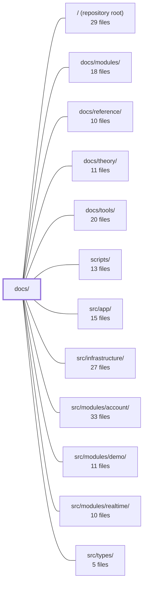

---
tags:
  - 2repo
  - 2repo/module
  - project/boilerplate-vue-frontend
type: module
module: docs/
files: 8
updated: 2026-08-30T17:07:18.294458+00:00
---

# docs/

## Purpose

The `docs/` directory is the project's documentation site, built with VitePress. It houses the top-level onboarding pages, the complete API reference and contract-workflow guides, and the site configuration that ties all documentation sections (Theory, Modules, Tools, Reference, API) into a single navigable experience.

## Key parts

- **`.vitepress/`** — Site plumbing. `config.mts` defines navigation, sidebar trees for every doc section, local search, and the Mermaid diagram theme. `theme/index.ts` adds a click-to-zoom overlay for rendered Mermaid SVGs and imports a project-specific stylesheet.
- **`api/`** — The API documentation section.
  - `endpoints.md` — Canonical HTTP route reference grouped by domain; the single source of truth for what the typed REST client (`contracts/rest/index.ts`) wraps.
  - `openapi-workflow.md` — Step-by-step procedure for editing `openapi.yaml`, linting, regenerating the client via orval, and updating stores/views.
  - `asyncapi-workflow.md` — Documents the SSE / event-driven contract: spec location, type generation, and the two-repo sync model that powers the realtime client stack.
  - `observability.md` — Reference for the four backend observability endpoints (health, metrics, audit log, SSE events) and the Admin Dashboard composables that consume them.
- **`index.md` / `getting-started.md`** — Reader entry points. The home page orients a visitor in under a minute; the getting-started page takes a fresh clone to a running storefront in three commands and front-loads the demo-vs-full-stack distinction.

## How it connects

- **`docs/modules/`, `docs/reference/`, `docs/theory/`, `docs/tools/`** — Sibling doc sections whose content appears in the same VitePress site; the sidebar in `config.mts` aggregates them alongside the files here.
- **`src/modules/realtime/`** — The SSE client implementation documented by `api/asyncapi-workflow.md`; changes to the AsyncAPI spec or generated types directly affect this module.
- **`src/types/`** — Holds the TypeScript types generated from both OpenAPI and AsyncAPI specs; the workflow docs in `api/` describe exactly how those types are produced and kept in sync.
- **`src/infrastructure/`** — Contains the HTTP client and connection utilities whose routes are enumerated in `api/endpoints.md`.
- **`src/modules/account/`, `src/modules/demo/`** — Feature modules whose endpoints and demo-mode behaviour are described in the API and getting-started docs.
- **`src/app/`** — The Admin Dashboard composables referenced in `api/observability.md`.
- **`scripts/`** — Houses the CI freshness guard and codegen tooling invoked by the OpenAPI/AsyncAPI workflow procedures.
- **`/` (repository root)** — The overall project context; `getting-started.md` and `index.md` orient a reader to the repo structure before diving into any sub-module.

## Where to start

Read **`docs/getting-started.md`** first—it compresses the clone-to-running-app path into three commands and explains the demo-vs-full-stack switch that prevents the most common setup failure. Then glance at **`docs/index.md`** to see how the five documentation sections divide the material, so you know where to look for architecture (Theory), per-feature detail (Modules), tooling (Tools), and contract references (API) as you explore the source tree.

## Connected modules

[[boilerplate-vue-frontend_ROOT|/ (repository root)]] · [[boilerplate-vue-frontend_docs_modules|docs/modules/]] · [[boilerplate-vue-frontend_docs_reference|docs/reference/]] · [[boilerplate-vue-frontend_docs_theory|docs/theory/]] · [[boilerplate-vue-frontend_docs_tools|docs/tools/]] · [[boilerplate-vue-frontend_scripts|scripts/]] · [[boilerplate-vue-frontend_src_app|src/app/]] · [[boilerplate-vue-frontend_src_infrastructure|src/infrastructure/]] · [[boilerplate-vue-frontend_src_modules_account|src/modules/account/]] · [[boilerplate-vue-frontend_src_modules_demo|src/modules/demo/]] · [[boilerplate-vue-frontend_src_modules_realtime|src/modules/realtime/]] · [[boilerplate-vue-frontend_src_types|src/types/]]

## Files
- `docs/.vitepress/config.mts` — VitePress site configuration for the project documentation. It defines the site metadata, top-level navigation, the full sidebar tree for every doc section, local search, a GitHub social link, and the Mermaid diagram theme used throughout the docs.
- `docs/.vitepress/theme/index.ts` — VitePress custom theme entry point that extends the default theme to add a click-to-zoom overlay for Mermaid SVG diagrams. It also imports project-specific stylesheet (`./custom.css`). The file exists so that dynamically-rendered Mermaid charts (which appear after hydration) still receive a zoom interaction without requiring a per-component hook.
- `docs/api/asyncapi-workflow.md` — Documents the AsyncAPI (SSE/event-driven) contract workflow for this frontend repo: where the spec lives, how TypeScript types are generated from it, how the "shared half" of a two-repo contract is kept in sync with the backend, and the naming/generation conventions that tie the realtime SSE client stack to the contract.
- `docs/api/endpoints.md` — Canonical reference for every HTTP endpoint the backend exposes, grouped by domain. It exists so the frontend team (and the generated client in `contracts/rest/index.ts`) knows the method, path, minimum auth level, and purpose of each route without reading backend source. Backend-internal details (Redis, RabbitMQ, PDF rendering) are deliberately excluded.
- `docs/api/observability.md` — Documents the four backend observability endpoints (health, metrics overview, audit log, SSE events) and the frontend Admin Dashboard implementation that consumes them. Exists so developers and AI assistants can reference response shapes, auth requirements, and the FE composable layout without opening the source files.
- `docs/api/openapi-workflow.md` — Procedural guide for the OpenAPI-driven contract workflow: edit `openapi.yaml`, lint with Spectral, regenerate the typed client via orval, then update stores/views. It exists to enforce a single order of operations and to document the manual sync, CI freshness guard, and codegen conventions that are otherwise scattered across config files.
- `docs/getting-started.md` — Onboarding guide that takes a developer from a fresh clone to a running storefront in three commands. It exists to eliminate the most common "it does not work" scenario — the app pointing at the wrong backend — by front-loading the demo-vs-full-stack distinction before any setup steps.
- `docs/index.md` — This is the VitePress home page (`layout: home`) for the boilerplate's docs site. It orients a reader in under a minute: what the repo is, how the five docs sections (Theory, Modules, Tools, API, Files) divide the work, and where to start depending on the question you're trying to answer.

---
[[boilerplate-vue-frontend_INDEX|← boilerplate-vue-frontend index]]
