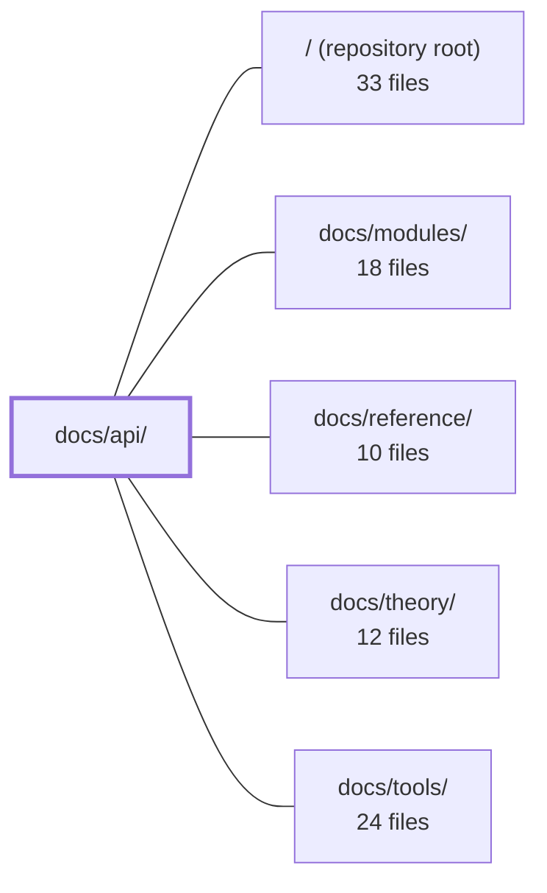

---
tags:
  - 2repo
  - 2repo/module
  - project/boilerplate-vue-frontend
type: module
module: docs/api/
files: 5
updated: 2026-09-03T10:55:53.052005+00:00
---

# docs/api/

## Purpose

`docs/api/` is the contract-and-consumption documentation for the frontend's interaction with the backend. It covers both the synchronous REST contract (OpenAPI) and the asynchronous SSE/event-driven contract (AsyncAPI), the codegen pipeline that turns specs into typed client code, and a catalog of every endpoint the frontend is expected to call.

## Key parts

- **Contract workflows** — `openapi-workflow.md` defines the OpenAPI edit → Spectral lint → Orval codegen → store/view update pipeline, including the manual backend sync and CI freshness guard. `asyncapi-workflow.md` is the analogue for the SSE/event-driven half: where the AsyncAPI spec lives, how TypeScript types are generated, and the naming conventions that bind the realtime client stack to the two-repo shared contract.
- **Endpoint reference** — `endpoints.md` is the canonical, domain-grouped list of every HTTP route (method, path, minimum auth level, purpose) the backend exposes. `observability.md` documents the four operational endpoints (health, metrics, audit log, SSE events) and the Admin Dashboard composables that consume them.
- **Orientation** — `index.md` is the entry point for this section. It summarises the full pipeline (OpenAPI → Orval → typed axios + Zod → Pinia), states the rules for consuming generated code, and routes readers to the correct deep-dive based on their task.

## How it connects

- **/ (repository root)** — The workflow docs reference root-level artefacts: `openapi.yaml`, the Orval config, the CI freshness-guard script, and the generated client at `contracts/rest/index.ts`. The AsyncAPI doc similarly points to the spec file and the generated SSE types that live outside this docs tree.
- **docs/modules/** — Every "update stores/views" or "FE composable layout" step described here lands in the frontend module documentation. `observability.md` in particular cross-references the Admin Dashboard composables documented there.
- **docs/reference/** — Serves as the broader reference shelf; the endpoint and observability pages here are the API-specific subset, while general data-model or naming reference material lives there.
- **docs/theory/** — Provides the architectural rationale (e.g., why a two-repo shared contract, why contract-driven codegen) that the procedural docs here assume but do not re-derive.
- **docs/tools/** — Documents the tooling (Spectral, Orval) whose invocations and configuration options are referenced in the workflow guides.

## Where to start

Read `index.md` first: in under a minute it maps the entire contract-to-store pipeline and tells you which deep-dive to open for your task. Then pick `openapi-workflow.md` if you touch REST, or `asyncapi-workflow.md` if you touch SSE/events. Both give you the exact command sequence and file locations you need before writing a single line of code.

## Connected modules

[[boilerplate-vue-frontend_ROOT|/ (repository root)]] · [[boilerplate-vue-frontend_docs_modules|docs/modules/]] · [[boilerplate-vue-frontend_docs_reference|docs/reference/]] · [[boilerplate-vue-frontend_docs_theory|docs/theory/]] · [[boilerplate-vue-frontend_docs_tools|docs/tools/]]

## Files
- `docs/api/asyncapi-workflow.md` — Documents the AsyncAPI (SSE/event-driven) contract workflow for this frontend repo: where the spec lives, how TypeScript types are generated from it, how the "shared half" of a two-repo contract is kept in sync with the backend, and the naming/generation conventions that tie the realtime SSE client stack to the contract.
- `docs/api/endpoints.md` — Canonical reference for every HTTP endpoint the backend exposes, grouped by domain. It exists so the frontend team (and the generated client in `contracts/rest/index.ts`) knows the method, path, minimum auth level, and purpose of each route without reading backend source. Backend-internal details (Redis, RabbitMQ, PDF rendering) are deliberately excluded.
- `docs/api/index.md` — Index and orientation page for the API documentation section. It summarises the contract-to-client pipeline (OpenAPI → Orval → typed axios + Zod → Pinia), lists the key rules for consuming generated code, and routes readers to the appropriate deep-dive doc based on their task.
- `docs/api/observability.md` — Documents the four backend observability endpoints (health, metrics overview, audit log, SSE events) and the frontend Admin Dashboard implementation that consumes them. Exists so developers and AI assistants can reference response shapes, auth requirements, and the FE composable layout without opening the source files.
- `docs/api/openapi-workflow.md` — Procedural guide for the OpenAPI-driven contract workflow: edit `openapi.yaml`, lint with Spectral, regenerate the typed client via orval, then update stores/views. It exists to enforce a single order of operations and to document the manual sync, CI freshness guard, and codegen conventions that are otherwise scattered across config files.

---
[[boilerplate-vue-frontend_INDEX|← boilerplate-vue-frontend index]]
