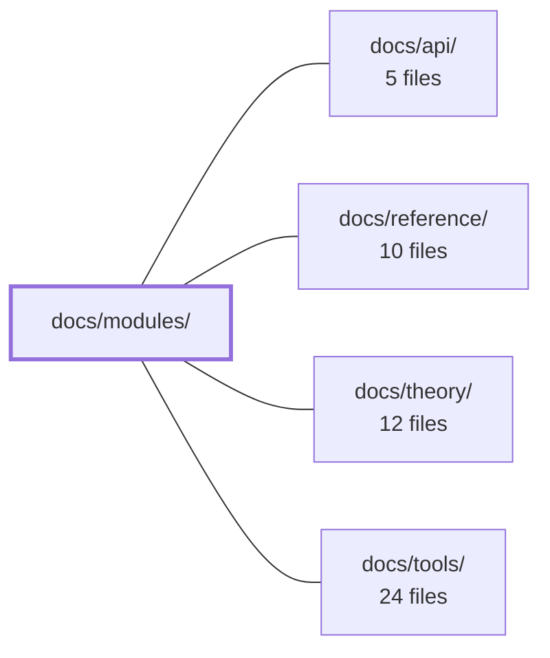

---
tags:
  - 2repo
  - 2repo/module
  - project/boilerplate-vue-frontend
type: module
module: docs/modules/
files: 18
updated: 2026-09-03T10:56:05.992369+00:00
---

# docs/modules/

## Purpose

The `docs/modules/` directory is the per-module reference section of the project wiki. Each page documents one application module—its owned screens, stores, API calls, public surface, and dependency edges—so that a developer (or AI assistant) can understand what a module is responsible for, what it publishes to siblings, and where its boundaries sit, without having to read the source code first.

## Key parts

- **`index.md`** — Landing page for the section. Defines the vertical per-domain cut through the codebase, provides the module dependency map, shared diagram conventions, the full 14-module listing (subdomain, store, screen count, dependency edges), and the client↔backend pairing for every module.
- **Core commerce modules** — `cart.md`, `cart-checkout.md`, `products.md`, `orders.md`, `payments.md`, `wishlist.md`, `account.md`. Document the primary customer-facing domain: catalogue browsing, cart/checkout flow, order lifecycle, payment/shipment panels, saved items, and self-service identity.
- **Admin & operational modules** — `admin.md`, `admin-dashboard.md`, `inventory.md`, `users.md`, `feedback.md`, `locales.md`, `locales-overrides.md`, `realtime.md`. Cover the back-office screens: observability console, audit log, stock ledger, user management, contact inbox, i18n authoring, runtime locale overrides, and the live SSE metrics view.
- **Supporting / leaf modules** — `delivery.md` (two published shipping components), `demo.md` (toolkit boilerplate showcase). Both are explicitly self-contained and deletable without cascading changes.

## How it connects

- **`docs/api/`** — Module pages reference the specific endpoints each screen calls (e.g. the ten product endpoints, the four checkout failure modes, the five read-only admin endpoints). The `api/` section provides the wire-format and response-schema details that the module pages deliberately omit.
- **`docs/reference/`** — Shared conventions that appear across many module pages (Pinia store patterns, barrel-export layout, screen composition rules, the `types.ts` local-convention) are documented once in `reference/` and cross-linked from individual module pages.
- **`docs/theory/`** — The architectural rationale behind the vertical cut, the "consumer-only / component-only / leaf" module classifications, and the read-only-posture decisions (e.g. audit table, inventory ledger) are grounded in the design principles laid out in `theory/`.
- **`docs/tools/`** — The toolkit features that `demo.md` and other pages exercise (provide/inject wiring, toasts, route guards, the module registration mechanism in `src/modules.ts`) are documented in `tools/` as project-specific infrastructure rather than per-module detail.

## Where to start

1. **`index.md`** — Read this first. It gives you the full dependency map, the subdomain grouping, and the diagram conventions so that every subsequent module page is immediately legible.
2. **`cart.md`** — As the central write-target in the `core` subdomain and the module with the most outgoing and incoming edges (products add to it, wishlist moves to it, checkout reads from it, orders consume its result), understanding its public surface (`useCartStore`, the barrel) sets the pattern for how modules publish and consume in this codebase.

## Connected modules

[[boilerplate-vue-frontend_docs_api|docs/api/]] · [[boilerplate-vue-frontend_docs_reference|docs/reference/]] · [[boilerplate-vue-frontend_docs_theory|docs/theory/]] · [[boilerplate-vue-frontend_docs_tools|docs/tools/]]

## Files
- `docs/modules/account.md` — Documents the `account` domain module: the visitor's self-service identity surface (login, signup, profile editing, password reset, email verification, account deletion, session management, address book). It is a consumer-only module with no exports and no dependents.
- `docs/modules/admin-dashboard.md` — Documents the admin dashboard module — a single screen with two tabs (Overview, Audit) that assembles data from five read-only endpoints across two backend domains (`observability` and `audit-logs`). It also records the module's local `types.ts` convention and the deliberate read-only posture of the audit table.
- `docs/modules/admin.md` — Documents the `admin` module: a single-screen observability console (service health, KPIs, audit log) that reads five backend endpoints directly, owns no state, and is deliberately designed to be deleted with a single `rm -rf` plus one line removed from `src/modules.ts`.
- `docs/modules/cart-checkout.md` — Documents the checkout flow — the only multi-step interaction in this client — covering how the user picks an address and shipping method, submits to `POST /cart/checkout`, and handles the four distinct failure modes. The file exists to make clear that the client collects inputs and renders server answers; all pricing, stock, and availability decisions live server-side.
- `docs/modules/cart.md` — The cart module owns the cart screen, the `cart` Pinia store, and the checkout flow. It sits in the `core` subdomain and is the central write target for add-to-cart, reorder, and move-to-cart actions across the app. Its public surface is a single barrel (`index.ts`) and the `useCartStore` export.
- `docs/modules/delivery.md` — Provides shipping functionality as two self-contained, published components (`ShippingSelector`, `ShipmentPanel`) that sibling modules mount into their own screens. It owns no routes, no navigation entries, and no dependencies — it exists solely to expose a component surface and a small Pinia store.
- `docs/modules/demo.md` — Documentation for the `demo` module — a single-screen boilerplate showcase that exercises the toolkit (store, provide/inject, toasts, route guard). It is intentionally isolated: no other module imports it and it imports nothing, so it can be deleted with `rm -rf` plus one line in `src/modules.ts`.
- `docs/modules/feedback.md` — Frontend module for a public contact form and the admin inbox behind it. Two screens (`Contact`, `FeedbackInbox`), one Pinia store, and three API endpoints. It is a fully self-contained leaf: no dependencies in either direction, no barrel export, and a backend counterpart that already exists in `boilerplate-node-backend`.
- `docs/modules/index.md` — Landing page for the **Modules** section of the docs site. It defines the vertical (per-domain) cut through the codebase, provides a module dependency map, explains the diagram conventions shared by every module page, and lists all 14 modules with their subdomain, store, screen count, and dependency edges. It also documents the client↔backend pairing for every module.
- `docs/modules/inventory.md` — Documents the **inventory** module — a single admin screen (`InventoryLedger`) that displays stock levels and the full movement ledger behind them. It is a *supporting* subdomain (not a differentiator), intentionally kept plain, and acts as a read-mostly window onto server-side counter data. No other module depends on it.
- `docs/modules/locales-overrides.md` — Documents the two-tier runtime translation override system: how bundled (tier 1) locale files and server-side (tier 2) editor rows are merged key-by-key, the rules that govern that merge, and the admin screens that manage tier 2 entries.
- `docs/modules/locales.md` — Documents the `locales` module: the admin screens and Pinia store that let a translator manage which languages exist and edit per-key entries. The module is fully standalone—zero imports in or out—and exists purely as the authoring half of the i18n feature (the consumer half lives in `infrastructure/i18n/locale-overrides.ts`).
- `docs/modules/orders.md` — Client-side module for the order lifecycle: a customer's order list, the order detail view (with embedded payment and shipment panels), and the admin edit/cancel screens. It is a leaf in the dependency graph—nothing imports from it—and it composes its three screens around components it mounts from other modules rather than reading their state.
- `docs/modules/payments.md` — Component-only payment domain. Owns `PaymentPanel` and `useOrderRefund`, exposes a `payments` Pinia store, and calls 4 backend endpoints. It has no routes and no navigation entries — it exists to be mounted by a sibling module, not to navigate on its own.
- `docs/modules/products.md` — Documents the **products** domain module — the four catalogue screens (public list, public detail, admin create, admin edit), its Pinia store, its ten API endpoints, and its wiring into the application shell. This page is the quick-reference for what the module owns, what it publishes to siblings, and where it draws its boundaries.
- `docs/modules/realtime.md` — Standalone module that renders a live view of the observability SSE metrics stream. It exists as an operator-facing playground — one admin-gated screen, one Pinia store, one composable — with no outgoing or incoming module-level dependencies.
- `docs/modules/users.md` — Admin-only user management: four screens (list, create, detail, edit) over a single `users` collection, plus the two published form schemas that the `account` module imports for validation. Classified as a `generic` subdomain — a solved CRUD problem that should not receive modelling effort.
- `docs/modules/wishlist.md` — Documents the **wishlist** domain module: a single-screen, supporting-subdomain feature that manages a visitor's saved product references and provides the move-to-cart exit. The page serves as the quick-reference for the store surface, API contract, file layout, and the one inter-module dependency (to `cart`) that developers and AI assistants must respect.

---
[[boilerplate-vue-frontend_INDEX|← boilerplate-vue-frontend index]]
