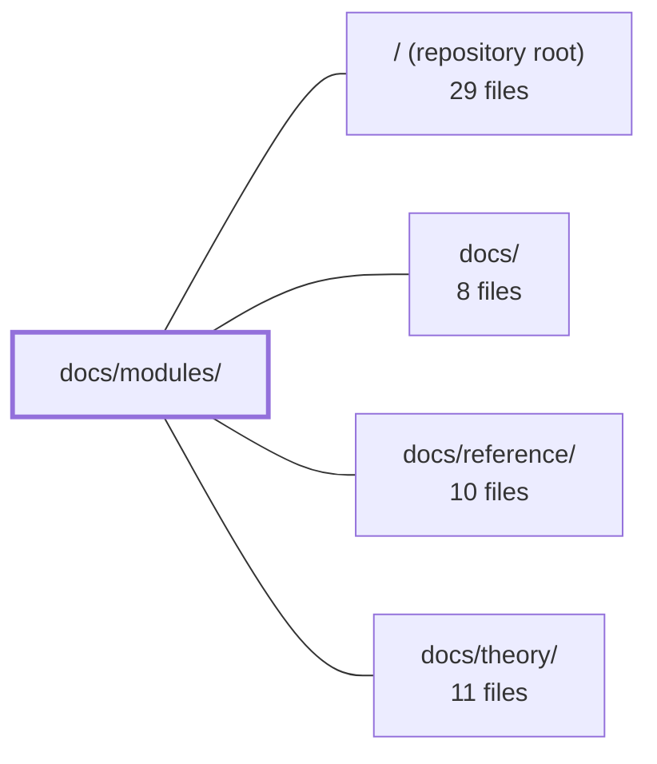

---
tags:
  - 2repo
  - 2repo/module
  - project/boilerplate-vue-frontend
type: module
module: docs/modules/
files: 18
updated: 2026-08-30T17:07:31.138246+00:00
---

# docs/modules/

## Purpose

Per-module documentation pages for every domain module in the codebase, plus a section index. Each Markdown file is a self-contained quick-reference for one module's screens, store, API surface, dependency edges, and boundaries. Together they form the "Modules" section of the docs site and serve as the primary orientation layer for newcomers and AI assistants working across the 14+ modules.

## Key parts

- **`index.md`** — Section landing page. Defines the vertical (per-domain) cut through the codebase, the shared dependency-map diagram conventions, the full module list (subdomain, store, screen count, edges), and the client↔backend pairing for each.
- **Core commerce flow** — `cart.md`, `cart-checkout.md`, `orders.md`, `payments.md`, `delivery.md`, `wishlist.md`. Documents the add-to-cart → checkout → order-lifecycle pipeline and the component-only modules (`payments`, `delivery`) that siblings mount rather than navigate to.
- **Catalogue & inventory** — `products.md` (four catalogue screens, ten API endpoints, shell wiring) and `inventory.md` (read-mostly admin ledger).
- **Identity, admin & feedback** — `account.md`, `users.md`, `admin.md` / `admin-dashboard.md` (observability + audit console), `feedback.md` (contact form + inbox).
- **Standalone / infrastructure** — `locales.md` + `locales-overrides.md` (i18n authoring and the two-tier runtime merge), `realtime.md` (SSE metrics playground), `demo.md` (boilerplate showcase, safe to delete).

## How it connects

- **`docs/`** — Parent section. `docs/modules/` is one sibling among the top-level docs areas; it cross-references the conventions defined at that level.
- **`docs/reference/`** — Sibling section holding per-endpoint API reference. Module pages here link out to the reference docs when they enumerate API calls (e.g., `products.md` listing its ten endpoints).
- **`docs/theory/`** — Sibling section for architectural rationale. Module pages occasionally point readers there for the "why" behind a boundary decision (e.g., the read-only audit posture in `admin-dashboard.md`).
- **`/` (repository root)** — The code each page describes lives under `src/` at the root. Pages reference `src/modules.ts` (the registration manifest) and the module directories it enumerates, but the documentation itself has no runtime coupling to that code.

## Where to start

1. **`index.md`** — Read this first. It gives you the dependency map, the subdomain taxonomy, and the shared diagram conventions, so every subsequent page is instantly legible.
2. **`cart.md`** — A representative, mid-complexity module page (store + screen + one inter-module dependency to `wishlist` and `cart-checkout`). Understanding its layout and the way it states boundaries prepares you for the more isolated or component-only pages that follow.

## Connected modules

[[boilerplate-vue-frontend_ROOT|/ (repository root)]] · [[boilerplate-vue-frontend_docs|docs/]] · [[boilerplate-vue-frontend_docs_reference|docs/reference/]] · [[boilerplate-vue-frontend_docs_theory|docs/theory/]]

## Files
- `docs/modules/account.md` — Documents the `account` domain module: the visitor's self-service identity surface (login, signup, profile editing, password reset, email verification, account deletion, session management, address book). It is a consumer-only module with no exports and no dependents.
- `docs/modules/admin-dashboard.md` — Documents the admin dashboard module — a single screen with two tabs (Overview, Audit) that assembles data from five read-only endpoints across two backend domains (`observability` and `audit-logs`). It also records the module's local `types.ts` convention and the deliberate read-only posture of the audit table.
- `docs/modules/admin.md` — Documents the `admin` module: a single-screen observability console (service health, KPIs, audit log) that reads five backend endpoints directly, owns no state, and is deliberately designed to be deleted with a single `rm -rf` plus one line removed from `src/modules.ts`.
- `docs/modules/cart-checkout.md` — Documents the checkout flow module — the client's only multi-step flow. It collects an address and a shipping-method id, sends them via `POST /cart/checkout`, and renders whatever the server returns. No pricing, stock, or availability logic lives here.
- `docs/modules/cart.md` — Documents the `cart` domain module: its single screen (`Cart`), its Pinia store (`useCartStore`), and the checkout flow. This is the `core` subdomain — the module other domains point at to add, remove, or settle cart lines. It owns `badgeQuantity`, the one reactive value the application shell reads for the header badge.
- `docs/modules/delivery.md` — Provides shipping functionality as two self-contained, published components (`ShippingSelector`, `ShipmentPanel`) that sibling modules mount into their own screens. It owns no routes, no navigation entries, and no dependencies — it exists solely to expose a component surface and a small Pinia store.
- `docs/modules/demo.md` — Documentation for the `demo` module — a single-screen boilerplate showcase that exercises the toolkit (store, provide/inject, toasts, route guard). It is intentionally isolated: no other module imports it and it imports nothing, so it can be deleted with `rm -rf` plus one line in `src/modules.ts`.
- `docs/modules/feedback.md` — Frontend module for a public contact form and the admin inbox behind it. Two screens (`Contact`, `FeedbackInbox`), one Pinia store, and three API endpoints. It is a fully self-contained leaf: no dependencies in either direction, no barrel export, and a backend counterpart that already exists in `boilerplate-node-backend`.
- `docs/modules/index.md` — Landing page for the **Modules** section of the docs site. It defines the vertical (per-domain) cut through the codebase, provides a module dependency map, explains the diagram conventions shared by every module page, and lists all 14 modules with their subdomain, store, screen count, and dependency edges. It also documents the client↔backend pairing for every module.
- `docs/modules/inventory.md` — Documents the **inventory** module — a single admin screen (`InventoryLedger`) that displays stock levels and the full movement ledger behind them. It is a *supporting* subdomain (not a differentiator), intentionally kept plain, and acts as a read-mostly window onto server-side counter data. No other module depends on it.
- `docs/modules/locales-overrides.md` — Documents the two-tier runtime translation override system: how bundled (tier 1) locale files and server-side (tier 2) editor rows are merged key-by-key, the rules that govern that merge, and the admin screens that manage tier 2 entries.
- `docs/modules/locales.md` — Documents the `locales` module: the admin screens and Pinia store that let a translator manage which languages exist and edit per-key entries. The module is fully standalone—zero imports in or out—and exists purely as the authoring half of the i18n feature (the consumer half lives in `infrastructure/i18n/locale-overrides.ts`).
- `docs/modules/orders.md` — Client-side module for the order lifecycle: a customer's order list, the order detail view (with embedded payment and shipment panels), and the admin edit/cancel screens. It is a leaf in the dependency graph—nothing imports from it—and it composes its three screens around components it mounts from other modules rather than reading their state.
- `docs/modules/payments.md` — Component-only payment domain. Owns `PaymentPanel` and `useOrderRefund`, exposes a `payments` Pinia store, and calls 4 backend endpoints. It has no routes and no navigation entries — it exists to be mounted by a sibling module, not to navigate on its own.
- `docs/modules/products.md` — Documents the **products** domain module — the four catalogue screens (public list, public detail, admin create, admin edit), its Pinia store, its ten API endpoints, and its wiring into the application shell. This page is the quick-reference for what the module owns, what it publishes to siblings, and where it draws its boundaries.
- `docs/modules/realtime.md` — Standalone module that renders a live view of the observability SSE metrics stream. It exists as an operator-facing playground — one admin-gated screen, one Pinia store, one composable — with no outgoing or incoming module-level dependencies.
- `docs/modules/users.md` — Admin-only user management: four screens (list, create, detail, edit) over a single `users` collection, plus the two published form schemas that the `account` module imports for validation. Classified as a `generic` subdomain — a solved CRUD problem that should not receive modelling effort.
- `docs/modules/wishlist.md` — Documents the **wishlist** domain module: a single-screen, supporting-subdomain feature that manages a visitor's saved product references and provides the move-to-cart exit. The page serves as the quick-reference for the store surface, API contract, file layout, and the one inter-module dependency (to `cart`) that developers and AI assistants must respect.

---
[[boilerplate-vue-frontend_INDEX|← boilerplate-vue-frontend index]]
