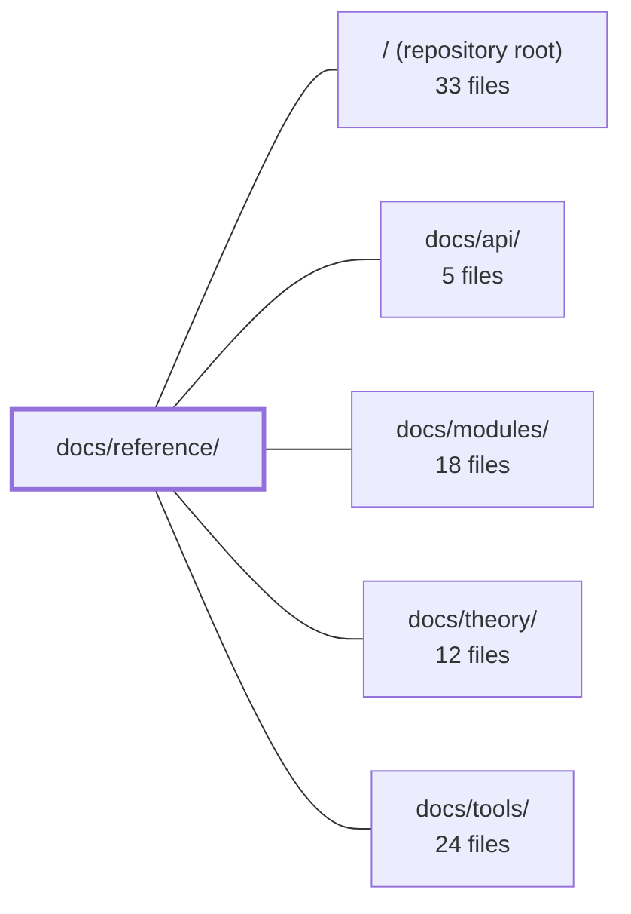

---
tags:
  - 2repo
  - 2repo/module
  - project/boilerplate-vue-frontend
type: module
module: docs/reference/
files: 10
updated: 2026-09-03T10:56:17.809327+00:00
---

# docs/reference/

## Purpose

`docs/reference/` is the file-level lookup layer of the documentation site. Each page answers a single question — *"what is this file or directory, what breaks without it, and where does the deeper explanation live?"* — so a reader (human or AI) never has to scan a directory tree or guess the role of a dotfile, generated artifact, or config file. The pages are deliberately maps, not theory: conceptual detail is always deferred to the Theory, Tools, API, or per-domain sections.

## Key parts

- **Repository-level index** — `index.md` (one-hop file glossary), `root.md` (every root-level file grouped by concern), `ops.md` (Docker, Compose, CI, public assets, VitePress), and `scripts.md` (`scripts/` + `.husky/`, naming conventions, cross-repo mirrors).
- **Source-tree index** — `src-app.md` (boot sequence, router, guards, layouts, shared types — the "chrome around the domains"), `src-infrastructure.md` (HTTP transport, i18n, non-domain stores, composables, observability), `src-modules.md` (the ~12 shared file shapes repeated across 14 domains), and `src-ui.md` (domain-agnostic UI kit: molecules, organisms, Vuetify themes).
- **Cross-cutting reference** — `contracts.md` (spec files copied from the paired backend, generated client code, the `spec-identity` lockstep guard) and `tests.md` (every test file, the single guarantee it encodes, and the Vitest/Cypress placement convention).

## How it connects

- **`/` (repository root)** — `root.md` and `ops.md` index the files that live directly in the repo root; `contracts.md` tracks the spec files copied from the paired backend into this checkout.
- **`docs/tools/`** — `scripts.md` explicitly complements the *Package Scripts* page in `docs/tools/`: tools covers *when* to run things; reference covers *what each script file is*.
- **`docs/theory/`** — `index.md` and every reference page defer conceptual explanations to the Theory section rather than restating them.
- **`docs/api/`** — `contracts.md` points to the generated types and client code under `src/types/` / `contracts/` that the API docs describe in detail.
- **`docs/modules/`** — `src-modules.md` explains each shared file shape once and then points to the per-domain pages in `docs/modules/` for domain-specific behaviour.

## Where to start

1. **`index.md`** — it is the one-hop glossary for the entire repository; read it first so every subsequent reference page has context for *what* the file it describes actually is.
2. **`src-app.md`** — the shortest route to understanding the application's boot sequence, routing, and module-enable list, which is the skeleton every other source-level reference page assumes you already know.

## Connected modules

[[boilerplate-vue-frontend_ROOT|/ (repository root)]] · [[boilerplate-vue-frontend_docs_api|docs/api/]] · [[boilerplate-vue-frontend_docs_modules|docs/modules/]] · [[boilerplate-vue-frontend_docs_theory|docs/theory/]] · [[boilerplate-vue-frontend_docs_tools|docs/tools/]]

## Files
- `docs/reference/contracts.md` — Documents the contract layer of this frontend repo: the two spec files (`openapi.yaml`, `asyncapi.yaml`) that are **copied from a paired backend**, the client code generated from them under `contracts/` and `src/types/`, and the `spec-identity` check that keeps the two checkouts in lockstep. This file exists so a reader never edits a generated or copied artifact without understanding the regeneration pipeline and the identity guard.
- `docs/reference/index.md` — A file-level glossary for the repository. When you encounter a filename and need to know what it is, what breaks without it, and where the deeper explanation lives, this page is the one-hop answer. It is explicitly a map, not a theory page — every entry defers conceptual detail to the Theory, Tools, or API sections.
- `docs/reference/ops.md` — Reference index for every non-application-code file in the frontend repo: Docker images, Compose stacks, CI workflows, public assets, and the VitePress docs site. Exists so a reader (human or AI) can locate and understand each operational file without scanning the directory tree.
- `docs/reference/root.md` — A reference index of every file that lives at the repository root (no parent directory). It groups them by concern—entry points, build/TypeScript, lint/format, test runners, mutation testing, and Git—and points to the deeper doc that explains each one. The file exists so that neither a human nor an AI assistant has to open or guess the role of a root-level dotfile or config.
- `docs/reference/scripts.md` — Reference page for every file under `scripts/` and `.husky/`. It complements the [Package Scripts](../tools/package-scripts.md) page (which covers *when* to run things) by explaining *what each file is*, the repo's script naming conventions, and which scripts are cross-repo mirrors that must stay in lockstep.
- `docs/reference/src-app.md` — Catalogs every file that is **not** a domain module: the boot sequence (`src/main.ts`), the root component, the module enable list, the kernel registry, the application shell (router, guards, layouts, navigation components, static views), and the shared type definitions. It exists as a single lookup point for the "chrome around the domains" so a reader never has to infer which file owns a concern.
- `docs/reference/src-infrastructure.md` — A reference map for the `src/infrastructure/` directory — the bottom tier that everything the app runs *on* (HTTP transport, i18n, non-domain Pinia stores, shared composables, observability, and generic utilities). It exists so a reader can locate the correct file by responsibility without reading source, and it enforces a hard boundary: this tier never imports from domain modules (enforced via `eslint.config.ts`).
- `docs/reference/src-modules.md` — Reference page that catalogs the file **shapes** used by every domain under `src/modules/` (14 domains, ~12 shared shapes). It explains each shape once so readers don't re-read the same structure per module, and it points to per-domain pages for the domain-specific answers.
- `docs/reference/src-ui.md` — Reference page for the `src/ui/` directory — the domain-agnostic UI kit. It catalogs the reusable molecules, organisms, and Vuetify theme configuration that can be dropped into any module without importing product concepts.
- `docs/reference/tests.md` — Reference index for the project's test architecture. It names every test file and the single guarantee each one provides, so a reader can locate *which* test covers a given rule without reading the specs themselves. It also records the two-level placement convention (co-located vs `tests/`) and which runner (Vitest or Cypress) owns which scope.

---
[[boilerplate-vue-frontend_INDEX|← boilerplate-vue-frontend index]]
