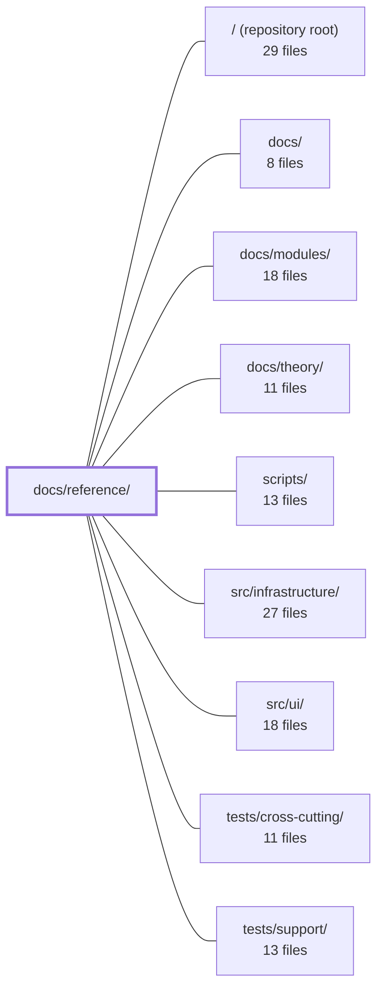

---
tags:
  - 2repo
  - 2repo/module
  - project/boilerplate-vue-frontend
type: module
module: docs/reference/
files: 10
updated: 2026-08-30T17:07:45.209038+00:00
---

# docs/reference/

## Purpose

`docs/reference/` is the "where things are" layer of the documentation set. Each file in this directory is a one-hop map: given a filename, directory, or directory-tier, you can find what it is, what breaks without it, and where the deeper explanation lives. It is deliberately a locator, not a theory page—conceptual "why" and "how" are deferred to `docs/theory/` and `docs/modules/`.

## Key parts

- **Entry point**
  - `index.md` — A file-level glossary for the entire repository; the single page to consult when you need to identify an unfamiliar filename and its role.

- **Source-code tier maps** (one page per architectural tier)
  - `src-app.md` — Application shell, boot sequence, module registry, router/guards/layouts.
  - `src-infrastructure.md` — HTTP transport, i18n, shared Pinia stores, composables, observability; documents the hard boundary against domain imports.
  - `src-modules.md` — The ~12 shared file *shapes* used across all 14 domain modules, so each structure is explained once rather than per-module.
  - `src-ui.md` — The domain-agnostic Vuetify-based UI kit (molecules, organisms, theme config).

- **Non-source reference pages**
  - `root.md` — Every file at the repository root, grouped by concern (entry points, build, lint, test, Git).
  - `ops.md` — Docker images, Compose stacks, CI workflows, public assets, and the VitePress site.
  - `scripts.md` — Every file under `scripts/` and `.husky/`, including cross-repo mirror scripts and naming conventions.
  - `contracts.md` — The two spec files copied from the paired backend, the generated client code, and the `spec-identity` lockstep guard.

- **Test catalog**
  - `tests.md` — Maps every test file to the single guarantee it enforces, so you can locate coverage for a given rule without reading the spec.

## How it connects

- **`docs/` (parent)** — This module is one of three sibling sections (`theory/`, `modules/`, `reference/`) that together form the documentation tree. Cross-references between them are the primary navigation mechanism.
- **`docs/theory/`** — Every reference page defers "why" and architectural rationale here; this module points outward rather than duplicating that content.
- **`docs/modules/`** — `src-modules.md` points to per-domain pages here for domain-specific answers; the shape catalog here is the shared vocabulary those pages rely on.
- **`scripts/`** — `scripts.md` is the descriptive companion to the `tools/package-scripts` page; together they cover *what* each script file is and *when* to run it.
- **`src/infrastructure/`, `src/ui/`** — The corresponding reference maps describe these directories' file responsibilities and import boundaries.
- **`tests/cross-cutting/`, `tests/support/`** — `tests.md` catalogs these directories alongside feature-level tests, mapping each file to the rule it enforces.
- **`/` (repository root)** — `root.md` indexes the dotfiles and config at the top level so no file's role is left to guesswork.

## Where to start

1. **`index.md`** — Read this first. It is the single-glossary entry point; every other reference page is reachable from it, and it will orient you to the repo's file layout before you drill into any tier.
2. **`src-app.md`** — Once you know the vocabulary, this page shows how the application boots and where the router, module registry, and shell live, giving you the structural skeleton of `src/` in one read.

## Connected modules

[[boilerplate-vue-frontend_ROOT|/ (repository root)]] · [[boilerplate-vue-frontend_docs|docs/]] · [[boilerplate-vue-frontend_docs_modules|docs/modules/]] · [[boilerplate-vue-frontend_docs_theory|docs/theory/]] · [[boilerplate-vue-frontend_scripts|scripts/]] · [[boilerplate-vue-frontend_src_infrastructure|src/infrastructure/]] · [[boilerplate-vue-frontend_src_ui|src/ui/]] · [[boilerplate-vue-frontend_tests_cross-cutting|tests/cross-cutting/]] · [[boilerplate-vue-frontend_tests_support|tests/support/]]

## Files
- `docs/reference/contracts.md` — Documents the contract layer of this frontend repo: the two spec files (`openapi.yaml`, `asyncapi.yaml`) that are **copied from a paired backend**, the client code generated from them under `contracts/` and `src/types/`, and the `spec-identity` check that keeps the two checkouts in lockstep. This file exists so a reader never edits a generated or copied artifact without understanding the regeneration pipeline and the identity guard.
- `docs/reference/index.md` — A file-level glossary for the repository. When you encounter a filename and need to know what it is, what breaks without it, and where the deeper explanation lives, this page is the one-hop answer. It is explicitly a map, not a theory page — every entry defers conceptual detail to the Theory, Tools, or API sections.
- `docs/reference/ops.md` — Reference index for every non-application-code file in the frontend repo: Docker images, Compose stacks, CI workflows, public assets, and the VitePress docs site. Exists so a reader (human or AI) can locate and understand each operational file without scanning the directory tree.
- `docs/reference/root.md` — A reference index of every file that lives at the repository root (no parent directory). It groups them by concern—entry points, build/TypeScript, lint/format, test runners, mutation testing, and Git—and points to the deeper doc that explains each one. The file exists so that neither a human nor an AI assistant has to open or guess the role of a root-level dotfile or config.
- `docs/reference/scripts.md` — Reference page for every file under `scripts/` and `.husky/`. It complements the [Package Scripts](../tools/package-scripts.md) page (which covers *when* to run things) by explaining *what each file is*, the repo's script naming conventions, and which scripts are cross-repo mirrors that must stay in lockstep.
- `docs/reference/src-app.md` — Reference map for the application-tier files: the boot sequence, root component, module registry, application shell (router, guards, layouts, views), and shared type definitions. It exists so a reader can locate *where* each concern lives in `src/` without opening every file, and to show how the kernel's typed-module model flows into the concrete app shell.
- `docs/reference/src-infrastructure.md` — A reference map for the `src/infrastructure/` directory — the bottom tier that everything the app runs *on* (HTTP transport, i18n, non-domain Pinia stores, shared composables, observability, and generic utilities). It exists so a reader can locate the correct file by responsibility without reading source, and it enforces a hard boundary: this tier never imports from domain modules (enforced via `eslint.config.ts`).
- `docs/reference/src-modules.md` — Reference page that catalogs the file **shapes** used by every domain under `src/modules/` (14 domains, ~12 shared shapes). It explains each shape once so readers don't re-read the same structure per module, and it points to per-domain pages for the domain-specific answers.
- `docs/reference/src-ui.md` — Reference page for the `src/ui/` directory — the domain-agnostic UI kit. It catalogs the reusable molecules, organisms, and Vuetify theme configuration that can be dropped into any module without importing product concepts.
- `docs/reference/tests.md` — Catalog of every test file in the repository, mapping each to the single guarantee it enforces. It exists so a reader can identify *which* test covers a given rule without opening the spec itself.

---
[[boilerplate-vue-frontend_INDEX|← boilerplate-vue-frontend index]]
