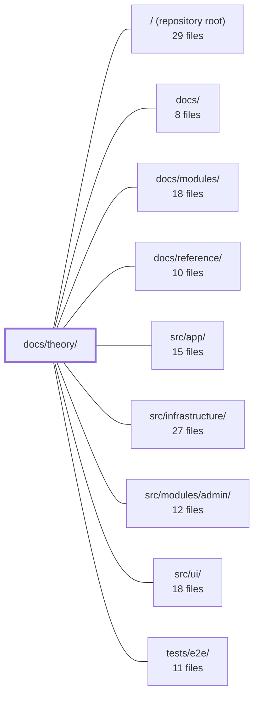

---
tags:
  - 2repo
  - 2repo/module
  - project/boilerplate-vue-frontend
type: module
module: docs/theory/
files: 11
updated: 2026-08-30T17:08:02.900958+00:00
---

# docs/theory/

## Purpose

`docs/theory/` is the architectural rationale section of the codebase. It answers the "why" and "where" questions—why the module structure looks the way it does, where a given piece of code belongs, what a domain term means in this project, and how a request travels through the stack—so that humans and AI assistants can navigate ~11,500 lines across 12 modules without tracing source files.

## Key parts

- **Entry & navigation** — `index.md` (defines the two load-bearing terms, gives the topic-to-file table) and `reading-path.md` (a time-boxed, 9-file guided reading order for newcomers).
- **Architecture & structure** — `architecture.md` (block-level diagram and ownership boundaries), `layers.md` (the authoritative folder map: tiers × layers), `modules.md` (the design contract and five-tier dependency hierarchy), `module-lifecycle.md` (step-by-step add/remove procedure with measured cost data).
- **Domain theory** — `strategic-ddd.md` (how bounded context, ubiquitous language, and context mapping are expressed here, and why tactical DDD is absent), `domain-layer.md` (the `domain/` folder rule and its lint enforcement), `glossary.md` (per-module term definitions with explicit ownership boundaries).
- **Runtime behavior** — `request-flow.md` (end-to-end request lifecycle plus observability signals).
- **Planning** — `roadmap.md` (living list of unbuilt work; shipped items are deleted, not checked off).

## How it connects

- **`docs/` (parent)** — `docs/theory/` is one subsection alongside `docs/modules/` (per-module *what*) and `docs/reference/` (lookup/API). Theory supplies the *why* that makes the other two sections intelligible.
- **`docs/modules/`** — `modules.md` and `module-lifecycle.md` here are the reasoning and procedure layer; each page under `docs/modules/` is a concrete instance of the rules defined here.
- **`src/app/`, `src/ui/`, `src/infrastructure/`** — `architecture.md`, `layers.md`, and `request-flow.md` describe the blocks, tier permissions, and runtime paths that live in these directories. A reader consults theory before opening source.
- **`src/modules/admin/`** — Referenced as a worked example in `module-lifecycle.md` and `glossary.md`; the lifecycle page's cost measurements come from real additions/deletions against this and sibling modules.
- **`tests/e2e/`** — The flows described in `request-flow.md` and the lifecycle checks in `module-lifecycle.md` are validated by the e2e suite; a contributor runs those tests after scaffolding or removing a module.
- **`/` (repository root)** — `reading-path.md` and `index.md` orient a reader who lands at the repo root with no prior map.

## Where to start

1. **`index.md`** — defines "domain" and "barrel," shows the one-flowchart architectural stance, and provides the topic-to-file table so you can jump to exactly the page you need.
2. **`reading-path.md`** — the prescribed one-hour, 9-file reading order with explicit "skip this" notes; read it before diving into any single theory page or source file so the rest of the codebase makes sense in context.

## Connected modules

[[boilerplate-vue-frontend_ROOT|/ (repository root)]] · [[boilerplate-vue-frontend_docs|docs/]] · [[boilerplate-vue-frontend_docs_modules|docs/modules/]] · [[boilerplate-vue-frontend_docs_reference|docs/reference/]] · [[boilerplate-vue-frontend_src_app|src/app/]] · [[boilerplate-vue-frontend_src_infrastructure|src/infrastructure/]] · [[boilerplate-vue-frontend_src_modules_admin|src/modules/admin/]] · [[boilerplate-vue-frontend_src_ui|src/ui/]] · [[boilerplate-vue-frontend_tests_e2e|tests/e2e/]]

## Files
- `docs/theory/architecture.md` — Defines the high-level architectural blocks (Contract → Generated → Stores → Views, plus cross-cutting HTTP, I18N, Router, and Observability) and the ownership boundaries between them. It exists to answer "which major blocks talk to each other?" without prescribing folder paths (that role belongs to `./layers.md`).
- `docs/theory/domain-layer.md` — Explains the `domain/` folder convention for frontend modules (what belongs there, what doesn't, how lint enforces the boundary) and clarifies the relationship between that folder, feature-based packaging, and full DDD. Exists so a contributor can decide in seconds whether a piece of logic goes in `domain/`, in the template, or in the store—without re-deriving the rule from memory.
- `docs/theory/glossary.md` — A per-module glossary that pins down what each domain term means *within that module's bounded context*. It exists to prevent cross-module ambiguity (e.g. "Cart" here is a read-only view, not an owned entity) and to explicitly mark the ownership boundary: most definitions state what the client does **not** own.
- `docs/theory/index.md` — Entry-point and glossary for the **Theory** documentation section. It defines the two load-bearing terms used across every sibling page ("domain" and "barrel"), summarizes the codebase's architectural stance in one flowchart, lists the main strategies already baked into the code, and provides a topic-to-file navigation table so a reader (human or AI) can jump straight to the page that answers their question.
- `docs/theory/layers.md` — Defines the two orthogonal axes that govern where code lives: **tiers** (what a file is permitted to know) and **layers** (what a file does within a domain). It is the authoritative folder map for resolving "which directory does this go in?" without opening source files.
- `docs/theory/module-lifecycle.md` — The operational how-to for adding and removing a domain module. Where `modules.md` explains *why* the shape is what it is, this page is the exact sequence of commands, files to create or delete, and checks to run. Its central claim—"a domain is one folder plus one registry line"—is validated by recorded cost measurements of a real scaffold addition and four real deletions.
- `docs/theory/modules.md` — Documents the module system's design contract: what a module is, the five-tier dependency hierarchy, the `AppModule` manifest, and the rules governing adding or deleting a domain. It is the reasoning layer behind the folder structure (the "why"), as opposed to `layers.md` which is the map (the "where").
- `docs/theory/reading-path.md` — A time-boxed (one-hour) guided reading order for the codebase. It prescribes 9 files to read in sequence and explicitly names what to skip, so a newcomer can internalise the architecture without reading all ~11,500 lines across 12 modules. It is the entry point into the `docs/theory/` section and the "landing" page when a reader arrives without a prior map.
- `docs/theory/request-flow.md` — Documents the end-to-end request lifecycle (user action → view → store → HTTP → backend → reactive update) and the parallel observability signals (Umami, Grafana Faro). Serves as the single reference for "where does a request go and who handles errors" so developers and AI assistants don't need to trace the chain through source files.
- `docs/theory/roadmap.md` — A living, periodically-pruned list of planned-but-unbuilt work. Items that have shipped are **deleted** from this file rather than checked off, on the principle that a roadmap listing finished work stops being read. Last reviewed 2026-08-14.
- `docs/theory/strategic-ddd.md` — Explains how the four strategic DDD concepts — bounded context, context mapping, ubiquitous language, and subdomain distillation — are (and were) expressed in this client codebase, and why the tactical half (entities, aggregates, repositories) is deliberately absent. Serves as the architectural rationale behind module folder structure, import rules, the glossary, and the `actions` pattern.

---
[[boilerplate-vue-frontend_INDEX|← boilerplate-vue-frontend index]]
