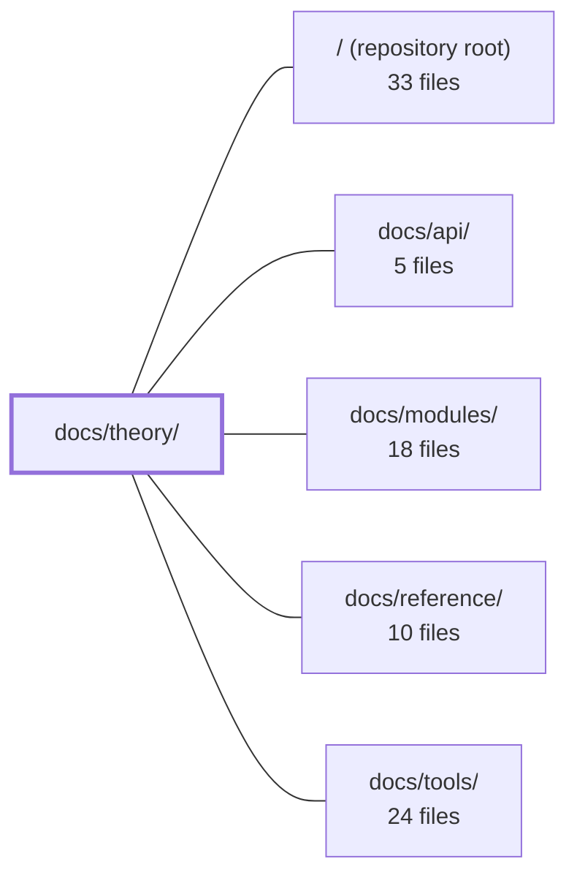

---
tags:
  - 2repo
  - 2repo/module
  - project/boilerplate-vue-frontend
type: module
module: docs/theory/
files: 12
updated: 2026-09-03T10:56:32.922421+00:00
---

# docs/theory/

## Purpose

`docs/theory/` is the conceptual documentation layer for the codebase. It answers *why* the architecture is shaped the way it is, *where* code belongs by tier and layer, and *how* a request or a new module flows through the system—without prescribing file-by-file implementation details. It sits above the per-module docs and the API reference, providing the shared vocabulary and structural rules that those sibling sections assume the reader already understands.

## Key parts

- **Entry & orientation** — `index.md` defines the two load-bearing terms ("domain", "barrel") and links every topic to its page. `reading-path.md` prescribes a one-hour, 9-file reading sequence for newcomers.
- **Architecture & structure** — `architecture.md` names the high-level blocks (Contract → Generated → Stores → Views + cross-cutting concerns). `modules.md` states the five-tier dependency hierarchy and the `AppModule` manifest. `layers.md` is the authoritative folder map (tiers × layers). `strategic-ddd.md` explains how bounded context, context mapping, and ubiquitous language are expressed in code—and why the tactical DDD half is absent.
- **Domain conventions** — `domain-layer.md` rules for what goes in a module's `domain/` folder. `glossary.md` pins domain-term meanings per bounded context and marks ownership boundaries.
- **Operational reference** — `module-lifecycle.md` gives the exact add/remove steps with measured cost. `request-flow.md` traces the end-to-end request lifecycle including observability signals. `sitemap.md` is the single route-ownership table.
- **Planning** — `roadmap.md` lists planned-but-unbuilt work (shipped items are deleted, not checked off).

## How it connects

- **`/` (repository root)** — Every page here describes the structure, conventions, and flows of the code that lives at the root. The folder map in `layers.md` and the tier hierarchy in `modules.md` are the rules the source tree obeys.
- **`docs/modules/`** — `modules.md` and `module-lifecycle.md` define the *contract* a module must satisfy; `docs/modules/` documents each concrete module's contents. `glossary.md` and `strategic-ddd.md` supply the bounded-context language that module pages rely on.
- **`docs/api/`** — `request-flow.md` and `architecture.md` establish the store → HTTP → backend chain that API documentation elaborates; the tier rules in `layers.md` constrain which module files may import generated API types.
- **`docs/reference/`** — Reference docs answer "what is this symbol/component?"; theory answers "why does it exist here and not elsewhere?" `layers.md` and `domain-layer.md` provide the placement rules that reference pages assume.
- **`docs/tools/`** — Tooling docs (lint, build, testing) operationalise the boundaries theory sets; e.g., `domain-layer.md` notes that lint enforces the `domain/` boundary that theory defines.

## Where to start

1. **`index.md`** — Read first: it defines "domain" and "barrel" (terms used on every other page), sketches the architecture in one flowchart, and provides a topic-to-file table so you know where to go next.
2. **`reading-path.md`** — Follow it as a guided, time-boxed tour through the nine source files that together explain the codebase, skipping the rest. It turns the abstract architecture into a concrete read order.

## Connected modules

[[boilerplate-vue-frontend_ROOT|/ (repository root)]] · [[boilerplate-vue-frontend_docs_api|docs/api/]] · [[boilerplate-vue-frontend_docs_modules|docs/modules/]] · [[boilerplate-vue-frontend_docs_reference|docs/reference/]] · [[boilerplate-vue-frontend_docs_tools|docs/tools/]]

## Files
- `docs/theory/architecture.md` — Defines the high-level architectural blocks (Contract → Generated → Stores → Views, plus cross-cutting HTTP, I18N, Router, and Observability) and the ownership boundaries between them. It exists to answer "which major blocks talk to each other?" without prescribing folder paths (that role belongs to `./layers.md`).
- `docs/theory/domain-layer.md` — Explains the `domain/` folder convention for frontend modules (what belongs there, what doesn't, how lint enforces the boundary) and clarifies the relationship between that folder, feature-based packaging, and full DDD. Exists so a contributor can decide in seconds whether a piece of logic goes in `domain/`, in the template, or in the store—without re-deriving the rule from memory.
- `docs/theory/glossary.md` — A per-module glossary that pins down what each domain term means *within that module's bounded context*. It exists to prevent cross-module ambiguity (e.g. "Cart" here is a read-only view, not an owned entity) and to explicitly mark the ownership boundary: most definitions state what the client does **not** own.
- `docs/theory/index.md` — Entry-point and glossary for the **Theory** documentation section. It defines the two load-bearing terms used across every sibling page ("domain" and "barrel"), summarizes the codebase's architectural stance in one flowchart, lists the main strategies already baked into the code, and provides a topic-to-file navigation table so a reader (human or AI) can jump straight to the page that answers their question.
- `docs/theory/layers.md` — Defines the two orthogonal axes that govern where code lives: **tiers** (what a file is permitted to know) and **layers** (what a file does within a domain). It is the authoritative folder map for resolving "which directory does this go in?" without opening source files.
- `docs/theory/module-lifecycle.md` — The operational how-to for adding and removing a domain module. Where `modules.md` explains *why* the shape is what it is, this page is the exact sequence of commands, files to create or delete, and checks to run. Its central claim—"a domain is one folder plus one registry line"—is validated by recorded cost measurements of a real scaffold addition and four real deletions.
- `docs/theory/modules.md` — Defines the architectural contract for the module system: the five-tier dependency hierarchy (app → modules → kernel → ui → infrastructure), the `AppModule` manifest, and the add/remove procedure. It is the *reasoning* behind the folder structure documented in `layers.md` — the "why" rather than the "where."
- `docs/theory/reading-path.md` — A time-boxed (one-hour) guided reading order for the codebase. It prescribes 9 files to read in sequence and explicitly names what to skip, so a newcomer can internalise the architecture without reading all ~11,500 lines across 12 modules. It is the entry point into the `docs/theory/` section and the "landing" page when a reader arrives without a prior map.
- `docs/theory/request-flow.md` — Documents the end-to-end request lifecycle (user action → view → store → HTTP → backend → reactive update) and the parallel observability signals (Umami, Grafana Faro). Serves as the single reference for "where does a request go and who handles errors" so developers and AI assistants don't need to trace the chain through source files.
- `docs/theory/roadmap.md` — A living, periodically-pruned list of planned-but-unbuilt work. Items that have shipped are **deleted** from this file rather than checked off, on the principle that a roadmap listing finished work stops being read. Last reviewed 2026-08-14.
- `docs/theory/sitemap.md` — Single reference for every route in the application: which module owns it, its path, access level, and view component. It also documents navigation placement (sections, pinned entries), the guard execution order, and the platform-level routes that exist independent of any module. The goal is to make the route table, the module pages, and the navigation chrome agree by construction.
- `docs/theory/strategic-ddd.md` — Explains how the four strategic DDD concepts — bounded context, context mapping, ubiquitous language, and subdomain distillation — are (and were) expressed in this client codebase, and why the tactical half (entities, aggregates, repositories) is deliberately absent. Serves as the architectural rationale behind module folder structure, import rules, the glossary, and the `actions` pattern.

---
[[boilerplate-vue-frontend_INDEX|← boilerplate-vue-frontend index]]
