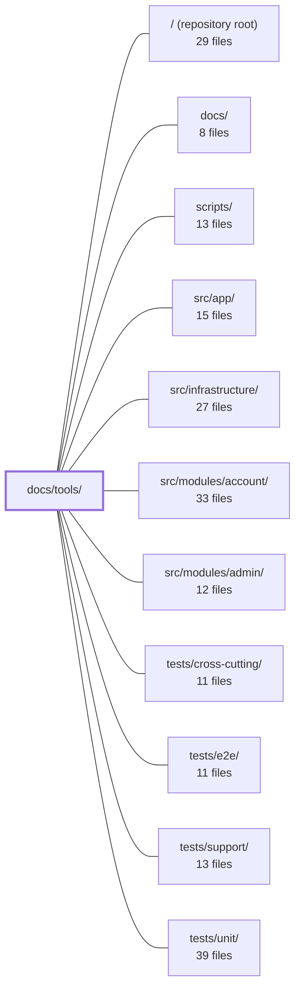

---
tags:
  - 2repo
  - 2repo/module
  - project/boilerplate-vue-frontend
type: module
module: docs/tools/
files: 20
updated: 2026-08-30T17:08:15.082331+00:00
---

# docs/tools/

## Purpose

`docs/tools/` is the project's developer-facing documentation layer for tooling, testing strategy, and operational mechanics. Every page here explains *how* a system works, *why* a particular tool was chosen, and *what is guaranteed* so that contributors (human or AI) can reason about the codebase without reading every source file.

## Key parts

- **Testing layer (the bulk of the module):** `testing-and-docs.md` is the index that links every sub-layer to its detail page. Individual layers are covered by `unit-testing.md`, `component-testing.md`, `property-testing.md`, `mutation-testing.md`, `accessibility-testing.md`, `visual-regression.md`, and the two E2E profiles (`demo-profile.md` for the fast in-memory backend, `live-e2e.md` for the fully-stacked run). `testing-quickstart.md` maps every `npm run` test script to its cost and CI-gate status.
- **Platform & environment:** `runtime.md`, `docker-and-podman.md`, `environment.md`, `package-dependencies.md`, and `tools-explained.md` document the build toolchain, the two-container compose setup, all `VITE_*` variables, every `package.json` dependency, and the full tech stack at a glance.
- **Feature mechanisms:** `admin-dashboard.md` (data flow into panels), `i18n.md` (three-tier text resolution), `observability.md` (Faro + Umami wiring and verification), `umami.md` (design rationale only), and `security.md` (frontend auth-token and route-guard model).

## How it connects

- **`docs/`** — this module is a subdirectory of the VitePress docs site; `docker-and-podman.md` describes the container that builds and serves it.
- **`/` (repository root)** — pages reference root-level files (`docker-compose.yml`, `package.json`, `.env` examples) that the docs describe.
- **`scripts/`** — `testing-quickstart.md` and `testing-and-docs.md` map the `npm run` scripts defined there to test layers.
- **`src/app/`** — `runtime.md`, `i18n.md`, `security.md`, and `environment.md` document behaviour implemented in the app entry, router guards, and HTTP interceptors.
- **`src/infrastructure/`** — `observability.md` and `environment.md` describe the init sequence and env-var consumption in this layer.
- **`src/modules/admin/`** — `admin-dashboard.md` documents the mechanism that renders the panels defined there.
- **`tests/unit/`, `tests/cross-cutting/`, `tests/support/`, `tests/e2e/`** — the testing pages describe the layout, conventions, and invariants of these directories; `demo-profile.md` and `live-e2e.md` specify the backend contracts those suites depend on.

## Where to start

1. **`testing-and-docs.md`** — it is the single index that names every test layer, links to its detail page, and explains how to read a test report. It gives the full map in one page.
2. **`tools-explained.md`** — a five-category tour of every tool in the stack with the problem each solves, so a newcomer can orient themselves before drilling into any single config or spec.

## Connected modules

[[boilerplate-vue-frontend_ROOT|/ (repository root)]] · [[boilerplate-vue-frontend_docs|docs/]] · [[boilerplate-vue-frontend_scripts|scripts/]] · [[boilerplate-vue-frontend_src_app|src/app/]] · [[boilerplate-vue-frontend_src_infrastructure|src/infrastructure/]] · [[boilerplate-vue-frontend_src_modules_account|src/modules/account/]] · [[boilerplate-vue-frontend_src_modules_admin|src/modules/admin/]] · [[boilerplate-vue-frontend_tests_cross-cutting|tests/cross-cutting/]] · [[boilerplate-vue-frontend_tests_e2e|tests/e2e/]] · [[boilerplate-vue-frontend_tests_support|tests/support/]] · [[boilerplate-vue-frontend_tests_unit|tests/unit/]]

## Files
- `docs/tools/accessibility-testing.md` — Documents the project's automated accessibility testing strategy: axe-based DOM auditing via Cypress e2e, a keyboard-interaction suite, and a pre-run lint pass. Explains scope, impact thresholds, reporting, state coverage, and the rationale behind each design choice so contributors know what is guaranteed, what is not, and how to extend coverage.
- `docs/tools/admin-dashboard.md` — Documents the admin dashboard's **mechanism**: which panels it renders, how data flows from `/observability/*` into view, and the metric/filter definitions. It deliberately scopes out the *domain* narrative (what the admin module is, why it is built to be deleted), which lives on the module page.
- `docs/tools/component-testing.md` — Documents the strategy, conventions, and worked examples for testing individual `.vue` components with `@vue/test-utils`. It establishes *what* to assert (resource cleanup, boundary values, emit contracts) over *how* markup looks, so that new specs target the questions only the component layer can answer.
- `docs/tools/demo-profile.md` — Documents the **demo profile**: a self-contained, disposable backend (real API + in-memory MongoDB + seeded fixtures) that both the dev server and the fast e2e suite run against. It records the mechanism, the rationale for replacing MSW, and the operational contracts (reset, outbox, shard isolation) the e2e suite relies on.
- `docs/tools/docker-and-podman.md` — Documents the repo's two-container `docker-compose.yml` (Vite dev server + VitePress docs) and its pairing contract with the separate backend stack. Exists so developers understand the browser-as-bridge architecture, the required `.env` setup, and the non-obvious Vite/compose interactions that cause silent failures.
- `docs/tools/environment.md` — Reference card for every `VITE_*` environment variable the frontend reads, grouped by concern (application, locale, API, logging, telemetry). It exists so a developer or assistant can look up *which* variable controls a setting, its default, and the build-time-vs-runtime distinction without grepping the source.
- `docs/tools/i18n.md` — Explains how the frontend resolves display text across three tiers — bundled locale files, API-stored overrides, and per-key deep merging — and documents the rules, scopes, and boundaries of that system so contributors understand what the client does (and deliberately does not) fetch.
- `docs/tools/live-e2e.md` — Documents the **live E2E** test profile: the same Cypress specs from the demo profile run against the fully-composed backend (real MongoDB, Redis, broker, Umami) instead of in-memory stubs. It covers where the profile runs (PR gate, nightly cron, local), how to boot it, and which guards make a green run meaningful.
- `docs/tools/mutation-testing.md` — Documents the mutation-testing setup in this repo (Stryker + Vitest), the glossary of its reporting terms, the per-file ratchet workflow, and the operational constraints (static mutants, setup-cost multiplication, exclusion of e2e) that differ from plain unit coverage. It exists so a developer or AI assistant can reason about *why* a mutation score is what it is and *what is safe to change* without reading the full narrative.
- `docs/tools/observability.md` — Documentation for the frontend observability stack: two complementary tools (Grafana Faro for errors/tracing/web-vitals, Umami for product analytics) wired into a single Pinia store and verified via a self-hosted local Docker/Podman stack. The page exists so a developer (or AI assistant) can find the env vars, init sequence, usage API, and verification steps without reading the source.
- `docs/tools/package-dependencies.md` — A reference map of every `package.json` dependency, grouped by concern (runtime vs. dev) so a reader can quickly identify *why* a package is present and which deeper doc to follow for details.
- `docs/tools/property-testing.md` — Documentation page explaining the repo's property-based testing practice: what qualifies as a target, the two determinism rules (fixed seed, committed counterexamples), the deliberate split with example-based tests, and where each property test file lives. It exists so contributors know *when* to write a property vs. an example and *how* to run/extend them without duplicating assertions.
- `docs/tools/runtime.md` — Reference page documenting the project's runtime toolchain (frameworks, build tools, HTTP client) and the conventions for how they interact. It exists so contributors and AI assistants can orient themselves on *what* runs the app and *where* each piece lives without scanning the repo.
- `docs/tools/security.md` — Frontend-facing security reference. Documents how the SPA handles auth tokens, enforces route access, and handles HTTP auth errors—so developers (human or AI) can locate the security model without reading every guard or interceptor file. It explicitly scopes to the **frontend perspective** and links out to the backend repo for JWT/bcrypt details.
- `docs/tools/testing-and-docs.md` — This is the index ("map") page for the project's testing and documentation layer. It links every test layer (unit, property, cross-cutting, accessibility, visual regression, E2E demo/live, mutation) to its dedicated detail page, explains how to read a test run report, and documents where test data originates across the two repos. Its role is orientation: start here, jump to a layer's detail page, and always return via the cross-links.
- `docs/tools/testing-quickstart.md` — Quick-reference guide for all test commands in the repo. It maps each `npm run` test script to the question it answers, its runtime cost, and whether it is part of the CI gate. Intended as the first page a developer (or AI assistant) opens when deciding which test to run or how to interpret a failure.
- `docs/tools/tools-explained.md` — Single-page reference that explains every tool in the project stack — what it is, the problem it solves, and its role in this repo — organised into five colour-coded categories (Build, Runtime, Contract, Testing, Telemetry). It exists so a reader can orient themselves in the tech landscape before diving into per-tool config docs.
- `docs/tools/umami.md` — Explains *why* Umami is the product-analytics layer in this boilerplate (self-hosted, open-source, no cookies by default) and the design rationale behind its event flow. It deliberately contains no operational rules, env-var specs, or code examples — those live exclusively in `docs/tools/observability.md` to prevent the two pages from drifting.
- `docs/tools/unit-testing.md` — Documents the project's unit-testing layer: the tooling, mount/mocking patterns, file layout, and the cross-cutting architectural-invariant specs that run under the same Vitest suite. Exists so a contributor (human or AI) can locate the right spec, understand the one `msw/node` exception, and know which support files a new test needs—without reading the full doc or the specs themselves.
- `docs/tools/visual-regression.md` — Documents the project's visual-regression testing layer: one baseline screenshot per module, pixel-compared against a committed PNG to catch layout, font, and styling defects that DOM-based tests cannot see. Also records the determinism requirements, tolerance settings, and the deliberate exclusion of these specs from the merge gate.

---
[[boilerplate-vue-frontend_INDEX|← boilerplate-vue-frontend index]]
