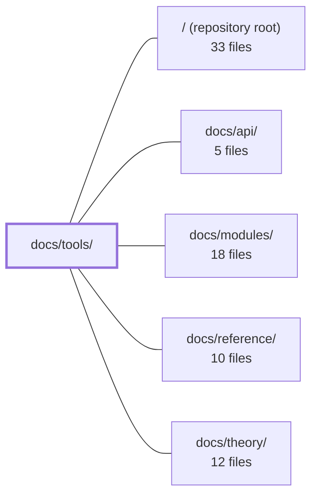

---
tags:
  - 2repo
  - 2repo/module
  - project/boilerplate-vue-frontend
type: module
module: docs/tools/
files: 24
updated: 2026-09-03T10:56:47.934065+00:00
---

# docs/tools/

## Purpose

`docs/tools/` is the mechanism-and-convention layer of the project documentation. It answers *how* things work in this codebase—testing strategy, toolchain configuration, environment wiring, transport protocols, and operational contracts—without re-explaining the domain rationale that lives in the module pages. It exists so a contributor (or AI assistant) can locate the right procedure, rule, or reference without grepping source code.

## Key parts

- **Navigation & orientation** — `index.md` (section landing page), `tools-explained.md` (categorised overview of every stack dependency), `testing-and-docs.md` (map across all test layers), `testing-quickstart.md` (command-to-purpose quick reference).
- **Testing layers** — `unit-testing.md`, `component-testing.md`, `property-testing.md`, `mutation-testing.md`, `visual-regression.md`, `accessibility-testing.md`, `live-e2e.md`, `demo-profile.md`. Together they document each layer's tooling, conventions, determinism rules, CI-gate status, and the boundaries between layers (e.g. demo vs. live profiles).
- **Infrastructure & environment** — `docker-and-podman.md` (two-container compose setup), `environment.md` (all `VITE_*` vars), `runtime.md` (framework/build/HTTP-client stack), `package-dependencies.md` and `package-scripts.md` (grouped `package.json` reference).
- **Architecture mechanisms** — `state-and-routing.md` (Pinia + Vue Router + Vue I18n), `i18n.md` (three-tier resolution), `realtime.md` (SSE transport factory & event contract), `security.md` (frontend auth model), `observability.md` + `umami.md` (Faro/Umami wiring and rationale), `admin-dashboard.md` (panel rendering & data-flow mechanics).

## How it connects

- **`docs/modules/`** — The primary sibling. Tools pages document the *mechanism* (how a panel renders, how SSE events are typed, how a test suite boots); the corresponding module page documents the *domain narrative* (what the feature is, why it exists, why it may be deleted). Several tools pages explicitly defer to their module page for scope, rationale, and lifecycle (e.g. `admin-dashboard.md`, `realtime.md`, `umami.md`).
- **`docs/api/`** — Tools pages that touch HTTP or data contracts (i18n API-stored overrides, security interceptors, live-e2e response validation) link out to the API docs for the authoritative endpoint/spec definitions rather than restating them.
- **`docs/reference/`** — Deeper, normative reference material (full env-var tables, type definitions, generated contracts) lives here; tools pages point to it for exhaustive detail while keeping their own prose focused on *how to use* and *why the convention exists*.
- **`docs/theory/`** — Cross-cutting design rationale and architectural principles that multiple tools pages cite as the "why" behind a convention (e.g. per-module sweeps vs. a central route list, the browser-as-bridge model).
- **`/` (repository root)** — The tools pages are the operational documentation layer of the repo; they reference root-level configuration files (`package.json`, `docker-compose.yml`, `.env.example`, `vite.config.ts`) as the source of truth for the settings they describe.

## Where to start

1. **`index.md`** — the section landing page; it gives a visual overview of every tool and links to the right sub-page by intent, saving you from guessing which page covers your question.
2. **`testing-quickstart.md`** — if your immediate task is running or interpreting tests, this maps every `npm run` test script to the question it answers, its cost, and whether it gates CI, making it the fastest path from "I need to verify my change" to the correct command.

## Connected modules

[[boilerplate-vue-frontend_ROOT|/ (repository root)]] · [[boilerplate-vue-frontend_docs_api|docs/api/]] · [[boilerplate-vue-frontend_docs_modules|docs/modules/]] · [[boilerplate-vue-frontend_docs_reference|docs/reference/]] · [[boilerplate-vue-frontend_docs_theory|docs/theory/]]

## Files
- `docs/tools/accessibility-testing.md` — Documents the automated accessibility testing suite (axe-core via Cypress, a keyboard-interaction suite, and a template lint plugin). It defines the sweep model, the failure threshold, the reporting format, the pinned rule set, and the rationale for per-module sweeps over a central route list.
- `docs/tools/admin-dashboard.md` — Documents the admin dashboard's **mechanism**: which panels it renders, how data flows from `/observability/*` into view, and the metric/filter definitions. It deliberately scopes out the *domain* narrative (what the admin module is, why it is built to be deleted), which lives on the module page.
- `docs/tools/component-testing.md` — Documents the strategy, conventions, and worked examples for testing individual `.vue` components with `@vue/test-utils`. It establishes *what* to assert (resource cleanup, boundary values, emit contracts) over *how* markup looks, so that new specs target the questions only the component layer can answer.
- `docs/tools/demo-profile.md` — Documents the **demo profile**: a self-contained, disposable backend (real API + in-memory MongoDB + seeded fixtures) that both the dev server and the fast e2e suite run against. It records the mechanism, the rationale for replacing MSW, and the operational contracts (reset, outbox, shard isolation) the e2e suite relies on.
- `docs/tools/docker-and-podman.md` — Documents the repo's two-container `docker-compose.yml` (Vite dev server + VitePress docs) and its pairing contract with the separate backend stack. Exists so developers understand the browser-as-bridge architecture, the required `.env` setup, and the non-obvious Vite/compose interactions that cause silent failures.
- `docs/tools/environment.md` — Reference card for every `VITE_*` environment variable the frontend reads, grouped by concern (application, locale, API, logging, telemetry). It exists so a developer or assistant can look up *which* variable controls a setting, its default, and the build-time-vs-runtime distinction without grepping the source.
- `docs/tools/i18n.md` — Explains how the frontend resolves display text across three tiers — bundled locale files, API-stored overrides, and per-key deep merging — and documents the rules, scopes, and boundaries of that system so contributors understand what the client does (and deliberately does not) fetch.
- `docs/tools/index.md` — Landing page for the Tools documentation section. Provides a visual overview of all third-party and framework dependencies, then routes readers to the detailed sub-page for each tool. It exists so a contributor can pick the right sub-page by intent without reading every page.
- `docs/tools/live-e2e.md` — Documents the **live E2E profile** — the full-stack Cypress test run that exercises the real composed backend (live MongoDB, Redis, session cookies over a real network) as opposed to the demo profile's in-memory/stubbed setup. Covers when it runs (PR gate, nightly, manual), the required boot sequence, environment-variable pitfalls, and the response-validation mechanism that turns live specs into contract tests.
- `docs/tools/mutation-testing.md` — Documents the mutation-testing setup in this repo (Stryker + Vitest), the glossary of its reporting terms, the per-file ratchet workflow, and the operational constraints (static mutants, setup-cost multiplication, exclusion of e2e) that differ from plain unit coverage. It exists so a developer or AI assistant can reason about *why* a mutation score is what it is and *what is safe to change* without reading the full narrative.
- `docs/tools/observability.md` — Documentation for the frontend observability stack: two complementary tools (Grafana Faro for errors/tracing/web-vitals, Umami for product analytics) wired into a single Pinia store and verified via a self-hosted local Docker/Podman stack. The page exists so a developer (or AI assistant) can find the env vars, init sequence, usage API, and verification steps without reading the source.
- `docs/tools/package-dependencies.md` — A reference map of every `package.json` dependency, grouped by concern (runtime vs. dev) so a reader can quickly identify *why* a package is present and which deeper doc to follow for details.
- `docs/tools/package-scripts.md` — Groups every `package.json` script by job (development, container, build/validation, test, codegen, docs) instead of raw list order, so a reader can find the right invocation without scanning the full script array. Each entry links to the deeper page that explains the mechanism.
- `docs/tools/property-testing.md` — Documentation page explaining the repo's property-based testing practice: what qualifies as a target, the two determinism rules (fixed seed, committed counterexamples), the deliberate split with example-based tests, and where each property test file lives. It exists so contributors know *when* to write a property vs. an example and *how* to run/extend them without duplicating assertions.
- `docs/tools/realtime.md` — Documents the SSE transport layer — the client factory, event contract, and generated types — and explicitly separates it from the `realtime` module (UI/store). Exists so readers can find the mechanism details without conflating them with the domain logic on the module page.
- `docs/tools/runtime.md` — Reference page documenting the project's runtime toolchain (frameworks, build tools, HTTP client) and the conventions for how they interact. It exists so contributors and AI assistants can orient themselves on *what* runs the app and *where* each piece lives without scanning the repo.
- `docs/tools/security.md` — Frontend-facing security reference. Documents how the SPA handles auth tokens, enforces route access, and handles HTTP auth errors—so developers (human or AI) can locate the security model without reading every guard or interceptor file. It explicitly scopes to the **frontend perspective** and links out to the backend repo for JWT/bcrypt details.
- `docs/tools/state-and-routing.md` — Documents the three cross-cutting libraries that manage reactive state (Pinia), URL-to-view mapping (Vue Router), and localisation (Vue I18n). It exists so a developer or AI assistant can understand *where* state lives, *how* routes are assembled, and *how* translations are resolved without reading every module individually.
- `docs/tools/testing-and-docs.md` — Serves as the single map page for all testing layers and test-data sources across the two-repo project. It exists so a reader (human or AI) can orient themselves to the full testing strategy, find the right detail page, and understand why each layer is distinct before diving into any individual tool.
- `docs/tools/testing-quickstart.md` — Quick-reference guide for all test commands in the repo. It maps each `npm run` test script to the question it answers, its runtime cost, and whether it is part of the CI gate. Intended as the first page a developer (or AI assistant) opens when deciding which test to run or how to interpret a failure.
- `docs/tools/tools-explained.md` — Single-page reference that explains every tool in the project stack — what it is, the problem it solves, and its role in this repo — organised into five colour-coded categories (Build, Runtime, Contract, Testing, Telemetry). It exists so a reader can orient themselves in the tech landscape before diving into per-tool config docs.
- `docs/tools/umami.md` — Explains *why* Umami is the product-analytics layer in this boilerplate (self-hosted, open-source, no cookies by default) and the design rationale behind its event flow. It deliberately contains no operational rules, env-var specs, or code examples — those live exclusively in `docs/tools/observability.md` to prevent the two pages from drifting.
- `docs/tools/unit-testing.md` — Documents the project's unit-testing layer: the tooling, mount/mocking patterns, file layout, and the cross-cutting architectural-invariant specs that run under the same Vitest suite. Exists so a contributor (human or AI) can locate the right spec, understand the one `msw/node` exception, and know which support files a new test needs—without reading the full doc or the specs themselves.
- `docs/tools/visual-regression.md` — Documents the project's visual-regression testing layer: one baseline screenshot per module, pixel-compared against a committed PNG to catch layout, font, and styling defects that DOM-based tests cannot see. Also records the determinism requirements, tolerance settings, and the deliberate exclusion of these specs from the merge gate.

---
[[boilerplate-vue-frontend_INDEX|← boilerplate-vue-frontend index]]
