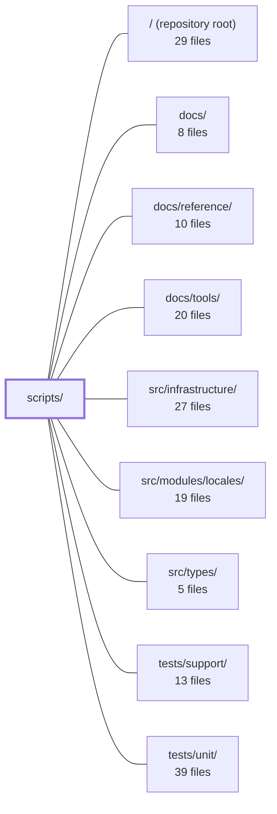

---
tags:
  - 2repo
  - 2repo/module
  - project/boilerplate-vue-frontend
type: module
module: scripts/
files: 13
updated: 2026-08-30T17:08:38.301514+00:00
---

# scripts/

## Purpose

The `scripts/` directory contains every CLI entry-point and shared helper that powers this repo's local tooling: spawning the paired backend demo, sharding and running the Cypress E2E suite, enforcing mutation-score ratchets, verifying cross-repo contract file identity, generating AsyncAPI-derived TypeScript types, and summarising test reports. It sits at the boundary between `npm run` commands (defined in the root `package.json`) and the heavier runtime tools (Stryker, Cypress, the backend process) so that each command has a single, testable implementation.

## Key parts

- **Backend demo lifecycle** — `run-backend-demo.ts` (the `npm run backend:demo` entry), `backend-demo-scratch-directory.ts` (isolated `TMPDIR` for MongoDB-memory-server data), and `paired-backend-path.ts` (shared resolution of the sibling checkout's path and reset/demo commands) work together so every consumer agrees on *which* backend to boot and *where* to put its scratch files.
- **E2E sharding** — `run-e2e-shards.ts` orchestrates parallel Cypress shards against a built preview server; `e2e-shard-balancer.ts` holds the LPT bin-packing logic in isolation for unit-testing; `cypress-spec-globs.ts` is the single source of truth for spec-glob patterns shared by Cypress config, ESLint, the shard runner, and `package.json`.
- **Mutation testing** — `run-mutation-tests.ts` wraps Stryker with OOM detection and env-driven tuning; `mutation-baseline.ts` implements the per-file ratchet; `check-mutation-baseline.ts` is the CI-facing CLI that compares the latest report against `mutation-baseline.json`.
- **Cross-repo contract integrity** — `spec-identity.ts` fingerprints the shared spec files on both checkouts; `check-spec-identity.ts` is the thin CLI (`npm run check:spec-identity`) that exits 0/1/2.
- **Code generation** — `generate-asyncapi-types.ts` produces `src/types/asyncapi.generated.ts` from `asyncapi.yaml` via `@asyncapi/modelina`; both repos in the pair run it with their own input document.
- **Reporting** — `report-test-results.ts` (`npm run test:report`) reorganises a Jest/Vitest JSON report into a per-module cost and coverage summary.

## How it connects

- **`/` (repository root)** — every script is wired to a `package.json` script here; `cypress-spec-globs.ts` exists specifically because the root `package.json` cannot import from a TS module, and a dedicated unit test keeps the two in sync.
- **`src/types/`** — `generate-asyncapi-types.ts` writes `asyncapi.generated.ts` into this directory; that file is then imported by the rest of the frontend source.
- **`tests/unit/`** — houses the unit tests for `e2e-shard-balancer.ts` (algorithm isolation), `cypress-spec-globs.ts` (globs vs. `package.json` consistency), and `mutation-baseline.ts` (ratchet logic).
- **`tests/support/`** — provides the Cypress fixtures and helpers that the sharded runs in `run-e2e-shards.ts` depend on at runtime.
- **`src/infrastructure/`** — the backend path and demo lifecycle helpers (`paired-backend-path.ts`, `run-backend-demo.ts`) are the single source of truth that infrastructure-level code uses when it needs to talk to the sibling repo.
- **`docs/`, `docs/reference/`, `docs/tools/`** — document the CLI commands exposed here (e.g. `test:e2e`, `test:report`, `check:spec-identity`) so a contributor can discover and invoke them without reading source.

## Where to start

1. **`paired-backend-path.ts`** — it is the shortest file and the one every other script delegates to for "where is the backend and how do I talk to it." Reading it first gives you the shared vocabulary (`BACKEND_PATH`, reset, demo) used throughout the directory.
2. **`run-e2e-shards.ts`** — it pulls together the shard balancer, the spec-glob list, the scratch directory, and the backend spawner into one readable orchestration flow, so you see how the pieces compose in a real `npm run test:e2e` invocation.

## Connected modules

[[boilerplate-vue-frontend_ROOT|/ (repository root)]] · [[boilerplate-vue-frontend_docs|docs/]] · [[boilerplate-vue-frontend_docs_reference|docs/reference/]] · [[boilerplate-vue-frontend_docs_tools|docs/tools/]] · [[boilerplate-vue-frontend_src_infrastructure|src/infrastructure/]] · [[boilerplate-vue-frontend_src_modules_locales|src/modules/locales/]] · [[boilerplate-vue-frontend_src_types|src/types/]] · [[boilerplate-vue-frontend_tests_support|tests/support/]] · [[boilerplate-vue-frontend_tests_unit|tests/unit/]]

## Files
- `scripts/backend-demo-scratch-directory.ts` — Provides a disk-backed scratch directory (under `~/.cache/boilerplate-vue-frontend-demo/<pid>`) to serve as `TMPDIR` for demo backends spawned by this repo. This keeps `mongodb-memory-server` data off the RAM-backed tmpfs that fills up when a backend is killed mid-run, and reclaims leaked directories on the next invocation.
- `scripts/check-mutation-baseline.ts` — CLI entry point for the per-file mutation-testing ratchet. It compares the latest Stryker report (`reports/mutation/mutation.json`) against the recorded baseline (`mutation-baseline.json`) and exits non-zero if any file's mutation score has dropped. It can also rewrite the baseline (`--update`), but only for improved or new files—the ratchet never lowers a recorded score.
- `scripts/check-spec-identity.ts` — CLI entry point (`npm run check:spec-identity`) that verifies shared contract files in this repo are byte-identical to those in the paired backend repo. It resolves the sibling path, runs the comparison, and communicates the result exclusively through exit codes (0 / 1 / 2) and a single console message.
- `scripts/cypress-spec-globs.ts` — Single source of truth for Cypress spec file globs. The same set of patterns is needed in at least five places that cannot import from each other (Cypress config, ESLint config, shard runner, `package.json` scripts, and a test). This file centralises the three glob arrays so they stay in agreement; the one place that *can't* import them (`package.json`) is kept consistent by a dedicated unit test.
- `scripts/e2e-shard-balancer.ts` — Pure balancing logic extracted from `run-e2e-shards.ts`. It holds the measured-duration table and the LPT (longest-processing-time) bin-packing algorithm that assigns E2E spec files to shards, isolated so the algorithmic core can be unit-tested independently of the process-orchestration code.
- `scripts/generate-asyncapi-types.ts` — Generates the TypeScript realtime contract types (payload interfaces, message aliases, per-namespace channel constants/unions, and SSE event payload maps) from `asyncapi.yaml` using `@asyncapi/modelina`. It exists as a single shared script consumed by both repos in the pair—each writes the same `src/types/asyncapi.generated.ts` path but from a different input document (full contract vs. public subset)—so the generated surface stays consistent.
- `scripts/mutation-baseline.ts` — Implements a per-file mutation-score ratchet to compensate for Stryker's lack of per-file thresholds. It reads a Stryker JSON report, compares each file's score against a committed baseline (`mutation-baseline.json`), and enforces that scores never silently drop. Baselines only move up on `--update`; lowering one is a deliberate human decision.
- `scripts/paired-backend-path.ts` — Centralises the resolution of the paired backend's filesystem path and its operational commands (reset, demo). Exists so that every consumer agrees on *which* backend directory they mean and *how* to invoke it, without duplicating env-reading, path-resolution, or placeholder-substitution logic across `cypress.config.ts`, spec-identity checks, and demo bootstrapping.
- `scripts/report-test-results.ts` — CLI reader that turns a Jest/Vitest JSON test report into a human-readable summary organised by module: which module owns a failure, where the wall-clock time went, and per-module line coverage. It exists because the rest of the toolchain is layer-shaped (unit, contract, CI jobs) and cannot tell you what a single module's tests cost or which module a red build belongs to. Invoked as `npm run test:report [-- <file.json>]`.
- `scripts/run-backend-demo.ts` — A thin CLI wrapper behind `npm run backend:demo`. It resolves *which* paired backend to boot (delegating to `resolveBackendDemoCommand`), loads `.env`, spawns the backend's demo-profile process with a dedicated scratch directory, and forwards lifecycle signals. It exists so that `start-server-and-test` and a human each get one command with the sibling-checkout path already resolved.
- `scripts/run-e2e-shards.ts` — The worker behind `npm run test:e2e`. It splits the functional Cypress spec suite into parallel shards (default 4) balanced by measured durations, boots one isolated demo backend per shard, staggers the `cypress run` launches, and collects pass/fail per shard — all against a single **built** (not dev) preview server so that shard count doesn't introduce compile-contention flakes.
- `scripts/run-mutation-tests.ts` — Wrapper around `npx stryker run` that handles three concerns a static JSON config cannot: injecting machine-specific settings (`concurrency`, worker heap) from `.env`, clearing the `.stryker-tmp/` sandbox before each run, and detecting the OOM/strand loop so a non-converging run is killed in seconds instead of hours.
- `scripts/spec-identity.ts` — Cross-repo contract integrity checker. A small set of spec files must be byte-identical (or semantically identical for YAML) between this repo and whichever backend is paired via `BACKEND_PATH`. A silent fork still passes each side's CI, so this module fingerprints the shared files on both checkouts and reports drift, missing files, or renames. It is the single source of truth for *which* files are shared and *how* they are compared.

---
[[boilerplate-vue-frontend_INDEX|← boilerplate-vue-frontend index]]
