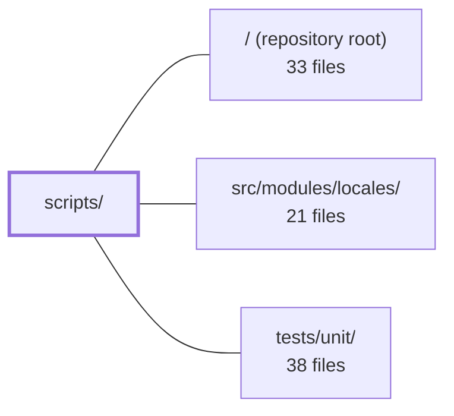

---
tags:
  - 2repo
  - 2repo/module
  - project/boilerplate-vue-frontend
type: module
module: scripts/
files: 13
updated: 2026-09-03T10:57:06.119975+00:00
---

# scripts/

## Purpose

`scripts/` holds the CLI entry points and shared utility modules that power this repository's local development workflow: bootstrapping and managing the paired demo backend, orchestrating sharded E2E test runs, enforcing mutation-score ratchets, verifying cross-repo contract identity, generating shared type definitions, and producing human-readable test reports.

## Key parts

- **Backend lifecycle** — `run-backend-demo.ts` (the `npm run backend:demo` entry point), `backend-demo-scratch-directory.ts` (disk-backed `TMPDIR` so `mongodb-memory-server` data survives kills), and `paired-backend-path.ts` (single source of truth for resolving the sibling backend's path and its operational commands).
- **E2E orchestration** — `run-e2e-shards.ts` (spawns N parallel `cypress run` workers behind one `vite preview`), `e2e-shard-balancer.ts` (LPT bin-packing algorithm, extracted for unit-testability), and `cypress-spec-globs.ts` (the one canonical set of spec-glob patterns consumed by five otherwise independent config surfaces).
- **Mutation testing** — `run-mutation-tests.ts` (wraps Stryker with env-tuned concurrency, sandbox cleanup, and OOM-kill detection), `mutation-baseline.ts` (per-file score-ratchet logic), and `check-mutation-baseline.ts` (CLI gate that exits non-zero on regression).
- **Cross-repo contracts** — `spec-identity.ts` / `check-spec-identity.ts` (byte-comparison of OpenAPI & AsyncAPI specs against the paired backend, mirrored verbatim in that repo), and `generate-asyncapi-types.ts` (produces `src/types/asyncapi.generated.ts` from `asyncapi.yaml` via Modelina).
- **Reporting** — `report-test-results.ts` (reads a Jest/Vitest JSON report and summarises failures, timing, and coverage per module).

## How it connects

- **Repository root (`/`)** — Every script is wired in through `package.json` scripts (`npm run …`), referenced from `cypress.config.ts`, the ESLint config, and CI job definitions. `cypress-spec-globs.ts` exists precisely because those consumers cannot import from one another; a dedicated unit test keeps the `package.json` copy in sync.
- **`tests/unit/`** — Houses the unit tests that exercise the pure-logic scripts (e.g., the LPT balancer in `e2e-shard-balancer.ts`, the ratchet comparison in `mutation-baseline.ts`, and the glob-consistency assertion for `cypress-spec-globs.ts`).
- **`src/modules/locales/`** — E2E specs that exercise locale-switching behaviour are among the files the shard balancer assigns and the spec-identity check guards; the scripts module therefore indirectly constrains how locale contract files evolve.

## Where to start

1. **`scripts/paired-backend-path.ts`** — short, self-contained, and the single place that resolves *which* backend directory every other script (demo, spec-identity, E2E) talks to. Reading it first makes the rest of the module's assumptions concrete.
2. **`scripts/run-e2e-shards.ts`** — the main test entry point a newcomer will run most often; tracing it reveals how the balancer, scratch directory, and backend bootstrap all compose into a single `npm run test:e2e` invocation.

## Connected modules

[[boilerplate-vue-frontend_ROOT|/ (repository root)]] · [[boilerplate-vue-frontend_src_modules_locales|src/modules/locales/]] · [[boilerplate-vue-frontend_tests_unit|tests/unit/]]

## Files
- `scripts/backend-demo-scratch-directory.ts` — Provides a disk-backed scratch directory (under `~/.cache/boilerplate-vue-frontend-demo/<pid>`) to serve as `TMPDIR` for demo backends spawned by this repo. This keeps `mongodb-memory-server` data off the RAM-backed tmpfs that fills up when a backend is killed mid-run, and reclaims leaked directories on the next invocation.
- `scripts/check-mutation-baseline.ts` — CLI entry point for the per-file mutation-testing ratchet. It compares the latest Stryker report (`reports/mutation/mutation.json`) against the recorded baseline (`mutation-baseline.json`) and exits non-zero if any file's mutation score has dropped. It can also rewrite the baseline (`--update`), but only for improved or new files—the ratchet never lowers a recorded score.
- `scripts/check-spec-identity.ts` — CLI entry point (`npm run check:spec-identity`) that verifies shared contract files in this repo are byte-identical to those in the paired backend repo. It resolves the sibling path, runs the comparison, and communicates the result exclusively through exit codes (0 / 1 / 2) and a single console message.
- `scripts/cypress-spec-globs.ts` — Single source of truth for Cypress spec file globs. The same set of patterns is needed in at least five places that cannot import from each other (Cypress config, ESLint config, shard runner, `package.json` scripts, and a test). This file centralises the three glob arrays so they stay in agreement; the one place that *can't* import them (`package.json`) is kept consistent by a dedicated unit test.
- `scripts/e2e-shard-balancer.ts` — Pure balancing logic extracted from `run-e2e-shards.ts`. It holds the measured-duration table and the LPT (longest-processing-time) bin-packing algorithm that assigns E2E spec files to shards, isolated so the algorithmic core can be unit-tested independently of the process-orchestration code.
- `scripts/generate-asyncapi-types.ts` — Generates the TypeScript realtime contract types (payload interfaces, message aliases, per-namespace channel constants/unions, and SSE event payload maps) from `asyncapi.yaml` using `@asyncapi/modelina`. It exists as a single shared script consumed by both repos in the pair—each writes the same `src/types/asyncapi.generated.ts` path but from a different input document (full contract vs. public subset)—so the generated surface stays consistent.
- `scripts/mutation-baseline.ts` — Implements a per-file mutation-score ratchet to compensate for Stryker's lack of per-file thresholds. It reads a Stryker JSON report, compares each file's score against a committed baseline (`mutation-baseline.json`), and enforces that scores never silently drop. Baselines only move up on `--update`; lowering one is a deliberate human decision.
- `scripts/paired-backend-path.ts` — Centralises the resolution of the paired backend's filesystem path and its operational commands (reset, demo). Exists so that every consumer agrees on *which* backend directory they mean and *how* to invoke it, without duplicating env-reading, path-resolution, or placeholder-substitution logic across `cypress.config.ts`, spec-identity checks, and demo bootstrapping.
- `scripts/report-test-results.ts` — CLI reader that turns a Jest/Vitest JSON test report into a human-readable summary organised by module: which module owns a failure, where the wall-clock time went, and per-module line coverage. It exists because the rest of the toolchain is layer-shaped (unit, contract, CI jobs) and cannot tell you what a single module's tests cost or which module a red build belongs to. Invoked as `npm run test:report [-- <file.json>]`.
- `scripts/run-backend-demo.ts` — A thin CLI wrapper (`npm run backend:demo`) that boots the paired backend's demo profile. It resolves *which* backend to start (delegating to `paired-backend-path.ts` so the choice can't diverge from `check-spec-identity`), sets up the runtime environment (scratch dir, frontend URL), spawns the backend process, and forwards signals so it shuts down cleanly. When no demo command is configured it idles so `start-server-and-test` still sees a "live" server.
- `scripts/run-e2e-shards.ts` — Orchestrates the sharded parallel execution of Cypress e2e specs (the worker behind `npm run test:e2e`). Splits functional specs across N parallel `cypress run` processes, each backed by its own in-memory demo backend, while sharing a single `vite preview` static server. Exists to cut wall-clock time from ~13 min (sequential) to ~85 s floor (bounded by the longest single spec) without the flakiness a dev server would introduce.
- `scripts/run-mutation-tests.ts` — Wrapper around `npx stryker run` that handles three concerns a static JSON config cannot: injecting machine-specific settings (`concurrency`, worker heap) from `.env`, clearing the `.stryker-tmp/` sandbox before each run, and detecting the OOM/strand loop so a non-converging run is killed in seconds instead of hours.
- `scripts/spec-identity.ts` — Cross-repo contract check that verifies a small set of spec files (OpenAPI, AsyncAPI) are byte-identical between this frontend checkout and whichever paired backend is deployed. It exists because a one-line edit in one repo silently forks what both sides believe they share, and neither CI suite catches it since a forked spec is still a valid spec. The file is mirrored verbatim in the backend; only `THIS_REPO` differs there.

---
[[boilerplate-vue-frontend_INDEX|← boilerplate-vue-frontend index]]
