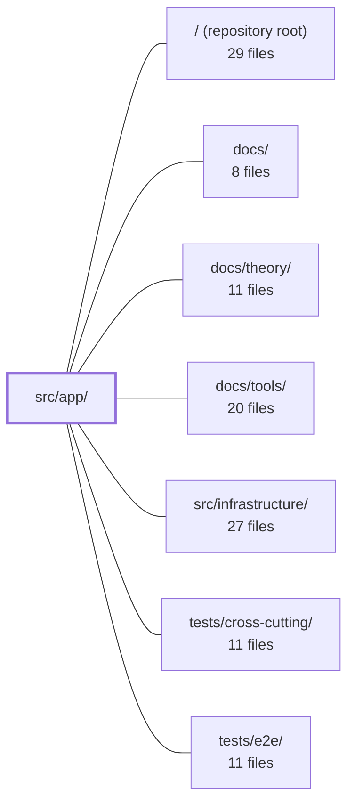

---
tags:
  - 2repo
  - 2repo/module
  - project/boilerplate-vue-frontend
type: module
module: src/app/
files: 15
updated: 2026-08-30T17:08:52.469510+00:00
---

# src/app/

## Purpose

`src/app/` is the application shell: the top-level UI chrome, routing pipeline, and navigation surface that every user-facing view renders through. It owns the navigation bar, locale-prefixed routing, authentication guards, confirmation dialogs, and the default landing/static/error views. Domain-specific functionality lives elsewhere; this module is the frame that holds it all together.

## Key parts

- **Shell & layout**
  - `layouts/LayoutDefault.vue` — The single application shell (skip link, health banner, nav, hero slot, footer, dialog host, toasts, loading indicators). Every view mounts inside it.
  - `components/AppNavigation.vue` — Top bar + mobile drawer. Merges shell entries with module-contributed entries from the kernel registry, filters by `canAccess`, and renders the desktop icon bar, dropdown menus, and hamburger drawer.
  - `components/AppDialogHost.vue` / `AppHealthBanner.vue` / `AppLanguageSwitcher.vue` — Small, single-purpose presentational components (confirmation dialog, offline warning, locale dropdown) that the layout mounts once.

- **Navigation primitives**
  - `components/AppNavMenu.vue` / `AppNavIconButton.vue` — Shared dropdown-menu and accessible icon-button building blocks used by the account and admin menus.

- **Routing & guards**
  - `router/index.ts` — Creates the Vue Router instance, assembles `/:locale/…` routes from the kernel registry, and registers the global guard chain and post-navigation side effects.
  - `guards/authentications.ts` — Defines the single `canAccess` predicate shared by both router guards and the nav bar; also provides `tryRestoreAuth` for session rehydration.
  - `guards/locale-choice.ts` — `beforeResolve` guard that loads/activates the i18n locale implied by the `:locale` param and redirects when it is missing.
  - `router/announcer.ts` — Post-navigation accessibility: live-region title announcement and deferred focus to `<v-main>`.
  - `router/navigation.ts` — Thin constants + helpers for sign-in/sign-up route names and "continue after login" redirects, decoupling the shell from the account module.

- **Default views**
  - `views/Home.vue`, `views/StaticPage.vue`, `views/Error.vue` — Landing hero, i18n-driven prose pages (About/FAQ/Terms/Privacy), and the generic full-page error, respectively.

## How it connects

- **`src/infrastructure/`** — Provides the kernel registry (`collectModuleRoutes`), the i18n/dictionary-loading utilities, the API reachability flag, and the dialog/toast stores that this shell consumes. The router and guards delegate all domain-route discovery and backend communication to it.
- **`tests/e2e/`** — Exercises the shell end-to-end (navigation flows, locale switching, auth-gated routes, dialog interactions).
- **`tests/cross-cutting/`** — Covers guard logic, a11y announcement timing, and shared-access predicates that span the shell and domain modules.
- **`/` (repository root)** — Project-level configuration (Vite, ESLint, module resolution) that determines how this module's files are built and linted.
- **`docs/`, `docs/theory/`, `docs/tools/`** — Narrative documentation describing the architectural decisions behind the shell's routing model, i18n strategy, and accessibility contracts.

## Where to start

1. **`src/app/layouts/LayoutDefault.vue`** — Shows the complete shell in one file: what is mounted, in what order, and which slots views fill. Reading it gives you the mental map of every other component's placement.
2. **`src/app/router/index.ts`** — The single place where routes are assembled, guards are chained, and post-navigation hooks are wired. It reveals how the shell stays domain-agnostic (routes come from the registry, not from literals in this file).

## Connected modules

[[boilerplate-vue-frontend_ROOT|/ (repository root)]] · [[boilerplate-vue-frontend_docs|docs/]] · [[boilerplate-vue-frontend_docs_theory|docs/theory/]] · [[boilerplate-vue-frontend_docs_tools|docs/tools/]] · [[boilerplate-vue-frontend_src_infrastructure|src/infrastructure/]] · [[boilerplate-vue-frontend_tests_cross-cutting|tests/cross-cutting/]] · [[boilerplate-vue-frontend_tests_e2e|tests/e2e/]]

## Files
- `src/app/components/AppDialogHost.vue` — A single, layout-mounted confirmation dialog host. Any component in the app that needs a "Are you sure?" prompt calls `useDialogStore().confirm(...)` instead of rendering its own dialog. This component is the only place that ties that abstract request to a concrete Vuetify `v-dialog`, so restyling or reworking all confirmations is a one-file edit.
- `src/app/components/AppHealthBanner.vue` — A thin, always-mounted presentational banner that surfaces a "degraded" warning when the API backend is unreachable. It intentionally does not render an error page—the app remains functional with bundled dictionaries and cached pages, so the message is "offline" rather than "broken." The component only reads a reachability flag; it never calls the API itself.
- `src/app/components/AppLanguageSwitcher.vue` — Renders a dropdown menu for switching the app's display language. The component owns only the **routing** half of a language switch (re-navigating the current route under the new locale prefix); dictionary loading and locale persistence are delegated to other modules.
- `src/app/components/AppNavIconButton.vue` — Icon-only button/link for the desktop app bar. Because the bar shows glyphs without visible text, this component guarantees every entry carries an accessible name (the same string used for both `aria-label` and tooltip, per WCAG 2.5.3) and exposes attribute fall-through so a parent can wrap it in `v-menu` as an activator.
- `src/app/components/AppNavMenu.vue` — A generic dropdown-menu shell that wraps `AppNavIconButton` as the activator and renders an array of `AppNavItem` entries inside a `role="menu"` list. It is the shared component behind both the account menu and the admin menu, giving them an identical keyboard-navigation contract (Vuetify `v-menu` defaults) plus correct ARIA menu semantics and a `#after` slot for non-navigation actions such as logout.
- `src/app/components/AppNavigation.vue` — The app shell's top navigation bar and mobile drawer. It merges the shell's own two entries (Home, StaticAbout) with every entry contributed by enabled modules (collected via the kernel registry), filters each section by `canAccess`, and renders the result as the desktop icon bar, the account/admin dropdown menus, and the mobile hamburger drawer.
- `src/app/guards/authentications.ts` — Central route-access-control module. It defines the single `canAccess` predicate that both the router guard and the navigation bar share, so "can reach" and "can see" can never drift apart. It also provides the session-restore step (`tryRestoreAuth`) that rehydrates token + viewer before any access check runs.
- `src/app/guards/locale-choice.ts` — A Vue Router `beforeResolve` guard that keeps the active i18n language in sync with the `:locale` route parameter. On first use of a locale it loads the bundled JSON dictionary, merges remote overrides, registers the messages, and activates the language. When the param is missing or unsupported it redirects to the same route with the default locale injected.
- `src/app/layouts/LayoutDefault.vue` — The single application shell every view renders through. It provides the skip link, health banner, navigation, page hero, footer, confirmation-dialog host, toast stack, and full-page/activity loading indicators. It deliberately preloads no domain-specific data—only the layout chrome and its accessibility scaffolding live here.
- `src/app/router/announcer.ts` — A small, router-owned state module that handles two accessibility concerns after navigation: publishing the new page title into a live region for screen readers, and deferring focus movement to the main landmark until the *new* page's DOM is mounted. It exists because a SPA otherwise swaps content silently (WCAG 4.1.3) and because the `<v-main>` element available at the moment of navigation belongs to the page about to unmount.
- `src/app/router/index.ts` — Creates and configures the application's Vue Router instance. It assembles locale-prefixed routes (`/:locale/…`), merges all domain routes in through the kernel registry (`collectModuleRoutes(enabledModules)`), and registers the global guard chain (auth restore → access enforcement → locale choice) plus post-navigation side effects (tab title, a11y announcement, focus management). This file names no domain itself; enabling or removing a domain is entirely a matter of `src/modules.ts`.
- `src/app/router/navigation.ts` — Defines the sign-in and sign-up route name constants and provides helpers for building a "continue here after login" redirect location. It exists as a thin, dependency-free bridge so that the app shell can reference authentication routes without importing the (potentially absent) account module.
- `src/app/views/Error.vue` — Generic full-page error view rendered when the router redirects with a status and message (e.g. an uncaught error or a rejected navigation). It displays the status, a human-readable message, and a single "Go Home" action.
- `src/app/views/Home.vue` — Landing page component for the app shell. Renders a static hero call-to-action and a three-card showcase grid, all fully i18n-driven. It exists as the default entry view that users see before navigating into any domain module.
- `src/app/views/StaticPage.vue` — A single Vue component that renders all prose-based static pages (About, FAQ, Terms, Privacy) in the shop. All copy lives in i18n locale dictionaries under `static-pages.<page>`, so localisation or content changes require editing dictionaries rather than touching this component.

---
[[boilerplate-vue-frontend_INDEX|← boilerplate-vue-frontend index]]
