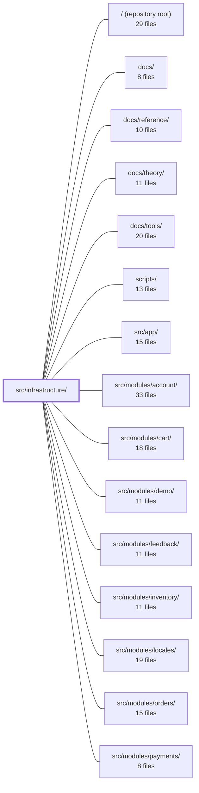

---
tags:
  - 2repo
  - 2repo/module
  - project/boilerplate-vue-frontend
type: module
module: src/infrastructure/
files: 27
updated: 2026-08-30T17:09:08.441805+00:00
---

# src/infrastructure/

## Purpose

`src/infrastructure/` is the application's shared services layer: it owns every cross-cutting concern that more than one feature needs—HTTP transport, internationalisation, session state, observability, form plumbing, and small utility helpers—so that domain modules under `src/modules/` can focus on business logic without re-wiring axios, vue-i18n, or the telemetry SDKs.

## Key parts

- **HTTP tier (`http/`)** — `client.ts` creates the single shared axios instance; `index.ts` is the composition root that wires interceptors and exposes `orvalMutator` (the one function every API call goes through); `interceptors.ts` adds the auth/language headers and normalises rejections; `refresh.ts` implements single-attempt 401 token-refresh-and-replay; `envelope.ts`, `types.ts`, and `url.ts` provide the shared type guards, aliases, and URL-normalisation helpers those files rely on. `response-schema-map.ts` + `validate.ts` form an optional Zod contract-validation gate that runs inside `orvalMutator`.
- **Composables (`composables/`)** — Thin bindings that adapt `@guebbit/vue-toolkit` primitives (liveness probe, form validation, upload-progress state machine) to this app's concrete endpoints and locale/notification choices, so feature forms call one composable instead of re-supplying the same three values.
- **i18n (`i18n/`)** — `index.ts` is the vue-i18n runtime (locale load → activate → merge); `locale-overrides.ts` fetches server-side overrides with safe fallbacks; `router-link.ts` rewrites vue-router locations to carry the active locale; `dom.ts` keeps `<html lang>` / `dir` in sync.
- **Stores (`stores/`)** — `session.ts` holds the in-memory auth token + minimal viewer projection and exposes `isAuth` / `isAdmin`; `dialog.ts` replaces `globalThis.confirm()` with an async, queued confirmation flow; `observability.ts` lazily initialises Grafana Faro and Umami behind one API.
- **Observability & SSE** — `config.ts` reads the two telemetry env vars; `analytics-events.ts` is a generated event-name catalogue shared with the backend repo; `create-sse-client.ts` wraps `EventSource` into a small typed listener API.
- **Utilities (`utils/`)** — `errors.ts` centralises catch-block handling; `formatters.ts` binds locale-bound formatting; `images.ts` resolves image URLs; `logger.ts` is the single console boundary; `uploads.ts` mirrors backend upload limits for instant client-side feedback.

## How it connects

- **`src/modules/*` (account, cart, products, orders, …)** — every domain module imports the HTTP composition root (`http/index.ts`), the session store, the form composable, the i18n runtime, and the error/formatting utilities rather than wiring those concerns themselves. The `response-schema-map` registration hook lets each module contribute its own Zod rows at boot.
- **`src/app/`** — the application shell consumes the dialog store (rendering `AppDialogHost`), the session store (route guards, admin gating), and the i18n / observability stores at startup.
- **`src/types/`** — provides the shared domain types that `envelope.ts`, `response-schema-map.ts`, and `validate.ts` reference when describing payload shapes.
- **`tests/unit/`** — exercises the HTTP tier (interceptors, refresh, validation gate), the composables, and the utility helpers in isolation.
- **`src/modules/locales/`** — supplies the per-locale JSON dictionaries that `i18n/index.ts` code-splits and loads via a Vite glob.
- **`scripts/` / repository root** — the build-time identity gate that keeps `analytics-events.ts` byte-identical to the backend counterpart, and the `orval.config.ts` at the root that points all generated clients at `http/index.ts`.

## Where to start

Read **`src/infrastructure/http/index.ts`** first: it is the single public surface of the HTTP tier, shows how the shared axios instance, interceptors, refresh logic, and validation gate are composed, and is the entry point every API call in the app funnels through. Then read **`src/infrastructure/stores/session.ts`**, because it defines the authentication contract (`isAuth`, `isAdmin`, token/identity pair) that route guards, the shell, and the refresh interceptor all depend on—understanding it early prevents confusion about *when* a request is considered authenticated.

## Connected modules

[[boilerplate-vue-frontend_ROOT|/ (repository root)]] · [[boilerplate-vue-frontend_docs|docs/]] · [[boilerplate-vue-frontend_docs_reference|docs/reference/]] · [[boilerplate-vue-frontend_docs_theory|docs/theory/]] · [[boilerplate-vue-frontend_docs_tools|docs/tools/]] · [[boilerplate-vue-frontend_scripts|scripts/]] · [[boilerplate-vue-frontend_src_app|src/app/]] · [[boilerplate-vue-frontend_src_modules_account|src/modules/account/]] · [[boilerplate-vue-frontend_src_modules_cart|src/modules/cart/]] · [[boilerplate-vue-frontend_src_modules_demo|src/modules/demo/]] · [[boilerplate-vue-frontend_src_modules_feedback|src/modules/feedback/]] · [[boilerplate-vue-frontend_src_modules_inventory|src/modules/inventory/]] · [[boilerplate-vue-frontend_src_modules_locales|src/modules/locales/]] · [[boilerplate-vue-frontend_src_modules_orders|src/modules/orders/]] · [[boilerplate-vue-frontend_src_modules_payments|src/modules/payments/]] · … and 6 more

## Files
- `src/infrastructure/composables/use-api-health.ts` — A one-line composable that binds the toolkit's generic liveness-probe mechanism to this app's specific health endpoint. All polling, backoff, and browser `online`-event retry logic lives in `useLivenessProbe` (from `@guebbit/vue-toolkit`); this file only declares *which* request counts as the ping.
- `src/infrastructure/composables/use-app-form.ts` — App-level wrapper around the toolkit's `useStructureFormValidation` that binds the three open questions the toolkit deliberately leaves unanswered (i18n translation, notification dispatch, invalid-field CSS selector) to this application's fixed choices. Every form in the codebase calls this composable instead of re-supplying those three values individually.
- `src/infrastructure/composables/use-upload-progress.ts` — Binds the `@guebbit/vue-toolkit` upload-progress state machine to axios, giving the five file-upload forms a single shared implementation of progress-bar plumbing instead of duplicating the binding in each form.
- `src/infrastructure/create-sse-client.ts` — Thin, framework-agnostic wrapper around the browser's `EventSource`. It opens a single SSE connection, registers one listener per typed event name, JSON-parses each frame, and silently drops frames that fail to parse. Exists so callers get a small, typed API without managing `EventSource` lifecycle or payload decoding themselves.
- `src/infrastructure/http/client.ts` — Creates and exports the single shared axios instance used by every HTTP client in the app. It exists as a dependency-free leaf of the http tier so that importing it can never create a circular evaluation through `index.ts`.
- `src/infrastructure/http/envelope.ts` — Provides type-guard helpers to read payloads out of the API's `{ data }` response wrapper. Because some endpoints (e.g. login) return a bare object while others (e.g. refresh, product lists) wrap the same shape in `{ data: … }`, these guards let a single call site handle both forms without the caller branching on the envelope. The module lives in the HTTP infrastructure layer—rather than in a domain store—because the wrapper is a transport concern, not a business concern.
- `src/infrastructure/http/index.ts` — Composition root of the HTTP tier. Wires the request/response interceptors onto the shared axios instance and exposes `orvalMutator` as the single function every generated (or hand-written) API call goes through. `orval.config.ts` points all generated clients at this module, making it the tier's public surface.
- `src/infrastructure/http/interceptors.ts` — Defines the four axios interceptor handlers that decorate outgoing requests (auth token, language) and normalize every incoming rejection into a single error-envelope shape. Token-refresh logic is deliberately kept out of this file.
- `src/infrastructure/http/refresh.ts` — Response-error interceptor that implements a single-attempt token refresh-and-retry flow. When a 401 is received (outside a small set of auth endpoints), it calls the refresh endpoint, stores the new token, and replays the original request exactly once. This exists so callers never need to handle token expiry manually.
- `src/infrastructure/http/response-schema-map.ts` — Route table that maps an HTTP method + URL pattern to the Zod schema validating the response for that call. It exists so `orvalMutator` can catch live contract violations without each call site knowing which operation it serves. Core (infrastructure-owned) rows are baked in; domain modules contribute their own rows at boot via registration.
- `src/infrastructure/http/types.ts` — Centralises the shared type aliases for the HTTP tier so that request-payload shapes, error-envelope shapes, and the retry-guard config extension are defined once and imported by the interceptors, refresh, and index modules.
- `src/infrastructure/http/url.ts` — Provides a single URL-to-pathname normalization function so that the two consumers that must agree on route identity (route-pattern matching and refresh exclusion) derive the same pathname from any given Axios request URL.
- `src/infrastructure/http/validate.ts` — Contract validation gate for the `orvalMutator` HTTP client. After a response is unwrapped, this module optionally parses the body against the Zod schema resolved for that request — throwing a detailed error on a real schema mismatch and logging a warning (fail-open) when no schema is mapped. A feature flag controls whether the check runs at all.
- `src/infrastructure/i18n/dom.ts` — A single-purpose DOM utility that keeps the `<html>` element's `lang` and `dir` attributes in sync with the active locale. It is deliberately decoupled from the i18n module's internal state (e.g. vue-i18n) so the function remains a plain, dependency-free DOM write.
- `src/infrastructure/i18n/index.ts` — Core i18n runtime: defines which languages exist, which are loaded, and the load → activate → merge pipeline every locale switch funnels through. Bundled dictionaries are code-split per locale via a Vite glob; this module wires them into a single `vue-i18n` instance (composition API) and exposes a module-scope `translate` helper for non-component callers (e.g. Zod validation thunks).
- `src/infrastructure/i18n/locale-overrides.ts` — Fetch layer for the runtime half of the i18n dictionaries: it pulls the API's language manifest and per-locale override messages, then merges them over the offline-bundled `src/locales/*.json` files. Every function resolves to a safe default (empty list, empty object) and never rejects, guaranteeing the app remains fully usable when the network is absent.
- `src/infrastructure/i18n/router-link.ts` — Rewrites any vue-router location so it carries the current locale. Because vue-router ignores `params` when a `path` is present, path-based locations need the locale physically prefixed onto the path, while named locations get it injected into `params.locale`. This file encapsulates that dual handling so callers never construct locale-prefixed routes by hand.
- `src/infrastructure/observability/analytics-events.ts` — A generated, byte-identical catalogue of the analytics event names this frontend app is allowed to emit. It exists so both repos in the paired architecture share a single event-name contract with no collisions, enforced by an identity gate at build time.
- `src/infrastructure/observability/config.ts` — Pure environment-variable readers for the two telemetry back-ends (Grafana Faro and Umami). Each back-end is opt-in via a single env var; if that var is unset the reader returns `undefined` and the consuming store skips initialisation entirely. No I/O, no side effects — just typed config objects built from `import.meta.env`.
- `src/infrastructure/stores/dialog.ts` — Pinia store that replaces `globalThis.confirm()` with an asynchronous, themeable, queued confirmation flow. Callers push a `DialogRequest` and `await` a `Promise<boolean>`; a separate host component (`AppDialogHost.vue`) renders the queue's head and calls `answer()` to settle the caller's promise. The store intentionally knows nothing about Vuetify, theming, or translation.
- `src/infrastructure/stores/observability.ts` — A single Pinia store that wraps two independent, lazily-initialized telemetry SDKs—Grafana Faro (errors, tracing, web-vitals) and Umami (product analytics)—behind one unified API. It exists to eliminate init-order problems between the two SDKs, to buffer boot-time analytics events that would otherwise be lost to the script-load round-trip, and to give components, stores, and router code a single import point for observability.
- `src/infrastructure/stores/session.ts` — Pinia store that holds the app-gating session pair — an in-memory access token and a minimal viewer projection — and exposes the derived booleans (`isAuth`, `isAdmin`) that route guards and the shell depend on. It exists so that authentication state lives in one place, is deliberately minimal (a `{ id, email, admin, imageUrl? }` shape rather than the domain `User`), and is never readable as "authenticated" until both the token *and* the identity are present.
- `src/infrastructure/utils/errors.ts` — Centralised error-handling helpers shared across the app: translating a caught value into user-facing text, classifying API rejections as transport-level vs. answered failures, the toast+Faro reporting pair every `catch` block calls, and a Vuetify-specific CSS selector for post-submit focus. It exists so that tone/language decisions, analytics-policy decisions, and a Vuetify quirk are each written in one place rather than scattered through feature code.
- `src/infrastructure/utils/formatters.ts` — Locale-bound formatting wrappers that bind the pure `@guebbit/js-toolkit` `formatX` functions to this app's active locale and shared empty-value glyph. Call sites invoke these wrappers without restating the locale or the fallback symbol, and cannot accidentally pick a different locale than the rest of the page.
- `src/infrastructure/utils/images.ts` — Leaf module that answers one question from three angles: given a record's `imageUrl`, what does `` get? It resolves API-relative paths to absolute URLs, optionally appends a thumbnail query parameter, and supplies a bundled placeholder for records with no image.
- `src/infrastructure/utils/logger.ts` — The app's single console boundary. Every `console.*` call is funneled through this module, gated by a severity ceiling and an opt-in scope set read from environment variables at module load. It exists so the rest of the codebase can use `no-console` as an ESLint error without losing structured, filterable logging.
- `src/infrastructure/utils/uploads.ts` — Client-side mirror of the backend's image-upload limits (accepted MIME types, max size) and a ready-made Zod rule for validating `File` fields in form schemas. It exists purely as a UX affordance—letting users get instant, localized feedback before a multi-megabyte upload is rejected by the server.

---
[[boilerplate-vue-frontend_INDEX|← boilerplate-vue-frontend index]]
