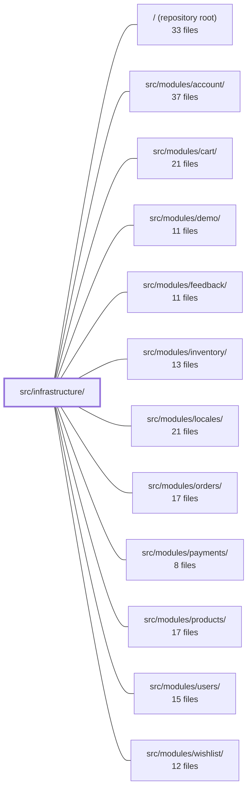

---
tags:
  - 2repo
  - 2repo/module
  - project/boilerplate-vue-frontend
type: module
module: src/infrastructure/
files: 21
updated: 2026-09-03T10:57:33.338787+00:00
---

# src/infrastructure/

## Purpose

`src/infrastructure/` is the application's shared services tier: the HTTP/SSE transport, session & auth state, i18n runtime, observability wiring, and cross-cutting utilities. Every feature module under `src/modules/` consumes this layer rather than talking to the browser, axios, or the network directly, so that wire-format concerns, token handling, locale resolution, and telemetry live in exactly one place.

## Key parts

- **`http/`** — The full HTTP stack.
  - `index.ts` is the composition root: attaches interceptors to the shared axios instance (`client.ts`) and exports the single `orvalMutator` that every generated or hand-written API call goes through.
  - `interceptors.ts` + `refresh.ts` handle auth-header injection, uniform error-envelope normalisation, and the single-retry 401 token-refresh flow.
  - `validate.ts` + `response-schema-map.ts` provide optional Zod contract-checking of responses keyed by method + URL pattern.
  - `envelope.ts`, `types.ts`, `url.ts` are small leaves that standardise the `{ data }` unwrap, shared type aliases, and pathname normalisation.

- **`i18n/`** — Locale lifecycle and runtime.
  - `index.ts` owns load → activate → merge of bundled (code-split) and module-contributed dictionaries.
  - `locale-overrides.ts` fetches API-side overrides with safe no-network fallbacks.
  - `router-link.ts` injects the active locale into vue-router locations (path-prefix or `params.locale`).

- **`observability/`** — `config.ts` reads env vars; `store.ts` lazily initialises Grafana Faro and Umami behind one Pinia store.

- **`session.ts`** — Pinia store holding the access token, a minimal viewer projection, `isAuth`/`isAdmin` flags, cookie bookkeeping, and the API calls for refresh / account / locale-persistence / logout.

- **`create-sse-client.ts`** — Typed, single-connection wrapper over `EventSource` with per-event JSON parsing and silent drop-on-parse-failure.

- **`utils/`** — Leaf helpers shared app-wide: `errors.ts` (classification + toast/Faro pair), `formatters.ts` (locale-bound `formatX` wrappers), `images.ts` (relative-path → absolute-URL + fallback SVG), `logger.ts` (the sole sanctioned `console` boundary), `uploads.ts` (client-side MIME/size guards mirroring the backend).

## How it connects

- **All `src/modules/*`** (account, cart, demo, feedback, inventory, locales, orders, payments, products, users, wishlist) import the `orvalMutator`, `session` store, i18n helpers, and `utils/` functions. They contribute their own response-schema rows to `response-schema-map.ts` and their bundled dictionaries to `i18n/index.ts` at boot.
- **`src/modules/locales/`** supplies the offline `*.json` dictionaries that `i18n/index.ts` code-splits and merges.
- **`src/modules/account/`** is the natural counterpart to `session.ts` (account lookup, token refresh, logout) and to the `/account/refresh` endpoint that `refresh.ts` calls.
- **Repository root** provides `orval.config.ts` (pointing all generated clients at `http/index.ts`) and the ESLint `no-console` rule that makes `utils/logger.ts` the only legal logging path.

## Where to start

1. **`http/index.ts`** — Read this first to see how a single `orvalMutator` is assembled from the bare axios client, interceptors, and optional validation. It is the public surface every other module talks to.
2. **`session.ts`** — A short, self-contained Pinia store that shows the auth-state shape, cookie helpers, and the API calls the rest of the app relies on for "am I logged in?" and "what is my token?"

## Connected modules

[[boilerplate-vue-frontend_ROOT|/ (repository root)]] · [[boilerplate-vue-frontend_src_modules_account|src/modules/account/]] · [[boilerplate-vue-frontend_src_modules_cart|src/modules/cart/]] · [[boilerplate-vue-frontend_src_modules_demo|src/modules/demo/]] · [[boilerplate-vue-frontend_src_modules_feedback|src/modules/feedback/]] · [[boilerplate-vue-frontend_src_modules_inventory|src/modules/inventory/]] · [[boilerplate-vue-frontend_src_modules_locales|src/modules/locales/]] · [[boilerplate-vue-frontend_src_modules_orders|src/modules/orders/]] · [[boilerplate-vue-frontend_src_modules_payments|src/modules/payments/]] · [[boilerplate-vue-frontend_src_modules_products|src/modules/products/]] · [[boilerplate-vue-frontend_src_modules_users|src/modules/users/]] · [[boilerplate-vue-frontend_src_modules_wishlist|src/modules/wishlist/]]

## Files
- `src/infrastructure/create-sse-client.ts` — Thin wrapper around the browser's `EventSource` that opens a single persistent SSE connection, registers one typed listener per event name, JSON-parses each incoming frame, and silently drops frames that fail to parse. It exists to give callers a small, typed surface (`SseClientCallbacks`) over the raw `EventSource` API without repeating the parse-and-filter boilerplate.
- `src/infrastructure/http/client.ts` — Single shared axios instance that all generated HTTP clients go through. It is the leaf of the http tier: configured but inert (no interceptors, no app imports), so importing it can never re-enter `index.ts` mid-evaluation. `index.ts` attaches the request/response interceptors on top of it.
- `src/infrastructure/http/envelope.ts` — Type-guard helpers that let any call site read a response whether the API wrapped it in a `{ data }` envelope or returned the payload directly. Placed here (transport layer) rather than in a store because the envelope is a property of the wire format, not of any single feature.
- `src/infrastructure/http/index.ts` — Composition root of the HTTP tier. Wires interceptors onto the shared axios instance at module load and exposes `orvalMutator` as the single function every generated (and hand-written) API call goes through. This is the tier's public surface: `orval.config.ts` points all generated clients here, and interceptor specs exercise them via the re-exports in this file.
- `src/infrastructure/http/interceptors.ts` — Defines the axios request/response interceptors for this application's HTTP layer. On the way out it attaches the session bearer token and active language; on the way back it normalizes every rejection into a single `AxiosResponseErrorData` envelope so downstream `catch` blocks can destructure uniformly. Token-refresh logic is explicitly out of scope here (delegated to `refresh.ts`).
- `src/infrastructure/http/refresh.ts` — Response interceptor that implements a single-retry token refresh flow: when a request fails with 401 (and the URL is not an auth endpoint), it calls `/account/refresh`, stores the new token, and replays the original request exactly once.
- `src/infrastructure/http/response-schema-map.ts` — Maps every HTTP method + URL pattern to the Zod schema that validates its response. This lets the live API client (`orvalMutator`) check a response against the correct contract without the caller needing to know which operation it issued. Core infrastructure rows are baked in; domain modules contribute their own rows at boot.
- `src/infrastructure/http/types.ts` — Central type-alias definitions for the HTTP infrastructure layer. It pins down the payload shapes (request data, error bodies, error envelopes) and the retry-loop-guard config extension so that `interceptors.ts`, `refresh.ts`, and `index.ts` share a single source of truth instead of repeating inline type assertions.
- `src/infrastructure/http/url.ts` — Single-utility leaf module that normalises an Axios request URL into the pathname string the HTTP layer matches on. It exists so that route-pattern lookups and the refresh exclusion set both derive the same pathname from the same input, guaranteeing they cannot disagree about which URLs they recognise.
- `src/infrastructure/http/validate.ts` — Contract validation gate for the `orvalMutator` HTTP client. After a response is unwrapped, this module optionally parses the body against the Zod schema resolved for that request — throwing a detailed error on a real schema mismatch and logging a warning (fail-open) when no schema is mapped. A feature flag controls whether the check runs at all.
- `src/infrastructure/i18n/index.ts` — Core i18n runtime that owns the full locale lifecycle: which languages are available, which are loaded, and the load → activate → merge pipeline every locale switch goes through. Bundled dictionaries are code-split per locale via dynamic `import()`, and module-contributed dictionaries are layered on top at boot or on demand. API-fetched overrides are deliberately **not** applied here; they are handled at the edges.
- `src/infrastructure/i18n/locale-overrides.ts` — Fetch layer for the runtime half of the i18n dictionaries: it pulls the API's language manifest and per-locale override messages, then merges them over the offline-bundled `src/locales/*.json` files. Every function resolves to a safe default (empty list, empty object) and never rejects, guaranteeing the app remains fully usable when the network is absent.
- `src/infrastructure/i18n/router-link.ts` — Rewrites any vue-router location so it carries the current locale. Because vue-router ignores `params` when a `path` is present, path-based locations need the locale physically prefixed onto the path, while named locations get it injected into `params.locale`. This file encapsulates that dual handling so callers never construct locale-prefixed routes by hand.
- `src/infrastructure/observability/config.ts` — Pure environment-variable readers for the two telemetry back-ends (Grafana Faro and Umami analytics). Each reader returns `undefined` when its primary env var is unset, serving as the single opt-in switch that `store.ts` checks — a build with neither set ships the code but calls nothing.
- `src/infrastructure/observability/store.ts` — A single Pinia store that wraps two independent, lazily-initialised telemetry SDKs—Grafana Faro (errors, tracing, web-vitals) and Umami (pageview analytics)—behind one unified API. It exists so that components, stores, and router hooks can all call the same observability functions without init-order concerns, and so that the two SDKs' lifecycles are co-located and independently gated by environment config.
- `src/infrastructure/session.ts` — Pinia store that holds the in-memory access token plus a minimal viewer projection, and exposes the `isAuth`/`isAdmin` flags that gate the app shell and route guards. It owns the cookie bookkeeping for the JS-readable `isAuth` and `rememberMe` markers, and wraps the API calls for token refresh, account lookup, locale persistence, and logout.
- `src/infrastructure/utils/errors.ts` — Central module for error-handling utilities shared across the app. It binds the app's translated fallback wording to the toolkit's message extractor, classifies rejections into "no response" vs. "server answered with a specific status," provides the toast+Faro reporting pair called from catch blocks, and exports a Vuetify-specific CSS selector for locating invalid form fields.
- `src/infrastructure/utils/formatters.ts` — Locale-bound formatting wrappers that bind the pure `@guebbit/js-toolkit` `formatX` functions to this app's active locale and shared empty-value glyph. Call sites invoke these wrappers without restating the locale or the fallback symbol, and cannot accidentally pick a different locale than the rest of the page.
- `src/infrastructure/utils/images.ts` — Two small leaf functions that turn an API record's relative image path into a URL a browser can actually fetch, and supply a bundled SVG when no image exists. They exist because the OpenAPI contract returns `uri-reference` values (paths relative to the API host), and handing those straight to `` 404s whenever the frontend and API are on different origins.
- `src/infrastructure/utils/logger.ts` — The single sanctioned console boundary for the entire app. Every other file is forbidden from calling `console.*` (enforced by an ESLint `no-console` rule), so all runtime logging is funnelled through this module. It wraps `console.debug/info/warn/error` behind a level ceiling and an opt-in scope filter, both read once from `VITE_APP_LOG_LEVEL` and `VITE_APP_LOG_SCOPES` at module load.
- `src/infrastructure/utils/uploads.ts` — Client-side mirror of the backend's image-upload limits (accepted MIME types, max size) and a single reusable Zod rule that enforces them on a form's optional `File` field. Exists purely as a UX affordance—so users get immediate feedback instead of waiting for a large upload to be rejected by the server.

---
[[boilerplate-vue-frontend_INDEX|← boilerplate-vue-frontend index]]
