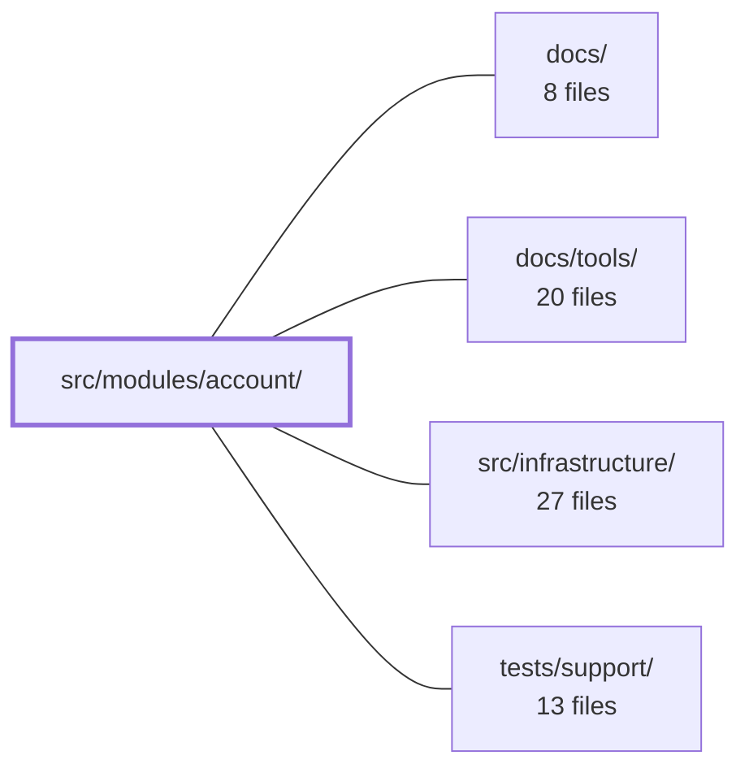

---
tags:
  - 2repo
  - 2repo/module
  - project/boilerplate-vue-frontend
type: module
module: src/modules/account/
files: 33
updated: 2026-08-30T17:09:24.232335+00:00
---

# src/modules/account/

## Purpose

The `account` module owns the entire identity-and-profile domain: authentication (login, signup, logout, password reset), self-service profile editing, email verification, device-session management, the address book, and account deletion. It is packaged as a self-contained `AppModule` that the kernel registry can enable or disable by name, contributing its own routes, nav entries, response-validation schemas, and locale strings.

## Key parts

- **Module manifest & wiring** — `module.ts` (registers the module's routes, schemas, and locale loaders), `routes.ts` (the full route table with per-route `access` guards), `response-schemas.ts` (Zod contracts for every account endpoint, consumed by the HTTP layer).
- **Views** (`views/`) — page-level components: `Login.vue`, `Signup.vue`, `Profile.vue` (the main edit form plus a composition shell for the sub-panels), `PasswordResetRequest.vue` / `PasswordResetConfirm.vue`, `VerifyEmailConfirm.vue`, and `AccountDeleteConfirm.vue`.
- **Profile sub-panels** (`components/`) — self-contained widgets composed by `Profile.vue`: `ProfileAddresses.vue`, `ProfilePasswordChange.vue`, `ProfileRole.vue`, `ProfileSessions.vue`, `ProfileDeleteAccount.vue`, `ProfileVerificationBanner.vue`. Each owns its own store slice and confirmation logic.
- **Stores** (`stores/`) — Pinia stores for `auth` (session lifecycle), `profile` (editable record + role + password + verification + deletion), `addresses` (address-book CRUD), and `sessions` (active-device list and revocation).
- **Tests** (`tests/`) — unit specs (mocking only the HTTP transport so real stores and composables execute), co-located e2e specs (Cypress suites for auth, profile, registration, password reset), accessibility and visual-regression declarations, and a route-metadata contract test.

## How it connects

- **`src/infrastructure/`** — The stores delegate all HTTP and caching to the `useStructureRestApi` composables provided by infrastructure. The array in `response-schemas.ts` is handed to the infrastructure HTTP layer, which validates every live account-domain response against the declared Zod schemas.
- **`tests/support/`** — The co-located e2e files (`a11y.cy.ts`, `account.visual.cy.ts`) are declarative route/anchor lists that the shared sweep utilities in `tests/support/` consume to perform the actual accessibility and visual-regression passes.
- **`docs/` / `docs/tools/`** — The module manifest's locale-loader declarations and route/access conventions are the units that documentation and tooling scripts reference when generating or validating the site's navigation and i18n coverage.

## Where to start

1. **`src/modules/account/module.ts`** — a short, plain object that shows the module's full surface (routes, schemas, locales) and how the kernel plugs it in. Reading this first gives the mental map of what "account" covers.
2. **`src/modules/account/stores/auth.ts`** — the session-lifecycle store is the thinnest entry point into the runtime: it shows how the module talks to the generated API client, coordinates with the session and profile stores, and fires analytics, all in one file.

## Connected modules

[[boilerplate-vue-frontend_docs|docs/]] · [[boilerplate-vue-frontend_docs_tools|docs/tools/]] · [[boilerplate-vue-frontend_src_infrastructure|src/infrastructure/]] · [[boilerplate-vue-frontend_tests_support|tests/support/]]

## Files
- `src/modules/account/components/ProfileAddresses.vue` — Address-book panel for the account profile page. Renders the user's saved addresses as a card grid and provides add, edit, remove, and set-default operations through a modal dialog and inline actions. Every mutating action re-fetches the full address list from the API so the "exactly one default" invariant is always reflected from the server's authoritative state.
- `src/modules/account/components/ProfileDeleteAccount.vue` — A single-button Vue component that triggers the account-deletion flow. It wraps the `requestAccountDelete` store call behind a shared confirmation dialog and surfaces the result (success toast or error toast) via the notifications store. It exists to isolate the destructive action so the parent profile page doesn't need to own the confirmation/error-handling logic.
- `src/modules/account/components/ProfilePasswordChange.vue` — A collapsible, inline password-change form for the profile page. It exists so the user can prove their current password and set a new one in a single request (no email round-trip), and so it stays hidden behind a toggle to avoid opening the profile page with multiple forms visible simultaneously.
- `src/modules/account/components/ProfileRole.vue` — A self-service role-switch widget that lets an admin promote or demote *themselves* between standard-user and administrator, visible only on the admin's own profile page. It exists as a standalone block (deliberately outside the main profile form) because the role change hits a different endpoint under a different authorisation than the rest of the profile.
- `src/modules/account/components/ProfileSessions.vue` — A Vuetify card component for the account profile page that lists all active refresh-token sessions, lets the user revoke any single session, and provides a "log out everywhere" action. It exists to give users a self-service surface for managing their device sessions and responding to credential leaks.
- `src/modules/account/components/ProfileVerificationBanner.vue` — A small Vuetify `v-alert` banner that appears on the profile page **only** when the loaded profile object exists and its `verified` field is explicitly `false`. It presents a single user action — resending the email-verification link — and reports the outcome via toast notifications.
- `src/modules/account/module.ts` — Module manifest for the `account` domain (login, signup, profile, password reset, deletion). Exports a plain object satisfying `AppModule` that is registered by name in the kernel registry, declaring which routes, nav entries, response schemas, and locale loaders this module contributes when enabled.
- `src/modules/account/response-schemas.ts` — Declares the complete list of response-envelope schemas for every account-domain HTTP endpoint. Each entry pairs an HTTP method with a URL regex and a Zod (or equivalent) schema so the `infrastructure/http` layer can validate a live response against the expected contract. The array is registered through the module manifest, making validation toggleable by simply enabling or removing the account module.
- `src/modules/account/routes.ts` — Defines the complete route table for the account module — login, signup, password reset, email verification, account deletion, profile, and logout. It is a default export of a single `RouteRecordRaw[]` that the kernel splices into the app router. Each entry carries an `access` level (`guest` or `auth`) in its `meta` that the global route guard enforces.
- `src/modules/account/stores/addresses.ts` — Pinia store (Composition API) that owns the visitor's address-book state and exposes CRUD actions. Every write operation re-fetches the full list from the API response envelope rather than patching a single entry, because the invariant the UI must render — exactly one default address — is a list-level property.
- `src/modules/account/stores/auth.ts` — Pinia store (Composition API, id `accountAuth`) that owns the **session lifecycle**: login, signup, password-reset, and the two logout paths. It wraps the generated REST calls from `@api`, coordinates with the session and profile stores, and fires analytics events. It deliberately does **not** hold editable profile data — that belongs to the sibling `profile.ts` store.
- `src/modules/account/stores/profile.ts` — Pinia store (Composition API) that owns the visitor's own editable account record and every operation on it: fetching/updating the profile, self-service role change, live password change, email verification, and two-step account deletion. It delegates request and cache management to the shared `useStructureRestApi` primitives (`fetchTarget`, `updateTarget`, `fetchAny`) so no action duplicates HTTP or caching logic.
- `src/modules/account/stores/sessions.ts` — Pinia store (Composition API) that manages the visitor's live device-session list—who else is signed in—and provides the single-session "log out that device" action. It uses a plain `ref<Session[]>` rather than the toolkit's record-structure helper because a session has no detail page and the list is always read in whole.
- `src/modules/account/tests/addresses.spec.ts` — Unit tests for the `useAddressesStore` that exercise all four address-book endpoints (fetch, add, update, delete) with only the HTTP transport mocked. The store's own fetch-after-write logic runs unmocked so the tests verify that the local list is always *replaced* by the server's full-book response rather than patched row-by-row.
- `src/modules/account/tests/auth-session.spec.ts` — Unit tests for the auth store's session flows (`login`, `logout`, `logoutEverywhere`, `requestPasswordReset`, `confirmPasswordReset`). The file mocks **only** the transport layer (`orvalMutator`) so that every layer above it — the generated API client, the session store, the profile store, and the observability store — executes for real. This matters because `login` is a coordination action (store token → fetch profile) and would be meaningless to test against a fully mocked store.
- `src/modules/account/tests/auth-signup.spec.ts` — Unit tests for the `signup` action on the auth store. They pin down which HTTP client branch (JSON vs. multipart `FormData`) is chosen based on the presence of `imageUpload`, assert the exact request that reaches the transport (URL, method, body shape), and verify that shared invariants (username default, progress-callback forwarding) hold on both branches. The generated API client is deliberately **not** mocked so that the real multipart encoding is exercised.
- `src/modules/account/tests/e2e/a11y.cy.ts` — Co-located accessibility (a11y) e2e test for the account module. It declares which routes and UI states to audit; the actual sweep mechanism lives in the shared support module. Co-location ensures deleting the account module also removes its a11y coverage, preventing a stale central route list.
- `src/modules/account/tests/e2e/account.visual.cy.ts` — Declarative screen list that tells the shared visual-regression sweep which routes and anchors to snapshot for the account module. It contains no test logic of its own — the mechanism lives in the shared `visual-sweep` utility.
- `src/modules/account/tests/e2e/auth.cy.ts` — Cypress end-to-end suite covering the full authentication lifecycle: login (including "remember me" cookie semantics), signup, the route guards that protect `/cart`, `/orders`, `/admin`, and `/users`, logout, and a live-profile-only test that exercises the cross-origin session-refresh flow (API :8085 → app :3000).
- `src/modules/account/tests/e2e/password-reset.cy.ts` — End-to-end test for the forgot-password flow. It verifies the full round-trip: requesting a reset link, extracting the real token from the demo backend's email outbox, confirming a new password, and proving at the login form that the old password no longer works while the new one does. A second case confirms that a fabricated token changes nothing.
- `src/modules/account/tests/e2e/profile.cy.ts` — Cypress end-to-end specs for the self-service profile page (language preference, role, password change, sessions, address book, email verification). They run against the real API in its demo profile so the backend invariants (one default address, a `current` session flag, unverify-on-email-change) are the service's own; the tests pin the page's honouring of those invariants rather than re-testing the rules themselves.
- `src/modules/account/tests/e2e/registration.cy.ts` — Cypress end-to-end spec covering the full registration arc: a visitor signs up, spends the emailed verification token as a guest (via a fresh page load), and then proves the password gate is real by having the wrong password refused before the correct one is accepted. A second test confirms the unverified-banner lifecycle (present until the token is spent, absent after).
- `src/modules/account/tests/login-view-i18n.spec.ts` — End-to-end integration test that proves the `Login.vue` view is genuinely wired to `usersSchema` and vue-i18n's `revalidateOn: locale`. It mounts the real component, triggers validation with a real schema parse, and asserts that rendered `v-text-field` error text re-translates when the locale switches mid-form — without mocking vue-i18n or the schema.
- `src/modules/account/tests/profile.spec.ts` — Unit tests for the profile store's user-facing flows (fetch, update, role change, password change, email verification, account deletion). The suite mocks **only** the HTTP transport (`orvalMutator`) with a URL-keyed router, so every layer above it — the generated API client, session store, observability store, and the `useStructureRestApi` composable — runs for real. A few cases establish a live session first via `useAuthStore().login`, mirroring how a real caller would arrive.
- `src/modules/account/tests/routes.spec.ts` — Guarantees that every account route explicitly declares its `meta.access` value and that no route is added to the module without an access decision. It asserts against the raw route records exported by the module (not a resolved router), so it runs without locale prefixes or the rest of the app.
- `src/modules/account/tests/sessions.spec.ts` — Unit tests for the device-sessions Pinia store (`useAccountSessionsStore`). Only the HTTP transport layer is mocked (keyed by request URL), while the store logic itself runs for real. The file exists to verify session fetching, revocation, and graceful handling of missing payloads.
- `src/modules/account/views/AccountDeleteConfirm.vue` — A standalone confirmation page that lets a signed-out visitor permanently delete their account by entering (or confirming) the one-time token delivered via email link. Because the token in the URL is itself the credential, the route requires no auth guard.
- `src/modules/account/views/Login.vue` — Renders the login form (email + password + remember-me), validates input against a zod schema, calls the auth store to authenticate, then redirects to a `?continue=` deep-link or the Home route — applying the user's saved language preference before landing.
- `src/modules/account/views/PasswordResetConfirm.vue` — The "confirm" step of the password-reset flow. The user arrives via an emailed link carrying a one-time token as a route query parameter, enters a new password and confirmation, and on valid submission the token is exchanged for the new credential through the auth store.
- `src/modules/account/views/PasswordResetRequest.vue` — Public-facing page that collects an email address and requests a password-reset token from the backend. It always displays the same success acknowledgement regardless of whether the account exists, preventing username enumeration.
- `src/modules/account/views/Profile.vue` — The account profile page. It renders a single edit form (username, email, phone, website, preferred language) and composes sibling panels — role, password change, delete account, active sessions, and addresses — each of which manages its own store slice. The page owns only the "user-owned fields" save flow and the post-save language re-entry.
- `src/modules/account/views/Signup.vue` — Registration page that collects email, password (with confirmation), a terms checkbox, and an optional avatar upload. Validates the input with a Zod schema built on top of the shared `usersSchema`, calls the auth store's `signup` action, and then redirects the user to the **Login** page (the new account still needs email confirmation before a session can start).
- `src/modules/account/views/VerifyEmailConfirm.vue` — Public (unauthenticated) confirmation page that spends a one-time email-verification token. The token arrived via email and acts as the credential, so the visitor need not be signed in. A submit button is used instead of auto-firing on mount to prevent mail scanners from prefetching the link and consuming the token before the human clicks through.

---
[[boilerplate-vue-frontend_INDEX|← boilerplate-vue-frontend index]]
