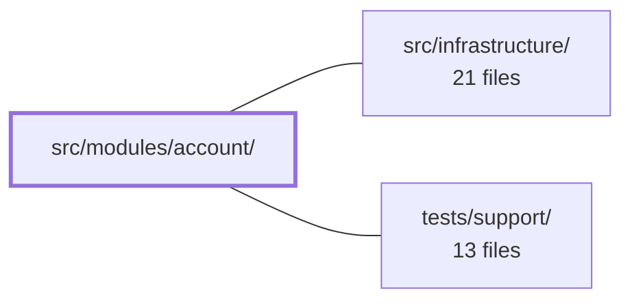

---
tags:
  - 2repo
  - 2repo/module
  - project/boilerplate-vue-frontend
type: module
module: src/modules/account/
files: 37
updated: 2026-09-03T10:57:46.866837+00:00
---

# src/modules/account/

## Purpose

The `account` module owns the full user-identity domain: authentication (login, signup, OAuth, password reset, email verification), the authenticated profile self-service surface (editable fields, address book, live sessions, role toggle, password change), and irreversible account deletion. It is registered by name in the kernel, contributing its routes, response-validation schemas, and locale strings to the application when enabled.

## Key parts

- **Module manifest & contracts** — `module.ts` declares what the module contributes (routes, nav, schemas, locales); `routes.ts` defines every auth/profile route and its `meta.access` level; `response-schemas.ts` maps each endpoint URL to a Zod envelope for HTTP-response validation.
- **Views (page-level)** — `views/Login.vue`, `views/Signup.vue`, `views/OAuthCallback.vue`, `views/PasswordResetRequest.vue`, `views/PasswordResetConfirm.vue`, `views/VerifyEmailConfirm.vue`, `views/AccountDeleteConfirm.vue` (public flows) and `views/Profile.vue` (the authenticated dashboard that composes the sub-panels below).
- **Profile sub-panels** — `components/ProfileAddresses.vue`, `ProfilePasswordChange.vue`, `ProfileRole.vue`, `ProfileSessions.vue`, `ProfileDeleteAccount.vue`, `ProfileVerificationBanner.vue` — each a self-contained widget managing its own store slice so the Profile page stays a thin layout.
- **Stores (Pinia, Composition API)** — `stores/auth.ts` (session lifecycle: login, signup, reset, logout); `stores/profile.ts` (the editable user record and every profile mutation); `stores/addresses.ts` (address-book CRUD); `stores/sessions.ts` (device-session list & revocation); `stores/oauth.ts` (cached provider list + helper functions for Login/Signup buttons).
- **Tests** — Unit specs under `tests/*.spec.ts` (only the HTTP transport is mocked); end-to-end Cypress suites under `tests/e2e/` covering the full auth surface, OAuth round-trip, profile self-service, registration, and password reset; plus a11y and visual-regression configuration files that plug into the shared sweep runners in `tests/support/`.

## How it connects

- **`src/infrastructure/`** — Every store delegates its HTTP calls to the shared `useStructureRestApi` primitives (`fetchTarget` / `updateTarget`) and the Orval-generated client rather than reimplementing fetch logic. `response-schemas.ts` plugs directly into `infrastructure/http`'s response-validation pipeline: the middleware matches a request URL against the Zod schema to verify the envelope before the store sees it. The module also relies on the infrastructure's session/cookie utilities and the observability store for toast/error reporting.
- **`tests/support/`** — The account e2e and cross-cutting test files reference the shared visual-regression runner (`visual-sweep.ts`) and the accessibility sweep (`a11y-sweep.ts`) that live in the support directory. The account module only supplies its route/screen lists; the sweeping and assertion logic is shared infrastructure.

## Where to start

1. **`stores/auth.ts`** — Reading the login, signup, and logout actions first gives you the session-lifecycle backbone every other flow builds on, and shows the store's delegation pattern to `useStructureRestApi`.
2. **`routes.ts`** — A single array that maps every screen, its component, and its `meta.access` value. Skimming it in one pass tells you which pages exist, which are public, which are authenticated-only, and which are admin-gated before you dive into individual views.

## Connected modules

[[boilerplate-vue-frontend_src_infrastructure|src/infrastructure/]] · [[boilerplate-vue-frontend_tests_support|tests/support/]]

## Files
- `src/modules/account/components/ProfileAddresses.vue` — Vue 3 single-file component that renders the user's address-book panel within the account/profile section. It provides full CRUD on saved addresses (add, edit, remove, set default) via a dialog form, pulling all state and actions from a Pinia store so the list re-renders from the server's full response after every write.
- `src/modules/account/components/ProfileDeleteAccount.vue` — A minimal, single-purpose UI widget that renders a "Delete account" button. When clicked it gates the actual API call behind a shared confirm dialog, then delegates the network request to the profile store. It exists to keep the destructive action self-contained and easy to drop into the account settings page without coupling that page to deletion logic.
- `src/modules/account/components/ProfilePasswordChange.vue` — A collapsible password-change form embedded in the profile page. It proves the current password on the server (no email round-trip, unlike the reset flow) and is hidden behind a toggle so the profile page doesn't open with all three forms visible at once.
- `src/modules/account/components/ProfileRole.vue` — A self-contained role-switch widget that lets an administrator viewing **their own** profile toggle their role between standard user and administrator. It is deliberately rendered outside the main profile form because a role change hits a different endpoint under different authorisation than the general "Save changes" flow.
- `src/modules/account/components/ProfileSessions.vue` — Vue component rendering the "Active sessions" card on the profile page. It lists every live refresh token as a row, lets the user revoke an individual session, and exposes a "Logout everywhere" button. Revoking the *current* session is treated by the API as a full logout, so the component navigates to the Logout route afterwards.
- `src/modules/account/components/ProfileVerificationBanner.vue` — A small Vuetify `v-alert` banner that appears on the profile page **only** when the loaded profile object exists and its `verified` field is explicitly `false`. It presents a single user action — resending the email-verification link — and reports the outcome via toast notifications.
- `src/modules/account/module.ts` — Module manifest for the `account` domain (login, signup, profile, password reset, deletion). Exports a plain object satisfying `AppModule` that is registered by name in the kernel registry, declaring which routes, nav entries, response schemas, and locale loaders this module contributes when enabled.
- `src/modules/account/response-schemas.ts` — Declares the response-envelope schema for every account endpoint (method + URL pattern → Zod schema) so that `infrastructure/http` can validate each HTTP response against its contract by matching the originating request. Enabling the account domain turns this validation on; deleting the folder turns it off.
- `src/modules/account/routes.ts` — Defines the route table for the account module — a single default-exported `RouteRecordRaw[]` covering all auth flows (login, signup, password reset, email verification, account deletion, OAuth callback) plus the authenticated profile page and a routeless `Logout` entry. The kernel splices this array into the app router; each entry's `meta.access` field is what the route guard reads to gate access.
- `src/modules/account/stores/addresses.ts` — Pinia store (Composition API) that owns the visitor's address-book state and exposes CRUD actions. Every write operation re-fetches the full list from the API response envelope rather than patching a single entry, because the invariant the UI must render — exactly one default address — is a list-level property.
- `src/modules/account/stores/auth.ts` — Pinia store (Composition API) that owns the **session lifecycle**: login, signup, password reset, and the two logout paths. It deliberately does *not* hold the editable user record — that lives in `profile.ts`. The split keeps "am I signed in?" separate from "what does my record say?".
- `src/modules/account/stores/oauth.ts` — Pinia store (Composition API) that caches the deployment's enabled OAuth provider list, plus two pure helper functions (`providerLabel`, `oauthStartUrl`) that `Login.vue`/`Signup.vue` use to render one button per provider. The list is a deployment-level fact, so it is fetched once and reused across mounts rather than re-requested each time.
- `src/modules/account/stores/profile.ts` — Pinia store (Composition API) that owns the authenticated visitor's own editable account record and every operation against it: fetch, update, role self-service, live password change, email verification, and account deletion. It delegates request/caching to the shared `useStructureRestApi` primitives (`fetchTarget` / `updateTarget`) so no action re-implements HTTP or cache logic.
- `src/modules/account/stores/sessions.ts` — Pinia store (Composition API) that manages the visitor's live device-session list—who else is signed in—and provides the single-session "log out that device" action. It uses a plain `ref<Session[]>` rather than the toolkit's record-structure helper because a session has no detail page and the list is always read in whole.
- `src/modules/account/tests/addresses.spec.ts` — Unit tests for the `useAddressesStore` Pinia store. The only external dependency mocked is the HTTP transport (`orvalMutator`), so the store's real fetch-after-write logic (replace-the-whole-book, not patch-a-row) executes under test. The suite pins the invariant that the server is the source of truth for default-address promotion and list contents after every mutation.
- `src/modules/account/tests/auth-session.spec.ts` — Unit tests for the auth store's session flows (login, logout, logoutEverywhere, password reset). Only the HTTP transport is mocked; the generated client, session, profile, and observability stores all execute for real, so the assertions validate the exact state the router guards read. `signup` is deliberately excluded and covered in `auth-signup.spec.ts`.
- `src/modules/account/tests/auth-signup.spec.ts` — Unit tests for `useAuthStore().signup` that pin the JSON-vs-multipart branch selection and verify the exact request shape sent to `/account/signup`. The spec exists because a store that silently always chose the JSON client would pass a shape-only test but break avatar uploads; these tests assert the branch *and* the body encoding.
- `src/modules/account/tests/e2e/a11y.cy.ts` — Declares the list of routes, states, and fixture contexts that the account module submits to the shared accessibility sweep. It contains no audit logic itself — that lives in `a11y-sweep.ts` — but co-locating the route list here means deleting the account module also removes its a11y coverage, and `tests/cross-cutting/a11y-coverage.spec.ts` enforces that every routed module has one of these files.
- `src/modules/account/tests/e2e/account.visual.cy.ts` — Declares the screen list for the account module's visual-regression sweep. It is a thin configuration file: all sweeping logic lives in `tests/support/e2e/visual-sweep.ts`; this file only names which screens to snapshot.
- `src/modules/account/tests/e2e/auth.cy.ts` — Cypress end-to-end test suite covering the full authentication surface: login, signup, route-guard redirects for protected and admin-only routes, logout, and a live-profile-only case that exercises the cross-origin (`:8085 → :3000`) session-refresh path. It ensures the user-facing auth contract (form rendering, validation, redirects, cookie lifetimes) stays intact as the app evolves.
- `src/modules/account/tests/e2e/oauth.cy.ts` — Cypress end-to-end tests that exercise the OAuth social-login button click-through against the backend's `fake` provider. Because real Google/GitHub consent screens cannot be automated in CI, the fake provider substitutes for them while still round-tripping the genuine `state` cookie and the full redirect chain (BE start → BE callback → cookies → FE `/oauth/callback`). The file exists to verify both the new-account-creation path and the account-linking path without external dependencies.
- `src/modules/account/tests/e2e/password-reset.cy.ts` — End-to-end test of the forgot-password flow. It verifies that the reset link actually emailed by the backend (read from the demo email outbox) replaces the old password, and that a fabricated token changes nothing. Both tests are gated to the demo profile only.
- `src/modules/account/tests/e2e/profile.cy.ts` — Cypress E2E spec covering the profile self-service surface: language preference, role visibility, password change, session list/revocation, address book (add / promote-default / remove-default), and email verification. Tests run against the real API in its demo profile so backend invariants (one default address, a `current` session flag, unverify-on-email-change) are exercised as the page honours them.
- `src/modules/account/tests/e2e/registration.cy.ts` — End-to-end Cypress suite covering the full registration arc: account creation, consuming the emailed verification token as a guest, and confirming the password gate actually enforces the chosen password. It also verifies the "email unverified" banner appears and disappears around token consumption. The tests deliberately cross page reloads (fresh `cy.visit`) to mirror how a real user follows the inbox link, ensuring the account genuinely persists server-side.
- `src/modules/account/tests/login-view-i18n.spec.ts` — Integration test that proves the `Login.vue` view is genuinely wired to `usersSchema` + vue-i18n's `revalidateOn: locale`. Unlike the isolated mechanism test in `tests/cross-cutting/schemas-i18n.spec.ts`, this spec mounts the real view, triggers a form submit, and reads the rendered `v-text-field` validation text in two languages (en → it) to confirm re-translation actually happens mid-form.
- `src/modules/account/tests/oauth.spec.ts` — Unit tests for the OAuth provider store (`useOAuthProvidersStore`) and its two pure helpers (`providerLabel`, `oauthStartUrl`). Only the HTTP transport is mocked; everything else runs against the real Pinia store, mirroring the pattern established in `sessions.spec.ts`.
- `src/modules/account/tests/profile.spec.ts` — Unit tests for the `useProfileStore` flows (fetch, update, role change, password change, email verification, account deletion). Only the HTTP transport is mocked; the generated client, `session.ts`, the observability store, and `useStructureRestApi` all execute for real.
- `src/modules/account/tests/routes.spec.ts` — Pins the `meta.access` value each account route declares, asserting directly against the module's raw route records (not a resolved router). Exists to guarantee that a route silently losing its `meta.access` — making it indistinguishable from a public route — is caught by CI. It complements the router-level spec, which proves enforcement is *attached*; this proves the declarations are *there*.
- `src/modules/account/tests/sessions.spec.ts` — Unit tests for `useAccountSessionsStore` covering two behaviours: fetching the device-sessions list and revoking a single session (which should trigger a re-fetch). Only the HTTP transport is mocked; the Pinia store runs for real. Follows the same mock-by-URL pattern as `profile.spec.ts`.
- `src/modules/account/views/AccountDeleteConfirm.vue` — Public, unauthenticated confirmation page for irreversible account deletion. The one-time token delivered via email link is the sole credential, so the route requires no auth guard and a signed-out visitor can complete the deletion.
- `src/modules/account/views/Login.vue` — Vue login page component. Accepts email/password (validated via a Zod schema derived from the shared `usersSchema`), authenticates through `useAuthStore`, and redirects to a `?continue=` target or `Home` while re-applying the user's saved language preference. Also renders OAuth provider buttons when any are configured.
- `src/modules/account/views/OAuthCallback.vue` — Transient landing view that the OAuth redirect chain hits after the provider callback. By the time it mounts, `tryRestoreAuth` in the router guard has already restored the session; this component only decides what to display next — redirect to `Home` on success, or render a translated error card (with a link back to `/login`) when the backend appended `?error=<code>`.
- `src/modules/account/views/PasswordResetConfirm.vue` — Public-facing page that completes a password reset using a one-time token delivered by email. It validates the token and two matching passwords with a zod schema, calls the auth store to persist the new password, and redirects the user to the Login route on success.
- `src/modules/account/views/PasswordResetRequest.vue` — Public "request password reset" page. The user enters an email address; the backend is asked to issue a reset token. The UI always displays the same success acknowledgement whether or not the account exists, preventing username enumeration.
- `src/modules/account/views/Profile.vue` — The account profile page. It lets a signed-in user edit the fields they own (username, email, phone, website, language preference) and, as a sibling layout, surfaces the role, password-change, account-deletion, active-sessions, and address panels—each of which manages its own store slice independently.
- `src/modules/account/views/Signup.vue` — The user-facing account registration page. It collects email, password (with confirmation), an optional avatar upload, and a terms/conditions acknowledgment, then calls the auth store's `signup` action. On success it redirects to the Login route (the account still requires email confirmation) rather than establishing a session. It also renders conditional OAuth "continue with" buttons when providers are configured.
- `src/modules/account/views/VerifyEmailConfirm.vue` — Public, unauthenticated email-verification confirm page. The visitor follows a link from their email, enters the one-time token into a form, and submits it to activate their account. A submit button (rather than an auto-fire on mount) is used deliberately so that mail-client link prefetchers cannot spend the token before the human actually clicks.

---
[[boilerplate-vue-frontend_INDEX|← boilerplate-vue-frontend index]]
