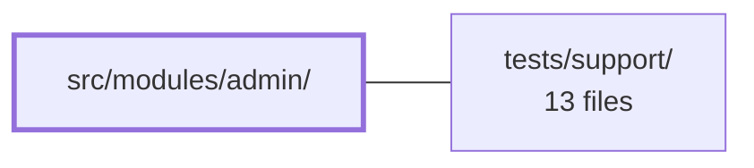

---
tags:
  - 2repo
  - 2repo/module
  - project/boilerplate-vue-frontend
type: module
module: src/modules/admin/
files: 12
updated: 2026-09-03T10:57:55.701914+00:00
---

# src/modules/admin/

## Purpose

The admin module provides a role-gated observability dashboard for administrators. It renders service health KPIs, business metrics, and a paginated audit log in a single lazy-loaded view, and exposes one destructive action (purging expired refresh tokens). Everything is registered as a self-contained `AppModule` so the entire admin console can be added or removed as a unit.

## Key parts

- **Dashboard shell & tabs** — `views/Admin.vue` owns active-tab state, initial data fetch, and the token-purge confirmation flow. It delegates rendering to two purely presentational components: `components/AdminOverviewTab.vue` (KPI cards, latency percentiles, auth/business metrics) and `components/AdminAuditTab.vue` (filter form, data table, pager).
- **Data layer** — `composables/use-admin-observability.ts` centralises the three read endpoints (health, metrics, paginated audit log) and the one write (token purge), giving each panel independent loading/error slices.
- **Module plumbing** — `module.ts` assembles routes, nav entry, response-schema registry, and locale loaders into the kernel's `AppModule` contract. `routes.ts` defines the single `/admin` route with lazy loading and an `admin` role gate. `response-schemas.ts` declares the Zod validation contract per endpoint for the response-schema middleware.
- **View-layer types** — `types.ts` holds UI-structure contracts (tab shapes, KPI card models, filter-form fields), deliberately excluding API/domain types that come from the generated `@api` client.
- **Tests** — Co-located unit, e2e (a11y sweep, visual regression), and route-access tests. Visual baselines live in a sibling `__snapshots__/` directory; all test files are removed together if the module is deleted.

## How it connects

- **`tests/support/`** — The e2e and visual-regression test files in this module delegate their sweep mechanics (a11y scanning, screenshot comparison, screen-list iteration) to shared helpers that live in `tests/support/`. This keeps each module's test file to a minimal screen/route declaration while the reusable infrastructure stays centralised.

## Where to start

1. **`views/Admin.vue`** — The shell shows how tab state, the composable's fetchers, and the destructive action are wired together; reading it first gives you the full data-flow picture.
2. **`composables/use-admin-observability.ts`** — Understanding the three read slices and the one write, and how errors are isolated per panel, explains why the presentational tabs carry no fetching logic of their own.

## Connected modules

[[boilerplate-vue-frontend_tests_support|tests/support/]]

## Files
- `src/modules/admin/components/AdminAuditTab.vue` — Audit-log tab of the admin dashboard. It renders a filter form, a data table, and a pager for audit events, but performs no data fetching itself — all retrieval is delegated to the parent view via a `search` emit. The component is purely presentational: it owns only the local filter-form state and passes structured filters upward.
- `src/modules/admin/components/AdminOverviewTab.vue` — Presentational tab for the admin dashboard that renders a row of KPI status cards (API health, dependencies, uptime, request/error counts, latency percentiles) plus auth and business metric sections. It derives every displayed value and status colour from `health` and `metrics` payloads passed in as props; it performs no fetching and holds no internal state.
- `src/modules/admin/composables/use-admin-observability.ts` — Vue composable that centralises the admin observability dashboard's data layer: three read endpoints (health, metrics overview, paginated audit logs) and one write (expired-token purge). It gives the dashboard a single composable to call instead of repeating per-panel `loading`/`error`/`data` bookkeeping, and deliberately treats reads and the write differently in terms of error propagation.
- `src/modules/admin/module.ts` — Module manifest for the **admin** domain. It assembles the domain's routes, navigation entry, response-schema registry, and locale loaders into a single object that satisfies the kernel's `AppModule` contract, so the admin console (service health, KPIs, audit log) can be registered and torn out as a unit.
- `src/modules/admin/response-schemas.ts` — Declarative contract-validation table for the admin domain. It lists, per admin endpoint the module calls, the exact HTTP method, a regex path pattern, and the Zod schema the response envelope must satisfy. A response-schema-map middleware reads this array at runtime to validate inbound API responses against the declared shape.
- `src/modules/admin/routes.ts` — Defines the route table for the admin domain. Contains a single lazy-loaded, access-gated route record that exposes the observability dashboard to users with the `admin` role. It exists so that the dashboard bundle is only fetched when an authenticated admin navigates to `/admin`.
- `src/modules/admin/tests/e2e/a11y.cy.ts` — Declares the e2e accessibility sweep for the **admin** module's routes. It is co-located with the module so that deleting the admin module automatically removes its a11y coverage; a cross-cutting test (`tests/cross-cutting/a11y-coverage.spec.ts`) enforces that every routed module has exactly one of these files.
- `src/modules/admin/tests/e2e/admin.visual.cy.ts` — Visual regression test for the admin module's dashboard screen. It declares which screen to photograph and delegates all sweep mechanics to a shared helper, keeping this file to a one-line screen list. Baseline PNGs are colocated in a `__snapshots__/` directory beside this file so they are deleted together if the module is removed.
- `src/modules/admin/tests/routes.spec.ts` — Guarantees that every admin route record carries an explicit `meta.access` declaration. Without this test, a route that silently loses its access level would become publicly reachable while all other tests still pass, because nothing else in the suite inspects that field. The test asserts declarations *on the route records themselves*, not on a resolved router, so it needs no locale prefix or app bootstrap.
- `src/modules/admin/tests/use-admin-observability.spec.ts` — Unit tests for the `useAdminObservability` composable, focused exclusively on the **composition layer**: that each of the three fetchers writes its own state slice without leaking into the others, that the audit envelope is decomposed into `items` + pagination meta (not stored as one opaque object), and that a dead endpoint degrades to a per-panel error message while the other panels still render. Loading/error bookkeeping delegated to `useAsyncAction` is intentionally out of scope.
- `src/modules/admin/types.ts` — Defines the view-layer (UI/composition) type contracts for the Admin dashboard. It intentionally contains only types that describe *how the UI is structured* (tabs, KPI cards, filter forms) — not domain or API contract types, which are sourced from the generated `@api` client via `@types`.
- `src/modules/admin/views/Admin.vue` — Admin dashboard shell component. It owns the active-tab state (overview vs. audit), fetches initial data on mount, and passes shared observability state and fetchers from `useAdminObservability` down to the two tab components as props and emit handlers. It also handles the single destructive action on the page — purging expired refresh tokens — by wrapping the composable's call in a confirmation dialog and a success/error toast.

---
[[boilerplate-vue-frontend_INDEX|← boilerplate-vue-frontend index]]
