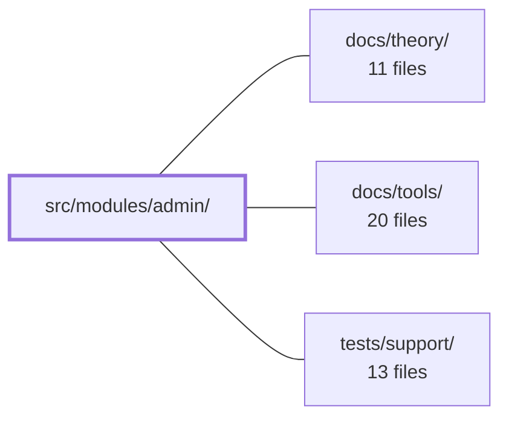

---
tags:
  - 2repo
  - 2repo/module
  - project/boilerplate-vue-frontend
type: module
module: src/modules/admin/
files: 12
updated: 2026-08-30T17:09:38.075551+00:00
---

# src/modules/admin/

## Purpose

The admin module implements the **admin observability dashboard** — a role-gated console that surfaces service health, business KPIs/metrics, and a paginated audit log. It is packaged as a self-contained `AppModule` (routes, navigation entry, response-schema registry, locale loaders) so the entire admin surface can be registered or removed as a single unit.

## Key parts

- **`views/Admin.vue`** — Dashboard shell. Owns the active-tab state, pulls all shared reactive data from the composable, handles the "purge expired tokens" action (confirm + toast), and triggers the initial fetch on mount.
- **`components/AdminOverviewTab.vue` / `AdminAuditTab.vue`** — Purely presentational tabs. The overview tab renders KPI cards and system-info rows; the audit tab owns its filter form state and emits a `search` event. Neither fetches data.
- **`composables/use-admin-observability.ts`** — The data layer. Centralises the three read endpoints (health, metrics, audit logs) and one write (token purge) behind shared reactive refs, so the view never duplicates fetch/error bookkeeping per panel.
- **`module.ts` + `routes.ts` + `response-schemas.ts`** — Module plumbing. `module.ts` satisfies the kernel's `AppModule` contract; `routes.ts` exposes a single lazy, `admin`-gated route; `response-schemas.ts` declares the Zod envelope each admin endpoint must satisfy at runtime.
- **`types.ts`** — UI-layer type contracts (tab keys, KPI card shape, audit filter state), kept separate from generated API types.
- **`tests/`** — Unit specs for the composable and a route-access guard; e2e specs for accessibility and visual regression that delegate mechanics to shared helpers and keep baselines co-located in `__snapshots__/`.

## How it connects

- **`tests/support/`** — Both e2e specs (`a11y.cy.ts`, `admin.visual.cy.ts`) delegate their sweep mechanics (route registration, screenshot capture, comparison) to shared utilities in this area, keeping the admin test files to thin screen-list declarations.
- **`docs/theory/` / `docs/tools/`** — Listed in the dependency graph as contextual documentation for the architectural patterns (module contract, response-schema validation, composable data-layer conventions) that this module follows. No runtime code import is implied.

## Where to start

1. **`views/Admin.vue`** — Read it first to see how the composable's reactive state flows into the two tab components and how the token-purge action is wired; it gives you the full data path in one file.
2. **`composables/use-admin-observability.ts`** — Next, read the composable to understand the three endpoints, the per-panel error isolation strategy, and the audit-pagination decomposition (`items` / `total` / `pages`). Together these two files cover the module's entire runtime behaviour.

## Connected modules

[[boilerplate-vue-frontend_docs_theory|docs/theory/]] · [[boilerplate-vue-frontend_docs_tools|docs/tools/]] · [[boilerplate-vue-frontend_tests_support|tests/support/]]

## Files
- `src/modules/admin/components/AdminAuditTab.vue` — Presentational audit-log tab for the admin dashboard. It owns the filter form's local state (actor, action, outcome, since, page, pageSize) and translates user interactions into a `search` emit; it renders the data table and pager declaratively from props the parent supplies. It never fetches data itself.
- `src/modules/admin/components/AdminOverviewTab.vue` — Presentational tab for the admin dashboard overview. It renders KPI cards, auth/business metric summaries, and system-info rows derived entirely from `health` and `metrics` payloads passed in via props. It owns no data-fetching state; the parent component supplies the payloads and their loading/error flags.
- `src/modules/admin/composables/use-admin-observability.ts` — Vue composable that centralises the admin observability dashboard's data layer: three read endpoints (health, metrics overview, paginated audit logs) and one write (expired-token purge). It exists so the view binds to shared reactive refs rather than duplicating fetch/error bookkeeping per panel.
- `src/modules/admin/module.ts` — Module manifest for the **admin** domain. It assembles the domain's routes, navigation entry, response-schema registry, and locale loaders into a single object that satisfies the kernel's `AppModule` contract, so the admin console (service health, KPIs, audit log) can be registered and torn out as a unit.
- `src/modules/admin/response-schemas.ts` — Declarative contract-validation table for the admin domain. It lists, per admin endpoint the module calls, the exact HTTP method, a regex path pattern, and the Zod schema the response envelope must satisfy. A response-schema-map middleware reads this array at runtime to validate inbound API responses against the declared shape.
- `src/modules/admin/routes.ts` — Defines the route table for the admin domain. It exports a single lazy-loaded route for the observability dashboard, gated behind the `admin` access role, so the dashboard chunk is only fetched when an admin actually navigates to `/admin`.
- `src/modules/admin/tests/e2e/a11y.cy.ts` — Registers the admin module's routes for accessibility (a11y) end-to-end testing. It exists as a thin, co-located route list so that deleting the admin module automatically removes its a11y coverage — a central list would go stale. The actual audit logic is delegated to a shared sweep utility.
- `src/modules/admin/tests/e2e/admin.visual.cy.ts` — Visual regression test for the admin module's dashboard screen. It declares which screen to photograph and delegates all sweep mechanics to a shared helper, keeping this file to a one-line screen list. Baseline PNGs are colocated in a `__snapshots__/` directory beside this file so they are deleted together if the module is removed.
- `src/modules/admin/tests/routes.spec.ts` — Guarantees that every admin route carries an explicit `meta.access` declaration and that no route exists outside the set known to this test. Without this spec, a route that silently drops its access requirement would still render and pass every other test, becoming publicly accessible with no signal.
- `src/modules/admin/tests/use-admin-observability.spec.ts` — Unit tests for the `useAdminObservability` composable. The file verifies the *composition* layer: that each of the three API fetchers (health, metrics, audit logs) writes only its own state slice, that the audit pagination envelope is decomposed into `items` / `total` / `pages` rather than stored as a single object, and that a failed endpoint degrades to a per-panel error message without affecting the panels that did succeed. Loading/error bookkeeping delegated to `useAsyncAction` is explicitly out of scope here.
- `src/modules/admin/types.ts` — Defines the UI-layer type contracts for the Admin dashboard (tab keys, KPI card shape, and audit filter form state). It exists to keep view-specific types separate from the generated API contract types that live in `@types` / `@api`, as stated in the module doc comment.
- `src/modules/admin/views/Admin.vue` — The admin dashboard shell. It owns which tab (overview or audit) is active, pulls all shared observability state and fetchers from `useAdminObservability`, and passes them down to the two tab child components as props. It also handles the "clear expired tokens" user action (confirmation dialog + outcome toast) and triggers the initial data fetch on mount.

---
[[boilerplate-vue-frontend_INDEX|← boilerplate-vue-frontend index]]
