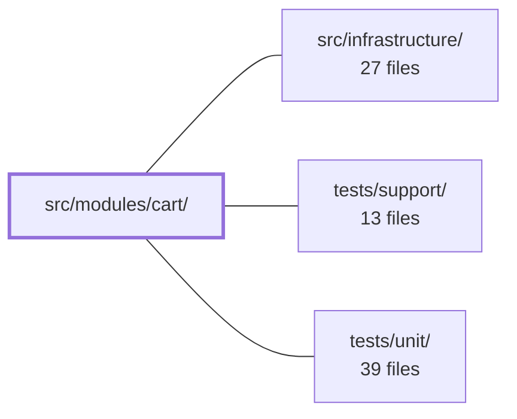

---
tags:
  - 2repo
  - 2repo/module
  - project/boilerplate-vue-frontend
type: module
module: src/modules/cart/
files: 18
updated: 2026-08-30T17:09:52.219547+00:00
---

# src/modules/cart/

## Purpose

The cart module owns the end-to-end shopping-cart experience for an authenticated user: storing cart lines and their quantities, enforcing pure domain invariants (minimum quantity, step arithmetic), rendering the cart page with a debounced quantity stepper, and handling checkout. It is a self-contained feature module that plugs into the application shell via a single manifest.

## Key parts

- **Domain layer** (`domain/index.ts`, `domain/quantity.ts`) — Framework-free pure rules. The single invariant: a line's quantity floors at 1; stepping can never produce zero. The barrel enforces a lint-checked purity contract (no Vue, Pinia, or axios).
- **Store** (`store.ts`) — Pinia setup store. Every mutating action replaces the local `cart` ref wholesale from the API response (no local patching). All derived state (items, summary, badge count) is computed from that one ref. Checkout lives here because it is the action that empties the store.
- **View & composable** (`views/Cart.vue`, `composables/use-line-quantity.ts`) — The cart page renders lines with steppers and a summary panel. The composable debounces per-line stepper clicks (~400 ms) into a single trailing API call, eliminating the "last-answered-wins" race while keeping the displayed number responsive.
- **Module wiring** (`module.ts`, `index.ts`, `routes.ts`, `response-schemas.ts`) — The manifest registers routes, a live item-count navigation badge, response-contract schemas, and locale dictionaries with the app shell. The barrel exposes the public API; the route table and schema array are consumed by infrastructure at runtime.
- **Tests** (`tests/`) — Co-located suites covering domain arithmetic, store contracts (401-only "no cart" rule, analytics emission, checkout failure split), composable debounce, route access meta, product-title resolution, plus e2e specs for the cart journey, a11y, visual regression, and a Umami double-write analytics guard.

## How it connects

- **`src/infrastructure/`** — The module manifest (`module.ts`) registers this module's routes, response schemas, and locale dictionaries with the app-level registry and router. At runtime the HTTP layer (infrastructure) matches cart-endpoint responses against the schemas declared in `response-schemas.ts`. The module never imports infrastructure directly; it declares contracts that infrastructure enforces.
- **`tests/support/`** — Shared Cypress helpers (Umami API query, visual-sweep registration, a11y harness) are consumed by the e2e specs in `tests/e2e/` without being redefined per module.
- **`tests/unit/`** — Houses the cross-cutting spec that asserts every routed module in the dependency graph ships an a11y e2e file; the cart's `tests/e2e/a11y.cy.ts` is one of the files that spec discovers.

## Where to start

Read `store.ts` first — it is the smallest file that captures the module's entire state model (single ref, replace-on-write, computed derivations, checkout). Then skim `domain/quantity.ts` (a few lines) to see the one business invariant the store and view both depend on. Together they explain *what* the cart holds and *why* the stepper behaves the way it does, without needing the view or composable yet.

## Connected modules

[[boilerplate-vue-frontend_src_infrastructure|src/infrastructure/]] · [[boilerplate-vue-frontend_tests_support|tests/support/]] · [[boilerplate-vue-frontend_tests_unit|tests/unit/]]

## Files
- `src/modules/cart/composables/use-line-quantity.ts` — Debounces per-product cart quantity stepper clicks into a single trailing API call while keeping the displayed number responsive. It exists to eliminate the race condition where three rapid clicks on `+` fired three concurrent requests and the last-arriving response overwrote the correct total.
- `src/modules/cart/domain/index.ts` — Barrel file that serves as the sole public entry point for the cart domain layer. It re-exports the pure business rules defined in sibling modules so that consumers (services, components, tests) import from one path rather than reaching into individual domain files. The module doc asserts a lint-enforced purity contract: no Vue, Pinia, axios, or any other tier may leak into this layer.
- `src/modules/cart/domain/quantity.ts` — Pure domain rules governing cart line quantities. It encodes a single invariant: a line's quantity has a floor of 1, and stepping can never produce zero (zero is a *removal*, handled by a different call). The module is intentionally framework-free — no Vue, no store.
- `src/modules/cart/index.ts` — Barrel (re-export) file for the cart module. It exposes the module's public API as a single import surface so that sibling modules never reach into cart's internal files directly.
- `src/modules/cart/module.ts` — Cart module manifest. Registers the cart/checkout module with the app registry by declaring its routes, navigation entry (including a live item-count badge), response schemas, and lazy-loaded locale dictionaries. It is the single integration point that ties the cart's internal pieces together for the shell.
- `src/modules/cart/response-schemas.ts` — Declares the flat array of response-schema rows the HTTP layer matches against at runtime to validate that cart-endpoint responses conform to their expected contracts. The array is registered through the module manifest so that contract validation activates automatically when the cart domain is enabled.
- `src/modules/cart/routes.ts` — Declares the route table for the cart module. It exports a single authenticated route record that the app router mounts under the module's registered path, separating routing concerns from the module's service/store logic.
- `src/modules/cart/store.ts` — Pinia setup store that owns the authenticated user's shopping cart. Every mutating action **replaces** the local `cart` ref wholesale with the payload the API returned — the store never patches items locally. All derived state (items list, summary, badge count) is computed from that single ref. Checkout lives here (not in an orders store) because it is the one call that empties this store's responsibility.
- `src/modules/cart/tests/e2e/a11y.cy.ts` — Co-located accessibility (a11y) test for the cart module's routes. It exists in this module's directory so that deleting the cart module automatically removes its a11y coverage, preventing a stale central route list. A cross-cutting spec asserts every routed module has one of these files.
- `src/modules/cart/tests/e2e/analytics.cy.ts` — Cypress e2e spec that verifies a single add-to-cart action produces exactly **one** `cart_item_added` row in Umami, rather than two (one from the frontend tracker, one from the backend `POST /cart/items` handler). The bug it guards against was invisible to unit tests in either repo because both sides independently asserted their own emission and both passed. Only a live run querying Umami's API for the actual row count can distinguish "one write" from "two writes of the same name."
- `src/modules/cart/tests/e2e/cart.cy.ts` — Cypress end-to-end test suite for the cart page. Covers the full user journey on `/en/cart`: empty-state rendering, item listing, quantity increment/decrement, item removal, full cart clear, and checkout redirect. Exists to guard the cart UI contract against regressions.
- `src/modules/cart/tests/e2e/cart.visual.cy.ts` — Visual regression test for the cart screen. It registers the cart page into a shared visual sweep so that a screenshot baseline is captured and compared on CI, catching unintended UI changes without requiring a dedicated test harness per screen.
- `src/modules/cart/tests/product-titles.spec.ts` — Vitest suite for the cart store's product-title join (`titleOf` / `resolveTitles`). It guards two invariants the cart and wishlist pages depend on: an unknown id is rendered as itself (never blank), and a single failed API lookup must not prevent the remaining ids from resolving.
- `src/modules/cart/tests/quantity.spec.ts` — Unit tests for the `steppedQuantity` rule and the `MIN_LINE_QUANTITY` constant in the cart domain. Tests are pure — no component mounting, no Pinia store, no HTTP — and assert the arithmetic contract of the step function (increment, decrement, floor clamping) rather than any `Cart.vue` rendering behavior.
- `src/modules/cart/tests/routes.spec.ts` — Guarantees that every cart route declares its access requirement (`meta.access`) and that no route exists outside this file's explicit list. Without this spec, a route that silently loses its `meta.access` would remain indistinguishable from a public route—still rendering, still passing every other test—while simply becoming open to everyone.
- `src/modules/cart/tests/store.spec.ts` — Unit tests for the cart Pinia store (`useCartStore`). They lock in three behavioral contracts that types and e2e tests cannot catch: (1) a 401 from `getCartSummary` is the *only* status that means "no cart" (a 500 must still reject), (2) which actions emit analytics events and which do not, and (3) the checkout failure split — the client reports only network-level (status-less) failures, while the server reports all HTTP failures, preventing double-counted Umami rows.
- `src/modules/cart/tests/use-line-quantity.spec.ts` — Vitest spec for the `useLineQuantity` composable. It verifies that the 400 ms debounce correctly collapses rapid stepper clicks into a single API call while preserving optimistic UI, per-line independence, and data safety (in-flight steps, unmount flush, removed lines). Every assertion is written against the original race-condition bug (last-answered-wins) rather than against the debounce mechanism itself.
- `src/modules/cart/views/Cart.vue` — The cart page view. Renders the visitor's cart lines (product title, quantity stepper, remove) alongside a summary panel with shipping selection and checkout/clear actions. It layers a debounced local stepper on top of the store's quantity update so rapid clicks collapse into one request per line.

---
[[boilerplate-vue-frontend_INDEX|← boilerplate-vue-frontend index]]
