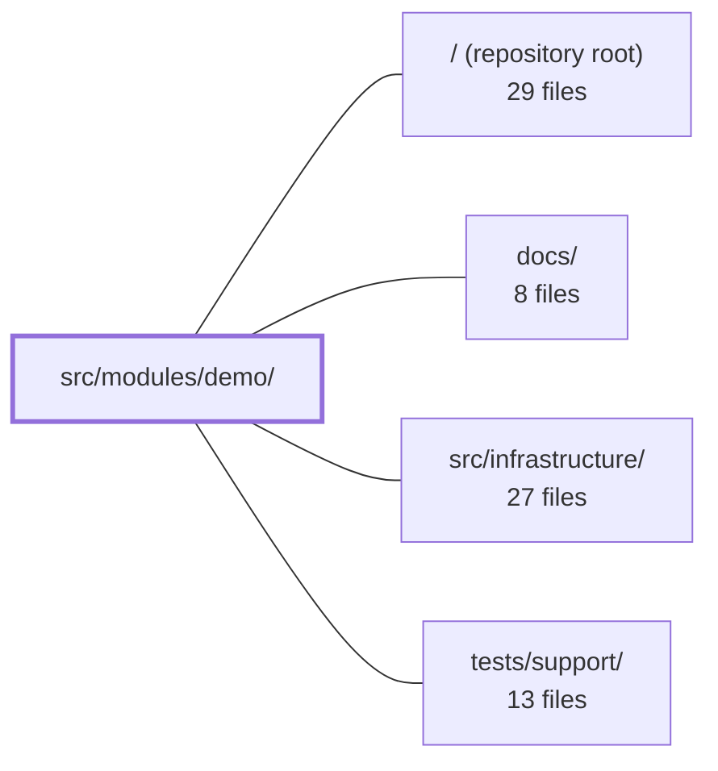

---
tags:
  - 2repo
  - 2repo/module
  - project/boilerplate-vue-frontend
type: module
module: src/modules/demo/
files: 11
updated: 2026-08-30T17:10:16.354704+00:00
---

# src/modules/demo/

## Purpose

A self-contained demo (showroom) module that exercises the project's core infrastructure—Pinia, `provide`/`inject`, router guards, i18n, and toast notifications—in a single readable view. It is deliberately un-abstracted and designed to be removed by deleting the folder plus one import line in `src/modules.ts`.

## Key parts

- **View & supporting pieces** – `views/Playground.vue` is the single-page showcase; `components/ProvidedVariableCard.vue` + `provided.ts` demonstrate typed `provide`/`inject` across a component boundary; `store.ts` supplies the minimal Pinia counter store that both the view and the guard consume.
- **Routing & registration** – `routes.ts` defines the one `playground` route (lazy-loaded, guarded); `guards.ts` provides the teaching `beforeEnter` hook that shows what is and isn't reachable in guard scope; `module.ts` is the `AppModule` manifest that registers routes, a nav entry, locale loaders, and a typed `demo` logger scope.
- **Tests** – `tests/guards.spec.ts`, `tests/routes.spec.ts`, and `tests/store.spec.ts` pin the behavioral contracts of the guard, route table, and counter store respectively; `tests/e2e/a11y.cy.ts` feeds the module's pages into the global accessibility sweep.

## How it connects

- **`/` (repository root)** – `module.ts` plugs the demo into the app's module registry (`src/modules.ts`), contributing its routes, navigation entry, and locale loaders to the application shell.
- **`src/infrastructure/`** – The module consumes Pinia (counter store, toast store), Vue Router (route table, guard), i18n (locale loading, translation calls in the guard), and the shared logger scoped to `demo`.
- **`tests/support/`** – The co-located a11y test (`tests/e2e/a11y.cy.ts`) registers the module's routes with the shared `sweepA11y` helper so the demo pages participate in the project-wide accessibility pass.

## Where to start

1. **`views/Playground.vue`** – The single file a reader needs to see every demonstrated mechanism (store, inject, toasts, loading states) in one pass, with no indirection.
2. **`module.ts`** – The one-page manifest that shows how a module plugs into the app (routes, nav, i18n, logger) and how removal is a single `rm -rf` + one import deletion.

## Connected modules

[[boilerplate-vue-frontend_ROOT|/ (repository root)]] · [[boilerplate-vue-frontend_docs|docs/]] · [[boilerplate-vue-frontend_src_infrastructure|src/infrastructure/]] · [[boilerplate-vue-frontend_tests_support|tests/support/]]

## Files
- `src/modules/demo/components/ProvidedVariableCard.vue` — The "injecting" half of the Vue `provide`/`inject` demo. It consumes a shared reactive ref (provided by `Playground.vue`) via the `useProvidedVariable` composable, renders two text inputs that mutate the value through different binding styles, and logs every observed change. It exists as a separate component specifically because a component providing to itself would not exercise the cross-boundary mechanism the demo is meant to illustrate.
- `src/modules/demo/guards.ts` — A single demo route guard for the Playground route. It exists to show, in one place, what is and isn't reachable from a Vue Router `beforeEnter` hook: Pinia stores work fine, i18n translations are not yet loaded (the dictionary loads later, in `beforeResolve`), and injected variables are unavailable because a guard has no component scope.
- `src/modules/demo/module.ts` — Module manifest that registers the demo (showroom) module into the app's module registry. It wires together the demo routes, a navigation entry, and locale loaders under the `AppModule` contract, and declares a typed `demo` scope for the shared logger. The file is intentionally self-contained so the entire demo can be removed by deleting its folder and one import line in `src/modules.ts`.
- `src/modules/demo/provided.ts` — A self-contained Vue 3 provide/inject demo that illustrates typed dependency injection using a `Symbol`-backed `InjectionKey`. It exists to show the mechanism (a ref paired with a mutation function passed down the component tree) in a form that is trivially deletable with `rm -rf src/modules/demo`.
- `src/modules/demo/routes.ts` — Defines the route table for the demo module: a single `playground` route that lazy-loads its view component and is protected by the teaching `exampleGuard`. The file exists so the app's module registry can mount demo navigation without the guard leaking into other routes.
- `src/modules/demo/store.ts` — A minimal Pinia store (`counter`) that exposes exactly one state ref, one computed getter, one sync action, and one async action. It exists as the worked example that the Playground page and `exampleGuard` use to demonstrate that a store is reachable from their respective scopes.
- `src/modules/demo/tests/e2e/a11y.cy.ts` — Co-located accessibility test for the demo module. It registers the module's routes with the shared `sweepA11y` helper so that the demo's pages are included in the global a11y sweep. Keeping the file next to the module ensures that removing the module also removes its a11y coverage, and a cross-cutting spec (`tests/cross-cutting/a11y-coverage.spec.ts`) asserts that every routed module has exactly one such file.
- `src/modules/demo/tests/guards.spec.ts` — Unit test for the demo router guard (`exampleGuard`). It verifies three contracts: the guard returns `undefined` (allowing navigation through), Pinia stores are reachable from within the guard, and the guard survives `t()` calls made before the i18n dictionary is loaded. i18n is fully mocked; Pinia is kept real by design.
- `src/modules/demo/tests/routes.spec.ts` — Vitest spec that pins the demo module's public route contract: the single `Playground` route must be publicly accessible (no `access` meta) and guarded exclusively by `exampleGuard`. It exists so that silently dropping the teaching guard or adding an undeclared route causes an immediate test failure rather than a quiet behavioral regression.
- `src/modules/demo/tests/store.spec.ts` — Vitest spec that verifies the demo counter store's synchronous and delayed-increment behaviors. It exists because the store is the boilerplate's worked example (used in a Playground and by `exampleGuard`), so a broken counter would propagate confusion; the tests lock in the expected semantics before anyone copies the pattern.
- `src/modules/demo/views/Playground.vue` — A single-page demo/showroom that exercises the project's core infrastructure in one readable view: the Pinia counter store, the `provide/inject` pattern, the toast notification store, and sequential fake loading states. It is intentionally un-abstracted so a reader can trace each mechanism end-to-end without following indirections.

---
[[boilerplate-vue-frontend_INDEX|← boilerplate-vue-frontend index]]
