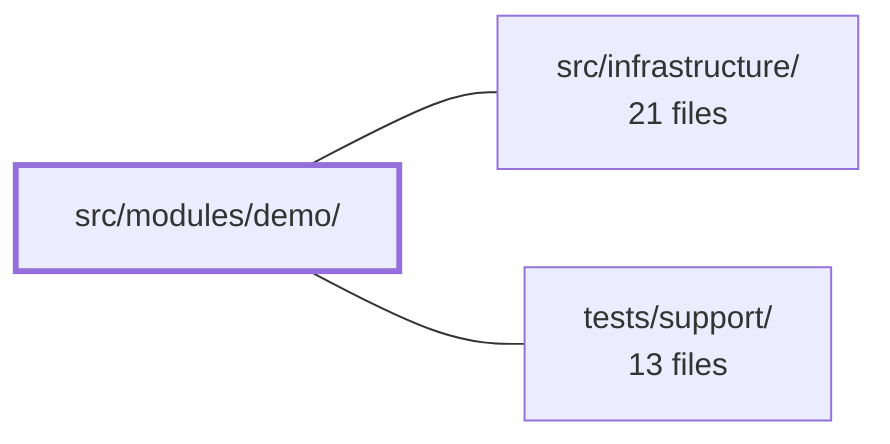

---
tags:
  - 2repo
  - 2repo/module
  - project/boilerplate-vue-frontend
type: module
module: src/modules/demo/
files: 11
updated: 2026-09-03T10:58:27.398035+00:00
---

# src/modules/demo/

## Purpose

A self-contained "showroom" module that exercises the project's core infrastructure—Pinia stores, typed `provide`/`inject`, route guards, and toast notifications—in one deliberately un-abstracted page. Every file lives inside this directory so that deleting `src/modules/demo/` (and its single registration line in `src/modules.ts`) removes the feature with zero residual references.

## Key parts

- **`views/Playground.vue`** — The single-page demo surface. Wires together the counter store, the `provide`/`inject` pair, a toast trigger, and sequential fake-loading states so a reader can trace each mechanism end-to-end in one file.
- **`store.ts`** — Minimal Pinia setup store (state, getter, sync + async actions) that serves as the canonical worked example referenced by the Playground and by `exampleGuard`.
- **`provided.ts` + `components/ProvidedVariableCard.vue`** — The typed `provide`/`inject` pair. State and mutation live in `provided.ts`; the Card is the injecting consumer kept separate so the value crosses a real component boundary.
- **`guards.ts`** — A single `beforeEnter` guard that documents what *is* and *isn't* reachable from that hook (Pinia works, i18n does not yet, injected vars are absent).
- **`module.ts` + `routes.ts`** — Module manifest and route table that register the Playground route (with the teaching guard) into the app's module registry without leaking the guard elsewhere.
- **`tests/`** — Vitest specs pinning down the guard's contract, the route surface, and the store's behavior; a Cypress a11y registration so the shared accessibility sweep covers the demo route and the cross-cutting coverage check can verify it.

## How it connects

- **`src/infrastructure/`** — The demo consumes the app's shared infrastructure: Pinia for state management, Vue Router for navigation and guard hooks, the i18n system (whose load-order is what the guard demonstrates), and the toast/notification store. It is a *consumer* of these primitives, not a contributor.
- **`tests/support/`** — The e2e a11y spec (`a11y.cy.ts`) plugs the demo's routes into the shared Cypress accessibility sweep maintained in `tests/support/`. The cross-cutting `a11y-coverage.spec.ts` there asserts that every routed module—including demo—has a corresponding a11y file, so deleting the demo also removes its coverage entry.

## Where to start

Read **`views/Playground.vue`** first—it is the one page where every demonstrated mechanism is visible in context and intentionally left un-abstracted so nothing is hidden behind indirection. Then open **`store.ts`** for the smallest, most self-contained concrete example (four lines of state/getter/actions) to ground the rest of the module in a single working unit.

## Connected modules

[[boilerplate-vue-frontend_src_infrastructure|src/infrastructure/]] · [[boilerplate-vue-frontend_tests_support|tests/support/]]

## Files
- `src/modules/demo/components/ProvidedVariableCard.vue` — The consuming (injecting) half of the provide/inject demo. It pulls a shared ref via `useProvidedVariable`, displays the current value, and offers two text inputs that mutate the value through different mechanisms. It exists as a separate component (rather than inline markup in `Playground.vue`) because provide/inject only becomes observable when the value crosses a component boundary.
- `src/modules/demo/guards.ts` — A single demo route guard for the Playground route. It exists to show, in one place, what is and isn't reachable from a Vue Router `beforeEnter` hook: Pinia stores work fine, i18n translations are not yet loaded (the dictionary loads later, in `beforeResolve`), and injected variables are unavailable because a guard has no component scope.
- `src/modules/demo/module.ts` — Module manifest that registers the demo "showroom" page (store, toolkit components, notification toasts, provide/inject demo) into the app's module registry. It exists as a self-contained, deletable unit — removing this folder and its single line in `src/modules.ts` cleanly removes the demo from the app with zero residual references.
- `src/modules/demo/provided.ts` — Demonstrates Vue's typed `provide`/`inject` pattern using a `Symbol`-based `InjectionKey` instead of a magic string. The state and its mutation live in this file (not the composition root) so that deleting `src/modules/demo` removes the feature cleanly, fulfilling the module-isolation contract described in `src/modules.ts`.
- `src/modules/demo/routes.ts` — Defines the route table for the demo module: a single `playground` route that lazy-loads its view component and is protected by the teaching `exampleGuard`. The file exists so the app's module registry can mount demo navigation without the guard leaking into other routes.
- `src/modules/demo/store.ts` — A minimal Pinia setup store that demonstrates state, a getter, a sync action, and an async action. It exists as the canonical worked example referenced by the Playground page and `exampleGuard` to prove a store is reachable from their respective scopes.
- `src/modules/demo/tests/e2e/a11y.cy.ts` — Registers the demo module's routes for the shared Cypress accessibility sweep. It exists so that deleting the demo module automatically removes its a11y coverage, and so the cross-cutting `a11y-coverage.spec.ts` can verify every routed module has a corresponding a11y file.
- `src/modules/demo/tests/guards.spec.ts` — Vitest unit tests for `exampleGuard` (in `src/modules/demo/guards.ts`). The suite verifies two real Vue Router guard invariants — that the guard returns `undefined` (not `false`/an object) and that it does not throw when i18n translations are not yet loaded — while also demonstrating that Pinia stores are fully functional inside a `beforeEnter` guard.
- `src/modules/demo/tests/routes.spec.ts` — Vitest suite that pins down the demo module's public route surface: it asserts the Playground route exists, is publicly accessible, is guarded solely by `exampleGuard`, and is the *only* route declared. It exists because a silently lost guard would still render the Playground and the teaching case would vanish without any visible error.
- `src/modules/demo/tests/store.spec.ts` — Vitest spec for the demo counter store (`useDemoStore`). It verifies that the synchronous `increment` action, the `doubleCount` getter, and the asynchronous `incrementDelayed` action all behave as documented. The tests exist because the store is a worked example shown in the Playground — a broken counter would mislead users, and the `exampleGuard` feature also increments this store to demonstrate guard access.
- `src/modules/demo/views/Playground.vue` — A single-page demo/showroom that exercises the project's core infrastructure in one readable view: the Pinia counter store, the `provide/inject` pattern, the toast notification store, and sequential fake loading states. It is intentionally un-abstracted so a reader can trace each mechanism end-to-end without following indirections.

---
[[boilerplate-vue-frontend_INDEX|← boilerplate-vue-frontend index]]
