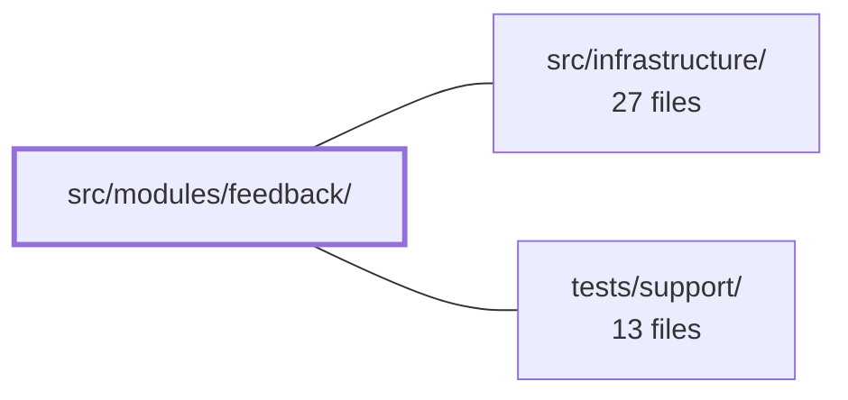

---
tags:
  - 2repo
  - 2repo/module
  - project/boilerplate-vue-frontend
type: module
module: src/modules/feedback/
files: 11
updated: 2026-08-30T17:10:24.599665+00:00
---

# src/modules/feedback/

## Purpose

The feedback module provides a public contact form and an admin-facing ticket inbox. It lets any visitor submit a message and lets an authenticated admin read, triage, and update the status of those messages—all as a self-contained feature registered into the app's module registry.

## Key parts

- **Module manifest & routing** — `module.ts` is the single entry point the kernel uses to discover the module; `routes.ts` and `response-schemas.ts` define the two paths (public contact, admin inbox) and the validation contracts for their API responses.
- **State layer** — `store.ts` is a Pinia setup-store exposing `submitContact`, `fetchRequests`, and `updateStatus`, each backed by the shared `useStructureRestApi` helper for consistent loading-state plumbing.
- **Views** — `views/Contact.vue` renders the unauthenticated form (Zod-validated, delegates to the store); `views/FeedbackInbox.vue` renders the admin ticket list with a per-ticket status dropdown.
- **Tests** — Co-located per-module specs cover route access metadata (`tests/routes.spec.ts`), store behaviour (`tests/store.spec.ts`), and three e2e suites: full user-flow (`tests/e2e/feedback.cy.ts`), accessibility sweep (`tests/e2e/a11y.cy.ts`), and visual-regression baselines (`tests/e2e/feedback.visual.cy.ts`).

## How it connects

- **`src/infrastructure/`** — The module consumes the app's kernel/module-registry to be mounted, relies on the response-envelope middleware that reads `response-schemas.ts`, and uses the shared `useStructureRestApi` toolkit (which wraps the Orval-generated HTTP client) for all three store actions. The Zod schemas and Pinia conventions come from this layer.
- **`tests/support/`** — The three e2e spec files delegate their actual sweep logic to shared helpers (`sweepA11y`, `sweepVisual`) and the `orvalMutator` mock lives in this support package, so feedback tests stay thin and focused on module-specific behaviour.

## Where to start

Read `module.ts` first—it's short and shows exactly how the module declares its routes, schemas, and locale loaders to the kernel, giving you the map of everything else. Then open `store.ts` to see the three actions that both views call and to understand the API contract the rest of the module depends on.

## Connected modules

[[boilerplate-vue-frontend_src_infrastructure|src/infrastructure/]] · [[boilerplate-vue-frontend_tests_support|tests/support/]]

## Files
- `src/modules/feedback/module.ts` — Module manifest that registers the feedback feature (contact form + admin inbox) into the app's module registry. It wires together routes, navigation entries, response schemas, and locale loaders so the kernel can discover and mount the module without importing its internals directly.
- `src/modules/feedback/response-schemas.ts` — Declares the response-validation schema table for every feedback endpoint the module calls. Each row pairs an HTTP method and URL regex with the corresponding schema from `@api/schemas`, so the response-envelope middleware can look up the correct validator by matching an incoming response's request.
- `src/modules/feedback/routes.ts` — Defines the two route records (public contact form and admin-only feedback inbox) for the feedback module. It is consumed by the module registry to mount these paths into the app's router.
- `src/modules/feedback/store.ts` — Pinia setup-store for the feedback module. It exposes a public `submitContact` action and an admin inbox (`requests`) with `fetchRequests` / `updateStatus` actions. All three actions run through the toolkit's `useStructureRestApi` so that loading-state plumbing (shared per-store-name flags) is consistent with the rest of the app.
- `src/modules/feedback/tests/e2e/a11y.cy.ts` — Declares the a11y sweep route list for the feedback module. It feeds specific page routes (public contact page and admin feedback inbox) into the shared `sweepA11y` helper so that Cypress can run accessibility checks against both surfaces. The file exists per-module so that a11y coverage is co-located with the code it guards.
- `src/modules/feedback/tests/e2e/feedback.cy.ts` — Cypress end-to-end spec that exercises the feedback module's full loop—visitor submits the public contact form, admin reads the resulting ticket in the inbox—plus guards (validation, role-based access) and static-page cross-linking. It exists to prove the two pages are wired together and the ticket survives navigation without a reload.
- `src/modules/feedback/tests/e2e/feedback.visual.cy.ts` — Declares the list of screens in the feedback module that require visual-regression snapshots, delegating the actual sweep logic to the shared `sweepVisual` helper. This file exists so that deleting the feedback module also removes its baselines (they live in a local `__snapshots__/` folder) and so the route list stays co-located with the code it tests.
- `src/modules/feedback/tests/routes.spec.ts` — Vitest spec that locks in the `meta.access` declaration of every feedback route. It exists to catch the failure mode where a route silently loses its access restriction (making an admin-only route publicly reachable) or where a new route is added without being accounted for.
- `src/modules/feedback/tests/store.spec.ts` — Vitest spec for the feedback Pinia store. It mocks only the HTTP transport (`orvalMutator`) so the generated Orval client and the store logic under test both run for real. The focus is verifying that the inbox is always replaced by what the API returned (never a local guess) and that a status update triggers a reload of the list it changed.
- `src/modules/feedback/views/Contact.vue` — Renders the public, unauthenticated contact form that lets any visitor submit a message to the feedback inbox. It validates input client-side with a Zod schema and delegates the actual submission to the feedback store, resetting the form on success.
- `src/modules/feedback/views/FeedbackInbox.vue` — Admin inbox page for the public contact/feedback form. On mount it fetches the full ticket list and renders each ticket as a card with a status dropdown, letting an admin move a ticket through its lifecycle in a single click.

---
[[boilerplate-vue-frontend_INDEX|← boilerplate-vue-frontend index]]
