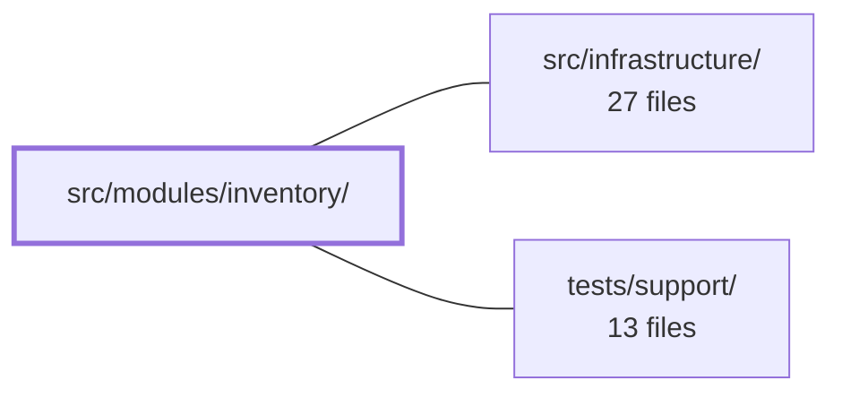

---
tags:
  - 2repo
  - 2repo/module
  - project/boilerplate-vue-frontend
type: module
module: src/modules/inventory/
files: 11
updated: 2026-08-30T17:10:35.628461+00:00
---

# src/modules/inventory/

## Purpose

The inventory module is the admin-facing domain for stock management. It tracks current shelf counts, records every stock transition (receipts, adjustments, reservation sweeps), and exposes both a read-only overview and a full audit trail through a single admin page. All data flows through one Pinia store; the UI components are presentational and delegate every read and write to it.

## Key parts

- **`module.ts` / `routes.ts`** — Module manifest and route table. Assembles the inventory domain's navigation entry, lazy-loaded route (`/inventory`), response-schema validators, and locale loaders, then registers the combined object under the kernel's `AppModule` interface so the app shell can discover it.
- **`store.ts`** — The single Pinia store for the domain. Exposes two paginated reads (movement ledger, shelf-count board) and three writes (receive, adjust, sweep) over the structure REST API. Every write reloads the views it touched before resolving, so callers never see a count the UI hasn't caught up with.
- **`views/InventoryLedger.vue`** — The page-level composition root. Places the stock board and movement ledger side by side, fetches the shared product catalogue once, and forwards the board's "history" click to the ledger's focus method.
- **`components/`** — The three presentational pieces: `StockBoard.vue` (glance-at table of on-hand / reserved / available per product), `MovementLedger.vue` (paginated, filterable audit trail plus the sweep button), and `StockMovementForm.vue` (reusable form that branches on a `mode` prop to distinguish receipts from adjustments).
- **`response-schemas.ts`** — Zod schemas for every inventory endpoint response, consumed by the `response-schema-map` middleware to validate API bodies before the caller touches them.
- **`tests/`** — Unit spec for the store (mocking at the `orvalMutator` seam) and two e2e suites: an accessibility sweep and a visual-regression screenshot registration.

## How it connects

- **`src/infrastructure/`** — The store's HTTP calls go through the shared transport/orval mutator defined in infrastructure. The `response-schemas.ts` array plugs into the `response-schema-map` middleware there. The module's `AppModule` registration also hands its route, validator, and locale entries to the infrastructure-level app kernel.
- **`tests/support/`** — Both e2e spec files (`a11y.cy.ts`, `inventory.visual.cy.ts`) are thin declarative lists that delegate the actual sweep mechanics (route discovery, readiness polling, screenshot capture) to shared helpers exported from `tests/support/`.

## Where to start

Read **`store.ts`** first: it is the sole data layer, and understanding its two reads, three writes, and the post-write reload pattern gives you the mental model for everything the UI displays. Then read **`views/InventoryLedger.vue`** to see how the board and ledger are composed on one screen and how the catalogue fetch and event forwarding tie the components together.

## Connected modules

[[boilerplate-vue-frontend_src_infrastructure|src/infrastructure/]] · [[boilerplate-vue-frontend_tests_support|tests/support/]]

## Files
- `src/modules/inventory/components/MovementLedger.vue` — Admin-facing tab that lists every stock transition (newest-first) in a paginated, filterable table, and hosts the "sweep" button that expires stale reservation holds. All reads/writes go through `useInventoryStore`; filters are local refs that trigger a re-fetch via a `watch`.
- `src/modules/inventory/components/StockBoard.vue` — A read-only admin table tab that displays current shelf counts (on-hand, reserved, available) per product. Supports filtering to low-availability items and client-side pagination. Designed as a glance-at table, not a scrollable feed.
- `src/modules/inventory/components/StockMovementForm.vue` — A reusable stock-movement form that handles two distinct domain writes—receipt (add stock) and adjustment (signed delta, e.g. shrinkage)—by branching on a `mode` prop rather than a runtime sign toggle. This design prevents a mis-click from silently converting a delivery into a correction (or vice-versa).
- `src/modules/inventory/module.ts` — Module manifest for the inventory domain. Assembles routes, navigation entry, response-schema validators, and locale loaders from sibling files and registers the combined object under the kernel's `AppModule` interface so the inventory board and stock ledger become discoverable in the app shell.
- `src/modules/inventory/response-schemas.ts` — Declares the response-envelope validation schemas for every inventory API endpoint this module calls. The exported array is consumed by the `response-schema-map` middleware to verify that each call's response body conforms to the expected Zod schema before the caller processes it.
- `src/modules/inventory/routes.ts` — Declares the Vue Router route table for the inventory domain. It exposes a single admin-only route (`/inventory`) that lazy-loads the `InventoryLedger.vue` view, so the component's code is excluded from the main bundle until navigation actually occurs.
- `src/modules/inventory/store.ts` — Pinia store for the inventory domain. Exposes two paginated reads (stock-movement ledger, shelf-count board) and three writes (receive, adjust, sweep) over the structure REST API. All writes reload the views they touched before resolving, so callers never observe a counter the views have not caught up with. No client-side arithmetic on counts is performed.
- `src/modules/inventory/tests/e2e/a11y.cy.ts` — Co-located accessibility (a11y) sweep for the inventory module's routed pages. It declares which routes the inventory domain owns and hands them to the shared `sweepA11y` helper, ensuring the module's a11y coverage is deleted automatically if the module is removed.
- `src/modules/inventory/tests/e2e/inventory.visual.cy.ts` — Registers the inventory module's screen with the visual-regression sweep so that a pixel-level baseline is captured and compared on every run. The file acts as a declarative "screen list": all sweep mechanics live in the shared support utility, and this file simply declares *which* route, *when* it is ready, and *as which role* to photograph.
- `src/modules/inventory/tests/store.spec.ts` — Vitest spec for `useInventoryStore`. It mocks the HTTP transport at the `orvalMutator` seam so every test exercises the store's read/write logic—query assembly, response shaping, and the post-write reload sequence—without touching the network.
- `src/modules/inventory/views/InventoryLedger.vue` — The inventory admin page. It composes the stock board (current per-product counts) and the movement ledger (full history) on a single screen so that a write (receipt or adjustment) is immediately visible in both. It owns two small coordination duties: fetching the shared product catalogue once for all children, and forwarding the board's `history` click to the ledger's `focusProduct` method.

---
[[boilerplate-vue-frontend_INDEX|← boilerplate-vue-frontend index]]
