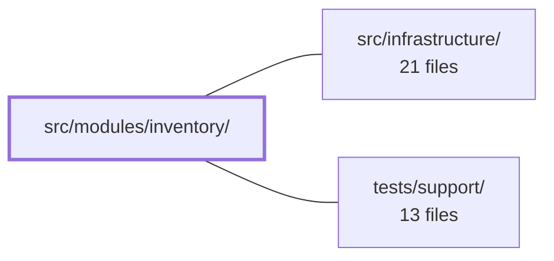

---
tags:
  - 2repo
  - 2repo/module
  - project/boilerplate-vue-frontend
type: module
module: src/modules/inventory/
files: 13
updated: 2026-09-03T10:58:48.702943+00:00
---

# src/modules/inventory/

## Purpose

The inventory module owns all stock-management concerns for the admin panel: reading current shelf counts, recording inbound receipts and shrinkage adjustments, expiring stale reservation holds ("sweep"), and presenting both views on a single page. It is self-contained under the kernel's `AppModule` interface so the app shell can discover its route, navigation entry, and schema validators without hard-coding them elsewhere.

## Key parts

- **`views/InventoryLedger.vue`** — The single admin screen. Composes `StockBoard` + `MovementLedger`, fetches the shared product catalogue once, and forwards the board's "view history" event to the ledger.
- **`components/StockBoard.vue`** — Read-only table of on-hand / reserved / available counts per product, with a "low availability only" filter.
- **`components/MovementLedger.vue`** — Paginated, filterable table of every stock transition (newest-first) plus the Sweep action. Owns its filter state locally.
- **`components/StockMovementForm.vue`** — Dual-mode form (receipt vs. adjust) with per-mode Zod validation; instantiated twice in the parent so a mis-click can't flip the sign of a delivery.
- **`store.ts`** — Pinia store (`'inventory'`) that owns the two reads and three writes. Every write re-fetches the affected views before resolving, so callers never see a stale count.
- **`module.ts` / `routes.ts` / `response-schemas.ts`** — Module manifest, lazy-loaded admin-only route table, and Zod response-envelope schemas consumed by the shared `response-schema-map` middleware.
- **`tests/`** — Co-located specs: store contract (`store.spec.ts`), form-mode validation (`stock-movement-form.spec.ts`), route access-declaration guard (`routes.spec.ts`), a11y sweep registration, and visual-regression baseline registration.

## How it connects

- **`src/infrastructure/`** — Provides the kernel `AppModule` registration surface (used by `module.ts`), the HTTP transport the store calls, the `response-schema-map` middleware that validates responses against `response-schemas.ts`, and the shared a11y / visual-regression sweep utilities that the e2e test files plug into.
- **`tests/support/`** — Houses the sweep mechanics (route discovery, screenshot capture, a11y auditing) that the module's e2e files declare against. The inventory tests simply register *which* route to sweep; the shared utilities perform the actual checks, so removing the module automatically removes its test registrations.

## Where to start

1. **`store.ts`** — Reading the five public actions (`fetchLevels`, `fetchMovements`, `receive`, `adjust`, `sweep`) gives you the full API surface and the read-replace / write-then-reload contract in ~100 lines.
2. **`views/InventoryLedger.vue`** — Shows how the two child components and the dual-mode form are wired together on the single admin screen, with zero business logic of its own.

## Connected modules

[[boilerplate-vue-frontend_src_infrastructure|src/infrastructure/]] · [[boilerplate-vue-frontend_tests_support|tests/support/]]

## Files
- `src/modules/inventory/components/MovementLedger.vue` — Renders the inventory module's stock-movement ledger tab: a paginated, filterable table of every stock transition (newest-first) and the "Sweep" action that expires stale reservation holds. It owns its filter state locally and delegates all reads/writes to `useInventoryStore`.
- `src/modules/inventory/components/StockBoard.vue` — Read-only admin table that lists current shelf counts (on-hand, reserved, available) for each product. It reads from the shared inventory Pinia store, supports a "low availability only" filter, and delegates navigation-to-ledger to its parent via an emitted event.
- `src/modules/inventory/components/StockMovementForm.vue` — A single Vue component that handles both stock **receipts** (inbound deliveries) and stock **adjustments** (shrinkage/corrections). It is instantiated twice in the parent layout — once with `mode: 'receipt'` and once with `mode: 'adjust'` — so that a user mis-click cannot accidentally flip a positive delivery into a negative correction. Validation rules differ per mode and are enforced via a Zod schema before dispatching the store action.
- `src/modules/inventory/module.ts` — Module manifest for the inventory domain. Assembles routes, navigation entry, response-schema validators, and locale loaders from sibling files and registers the combined object under the kernel's `AppModule` interface so the inventory board and stock ledger become discoverable in the app shell.
- `src/modules/inventory/response-schemas.ts` — Declares the response-envelope validation schemas for every inventory API endpoint this module calls. The exported array is consumed by the `response-schema-map` middleware to verify that each call's response body conforms to the expected Zod schema before the caller processes it.
- `src/modules/inventory/routes.ts` — Declares the Vue Router route table for the inventory domain. It exposes a single admin-only route (`/inventory`) that lazy-loads the `InventoryLedger.vue` view, so the component's code is excluded from the main bundle until navigation actually occurs.
- `src/modules/inventory/store.ts` — Pinia store (`'inventory'`) that owns the two reads (stock board, movement ledger) and three writes (receive, adjust, sweep) for the inventory domain. Every write reloads the affected views before resolving so callers never see a counter the views haven't caught up with.
- `src/modules/inventory/tests/e2e/a11y.cy.ts` — Co-located accessibility (a11y) e2e coverage for the inventory module's routes. It registers the module's routes with the shared a11y sweep so that deleting the module automatically removes its a11y tests — avoiding a central list that references routes the app no longer serves.
- `src/modules/inventory/tests/e2e/inventory.visual.cy.ts` — Registers the inventory module's screen with the visual-regression sweep so that a pixel-level baseline is captured and compared on every run. The file acts as a declarative "screen list": all sweep mechanics live in the shared support utility, and this file simply declares *which* route, *when* it is ready, and *as which role* to photograph.
- `src/modules/inventory/tests/routes.spec.ts` — Pins the `meta.access` value every inventory route declares, verified by route name against the raw route records (not a resolved router). It exists to catch a route that silently loses its access declaration, which would make it indistinguishable from a public route. Complements the router-level spec (which proves enforcement is attached) by proving the declarations themselves are present.
- `src/modules/inventory/tests/stock-movement-form.spec.ts` — Vitest suite that exercises the two mode branches of `StockMovementForm` — *receipt* and *adjust* — to verify their distinct amount-validation rules: receipts reject non-positive and fractional quantities, adjustments reject zero and fractional deltas but pass signed negatives through unchanged.
- `src/modules/inventory/tests/store.spec.ts` — Vitest spec for the Pinia inventory store. It exercises every public action (`fetchMovements`, `fetchLevels`, `receive`, `sweep`, `adjust`) against a mocked HTTP transport, pinning down the store's read-replace semantics, write-then-reload ordering, and payload shapes so regressions in those contracts are caught at the store boundary.
- `src/modules/inventory/views/InventoryLedger.vue` — Admin inventory page that composes `StockBoard` and `MovementLedger` on a single screen so a stock write is visible in both simultaneously. It owns no business logic; its only job is to fetch the shared product catalogue once (avoiding three racing first-fetches from child components) and to forward the board's `history` emit to the ledger's `focusProduct` method.

---
[[boilerplate-vue-frontend_INDEX|← boilerplate-vue-frontend index]]
