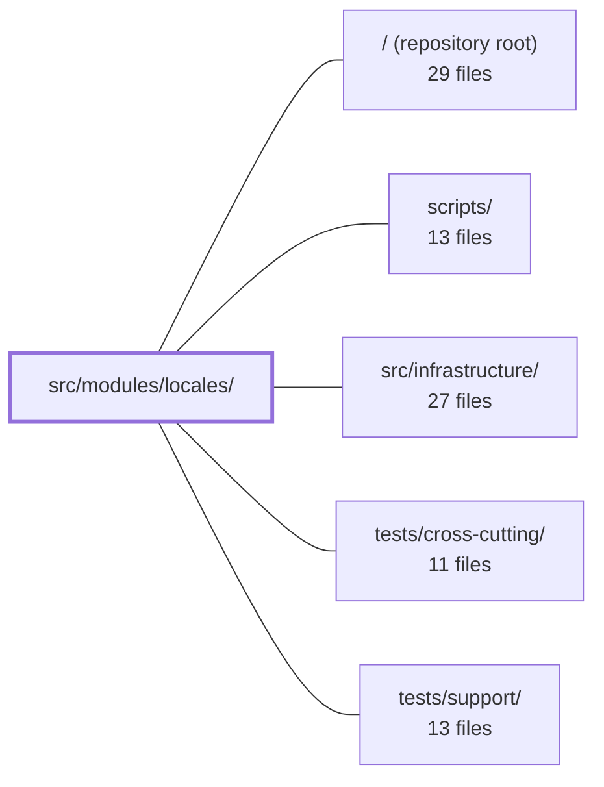

---
tags:
  - 2repo
  - 2repo/module
  - project/boilerplate-vue-frontend
type: module
module: src/modules/locales/
files: 19
updated: 2026-08-30T17:10:51.264906+00:00
---

# src/modules/locales/

## Purpose

The locales module is the **admin-facing translation-management surface**: the screens, store, and logic an operator or translator uses to define languages, manage per-language translation entries, and edit the full dictionary board. It is the *author* side of the application's i18n tier—rendering translations in the UI (the *consumer* side) lives elsewhere and does not depend on this module.

## Key parts

- **Route views** (`views/`) — `LocalesList.vue` (languages CRUD board), `LocaleEntries.vue` (per-language entry search/edit/import/export), and `LocalesDictionary.vue` (full key × language matrix board with filtering and add-key flow).
- **Dialog components** (`components/`) — `LanguageFormDialog.vue` (create/edit a language), `EntryFormDialog.vue` (add a single key-value entry), and `EntriesImportDialog.vue` (bulk paste/upload of a nested JSON dictionary in merge or replace mode). All are purely presentational; they emit events upward and never persist directly.
- **Composables** (`composables/`) — `use-dictionary-aggregation.ts` merges three data sources (stored entries, API baseline, bundled baseline) into one per-cell read model; `use-dictionary-cell-editor.ts` owns the per-cell edit lifecycle (draft tracking, save/clear/enter, transient UI state).
- **Core logic & wiring** — `dictionaries.ts` (pure flatten/expand conversion between dotted-key rows and nested objects), `store.ts` (single Pinia store wrapping both the language manifest and paginated entry CRUD), `schemas.ts` (Zod form schemas with lazily-translated error messages), `response-schemas.ts` (Zod rows for the nine admin endpoint envelopes), `module.ts` (module manifest: routes, nav, schema rows, locale loaders), and `routes.ts` (typed route table with lazy-loaded views).
- **Tests** (`tests/`) — unit specs for the pure helpers, the store (transport-mock pattern), and the aggregation composable; plus co-located Cypress e2e suites for accessibility and visual regression.

## How it connects

- **`src/infrastructure/`** — The module is the author side; `infrastructure/i18n/locale-overrides.ts` is the consumer side that renders the dictionary at runtime and does not import from this module. The `response-schemas.ts` rows feed the global response-envelope validator that lives in the infrastructure layer.
- **`tests/cross-cutting/` & `tests/support/`** — The e2e suites delegate to shared runners (`sweepA11y`, `sweepVisual`) and the store/aggregation specs rely on shared transport-mock helpers, both supplied by these directories.
- **`scripts/` / repository root** — The "bundled baseline" (`src/locales/*.json`) that the aggregation composable reads is produced by the build tooling; the module manifest in `module.ts` is consumed by the kernel registry at the root level to register routes, navigation, and response-schema rows.

## Where to start

1. **`dictionaries.ts`** — A short, dependency-free pair of pure functions that show the exact data shape flowing through the module (flat dotted rows ↔ nested i18n objects). Reading this first makes the store, views, and import dialog immediately legible.
2. **`store.ts`** — The single Pinia store that both the languages board and the entries board read from and write to. Understanding its two sub-sections (language manifest vs. paginated entries) and the API calls it issues gives you the backbone for every view in the module.

## Connected modules

[[boilerplate-vue-frontend_ROOT|/ (repository root)]] · [[boilerplate-vue-frontend_scripts|scripts/]] · [[boilerplate-vue-frontend_src_infrastructure|src/infrastructure/]] · [[boilerplate-vue-frontend_tests_cross-cutting|tests/cross-cutting/]] · [[boilerplate-vue-frontend_tests_support|tests/support/]]

## Files
- `src/modules/locales/components/EntriesImportDialog.vue` — A Vuetify dialog that lets a translator paste or upload a nested JSON locale dictionary (the same shape as the bundled `src/locales/*.json` files) and submit it as flattened rows for a chosen tenant, in either `merge` or `replace` mode. It is purely presentational with respect to persistence: it parses, validates, and emits the `import` event upward; it never writes anything itself.
- `src/modules/locales/components/EntryFormDialog.vue` — A "add one entry" dialog for the locales module. It presents a schema-validated three-field form (tenant, key, value), resets itself on every open, and emits the resulting fields upward via a `save` event. It performs no store access and no API calls of its own — the parent page owns persistence. It exists because stored entries have immutable keys and are edited inline in the table, so the only path back through a dialog is creation.
- `src/modules/locales/components/LanguageFormDialog.vue` — A create-or-edit dialog for a single language (locale capability). The same component handles both modes; the only behavioral difference is that the `tag` field is writable on create and disabled on edit (the API treats it as immutable). It validates via a schema, resets on every open, and emits the saved fields upward.
- `src/modules/locales/composables/use-dictionary-aggregation.ts` — Vue composable that merges the dictionary board's three data sources — stored entries, the API's deployed baseline, and this build's bundled baseline — plus in-page pending keys into a single per-cell read model. The board and cell editor query cell state through this composable rather than reading the raw sources, giving "what is this cell" exactly one answer.
- `src/modules/locales/composables/use-dictionary-cell-editor.ts` — Vue composable that owns the per-cell edit lifecycle on the dictionary board. It keeps a local draft map so a blur event can distinguish "value actually changed" from "user just clicked through," routes save/clear/enter actions into the locales store, and exposes transient per-cell UI state (saved check-mark, inline error) that a cell component renders for its own last write.
- `src/modules/locales/dictionaries.ts` — Pure conversion utilities between the API's flat dotted-key row format (`products.list.title`) and the nested object shape that vue-i18n consumes. Exists so the round-trip logic lives in one testable, side-effect-free module rather than being scattered across components and stores.
- `src/modules/locales/module.ts` — Module manifest for the locales (translation-management) domain. It declares the routes, navigation entry, response-schema rows, and locale dictionary loaders through the `AppModule` shape consumed by the kernel registry. This file is the *author* side of the i18n tier — the screens a translator uses to edit languages — while rendering (the *consumer* side) lives in `infrastructure/i18n/locale-overrides.ts` and does not depend on this module.
- `src/modules/locales/response-schemas.ts` — Declares the response-envelope validation rows for the nine **admin-only** locale endpoints. Each row pairs an HTTP method with a `$`-anchored URL regex and the corresponding Zod response schema, so the global response-envelope validator can confirm that admin locale calls return the expected shape.
- `src/modules/locales/routes.ts` — Declares the locale-management route table (three admin-only routes) as a typed `RouteRecordRaw[]` that the module registry splices into the application router. Each entry lazy-loads its view component.
- `src/modules/locales/schemas.ts` — Defines Zod validation schemas for the two forms in the locale admin (language list and translation-entry list). Error messages are wrapped in thunks that call `translate` at parse time, so they resolve in whatever locale is active when the user submits rather than freezing at schema-creation time.
- `src/modules/locales/store.ts` — Pinia store that manages the translation admin surface: the language manifest (which languages exist, their direction, visibility, and tier) on one side, and a single language's translation entries (paginated CRUD) on the other. It exists because the API answers with two differently-shaped records (`LocaleCapability` vs `Language`), so a single generic CRUD resource would not work; the store wraps both behind one `defineStore` setup function.
- `src/modules/locales/tests/dictionaries.spec.ts` — Vitest unit tests for the two pure dictionary-conversion helpers (`flattenDictionary` and `expandEntries`). The tests exercise the conversions directly against plain fixture data with no store, transport, or mocking, so edge cases (array↔numeric-key folding, deep nesting, collision semantics) are pinned at the logic level.
- `src/modules/locales/tests/e2e/a11y.cy.ts` — Co-located accessibility (a11y) test for the **locales** module. It registers the module's routes with the shared `sweepA11y` runner, which visits each route and asserts accessibility with axe-core. By living inside the module's directory, deleting the module automatically removes its a11y coverage, preventing a stale central list from referencing routes the app no longer serves.
- `src/modules/locales/tests/e2e/locales.visual.cy.ts` — Visual regression test for the locales module's screens. It registers three screen/URL/selector triples with the shared `sweepVisual` runner, which visits each screen, waits for the ready selector, and diffs a screenshot against a stored baseline. It exists so that unintended UI changes in the locales admin screens are caught before reaching production.
- `src/modules/locales/tests/store.spec.ts` — Unit tests for the locales Pinia store (`useLocalesStore`). It uses a transport-mock pattern — `orvalMutator` is replaced with a lookup table keyed by `"METHOD path"` — to verify the exact API call sequences the store issues and to assert on the shape of the data it returns to the board, without a live HTTP layer.
- `src/modules/locales/tests/use-dictionary-aggregation.spec.ts` — Unit tests for the `useDictionaryAggregation` composable, exercising its three-source aggregation (stored entries, API baseline, bundled baseline) by faking the `useLocalesStore` with plain reactive refs rather than mocking the underlying transport layer (`import.meta.glob`, `orvalMutator`).
- `src/modules/locales/views/LocaleEntries.vue` — Route view for `/locales/:tag` that displays, searches, and edits the translation entries for a single language. It drives the locales store's paginated search, provides inline value editing (save-on-blur), add/delete/import/export operations, and after every write refreshes the running app's live dictionary so the admin sees their edit immediately without a page reload.
- `src/modules/locales/views/LocalesDictionary.vue` — Route view that renders the full i18n dictionary board — every key down the left, every language across the top — with client-side text filtering, pagination, and an "add key" flow. It owns only the presentation-layer concerns (filter, paging, add-key navigation); all three-source data aggregation and per-cell writes are delegated to composables.
- `src/modules/locales/views/LocalesList.vue` — Route view that renders the **languages board** — a thin CRUD screen over the locale manifest. It reads `LocaleCapability` rows from the locales store, writes through the store's language wrappers (create, edit, delete), and hosts the shared `LanguageFormDialog` for create/edit. It exists as the admin-facing entry point where an operator sees every language the deployment offers (both `static` and dynamic tiers) and manages their metadata.

---
[[boilerplate-vue-frontend_INDEX|← boilerplate-vue-frontend index]]
