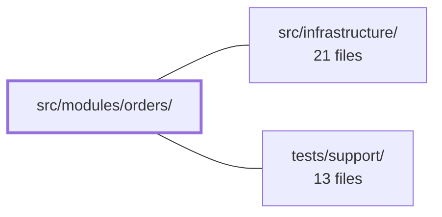

---
tags:
  - 2repo
  - 2repo/module
  - project/boilerplate-vue-frontend
type: module
module: src/modules/orders/
files: 17
updated: 2026-09-03T10:59:18.860636+00:00
---

# src/modules/orders/

## Purpose

The orders module implements the full order-lifecycle UI and state for the application: listing, viewing, editing, cancelling, and invoicing `Order` records for both customer and operator roles. It owns the Pinia store, the Vue Router route table, Zod validation schemas, and the three page views that a user navigates through to manage orders.

## Key parts

- **Registration & routing** — `module.ts` assembles routes, a navigation entry, response schemas, and locale dictionaries into the `AppModule` manifest; `routes.ts` declares each path, its lazy-loaded view, and the minimum access level.
- **State & contracts** — `store.ts` (Pinia `useOrdersStore`) provides CRUD, paginated search, and hand-written actions (`cancelOrder`, `downloadInvoice`); `schemas.ts` defines the order-form Zod schema with locale-aware error messages; `response-schemas.ts` maps every REST endpoint to its Zod schema for runtime response validation.
- **Views** — `OrdersList.vue` (filterable, paginated table with per-row actions), `Order.vue` (detail page with payment/shipment panels), `OrderEdit.vue` (status + email form with operator cancel/refund buttons gated on server-returned `actions`).
- **Shared composable** — `use-order-actions-refetch.ts` forces a single `GET /orders/:id` re-fetch when the list-cache row lacks an `actions` array, so every detail page gets the full action set.
- **Tests** — Unit specs cover the store, routes' `meta.access`, schema i18n resolution, and the re-fetch composable; E2E specs cover list rendering with per-role action visibility, a11y sweeps, and visual-regression baselines.

## How it connects

- **`src/infrastructure/`** — Supplies the shared building blocks this module consumes: the `AppModule` registry that `module.ts` registers with, the `useStructureCrudApi` toolkit that scaffolds the store's CRUD/search, the `response-schema-map` infrastructure that activates the endpoint-to-schema table, and the `orvalMutator` transport layer that the store's API calls (and the cancel spec's mocks) target.
- **`tests/support/`** — Provides the reusable E2E helpers the orders E2E specs delegate to: `sweepA11y` (axe-core auditing across viewports), `sweepVisual` (screenshot-baseline registration), and `collectModuleRoutes` (resolving module routes for component-level tests like `order-edit-view.spec.ts`).

## Where to start

1. **`module.ts`** — A short manifest that names every piece (routes, schemas, nav entry, locales) and shows how the module plugs into the app. Reading it first gives you the map before you dive into any single concern.
2. **`store.ts`** — Defines the `Order` entity shape, the available actions, and how CRUD/search are wired to the API client. Every view and composable in the module reads from or writes through this store, so understanding its public surface makes the views straightforward.

## Connected modules

[[boilerplate-vue-frontend_src_infrastructure|src/infrastructure/]] · [[boilerplate-vue-frontend_tests_support|tests/support/]]

## Files
- `src/modules/orders/composables/use-order-actions-refetch.ts` — A Vue composable that forces exactly one detail re-fetch of the current order when the store's cache-first record resolves without an `actions` array. The orders list seeds the store with a summary row lacking `actions`, and cache-first watchers (`watchOne`/`watchOrder`) will settle on that row unless something explicitly re-fetches via `GET /orders/:id`. This composable was factored out so every order-detail page can share the guard and no page silently omits it.
- `src/modules/orders/module.ts` — Module manifest that registers the **orders** module with the app's module registry (`AppModule`). It assembles the module's routes, a single navigation entry, response schemas, and lazy-loaded locale dictionaries into one default export.
- `src/modules/orders/response-schemas.ts` — Declarative table that maps every orders REST endpoint (method + path regex) to its Zod response schema. It plugs into the `response-schema-map` infrastructure so that API responses are validated against the shared `@api/schemas` contracts. Enabling or deleting the orders module folder toggles this validation on/off automatically.
- `src/modules/orders/routes.ts` — Defines the Vue Router route table for the orders module. Each entry pairs a URL path with a lazy-loaded view component and declares the minimum access level the router guard must enforce. The array is consumed by the module registry to mount these routes under the application's shared router.
- `src/modules/orders/schemas.ts` — Defines Zod validation schemas for the order form, with i18n error messages deferred to parse time so that the active locale is resolved when a value is actually validated, not at module-import time.
- `src/modules/orders/store.ts` — Pinia store (`useOrdersStore`) providing CRUD, paginated search, and order-specific actions (cancel, hard delete, invoice download) for the `Order` entity. The CRUD and search scaffolding is generated by `useStructureCrudApi` from `@guebbit/vue-toolkit`; `cancelOrder` and `downloadInvoice` are hand-written because they don't fit the toolkit's record-shaped primitives.
- `src/modules/orders/tests/cancel.spec.ts` — Vitest spec for the `cancelOrder` action in the orders store. It mocks `orvalMutator` at the transport layer so assertions can inspect the **raw request body** (not just the URL) and verify that the store replaces the cached order record with the server-returned cancelled one.
- `src/modules/orders/tests/e2e/a11y.cy.ts` — Cypress a11y sweep definition for the orders module. It declares which routes to audit (orders list, detail, edit) and at which viewports, delegating the actual axe-core checks to the shared `sweepA11y` helper. The file is co-located with the module so that deleting the module also removes its a11y coverage; a cross-cutting spec (`tests/cross-cutting/a11y-coverage.spec.ts`) enforces that every routed module has one.
- `src/modules/orders/tests/e2e/orders.cy.ts` — Cypress end-to-end spec that exercises the Orders list page in a real browser. It verifies that an admin sees full row actions (View, Edit, Delete, Hard delete) and can navigate to order detail, while a non-admin customer sees only the View action. It exists to guard the orders list rendering, per-role action visibility, and navigation behavior.
- `src/modules/orders/tests/e2e/orders.visual.cy.ts` — Cypress visual-regression test for the orders module. It registers a single route (`/en/orders`, anchored on `#orders-list-page`) with the shared `sweepVisual` helper so that a screenshot baseline exists for the orders list page under the `user` role. The file exists to make the orders module part of the cross-module visual-sweep suite without duplicating setup logic.
- `src/modules/orders/tests/order-edit-view.spec.ts` — Verifies that `OrderEdit.vue` gains `actions` (transitions, cancel, pay) after a list-cache arrival triggers `useOrderActionsRefetch`, rather than being left with no available moves. Mounts the real component against a real memory-history router over `collectModuleRoutes`, exercising the forced re-fetch for real instead of pre-seeding the detail row. Follows the same template as `product-view.spec.ts` and `wishlist-view.spec.ts`.
- `src/modules/orders/tests/routes.spec.ts` — Vitest spec that verifies every orders route record declares the expected `meta.access` value. It guards against a route silently losing its access declaration (which would make it indistinguishable from a public route) and against new routes being added without an explicit access decision.
- `src/modules/orders/tests/schemas-i18n.spec.ts` — Vitest spec that verifies the orders module's Zod schemas resolve i18n messages in the correct language. It wires the **real** vue-i18n instance (not a mock), switches the active locale to Italian, parses invalid values through `ordersSchema`, and asserts the produced messages match the Italian dictionary. It complements `tests/cross-cutting/schemas-i18n.spec.ts` (which proves the thunked-Zod-message mechanism in general) by proving that *this module's* schema keys and *this module's* locale files actually agree in both languages.
- `src/modules/orders/tests/store.spec.ts` — Unit tests for the `useOrdersStore` Pinia store. The `@api` client module is fully mocked so each store action is verified against canned envelope responses without hitting the network. Checkout is deliberately excluded—it belongs to `useCartStore` and is covered in `src/modules/cart/tests/store.spec.ts`.
- `src/modules/orders/views/Order.vue` — Order detail page (`OrderTargetPage`) that renders a single order for both customer and operator roles. It loads the order by route id, guarantees the detail-level `actions` payload is present even when arriving from the list cache, and delegates payment/shipment status to their respective module panels.
- `src/modules/orders/views/OrderEdit.vue` — Single order-edit page. It loads an order by route `id`, exposes a status + email form (validated via `useStructureFormValidation`), and renders the operator's cancel / cancel-and-refund / refund-only buttons. Every actionable control is gated on the `actions` object the server attaches to the loaded record, so the UI never offers a transition or money operation the API would reject.
- `src/modules/orders/views/OrdersList.vue` — Renders the user-facing orders list page: a filter form (id, user, product, email), a paginated `DataTable` of orders, and per-row actions (view, edit, delete, hard-delete). It wires the Pinia orders store's reactive search/pagination state to the UI without holding any local list data.

---
[[boilerplate-vue-frontend_INDEX|← boilerplate-vue-frontend index]]
