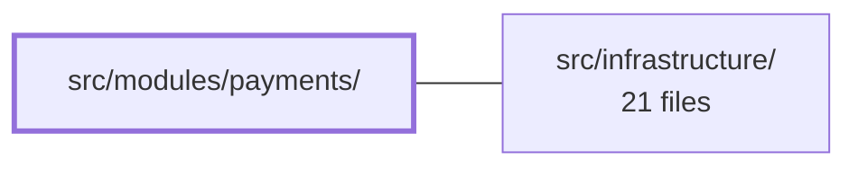

---
tags:
  - 2repo
  - 2repo/module
  - project/boilerplate-vue-frontend
type: module
module: src/modules/payments/
files: 8
updated: 2026-09-03T10:59:27.613447+00:00
---

# src/modules/payments/

## Purpose

The payments module owns every client-side interaction around paying for an order and refunding it. It encapsulates the two-step PSP sequence (create intent → confirm with card), interprets the server's "404 means no payment yet" convention, and exposes a narrow UI surface (a card-entry panel and a refund action) that the orders module mounts on its order page. It deliberately owns no routes of its own.

## Key parts

- **`store.ts`** – Pinia store that mirrors the API's payment record locally and drives the intent/confirm flow. Components never hit the payment APIs directly; they call store actions. The 404-as-`undefined` contract lives here.
- **`components/PaymentPanel.vue`** – The order-page payment card. While the order is payable it renders a single card-number field; once a payment record exists it collapses to a read-only status row. All logic is delegated to the store.
- **`composables/use-order-refund.ts`** – Thin composable (`canRefund` + `refund()`) that reads the server's `actions.refund` flag from the store so UI components can offer a refund without importing the store themselves.
- **`response-schemas.ts`** – Zod-style schemas paired with method + URL patterns for the four payments endpoints, consumed by the shared HTTP layer for runtime response validation.
- **`module.ts`** – Registry manifest: registers the response schemas and locale loaders. No route definitions.
- **`index.ts`** – Public barrel. The only export surface is `PaymentPanel` and `useOrderRefund`; the store and schemas remain module-private.
- **`tests/`** – Vitest specs pinning the PSP call sequence, the 404 contract, and the "no local refundability logic" rule of the composable.

## How it connects

- **`src/infrastructure/`** – The module's API calls travel through the shared HTTP client in infrastructure. `response-schemas.ts` plugs into that layer's runtime validation pipeline, and `module.ts` registers the module (schemas, locale loaders) with the application registry that infrastructure provides. No other module is imported; the payments store and components are self-contained.

## Where to start

1. **`store.ts`** – Understanding the intent/confirm flow and the 404 convention gives you the mental model for everything else in the module.
2. **`components/PaymentPanel.vue`** – Seeing how the store's state maps to the two UI states (form vs. status row) shows the module's entire user-facing surface in one file.

## Connected modules

[[boilerplate-vue-frontend_src_infrastructure|src/infrastructure/]]

## Files
- `src/modules/payments/components/PaymentPanel.vue` — Order-page payment card that shows either a single-field card form (while the order is still payable) or a read-only status row (after a payment record exists). It owns no payment logic itself — the two-step intent/confirm flow lives in the payments store; this component only collects the card number, fires the store call, surfaces the result as a toast, and tells the parent to refetch the order.
- `src/modules/payments/composables/use-order-refund.ts` — A Vue composable that exposes a single-order refund control (`canRefund` + `refund()`) by delegating to the payments Pinia store. It exists so that UI components can act on one order's refund without importing the store directly, keeping the refund surface narrow and reactive to route-driven order changes.
- `src/modules/payments/index.ts` — Public barrel for the payments module. It is the only file outside the module that may be imported from, exposing exactly two things: the `PaymentPanel` component (the UI through which a payment is initiated on an order) and the `useOrderRefund` composable (the operator's refund action). Everything else — including the payments store — stays private to the module.
- `src/modules/payments/module.ts` — Declares the payments module manifest for the app registry. It registers the response schemas and locale loaders needed to wire the `PaymentPanel` into the application. The module intentionally owns no routes — paying is a sub-interaction on an order, mounted by the orders module, not a standalone page.
- `src/modules/payments/response-schemas.ts` — Declares the response-envelope schema registrations for all four payments endpoints consumed by the module. Each entry pairs an HTTP method with a URL regex pattern and a Zod-style schema, so the shared HTTP layer can validate responses at runtime.
- `src/modules/payments/store.ts` — Pinia store for the payments module. It mirrors the API's payment record locally and encapsulates the two-step PSP sequence (create intent → confirm) plus the "404 means no payment yet" convention, so components never call the payment APIs directly.
- `src/modules/payments/tests/store.spec.ts` — Vitest spec for the payments Pinia store. It pins two invariants: the PSP call sequence (create intent → confirm with card) and the critical contract that a 404 on the read endpoint means *"no payment yet"* (resolves to `undefined`) while **any other** failure must reject and propagate to the caller.
- `src/modules/payments/tests/use-order-refund.spec.ts` — Unit tests for the `useOrderRefund` composable. They lock in the contract that the composable makes **no** local refundability decision: the button state is always a passthrough of the server's `actions.refund` flag, and the only client-side guard is an empty order-ID short-circuit.

---
[[boilerplate-vue-frontend_INDEX|← boilerplate-vue-frontend index]]
