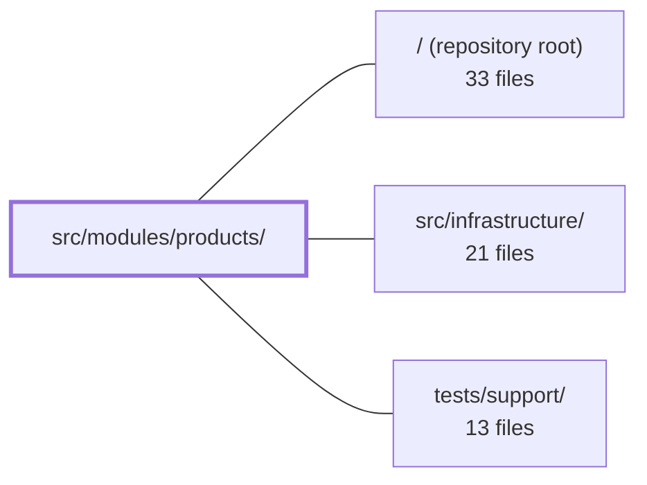

---
tags:
  - 2repo
  - 2repo/module
  - project/boilerplate-vue-frontend
type: module
module: src/modules/products/
files: 17
updated: 2026-09-03T10:59:38.268744+00:00
---

# src/modules/products/

## Purpose

The products domain module owns everything related to the product catalogue: the public storefront (listing + detail pages) and the admin CRUD pages (create, edit), the Pinia store that talks to the backend, the Zod validation schemas, the route declarations, and the response-contract validation. It exposes a single narrow import surface so sibling modules never reach into its internals.

## Key parts

- **Public surface** — `index.ts` (barrel re-exports) and `module.ts` (the `AppModule` manifest that bundles routes, a nav entry, response schemas, and lazy locale dicts for the app registry).
- **Routing & validation** — `routes.ts` (four route records: list, create, detail, edit), `schemas.ts` (Zod form schema mirroring server constraints), `response-schemas.ts` (envelope contracts for the HTTP layer's validation map).
- **State** — `store.ts`: a Pinia store that delegates CRUD, caching, pagination, and optimistic updates to the toolkit's `useStructureCrudApi`, then adds a hard-delete action and a facets read.
- **Views** — `ProductsList.vue` (public paginated list + admin row actions), `Product.vue` (public detail with cart/wishlist), `ProductCreate.vue` and `ProductEdit.vue` (admin forms with multipart-aware submission).
- **Tests** — Unit specs (`store.spec.ts`, `product-view.spec.ts`, `routes.spec.ts`, `schemas-i18n.spec.ts`) and E2E suites (`products.cy.ts`, `a11y.cy.ts`, `products.visual.cy.ts`) covering behaviour, accessibility, and visual regression.

## How it connects

- **`/` (repository root)** — The app's module registry discovers and mounts this feature via the `AppModule` object exported from `module.ts`; the app-level router consumes `routes.ts` through that same manifest.
- **`src/infrastructure/`** — The store delegates HTTP calls to the generated Orval client and the toolkit's `useStructureCrudApi`; `response-schemas.ts` plugs into the infrastructure HTTP layer's response-validation map; `schemas.ts` messages resolve through the shared vue-i18n setup.
- **`tests/support/`** — The E2E specs lean on shared harnesses for the a11y sweep, the visual-regression `sweepVisual` runner, and the seeded backend fixture that `products.cy.ts` exercises against.

## Where to start

Read `module.ts` first to see the module's full contract (what it exports, how it's mounted) in one small file. Then open `store.ts` — every view in this module is a thin renderer over the store's state and actions, so understanding the store's CRUD surface and its two custom actions (hard-delete, facets) explains how the pages behave without having to trace each view individually.

## Connected modules

[[boilerplate-vue-frontend_ROOT|/ (repository root)]] · [[boilerplate-vue-frontend_src_infrastructure|src/infrastructure/]] · [[boilerplate-vue-frontend_tests_support|tests/support/]]

## Files
- `src/modules/products/index.ts` — Barrel file that defines the public import surface for the products module. It exists to enforce a single, narrow re-export contract: sibling modules must import through this file rather than reaching into the module's internals, a rule backed by lint.
- `src/modules/products/module.ts` — Module manifest for the **products** domain. It bundles the routes, a navigation entry, response schemas, and lazy-loaded locale dictionaries into a single object that conforms to the `AppModule` interface, so the app's registry can discover and mount the products feature in one place.
- `src/modules/products/response-schemas.ts` — Declares the response-envelope schema for every products endpoint this module calls. The array is consumed by the HTTP layer's response-schema map to validate server responses against the expected contract. Enabling or deleting the products domain folder automatically turns this validation on or off via the module manifest.
- `src/modules/products/routes.ts` — Defines the four route records for the products domain (list, create, detail, edit). This array is the single source of truth for the module's navigation entries and is consumed by the module manifest, which merges it into the application-level router.
- `src/modules/products/schemas.ts` — Defines the Zod validation schema for the product create/edit form. It mirrors the server's API contract constraints (notably the price minimum) so client-side validation is never more permissive than the backend.
- `src/modules/products/store.ts` — Pinia store for the products domain. It declares the CRUD/search endpoints once and delegates all derived state (dictionary, filters, pagination, caching, optimistic updates, rollback) to the toolkit's `useStructureCrudApi`, then layers on two things the toolkit has no shape for: a hard-delete action and a facets read.
- `src/modules/products/tests/e2e/a11y.cy.ts` — Declares the set of routes and viewport/theme variants that the products module exposes to the shared a11y sweep mechanism. It exists so that axe audits cover both the public storefront and the admin CRUD pages, including edge cases (dark theme, phone-width stacking, form-error states) that a single default-desktop pass would miss.
- `src/modules/products/tests/e2e/products.cy.ts` — Cypress E2E suite that exercises the products **list** and **detail** pages in a real browser against a seeded backend. It verifies what anonymous vs. admin users see (including soft-deleted and inactive products), that the public list matches the API's public scope, that row actions are role-gated, and that the detail page renders the fields the API returned.
- `src/modules/products/tests/e2e/products.visual.cy.ts` — Declares the list of screens for the products module's visual-regression sweep. It registers a single screen (`products-list`) so the shared `sweepVisual` harness can capture and compare a screenshot of the rendered page.
- `src/modules/products/tests/product-view.spec.ts` — Unit test for the `Product` detail view. It mounts the real component against a real (memory-history) router and exercises multiple product **shapes**—out-of-stock, in-stock, minimal, rich—by seeding data directly into the Pinia store, bypassing the network layer entirely.
- `src/modules/products/tests/routes.spec.ts` — Table-driven Vitest spec that asserts every route in the products module declares an explicit `meta.access` value, and that no route exists outside the tested set. It inspects the raw route records directly (no resolved router, no locale prefix), so it runs as a standalone fact about this module's declarations.
- `src/modules/products/tests/schemas-i18n.spec.ts` — Cross-checks the products module's Zod schemas against its own locale dictionaries (en/it), verifying that message keys the schemas reference exist in both languages and resolve to different translated text. It runs against the **real** vue-i18n instance (not a mocked `t`) so it catches cases where a message is frozen in the wrong language. The thunked-message re-resolution *mechanism* is proven elsewhere (`tests/cross-cutting/schemas-i18n.spec.ts`); this file only proves this module's data agrees.
- `src/modules/products/tests/store.spec.ts` — Unit tests for the products store's create, update, and delete actions. Focuses on the repo-specific logic — the JSON-vs-multipart branching, request shaping, and optimistic-update patching — rather than the thin CRUD wrappers over `@guebbit/vue-toolkit`. Mocks only the transport (`orvalMutator`) so the generated client and FormData encoding run for real, catching wire-format regressions that TypeScript cannot.
- `src/modules/products/views/Product.vue` — Public product detail page (route component `ProductTargetPage`). Renders the product record fetched by the products store and exposes the two storefront visitor actions — add to cart and toggle wishlist — by delegating to their owning module stores.
- `src/modules/products/views/ProductCreate.vue` — Vue SFC that renders the "create product" form page. It builds a Zod validation schema (a picked + extended slice of the shared `productsSchema`), wires it into the toolkit's `useStructureFormValidation`, and on submit calls the products store's multipart-aware `createProduct` action, then redirects to the new product's detail route.
- `src/modules/products/views/ProductEdit.vue` — Vue single-file component (`ProductEditPage`) that renders a product edit form. It auto-hydrates fields from the fetched record in the products store, validates user input with a Zod schema, and submits changes—including an optional replacement image—through the store's multipart-aware `updateProduct` action.
- `src/modules/products/views/ProductsList.vue` — Public products listing page. Provides a search/filter form (text, ID, price range), category and tag facet chips, a paginated data table of products, and admin-gated row actions (edit, soft delete, hard delete). Mounted under `LayoutDefault`.

---
[[boilerplate-vue-frontend_INDEX|← boilerplate-vue-frontend index]]
