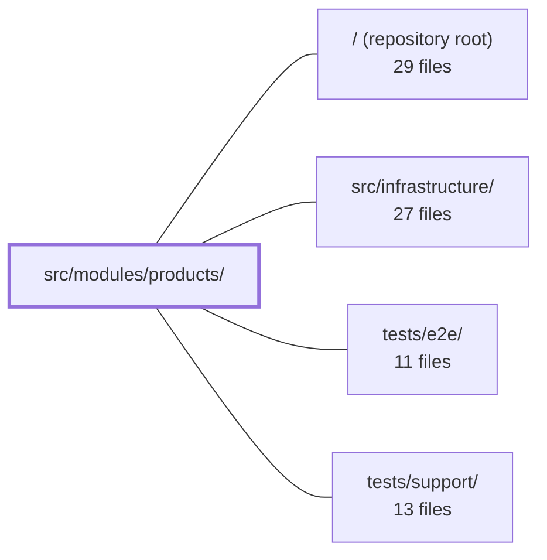

---
tags:
  - 2repo
  - 2repo/module
  - project/boilerplate-vue-frontend
type: module
module: src/modules/products/
files: 17
updated: 2026-08-30T17:11:24.456884+00:00
---

# src/modules/products/

## Purpose

The products module implements the full product-catalogue feature: listing, creating, viewing, editing, and deleting products. It bundles its routes, validation schemas, a Pinia data store, and the four user-facing views into a self-contained domain that the app's module registry can mount (or remove) as a unit.

## Key parts

- **Entry & manifest** — `index.ts` is the sole public import surface (enforced by lint); `module.ts` packages routes, a nav entry, response schemas, and locale dictionaries into the `AppModule` shape the app registry expects.
- **Routing & validation** — `routes.ts` defines the four product routes (list, create, detail, edit) with `meta.access` guards; `schemas.ts` holds the Zod create/edit form schema; `response-schemas.ts` declares the expected API response envelopes for the HTTP layer to validate.
- **Data store** — `store.ts` (Pinia) declares CRUD/search endpoints and delegates state management to `useStructureCrudApi` from `@guebbit/vue-toolkit`, layering on a hard-delete action and a catalogue-facets read that the toolkit doesn't provide.
- **Views** — `views/ProductsList.vue` (paginated table, facet chips, admin row actions), `views/Product.vue` (detail + cart/wishlist actions), `views/ProductCreate.vue` and `views/ProductEdit.vue` (multipart-aware forms with shared Zod validation).
- **Tests** — Unit specs for the store, detail view, route metadata, and schema↔i18n agreement; Cypress e2e specs for list/detail behaviour; co-located a11y and visual-regression registration files so deleting the module also removes its cross-cutting coverage.

## How it connects

- **`src/infrastructure/`** — Provides the HTTP client and response-schema map that `response-schemas.ts` feeds, the `useStructureCrudApi` composable the store depends on, and the app-level registry that reads the `AppModule` object exported by `module.ts`.
- **`tests/e2e/`** — Houses the shared a11y sweep (`a11y-coverage.spec.ts`) and visual-regression sweep that discover and consume the co-located `a11y.cy.ts` and `products.visual.cy.ts` files in this module.
- **`tests/support/`** — Supplies the Cypress commands, fixtures, and seeded-backend setup that the products e2e specs rely on.
- **Repository root** — Owns the lint rules that block direct imports of internal product files and the global router configuration into which the module's route array is merged.

## Where to start

Read **`module.ts`** first: in one small file it reveals every route, schema, locale, and nav entry the module exposes, giving you the full shape of the feature. Then read **`store.ts`** to see how product data flows in and out (CRUD, pagination, optimistic updates) before touching any view.

## Connected modules

[[boilerplate-vue-frontend_ROOT|/ (repository root)]] · [[boilerplate-vue-frontend_src_infrastructure|src/infrastructure/]] · [[boilerplate-vue-frontend_tests_e2e|tests/e2e/]] · [[boilerplate-vue-frontend_tests_support|tests/support/]]

## Files
- `src/modules/products/index.ts` — Public barrel file for the `products` module. It is the **only** entry point sibling modules are permitted to import from; all other files in the module are considered internal and are blocked by lint rules.
- `src/modules/products/module.ts` — Module manifest for the **products** domain. It bundles the routes, a navigation entry, response schemas, and lazy-loaded locale dictionaries into a single object that conforms to the `AppModule` interface, so the app's registry can discover and mount the products feature in one place.
- `src/modules/products/response-schemas.ts` — Declares the response-envelope schema for every products endpoint this module calls. The array is consumed by the HTTP layer's response-schema map to validate server responses against the expected contract. Enabling or deleting the products domain folder automatically turns this validation on or off via the module manifest.
- `src/modules/products/routes.ts` — Defines the four route records for the products domain (list, create, detail, edit). This array is the single source of truth for the module's navigation entries and is consumed by the module manifest, which merges it into the application-level router.
- `src/modules/products/schemas.ts` — Defines the Zod validation schema for the product create/edit form. It mirrors the server's API contract constraints (notably the price minimum) so client-side validation is never more permissive than the backend.
- `src/modules/products/store.ts` — Pinia store for the products domain. Declares CRUD/search endpoints once and delegates the bulk of state (dictionary, pagination, filters, caching, optimistic updates) to `useStructureCrudApi` from `@guebbit/vue-toolkit`. Layers two additions the toolkit has no shape for: an irreversible hard-delete action and a catalogue facets read.
- `src/modules/products/tests/e2e/a11y.cy.ts` — Co-located route list that feeds the shared a11y sweep for the products module. It exists alongside the module so that deleting the module also removes its accessibility coverage, and so that the cross-cutting `a11y-coverage.spec.ts` can verify every routed module ships one of these files.
- `src/modules/products/tests/e2e/products.cy.ts` — Cypress end-to-end spec covering the Products list and detail screens. It drives a real browser against a seeded backend to verify that anonymous visitors see only publicly visible products, admins see the full set with role-specific row actions, and the detail page renders the fields the API actually returned.
- `src/modules/products/tests/e2e/products.visual.cy.ts` — Declares the screen list for the products module's visual-regression sweep. It is a thin "registration" file: it tells the shared sweep mechanism which URL and target selector to photograph, and nothing else. It exists so that deleting the products module also deletes its snapshot PNGs (stored in a sibling `__snapshots__/` folder) rather than leaving orphaned baselines in a central directory.
- `src/modules/products/tests/product-view.spec.ts` — Unit-test spec for the `Product` detail view that mounts the real component against a real (memory-history) router and a real Pinia store, but stubs the fetch layer so every product shape the API can return is exercised in a single in-memory run — no browser, no network round trip per shape.
- `src/modules/products/tests/routes.spec.ts` — Table-driven Vitest spec that verifies every route in the products module declares the expected `meta.access` value, and that no route exists outside the known set. It guards against a route silently losing its access declaration (making it public) or a new route being added without an access decision.
- `src/modules/products/tests/schemas-i18n.spec.ts` — Verifies that the products module's Zod schemas and its own locale dictionaries actually agree: every message key the schemas reference exists in both `en.json` and `it.json`, and the Italian copy resolves to text different from the English copy. Unlike the cross-cutting mechanism test, this file proves a fact specific to *this* domain.
- `src/modules/products/tests/store.spec.ts` — Unit tests for the products store's own request-shaping logic: which branch a create/update call takes (JSON vs multipart `FormData`), how the `FormData` is built (repeated keys, omitted optionals, Blob preservation), and how optimistic updates are applied before the transport resolves. The generated HTTP client is exercised for real; only the lowest transport (`orvalMutator`) is mocked, so encoding regressions that TypeScript cannot catch are still asserted.
- `src/modules/products/views/Product.vue` — Renders the public product detail page. It fetches the product record via the products store when the route `id` changes, displays its fields, and exposes the two visitor write actions (add-to-cart and wishlist toggle) by delegating to the cart and wishlist stores.
- `src/modules/products/views/ProductCreate.vue` — Renders the "Create Product" page. It builds a product-creation form (title, price, description, active flag, optional image), validates it against a derived slice of the shared `productsSchema`, and submits through the products store's multipart-aware `createProduct`. On success it toasts and navigates to the new product's detail route.
- `src/modules/products/views/ProductEdit.vue` — Edit form for a single product. It auto-hydrates from the store's `currentProduct` once the record is fetched by `watchProduct`, then persists field changes (title, price, description, active flag) and an optional replacement image through the store's multipart-aware `updateProduct`.
- `src/modules/products/views/ProductsList.vue` — The public products list page. It renders a search/filter form, toggleable category and tag facet chips, and a paginated data table of products. Admin users additionally see per-row edit, soft-delete, and hard-delete actions plus a "Create product" button.

---
[[boilerplate-vue-frontend_INDEX|← boilerplate-vue-frontend index]]
