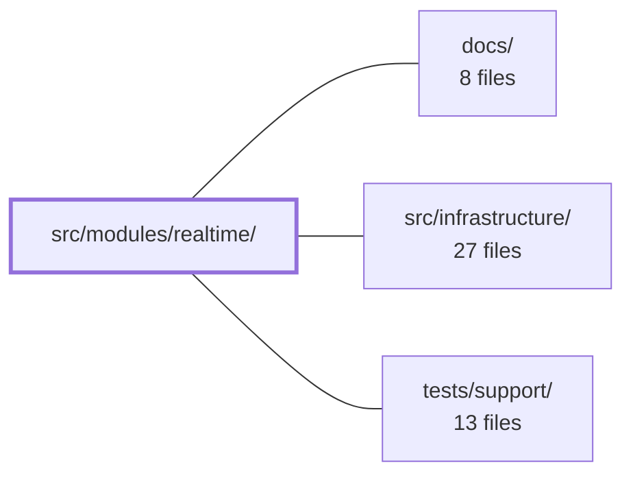

---
tags:
  - 2repo
  - 2repo/module
  - project/boilerplate-vue-frontend
type: module
module: src/modules/realtime/
files: 10
updated: 2026-08-30T17:11:38.362503+00:00
---

# src/modules/realtime/

## Purpose

A single-route observability playground that opens a Server-Sent Events (SSE) stream and renders its payloads in a live dashboard. The module contains no business domain logic; it is a thin UI layer (view + composable + Pinia store) for inspecting real-time metrics, exposed at `playground/realtime`.

## Key parts

- **Module manifest & routing** — `module.ts` and `routes.ts` declare the `AppModule` shape, the one navigation entry, lazy locale dictionaries, and the sole route record the kernel splices into the app router.
- **SSE composable** — `use-realtime-observability.ts` owns a module-level singleton SSE connection, opens the stream, dispatches each typed event to the store, and exposes `connect`/`disconnect`.
- **State** — `store.ts` is a Pinia store holding connection status, the latest snapshot/update payloads, a heartbeat timestamp, a capped event feed, and the last error. Pure state + setter actions; it never touches the network.
- **View** — `views/RealtimePlayground.vue` renders status, a KPI summary, and a scrollable event feed with a per-entry toggle between a formatted metric grid and raw JSON.
- **Tests** — Co-located under `tests/`: a route-access spec, a store unit suite, a composable unit suite (SSE transport mocked), an accessibility e2e sweep, and a visual-regression sweep.

## How it connects

- **`src/infrastructure/`** — Supplies the `AppModule` contract and kernel registry that `module.ts` conforms to, as well as the `createSseClient` transport that the composable consumes.
- **`tests/support/`** — Provides the shared `sweepA11y` and `sweepVisual` runners that the module's e2e spec files register against, keeping sweeping logic central while coverage stays co-located.
- **`docs/`** — Referenced in the dependency graph; the module's lazy locale dictionaries and route metadata feed the documentation/landing-page structure defined there.

## Where to start

1. **`use-realtime-observability.ts`** — Reading this first shows how the SSE singleton is opened, how events are routed to the store, and the connect/disconnect lifecycle. It is the "brain" of the module.
2. **`views/RealtimePlayground.vue`** — Follows naturally to see how that state is rendered into the user-facing dashboard, giving you the full request-to-pixel picture.

## Connected modules

[[boilerplate-vue-frontend_docs|docs/]] · [[boilerplate-vue-frontend_src_infrastructure|src/infrastructure/]] · [[boilerplate-vue-frontend_tests_support|tests/support/]]

## Files
- `src/modules/realtime/module.ts` — Module manifest for the **realtime** domain. Declares the module's routes, a single navigation entry, and lazy-loaded locale dictionaries, conforming to the `AppModule` shape consumed by the kernel registry. The module itself contains no domain logic — it is a thin screen for an observability-metrics SSE playground.
- `src/modules/realtime/routes.ts` — Declares the realtime module's route table—a single-route `RouteRecordRaw[]` that exposes the SSE observability playground at `playground/realtime`. The module registry splices this array into the application router at startup.
- `src/modules/realtime/store.ts` — Pinia store that holds the reactive UI state for the real-time observability dashboard: SSE connection lifecycle, the two latest payload shapes (initial snapshot vs. incremental update), a heartbeat timestamp, a capped event feed, and the last error. It is pure state plus setter actions — it never opens or manages the SSE connection itself; that responsibility belongs to the composable in `use-realtime-observability.ts`, which calls the store's actions.
- `src/modules/realtime/tests/e2e/a11y.cy.ts` — Co-located accessibility e2e test for the **realtime** module. It registers the module's routes with the shared `sweepA11y` runner so that axe assertions are executed against each route. Placing this file inside the module (rather than a central list) ensures that deleting the module automatically removes its a11y coverage.
- `src/modules/realtime/tests/e2e/realtime.visual.cy.ts` — Registers the realtime module's screen with the shared `sweepVisual` visual-regression runner so that a screenshot of the page is captured and diffed against a stored baseline. This file acts purely as a declaration (screen list); all sweeping logic lives elsewhere.
- `src/modules/realtime/tests/routes.spec.ts` — Guarantees that every route in the realtime module explicitly declares a `meta.access` value, and that no route can be added without an access decision. It asserts against the module's own route records directly, so it needs neither a resolved router nor locale prefixes.
- `src/modules/realtime/tests/store.spec.ts` — Vitest unit-test suite for the `useRealtimeObservabilityStore` Pinia store. It verifies the store's initial state and each setter action (`setStatus`, `setSnapshot`, `setUpdate`, `setHeartbeat`, `setError`) against a fresh Pinia instance per test.
- `src/modules/realtime/tests/use-realtime-observability.spec.ts` — Unit tests for the `useRealtimeObservability` composable that powers the observability dashboard. The SSE transport (`createSseClient`) is fully mocked so the tests verify only the wiring: which URL and event names are requested, which store action each event name dispatches to, and that the module-level singleton is torn down before a reconnection.
- `src/modules/realtime/use-realtime-observability.ts` — Composable that owns a **module-level singleton** SSE connection for the realtime observability dashboard. It opens the stream, routes each typed event to the paired Pinia store's actions, and exposes `connect`/`disconnect` controls. The singleton lives outside the composable's closure so that re-mounting a consuming component never opens a second stream.
- `src/modules/realtime/views/RealtimePlayground.vue` — Route view that renders the live SSE observability state from the `useRealtimeObservability` composable. It shows the current connection status, a KPI summary derived from the most recent event, and a scrollable feed of all received events with a per-entry toggle between a formatted metric grid and the raw JSON payload.

---
[[boilerplate-vue-frontend_INDEX|← boilerplate-vue-frontend index]]
