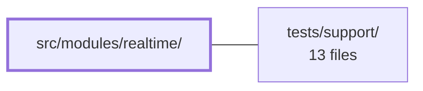

---
tags:
  - 2repo
  - 2repo/module
  - project/boilerplate-vue-frontend
type: module
module: src/modules/realtime/
files: 10
updated: 2026-09-03T10:59:46.584940+00:00
---

# src/modules/realtime/

## Purpose

A single-route module that provides a live Server-Sent Events (SSE) observability playground. It owns the SSE connection lifecycle, captures the stream's state in a Pinia store, and renders the resulting metrics feed in a dedicated view. The module contains no business logic beyond wiring the transport to the UI.

## Key parts

- **`module.ts` / `routes.ts`** — Module manifest and the one route record (`/realtime`) the kernel registry splices into the app router.
- **`use-realtime-observability.ts`** — The core composable. Holds a module-level singleton SSE client, opens/closes the stream, and fans each typed event out to the store's setter actions.
- **`store.ts`** — Pure Pinia setup-store: connection status, latest snapshot vs. incremental payload, heartbeat timestamp, capped event feed, and last error. No I/O lives here.
- **`views/RealtimePlayground.vue`** — The route-level component: connect/disconnect controls, a KPI strip for the most recent event, and a scrollable metric feed with a raw-JSON toggle.
- **`tests/`** — Unit specs for the store and composable (with a mocked SSE client), a route-metadata guard test, and two e2e registrations (axe a11y sweep + visual-regression sweep).

## How it connects

- **`tests/support/`** — The two e2e specs (`a11y.cy.ts`, `realtime.visual.cy.ts`) import the shared `sweepA11y` and `sweepVisual` runners from this directory. Deleting the module removes its route, which in turn removes the only references to those runners for this screen.

## Where to start

Read **`use-realtime-observability.ts`** first — it is the single piece that owns the SSE lifecycle and makes the store's actions fire, so understanding its connect/disconnect flow and event routing clarifies every other file. Then open **`views/RealtimePlayground.vue`** to see how a consumer component reads from the store and drives the composable's controls.

## Connected modules

[[boilerplate-vue-frontend_tests_support|tests/support/]]

## Files
- `src/modules/realtime/module.ts` — Module manifest for the **realtime** domain. Declares the module's routes, a single navigation entry, and lazy-loaded locale dictionaries, conforming to the `AppModule` shape consumed by the kernel registry. The module itself contains no domain logic — it is a thin screen for an observability-metrics SSE playground.
- `src/modules/realtime/routes.ts` — Defines the realtime module's route table — a single `RouteRecordRaw` entry for the SSE observability playground. The array is spliced into the app-level router by the module registry, making this the module's sole navigation entry point.
- `src/modules/realtime/store.ts` — Pinia setup-store that holds the live state of an SSE metrics stream for the observability dashboard — connection status, the two most recent payload shapes (full snapshot vs. incremental update), a heartbeat timestamp, a capped event feed, and the last error. It is intentionally pure state plus setters; the actual SSE connection is managed elsewhere (`use-realtime-observability.ts`), which calls the actions exported here.
- `src/modules/realtime/tests/e2e/a11y.cy.ts` — Registers the **realtime** module's e2e accessibility (a11y) coverage by declaring its route to the shared `sweepA11y` runner, which visits the page and asserts axe results. It is co-located with the module so that deleting the module removes its a11y test with it, preventing a central list from referencing dead routes.
- `src/modules/realtime/tests/e2e/realtime.visual.cy.ts` — Registers the realtime playground screen with the shared `sweepVisual` visual-regression runner so its rendered output is screenshot-diffed against a stored baseline. It exists so that unexpected visual changes to the realtime module are caught in CI or local runs without manual eyeballing.
- `src/modules/realtime/tests/routes.spec.ts` — Table-driven test that asserts every route in the realtime module carries an explicit `meta.access` value, and enforces a closed list so that adding a new route without an access decision causes a test failure. It validates the *declarations* exist on the route records; the router-level spec separately proves enforcement is attached.
- `src/modules/realtime/tests/store.spec.ts` — Vitest unit-test suite for the `useRealtimeObservabilityStore` Pinia store. It verifies the store's initial state and each setter action (`setStatus`, `setSnapshot`, `setUpdate`, `setHeartbeat`, `setError`) against a fresh Pinia instance per test.
- `src/modules/realtime/tests/use-realtime-observability.spec.ts` — Unit tests for the `useRealtimeObservability` SSE composable. They verify the wiring layer—URL resolution, event-name-to-store-action routing, singleton teardown/replacement, and disconnect safety—by mocking `createSseClient` rather than exercising a real `EventSource`. The transport internals are covered separately in `tests/unit/infrastructure/create-sse-client.spec.ts`.
- `src/modules/realtime/use-realtime-observability.ts` — Composable that owns a **module-level singleton** SSE connection for the realtime observability dashboard. It opens the stream, routes each typed event to the paired Pinia store's actions, and exposes `connect`/`disconnect` controls. The singleton lives outside the composable's closure so that re-mounting a consuming component never opens a second stream.
- `src/modules/realtime/views/RealtimePlayground.vue` — Route-level view that renders the live Server-Sent Events (SSE) observability stream. It exposes connection controls, a KPI summary of the most recent event, and a scrollable feed of all received metric entries with an optional raw-JSON toggle. It exists as the human-facing "playground" for the `useRealtimeObservability` composable.

---
[[boilerplate-vue-frontend_INDEX|← boilerplate-vue-frontend index]]
