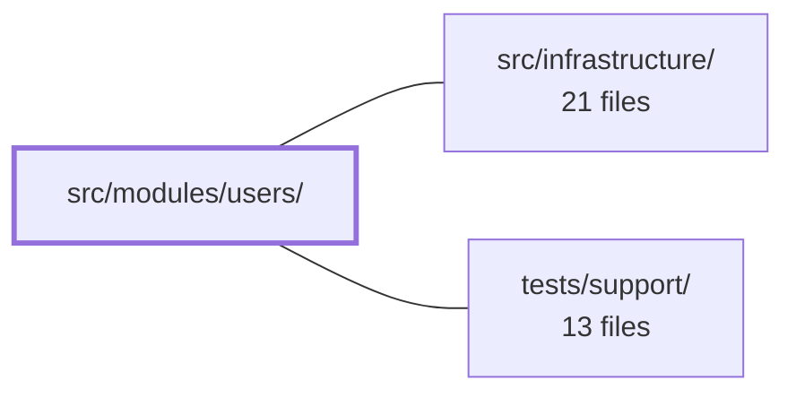

---
tags:
  - 2repo
  - 2repo/module
  - project/boilerplate-vue-frontend
type: module
module: src/modules/users/
files: 15
updated: 2026-09-03T10:59:58.081289+00:00
---

# src/modules/users/

## Purpose

The `users` module provides the full admin surface for managing user accounts: a paginated list with search, create/detail/edit pages, and the Pinia store that performs CRUD, paginated search, and avatar-upload against the API. It also publishes its Zod form schemas so sibling modules (notably `account`) can validate login, signup, and password-reset forms against the same field rules without re-declaring them.

## Key parts

- **Entry & manifest** — `index.ts` (barrel: re-exports the two Zod schemas for cross-module use) and `module.ts` (registers routes, nav entry, response schemas, and locale loaders with the `AppModule` registry).
- **Validation & contracts** — `schemas.ts` (Zod form schemas with i18n-thunked error messages) and `response-schemas.ts` (per-endpoint Zod response contracts keyed by method + path regex).
- **State** — `store.ts` (Pinia store built on the shared `useStructureCrudApi` primitive; exposes CRUD, search, avatar-upload, and a hard-delete action).
- **Routes** — `routes.ts` (four `RouteRecordRaw` records, all gated behind `admin` access).
- **Views** — `UsersList.vue` (paginated table + filters + row actions), `UserCreate.vue` (signup form with optional avatar), `UserEdit.vue` (edit form with optional password/avatar change), `User.vue` (read-only detail page).
- **Tests** — Unit specs for the store, schema-i18n agreement, and route access declarations; E2E specs for accessibility (`sweepA11y`) and visual regression (`sweepVisual`).

## How it connects

- **`src/infrastructure/`** — The store is generated from the shared `useStructureCrudApi` toolkit, response schemas plug into the infrastructure's response-schema-map validator, and `module.ts` registers everything through the `AppModule` registry that the infrastructure kernel reads at boot. The Zod schemas and i18n thunks also lean on infrastructure-level locale and validation utilities.
- **`tests/support/`** — The E2E files (`a11y.cy.ts`, `users.visual.cy.ts`) call the shared `sweepA11y` / `sweepVisual` harnesses that live in `tests/support/`, so the module only declares *which* routes to audit; the actual screenshot and accessibility logic is cross-cutting.

## Where to start

Read `schemas.ts` first to internalise the user data model and the validation rules that every view enforces. Then move to `store.ts` to see how those schemas feed into the CRUD/search/avatar-upload actions and how the shared toolkit shapes the HTTP layer. Together they give you the full request/response picture before you touch a single Vue component.

## Connected modules

[[boilerplate-vue-frontend_src_infrastructure|src/infrastructure/]] · [[boilerplate-vue-frontend_tests_support|tests/support/]]

## Files
- `src/modules/users/index.ts` — Barrel file (public entry point) for the `users` module. It exposes exactly two schema exports so that sibling modules (notably `account`) can validate login, signup, and password-reset forms against the same field rules without re-typing them. It deliberately omits the store: on the client neither module writes data — the API does — so what is shared is vocabulary, not a shared kernel.
- `src/modules/users/module.ts` — Module manifest for the **users** admin screens (list, detail, create, edit). It registers routes, a navigation entry, response schemas, and locale loaders with the app's `AppModule` registry so the kernel can mount everything in one place.
- `src/modules/users/response-schemas.ts` — Declares the response-schema contracts for every users-domain endpoint the module consumes. Each row pairs an HTTP method + path regex with a Zod schema, so the shared response-schema-map infrastructure can validate API responses at runtime. It exists to isolate the users domain's contract declarations in one table that the module manifest registers centrally.
- `src/modules/users/routes.ts` — Declares the four route records for the users module (list, create, detail, edit). Each record pairs a URL path with a lazy-loaded Vue component and an `admin`-only `meta.access` guard, and the array is typed as `RouteRecordRaw[]` for registration into the app's Vue Router.
- `src/modules/users/schemas.ts` — Zod validation schemas for user form data. Error messages are i18n thunks (`() => translate(…)`) so translations are resolved at parse time, not at module-load time.
- `src/modules/users/store.ts` — Pinia store that provides CRUD, paginated search, and avatar-upload operations for the User entity. It is generated from the shared `useStructureCrudApi` toolkit primitive so that the store's shape stays identical to other resource stores (e.g. products), differing only in endpoints and filter fields. A single hand-written action handles irreversible hard-delete.
- `src/modules/users/tests/e2e/a11y.cy.ts` — Declares the accessibility route list for the users module so the shared `sweepA11y` helper can audit every user-facing page (list, create, detail, edit) as the admin. Co-located with the module so that deleting the module automatically removes its a11y coverage, and so a cross-cutting spec can verify no routed module is missing a sweep file.
- `src/modules/users/tests/e2e/users.visual.cy.ts` — Declares the visual-regression routes for the **users** module so the shared `sweepVisual` harness knows which pages (and in-page anchors) to screenshot and compare. The file has no exports; its only runtime effect is the single `sweepVisual` call.
- `src/modules/users/tests/routes.spec.ts` — Pins the `meta.access` declaration on every users-module route by name. It reads the raw route records directly (not a resolved router), so it needs no locale prefix or app context. Its role is to prove the access declarations are *present*; a separate router spec proves enforcement is *attached*. Together they ensure a route cannot silently become public.
- `src/modules/users/tests/schemas-i18n.spec.ts` — Verifies that the users module's Zod schemas (`usersSchema`, `usersPasswordSchema`) emit validation messages resolved through the **real** vue-i18n instance in the currently active locale. This is distinct from the cross-cutting spec (`tests/cross-cutting/schemas-i18n.spec.ts`) which proves the thunked-message mechanism in isolation; this file proves the domain schemas and the `en.json` / `it.json` dictionaries actually agree. It lives alongside the domain rather than in a shared test folder.
- `src/modules/users/tests/store.spec.ts` — Unit tests for the `useUsersStore` Pinia store. The transport layer (`orvalMutator`) is mocked so that the tests inspect the raw HTTP requests each store action constructs (URL, method, body shape, FormData vs. JSON) without hitting a network. A users-specific concern — that submitted passwords and uploaded Blobs never linger in store state — is asserted here in addition to the request-contract checks shared in shape with the products store.
- `src/modules/users/views/User.vue` — Read-only user detail page that loads a single user by route `id` and renders their profile fields (username, email, role, status, timestamps) in a structured layout with hero, stats, detail grid, aside, and navigation actions.
- `src/modules/users/views/UserCreate.vue` — Vue single-file component that renders the "Create User" form page. It collects email, username, password, admin/active flags, and an optional avatar file, validates them via a Zod schema, and delegates submission to the users store—sending a multipart request when an avatar is present or JSON otherwise (the branch is handled inside the store).
- `src/modules/users/views/UserEdit.vue` — Single-user edit page. Loads a user by the route `id` prop, presents a form (email, optional password, optional avatar upload), and persists changes via the users store. An empty password or avatar field is a no-op ("leave as is"); a new avatar triggers a multipart upload with progress tracking.
- `src/modules/users/views/UsersList.vue` — The paginated user listing and search page. It wires the `useUsersStore` reactive filter/pagination state to a filter form, a `DataTable`, and per-row action buttons (view, edit, soft-delete, hard-delete), and reports API errors as toasts.

---
[[boilerplate-vue-frontend_INDEX|← boilerplate-vue-frontend index]]
