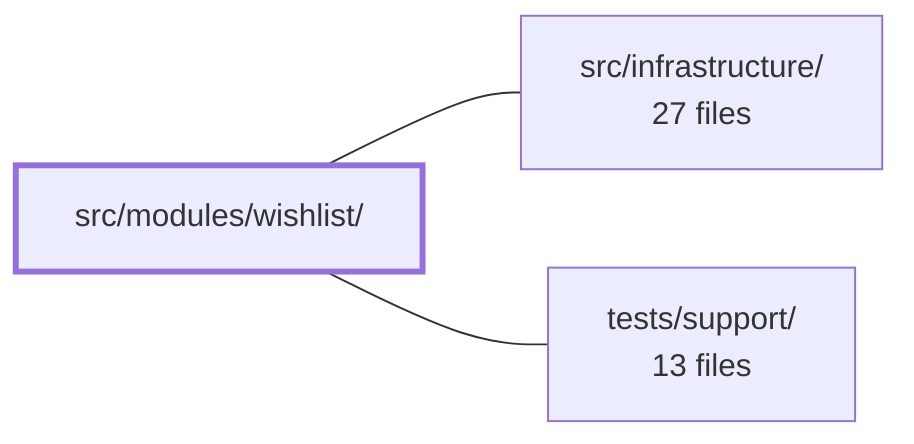

---
tags:
  - 2repo
  - 2repo/module
  - project/boilerplate-vue-frontend
type: module
module: src/modules/wishlist/
files: 12
updated: 2026-08-30T17:12:01.136544+00:00
---

# src/modules/wishlist/

## Purpose

The wishlist module lets authenticated visitors save products and manage that saved list (view, remove, move-to-cart). It owns its route, Pinia state, API contract schemas, and the `Wishlist.vue` page view, all registered through the shared `AppModule` manifest so the app discovers the feature without hard-coding it.

## Key parts

- **Module entry & manifest** — `index.ts` is the public barrel (re-exports `useWishlistStore` for sibling modules like `products`); `module.ts` declares routes, navigation, response schemas, and locale loaders to the app registry.
- **State & contracts** — `store.ts` (Pinia store holding saved product IDs, whole-list replacement on every mutation, and a `moveToCart` action that triggers a cart refetch) and `response-schemas.ts` (endpoint → response-envelope map consumed by the HTTP layer for runtime validation).
- **Routing** — `routes.ts` defines a single authenticated route that the registry merges into Vue Router.
- **View** — `views/Wishlist.vue` renders the saved list, resolves display titles via the cart store's title cache, and offers per-item move-to-cart and remove actions using Vuetify components.
- **Tests** — Co-located under `tests/`: unit specs for the view and route table, an integration spec for the store (real store + real client against a mocked transport), and Cypress e2e/visual/a11y specs for the full user flow.

## How it connects

- **`src/infrastructure/`** — The store and view depend on the infrastructure HTTP layer: the generated API client and `orvalMutator` transport live there, and `response-schemas.ts` is consumed by that layer to validate outbound responses at runtime. The cart store (also reached through infrastructure) provides the product-title cache the view reads and is refetched by `moveToCart`.
- **`tests/support/`** — The e2e specs (`a11y.cy.ts`, `wishlist.visual.cy.ts`) are thin wrappers that feed the wishlist route into shared sweep utilities (a11y audit, visual-regression harness) defined in the support directory.

## Where to start

Read `store.ts` first — it is small, shows the module's core data model (IDs only, whole-list replacement invariant) and the one cross-module side-effect (`moveToCart` → cart refetch). Then open `views/Wishlist.vue` to see how that state is rendered and how the view resolves titles through the cart store's cache. Together they give the full picture before you touch routing, schemas, or tests.

## Connected modules

[[boilerplate-vue-frontend_src_infrastructure|src/infrastructure/]] · [[boilerplate-vue-frontend_tests_support|tests/support/]]

## Files
- `src/modules/wishlist/index.ts` — Public barrel (entry point) for the wishlist module. It re-exports `useWishlistStore` so that sibling modules (notably `products`) can access the store's heart-toggle API without reaching into the module's internal file layout.
- `src/modules/wishlist/module.ts` — Module manifest for the **wishlist** feature. It registers the module's routes, navigation entry, response schemas, and locale loaders with the app registry (`AppModule`) so the application can discover and mount the wishlist without hard-coding its details.
- `src/modules/wishlist/response-schemas.ts` — Declarative table that maps every wishlist endpoint (method + URL pattern) to its response-envelope schema. The HTTP layer consumes this array to perform runtime contract validation on outbound responses.
- `src/modules/wishlist/routes.ts` — Declares the route table for the wishlist module—a single authenticated route that is merged into the application's Vue Router by the module registry. It exists to decouple the module's navigation entry point from the central router configuration.
- `src/modules/wishlist/store.ts` — Pinia store for the wishlist module. It holds the visitor's saved product lines (IDs only) and exposes CRUD actions. Every mutating action discards local state and replaces it wholesale with the list the API returns, guaranteeing the store never diverges from the server.
- `src/modules/wishlist/tests/e2e/a11y.cy.ts` — Declares the accessibility (a11y) route coverage for the wishlist module. It is a thin co-located wrapper that feeds the wishlist's route into the shared a11y sweep utility, ensuring that removing the wishlist module automatically removes its a11y test with it.
- `src/modules/wishlist/tests/e2e/wishlist.cy.ts` — Cypress end-to-end spec covering the full wishlist user flow: toggling the heart on a product page, browsing the saved list, following a saved item's link to its product page, moving an item to the cart, and confirming guests are redirected to login. It lives co-located with the wishlist module so that deleting the module also deletes its coverage.
- `src/modules/wishlist/tests/e2e/wishlist.visual.cy.ts` — Visual regression test for the wishlist screen. It registers the wishlist page in the shared visual-sweep harness so a screenshot can be captured and compared against a co-located baseline. The file itself is just a one-line screen declaration; all sweep logic lives elsewhere.
- `src/modules/wishlist/tests/routes.spec.ts` — Guards the wishlist route table against silent security regressions. It asserts that the `Wishlist` route still declares `meta.access: 'auth'` and that no unlisted routes have been added to the module, because a route that loses its access requirement simply renders open.
- `src/modules/wishlist/tests/store.spec.ts` — Integration-style tests for the wishlist Pinia store. Rather than unit-testing in isolation, the spec exercises the real store, real generated client, and real cart store against a transport-mocked `orvalMutator`, verifying the store's coordination invariants: whole-list replacement on every mutation and the cross-module side-effect where `moveToCart` refetches the cart.
- `src/modules/wishlist/tests/wishlist-view.spec.ts` — Unit tests for the `Wishlist.vue` view that verify two critical invariants: each saved-item link's `href` carries the product **ID** while its visible text carries the product **TITLE**, and the rendered href actually resolves to the `ProductTarget` route in the app's real route table. It also covers list rendering, the title-fallback behavior, aria-labels, and the empty state.
- `src/modules/wishlist/views/Wishlist.vue` — Page-level view that renders the user's saved products (wishlist). It fetches the saved product IDs on mount, resolves display titles via the cart store's title cache, and provides two actions per item: move-to-cart and remove. Uses Vuetify components and the default site layout.

---
[[boilerplate-vue-frontend_INDEX|← boilerplate-vue-frontend index]]
