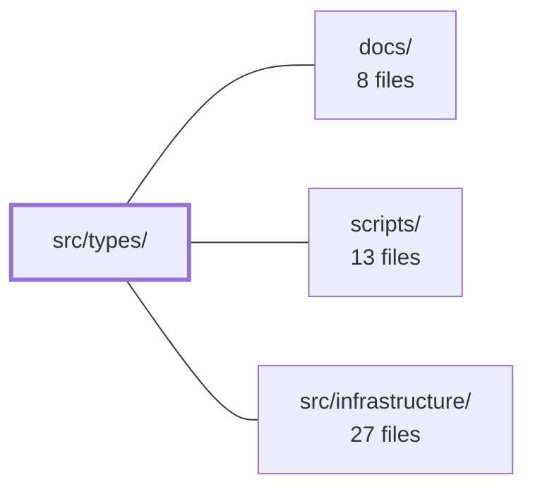

---
tags:
  - 2repo
  - 2repo/module
  - project/boilerplate-vue-frontend
type: module
module: src/types/
files: 5
updated: 2026-08-30T17:12:09.860407+00:00
---

# src/types/

## Purpose

`src/types/` is the single import surface (`@/types`) for every TypeScript type the application's runtime code consumes. It aggregates hand-written contracts (HTTP envelope, realtime feed) with auto-generated definitions (Orval API, AsyncAPI) so that the rest of the codebase never imports from a generated package or a codegen output directly.

## Key parts

- **`index.ts`** – The barrel that re-exports everything else in the directory, giving consumers a stable `@/types` path.
- **`api.ts`** – Thin re-export of all generated Orval types from the `@api` package, shielding consumers from the generated package's location or alias.
- **`asyncapi.generated.ts`** – Auto-generated (from `asyncapi.yaml` via AsyncAPI codegen) interfaces for observability-metric payloads, canonical channel-name constants, and the SSE event-name → payload map.
- **`http.ts`** – The response-envelope interfaces every API reply conforms to; callers discriminate success vs. rejection via the `success` flag rather than parsing status codes.
- **`realtime.ts`** – Client-facing types for the observability SSE feed: the shape of a single rendered entry and the connection lifecycle states shared by UI and infrastructure code.

## How it connects

- **`docs/`** – Houses the source-of-truth documents (`asyncapi.yaml`, OpenAPI specs) from which `asyncapi.generated.ts` and the Orval types are produced.
- **`scripts/`** – Contains the codegen tooling that regenerates `asyncapi.generated.ts` and the `@api` package types, so any schema change in `docs/` flows through here before landing in this module.
- **`src/infrastructure/`** – The primary consumer: the HTTP client, SSE connection manager, and metric-parsing logic import the envelope, feed-entry, and lifecycle types defined here, guaranteeing a single shared contract between infrastructure and UI layers.

## Where to start

1. **`http.ts`** – It is short and shows the response shape every API call produces; understanding the `success` flag pattern makes the rest of the app's data flow intuitive.
2. **`realtime.ts`** – It defines the observable "metric entry" and connection states you will see in both the UI and the infrastructure layer, giving you a concrete example of how a shared type contract is consumed across modules.

## Connected modules

[[boilerplate-vue-frontend_docs|docs/]] · [[boilerplate-vue-frontend_scripts|scripts/]] · [[boilerplate-vue-frontend_src_infrastructure|src/infrastructure/]]

## Files
- `src/types/api.ts` — Single-line barrel that re-exports all generated Orval API types from the `@api` package. It exists so that consumers import types from `@/types` (via the directory barrel) rather than reaching into the generated package directly, keeping the public import surface stable even if the generated package's location or alias changes.
- `src/types/asyncapi.generated.ts` — Auto-generated TypeScript type definitions derived from `asyncapi.yaml` via the AsyncAPI codegen tool. It provides compile-time typed interfaces for observability metrics payloads, canonical channel-name constants, and an SSE event-name → payload mapping so that consumers of the realtime API don't have to hand-write string literals or inline shapes.
- `src/types/http.ts` — Defines the TypeScript interfaces for the API's HTTP response envelope. Every response returned by the API conforms to one of these shapes, allowing callers to discriminate success vs. rejection via the `success` flag rather than inspecting status codes at runtime.
- `src/types/index.ts` — Barrel module that aggregates all of this app's type definitions behind a single import path (`@/types`), so consumers never need to import from individual sub-modules.
- `src/types/realtime.ts` — Defines the TypeScript types for the realtime observability SSE feed: the shape of a single rendered feed entry and the lifecycle states of the underlying connection. This file centralises the client-facing contract so UI and infrastructure code share one source of truth for what a "realtime metric" looks like and what states a connection can be in.

---
[[boilerplate-vue-frontend_INDEX|← boilerplate-vue-frontend index]]
