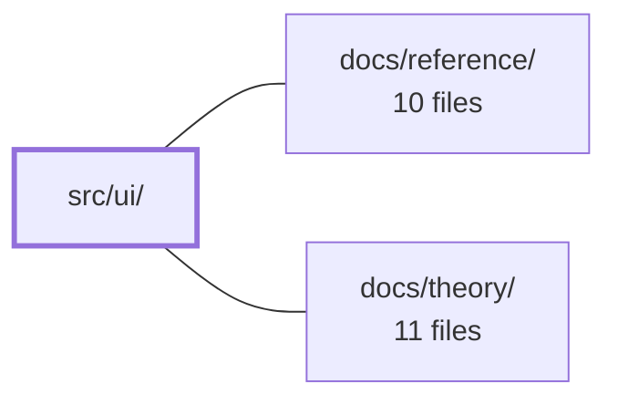

---
tags:
  - 2repo
  - 2repo/module
  - project/boilerplate-vue-frontend
type: module
module: src/ui/
files: 18
updated: 2026-08-30T17:12:21.323882+00:00
---

# src/ui/

## Purpose

`src/ui/` is the shared UI layer for the application. It bundles the Vuetify design-system configuration, a set of reusable **molecules** (small, self-contained form controls and display widgets), and **organisms** (larger composite layout blocks such as detail-page skeletons and the app-wide data table). Together they ensure that every view composes the same visual vocabulary, accessibility rules, and theming without re-implementing layout or styling logic.

## Key parts

- **Design-system config** (`vuetify/index.ts`, `vuetify/icons.ts`, `types.ts`) — `vuetify/index.ts` is the single source of truth for colour palettes (light & dark), component defaults (rounding, variants, densities), the Lucide icon integration, and locale strings. `vuetify/icons.ts` wires `lucide-vue-next` as Vuetify's icon renderer. `types.ts` defines the shared `ThemeAccent` string-literal union so every component referencing an accent colour points at one canonical type.

- **Molecules** (`molecules/`) — small, focused building blocks:
  - *Form inputs*: `FormCounterInput` (accessible numeric stepper wrapper), `FormImageUpload` (single-image picker with preview, progress, and object-URL lifecycle management).
  - *Display & navigation*: `LazyImage` (three-tier image loading with fallback), `ListPagination` (accessible pager that hides on single-page lists), `TableLoadingBar` (accessible `#loader` replacement for `v-data-table`).
  - *Detail fields*: `DefinitionRow` (dense label/value row for `<dl>` blocks), `ItemDetailField` (icon-tile + label/value for individual detail pages).

- **Organisms** (`organisms/`) — composite layout shells that views compose directly:
  - *Page-level skeletons*: `ItemDetailLayout` (max-width container, hero+stats row, main/aside grid, accent CSS variable), `FormCard` (shared create/edit card shell with back-link and submit button).
  - *Display cards*: `CardDetail`, `CardInfo`, `CardMaterialStat` — consistent Vuetify `v-card` surfaces for detail content, info highlights, and dashboard stat tiles.
  - *Data table*: `DataTable` (generic wrapper over `v-data-table` that adapts the app's header shape, adds single-row selection, swaps in the accessible loader, and forwards selected slots) plus `data-table-headers.ts` (the column-header union types it accepts).

## How it connects

- **`docs/reference/`** — Provides the human-readable API reference for the components and design tokens defined here. Changes to props, slots, or theme keys in `src/ui/` must be reflected in the reference docs.
- **`docs/theory/`** — Explains the architectural rationale behind the module (e.g., why organisms wrap Vuetify rather than exposing it, the molecule/organism split, and the single-source-of-truth theming policy). The code in `src/ui/` is the implementation those documents describe.

## Where to start

1. **`src/ui/vuetify/index.ts`** — Read this first to understand the palette, component defaults, and icon setup that every other file in the module inherits. It is the file a downstream project edits to rebrand the entire UI.
2. **`src/ui/organisms/ItemDetailLayout.vue`** — A representative organism that shows how the module composes molecules (`ItemDetailField`, `LazyImage`, `CardMaterialStat`) into a full page skeleton, and how the `--detail-accent` custom property flows from theme to children without prop drilling.

## Connected modules

[[boilerplate-vue-frontend_docs_reference|docs/reference/]] · [[boilerplate-vue-frontend_docs_theory|docs/theory/]]

## Files
- `src/ui/molecules/DefinitionRow.vue` — A single label/value row intended to sit inside a `<dl>` block. It provides the "dense, underlined" visual treatment for panels that list many facts at once (e.g. a dozen key–value pairs). It is the lightweight counterpart to `ItemDetailField`, which uses a bordered-tile-plus-icon layout for individual detail pages.
- `src/ui/molecules/FormCounterInput.vue` — A thin wrapper around Vuetify's `v-number-input` that enforces an accessibility rule (a visible `label` or `ariaLabel` is required) and normalizes the `errorMessages` prop to match the shape every other form field in this codebase accepts. It exists so callers get a uniform stepper without repeating the guard or prop-shape logic.
- `src/ui/molecules/FormImageUpload.vue` — A single-image picker field for forms: wraps Vuetify's `v-file-input`, renders a live preview from an object URL (or a stored image on edit), and optionally displays an upload-progress bar driven by the parent. It owns the full lifecycle of the temporary object URL so the blob never leaks.
- `src/ui/molecules/ItemDetailField.vue` — Atomic, read-only field for detail pages that renders a single label/value pair alongside an icon tile. It standardizes how individual data points are displayed so parent detail views can compose many of these in a grid without repeating layout logic.
- `src/ui/molecules/LazyImage.vue` — Renders a single record image with three display tiers (thumbnail → full image → bundled placeholder) while handling URL resolution, layout reservation, lazy loading, and error fallback in one place. It exists so callers never repeat the resolve / placeholder / size / lazy-load logic that every image site in the app needs.
- `src/ui/molecules/ListPagination.vue` — A thin wrapper around Vuetify's `v-pagination` that solves three UX problems at once: it disappears entirely when a list has only one page, gives each instance a unique `aria-label` so screen readers don't merge two pagers into one landmark, and hands focus to the `<main>` landmark when it unmounts out from under the user's cursor.
- `src/ui/molecules/TableLoadingBar.vue` — Provides an accessible `#loader` slot replacement for `v-data-table`. Vuetify's built-in loading bar renders a `v-progress-linear` with `role="progressbar"` but no accessible name, producing an axe "serious" violation on every list screen. Because `aria-label` is not a declared prop, Vuetify component defaults cannot inject one; this component is the supported override point (the loader slot) that adds the label.
- `src/ui/organisms/CardDetail.vue` — A minimal presentational card shell that provides a consistent flat, bordered, padded surface (`v-card`) for detail-page content. It exists so that higher-level organisms (`ItemDetailHero`, stat tiles, the main content card) share identical card styling without duplicating the `v-card` configuration.
- `src/ui/organisms/CardInfo.vue` — A small presentational "info card" organism that displays a themed gradient icon tile alongside a title and description. It exists to give a consistent, theme-aware visual block for feature highlights or summary sections.
- `src/ui/organisms/CardMaterialStat.vue` — A presentational stat tile (title, headline value, optional subtitle) rendered as a Vuetify `v-card` with a colored top border. It exists to give dashboards and panels a consistent, theme-aware "big number" card without duplicating layout markup.
- `src/ui/organisms/DataTable.vue` — A thin, generic wrapper around Vuetify's `v-data-table` that adapts this app's `CoreDataTableHeader<T>` shape to Vuetify's expectations, adds opt-in single-row selection via `v-model`, swaps in the accessible `TableLoadingBar`, and selectively forwards `header.*` / `item.*` slots. It exists so views never touch Vuetify's table API directly and so selection, a11y naming, and test hooks stay consistent across the app.
- `src/ui/organisms/FormCard.vue` — Shared card shell for single-form pages (create/edit). It fixes the layout decisions that all such pages agree on — card width, `novalidate` form, block submit button, centred back link — so each concrete page only supplies its own fields and submit logic.
- `src/ui/organisms/ItemDetailHero.vue` — Renders the top "hero" strip of a record detail page: a 72 px image (or a gradient icon-tile fallback) laid out beside the record's eyebrow, title, and description. It exists so that detail pages share one visual header regardless of whether the underlying record type has an image field.
- `src/ui/organisms/ItemDetailLayout.vue` — Shared layout skeleton for entity detail/edit pages (product, order, user, etc.). It provides a consistent max-width container with a hero+stats row, a main+aside content grid, and an optional actions bar, while exposing a `--detail-accent` CSS custom property so child components can inherit a per-entity accent color without explicit prop drilling.
- `src/ui/organisms/data-table-headers.ts` — Defines the column-header type shapes that `DataTable` accepts. It lives in its own module (rather than a component's `<script setup>`) because the two header forms are combined into a union **type**, and Vue's `<script setup>` can export an `interface` but not a `type` alias.
- `src/ui/types.ts` — Defines a shared `ThemeAccent` string-literal union so that every UI component that accepts a theme accent references a single named type instead of repeating the inline union. This keeps the set of valid accents editable in exactly one place.
- `src/ui/vuetify/icons.ts` — Integrates **lucide-vue-next** as Vuetify's icon system, replacing the default `@mdi/font` icon-font payload. It provides the alias map Vuetify uses internally and the render function Vuetify calls to produce an icon vnode.
- `src/ui/vuetify/index.ts` — The single source of truth for the app's visual design. It configures Vuetify's theme (light & dark colour palettes), component-level defaults (rounding, variants, densities), the Lucide icon set, and built-in locale strings. Downstream projects restyle the entire UI by editing the palettes and the `defaults` block here—nothing else needs to change.

---
[[boilerplate-vue-frontend_INDEX|← boilerplate-vue-frontend index]]
