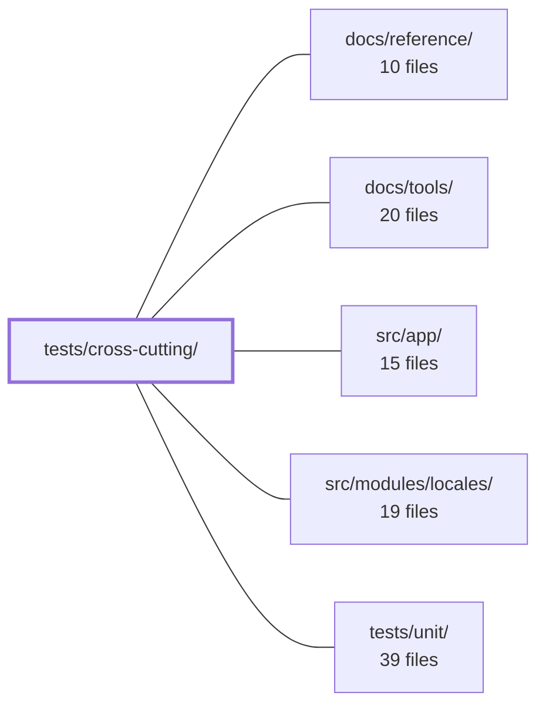

---
tags:
  - 2repo
  - 2repo/module
  - project/boilerplate-vue-frontend
type: module
module: tests/cross-cutting/
files: 11
updated: 2026-08-30T17:12:43.182960+00:00
---

# tests/cross-cutting/

## Purpose

This module holds cross-cutting, structural tests that enforce invariants spanning the entire application or multiple modules simultaneously. They are "meta" checks on the codebase's shape—file placement, wiring conventions, coverage/mutation scope alignment, and inter-repo contracts—that no single module's unit test can express because the invariant is *about* the relationship between parts, not about any one part's behavior.

## Key parts

- **Module-structure guards** — `registry.spec.ts` (navigation links, icons, route names, i18n key collisions for every enabled module), `module-file-shapes.spec.ts` (fixed catalogue of allowed file names per module), `store-location.spec.ts` (Pinia stores must sit where the coverage glob expects them), `published-language.spec.ts` (barrel exports must match actual sibling imports), `a11y-coverage.spec.ts` (every route has a corresponding a11y sweep and vice-versa).
- **Component & form conventions** — `form-idiom.spec.ts` (every form uses `useAppForm`, a single show-errors flag, and a `formElement` focus target), `badge-name.spec.ts` (every `<v-badge>` carries an accessible label or `aria-hidden`).
- **Tooling / config consistency** — `coverage-and-mutate-scope.spec.ts` (coverage-floored files must also be in Stryker's mutate scope), `mutation-safe-imports.spec.ts` (dynamic import specifiers in mutate scope carry `Stryker disable` directives).
- **Cross-concern integration** — `schemas-i18n.spec.ts` (Zod error-thunk resolution and locale re-translation), `backend-pairing.spec.ts` (frontend module map ↔ `boilerplate-node-backend` domain map).

## How it connects

- **`src/app/`** — `registry.spec.ts` and `a11y-coverage.spec.ts` read the shell router and app-level navigation to verify that routes, links, and icons are consistent; `form-idiom.spec.ts` and `badge-name.spec.ts` scan app-wide component sources for convention violations.
- **`src/modules/locales/`** — `schemas-i18n.spec.ts` exercises the i18n × Zod `translate`-thunk mechanism and locale re-translation; `registry.spec.ts` checks that i18n dictionary keys across modules do not collide.
- **`tests/unit/`** — These specs deliberately cover the gaps unit tests structurally cannot: a missing spec file, a misplaced store, a dead barrel export, or a cross-repo contract drift produces no assertion in any per-module unit suite. This module turns those silent gaps into hard failures.
- **`docs/tools/`** — The tooling-consistency specs (`coverage-and-mutate-scope`, `mutation-safe-imports`) validate `vitest.config.ts` and `stryker.config.json`, the configs those docs describe and that CI operators tune.
- **`docs/reference/`** — `backend-pairing.spec.ts` pins the frontend-to-backend domain mapping that the reference documentation narrates; a drift here would make the docs stale without either build noticing.

## Where to start

Read **`registry.spec.ts`** first: it iterates the module registry generically and shows the module's core pattern—asserting invariants that are true of *all* enabled modules without naming any one domain. Then read **`a11y-coverage.spec.ts`** to see the module's distinctive philosophy made concrete: it fails because a spec *doesn't exist*, catching a gap that no runtime tool or unit test would ever report.

## Connected modules

[[boilerplate-vue-frontend_docs_reference|docs/reference/]] · [[boilerplate-vue-frontend_docs_tools|docs/tools/]] · [[boilerplate-vue-frontend_src_app|src/app/]] · [[boilerplate-vue-frontend_src_modules_locales|src/modules/locales/]] · [[boilerplate-vue-frontend_tests_unit|tests/unit/]]

## Files
- `tests/cross-cutting/a11y-coverage.spec.ts` — A Vitest spec that performs a **structural** (source-reading) check: every route declared in a module's `routes.ts` (or the shell router) must be visited by that module's `a11y.cy.ts` sweep, and vice-versa. It does not run axe or open a browser; it catches the absence of a sweep that a runtime tool would never report because a missing spec produces no assertions. A new page without a sweep cannot be merged.
- `tests/cross-cutting/backend-pairing.spec.ts` — A cross-repository contract test that pins every enabled frontend module to its counterpart(s) in `boilerplate-node-backend`. It exists because nothing in either build fails when the two module maps drift; this file is the single, explicit record of which backend domain answers each frontend domain, and why the mapping is non-obvious where it is.
- `tests/cross-cutting/badge-name.spec.ts` — Cross-cutting accessibility guard that enforces a single invariant across the entire app: every `<v-badge>` rendered in a `.vue` source file must carry a `label`, `:label`, `aria-label`, `:aria-label`, or `aria-hidden` attribute. It exists because the missing attribute is visually invisible, no linter knows what a Vuetify badge is, and the three call sites that render badges are spread across components with no shared parent.
- `tests/cross-cutting/coverage-and-mutate-scope.spec.ts` — Cross-cutting invariant test that enforces one directional rule between two config files: every file covered by a per-file coverage floor in `vitest.config.ts` must also fall within Stryker's mutation scope in `stryker.config.json`. The reverse is deliberately not asserted. Without this spec the relationship is maintained only by convention, and a floored-but-unmutated file would silently guard execution without ever verifying correctness.
- `tests/cross-cutting/form-idiom.spec.ts` — A cross-cutting, source-scanning test that enforces one invariant: every form in the app is wired the same way. It guards against the three silent omissions (missing `useAppForm` indirection, a duplicate "show errors" flag, or a missing `formElement` focus target) that individually produce no hard failure but leave screen-reader users stranded after a failed submit. Thirteen forms once shipped with one or more of these gaps; this file exists so that regression is a test failure, not a silent UX gap.
- `tests/cross-cutting/module-file-shapes.spec.ts` — Enforces that every file inside an enabled module folder matches a known shape in a fixed catalogue. A file with no matching entry causes the test to fail, making it a single point where someone must consciously justify (or reject) a new file name before it becomes invisible. Complements `store-location.spec.ts`, which only polices store filenames and lets stray files slip through.
- `tests/cross-cutting/mutation-safe-imports.spec.ts` — Guards against Stryker's template-literal mutator turning dynamic import specifiers (`import(\`...\`)`, `import.meta.glob('...')`) into empty strings, which causes the instrumented build to fail in the dry-run with an unhelpful sandbox-path error. Every such specifier inside the `mutate` scope must carry a `Stryker disable` comment directive directly above it; this test enforces that.
- `tests/cross-cutting/published-language.spec.ts` — A cross-cutting static-analysis test that enforces one structural invariant across all modules under `src/modules`: a module's `index.ts` barrel may publish **only** the names that sibling modules actually import. It exists to catch dead exports (names outliving their reason) and pointless barrels (a module that publishes to no one) as ordinary test failures, rather than letting them rot silently.
- `tests/cross-cutting/registry.spec.ts` — Cross-cutting test that validates structural invariants **every** enabled module must satisfy, without ever naming a specific domain. It iterates the module registry generically so that removing a module simply shrinks the test surface rather than breaking the spec. It exists to catch silent, non-throwing regressions: dangling navigation links, missing icons or route names, and i18n dictionary key collisions that would otherwise surface only as a human noticing raw keys on screen.
- `tests/cross-cutting/schemas-i18n.spec.ts` — Cross-cutting integration test for the i18n × Zod mechanism: it proves that a schema whose error messages are thunks (`() => translate(…)`) resolves in the active locale at parse time, and that `revalidateOn` in `useStructureFormValidation` re-translates errors already rendered on screen after a locale switch. It uses a synthetic, domain-agnostic schema so it survives the deletion of any single module.
- `tests/cross-cutting/store-location.spec.ts` — Cross-cutting structural test that enforces where Pinia stores are declared within each module. It exists because `vitest.config.ts` floors domain-store coverage with a fixed glob; a store in any other location silently drops out of coverage without lowering the green number. This test makes that violation loud.

---
[[boilerplate-vue-frontend_INDEX|← boilerplate-vue-frontend index]]
