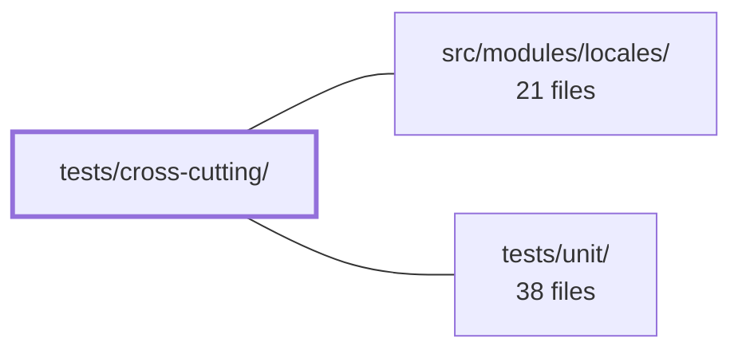

---
tags:
  - 2repo
  - 2repo/module
  - project/boilerplate-vue-frontend
type: module
module: tests/cross-cutting/
files: 11
updated: 2026-09-03T11:00:39.306348+00:00
---

# tests/cross-cutting/

## Purpose

A collection of domain-agnostic, static-analysis specs that enforce app-wide invariants—file shapes, accessibility attributes, i18n wiring, coverage/mutation config consistency, and module-to-module contracts—without launching a browser or importing any single domain module. Each spec is written to survive the deletion of any individual module: it iterates the enabled-module registry or scans source text, so a new page or file that violates a rule causes a merge-blocking failure rather than a silent gap.

## Key parts

- **Accessibility guards** — `a11y-coverage.spec.ts` asserts every declared route has a corresponding `a11y.cy.ts` sweep; `badge-name.spec.ts` verifies every `<v-badge>` carries an accessible-label attribute.
- **Module structure & shape** — `module-file-shapes.spec.ts` checks every file in a module folder matches a known catalogue entry; `store-location.spec.ts` enforces the `store.ts` vs `stores/*.ts` convention; `published-language.spec.ts` flags dead barrel exports; `registry.spec.ts` validates navigation entries, i18n key ownership, and locale completeness across all enabled modules.
- **Cross-repo contract** — `backend-pairing.spec.ts` pins each enabled frontend module to its counterpart(s) in `boilerplate-node-backend`.
- **Form & i18n invariants** — `form-idiom.spec.ts` inspects `.vue` source for the three required `useStructureFormValidation` answers; `schemas-i18n.spec.ts` proves Zod error-thunk resolution and locale re-translation with a synthetic schema.
- **Build-tooling consistency** — `coverage-and-mutate-scope.spec.ts` asserts every coverage-floored file is inside Stryker's mutation scope; `mutation-safe-imports.spec.ts` requires `Stryker disable` directives above dynamic import specifiers to prevent template-literal mutation from breaking the dry-run build.

## How it connects

- **`src/modules/locales/`** — `registry.spec.ts` iterates every module's i18n dictionaries for key collisions and locale completeness, and `schemas-i18n.spec.ts` exercises the translate-thunk mechanism that the locales module provides. These specs treat the locales infrastructure as a contract to verify, not a unit under test in isolation.
- **`tests/unit/`** — Unit tests validate per-component behavior in isolation; this module fills the gap that unit tests structurally cannot: rules that span multiple modules, config files, or repositories. A component can pass every unit test while still violating the form idiom, missing an a11y sweep, or publishing a dead barrel export.

## Where to start

Read **`registry.spec.ts`** first—it establishes the canonical pattern (iterate `enabledModules`, assert invariants, stay domain-agnostic) that most other specs in this directory follow. Then read **`a11y-coverage.spec.ts`** for the clearest illustration of *why* the module exists: a single, human-readable rule ("every route must have a sweep") turned into a merge-blocking assertion that would be invisible in any per-module test suite.

## Connected modules

[[boilerplate-vue-frontend_src_modules_locales|src/modules/locales/]] · [[boilerplate-vue-frontend_tests_unit|tests/unit/]]

## Files
- `tests/cross-cutting/a11y-coverage.spec.ts` — A structural guard that asserts, without launching a browser, that every route the app declares has a corresponding path visited by its accessibility sweep (`a11y.cy.ts`). It exists because the sweeps live inside each domain module (so a deleted module's coverage disappears with it), and there is no single human-maintained list of "what is covered." This spec turns that absence into a failing assertion: a new page with no sweep cannot merge.
- `tests/cross-cutting/backend-pairing.spec.ts` — A cross-repository contract test that pins every enabled frontend module to its counterpart(s) in `boilerplate-node-backend`. It exists because nothing in either build fails when the two module maps drift; this file is the single, explicit record of which backend domain answers each frontend domain, and why the mapping is non-obvious where it is.
- `tests/cross-cutting/badge-name.spec.ts` — Cross-cutting accessibility guard that enforces a single invariant across the entire app: every `<v-badge>` rendered in a `.vue` source file must carry a `label`, `:label`, `aria-label`, `:aria-label`, or `aria-hidden` attribute. It exists because the missing attribute is visually invisible, no linter knows what a Vuetify badge is, and the three call sites that render badges are spread across components with no shared parent.
- `tests/cross-cutting/coverage-and-mutate-scope.spec.ts` — Cross-cutting invariant test that enforces one directional rule between two config files: every file covered by a per-file coverage floor in `vitest.config.ts` must also fall within Stryker's mutation scope in `stryker.config.json`. The reverse is deliberately not asserted. Without this spec the relationship is maintained only by convention, and a floored-but-unmutated file would silently guard execution without ever verifying correctness.
- `tests/cross-cutting/form-idiom.spec.ts` — Cross-cutting spec that enforces a uniform "form idiom" across every Vue component that calls `useStructureFormValidation`. It replaces the removed `useAppForm` composable as the mechanism that *forces* three required call-site answers (`revalidateOn`, `invalidFieldSelector`, `onInvalid`), a single source of truth for error-visibility state, and a focus target for page-level forms. It works by reading `.vue` source files from disk and inspecting their text, not by importing or rendering components.
- `tests/cross-cutting/module-file-shapes.spec.ts` — Enforces that every file inside an enabled module folder matches a known shape in a fixed catalogue. A file with no matching entry causes the test to fail, making it a single point where someone must consciously justify (or reject) a new file name before it becomes invisible. Complements `store-location.spec.ts`, which only polices store filenames and lets stray files slip through.
- `tests/cross-cutting/mutation-safe-imports.spec.ts` — Guards against Stryker's template-literal mutator turning dynamic import specifiers (`import(\`...\`)`, `import.meta.glob('...')`) into empty strings, which causes the instrumented build to fail in the dry-run with an unhelpful sandbox-path error. Every such specifier inside the `mutate` scope must carry a `Stryker disable` comment directive directly above it; this test enforces that.
- `tests/cross-cutting/published-language.spec.ts` — A cross-cutting static-analysis test that enforces one structural invariant across all modules under `src/modules`: a module's `index.ts` barrel may publish **only** the names that sibling modules actually import. It exists to catch dead exports (names outliving their reason) and pointless barrels (a module that publishes to no one) as ordinary test failures, rather than letting them rot silently.
- `tests/cross-cutting/registry.spec.ts` — A domain-agnostic Vitest spec that validates structural invariants across **all** enabled modules in the registry: navigation entries must reference declared routes, carry required fields, and live in known sections; i18n dictionaries must not have unowned key collisions; and every module must ship every declared locale. It iterates `enabledModules` rather than naming any domain, so deleting a module simply removes one iteration without breaking the spec.
- `tests/cross-cutting/schemas-i18n.spec.ts` — Cross-cutting integration test for the i18n × Zod mechanism: it proves that a schema whose error messages are thunks (`() => translate(…)`) resolves in the active locale at parse time, and that `revalidateOn` in `useStructureFormValidation` re-translates errors already rendered on screen after a locale switch. It uses a synthetic, domain-agnostic schema so it survives the deletion of any single module.
- `tests/cross-cutting/store-location.spec.ts` — Cross-cutting structural test that enforces a single convention: every Pinia store in `src/modules/*` must live in either `store.ts` (one store) or `stores/*.ts` (multiple stores), and no module may mix both shapes. It exists because `vitest.config.ts` floors domain stores with a fixed glob; a store placed anywhere else simply drops out of coverage silently, and the green percentage quietly shrinks.

---
[[boilerplate-vue-frontend_INDEX|← boilerplate-vue-frontend index]]
