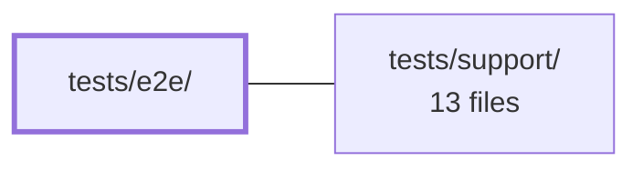

---
tags:
  - 2repo
  - 2repo/module
  - project/boilerplate-vue-frontend
type: module
module: tests/e2e/
files: 10
updated: 2026-09-03T11:00:50.206818+00:00
---

# tests/e2e/

## Purpose

End-to-end test suite for the application, written in Cypress. It exercises the full user-facing experience in a real browser—purchasing, navigation, accessibility, locale switching, file uploads, and visual stability—covering scenarios that unit or integration tests cannot reach because they depend on rendered DOM, focus management, and cross-session state.

## Key parts

- **`specs/journey.cy.ts`** — Single-session walk through the complete customer lifecycle (browse → sign in → buy → cancel → restock). The highest-level spec; establishes that state persists across navigation.
- **`specs/commerce.cy.ts`** — Two-session commerce lifecycle (customer purchase/decline/retry/cancel, then admin ship/deliver/inventory). Self-contained tests exercising only API-permitted transitions.
- **`specs/storefront.cy.ts`** — Pins the three customer-facing surfaces: facet chips, stock-gated add-to-cart, and order-page actions. Assertions lean on API invariants rather than a fixed dataset.
- **`specs/uploads.cy.ts`** — Round-trip image-upload test across product create/edit and user create, asserting on the rendered `` rather than wire details.
- **`specs/a11y.cy.ts`** — Accessibility sweep for "shell" pages (landing, prose pages, error page, shared chrome) that no domain module owns.
- **`specs/keyboard.cy.ts`** — Browser-level focus-order, focus-trap, and keystroke-activation checks that static axe/DOM audits cannot cover.
- **`specs/locale.cy.ts`** — Exercises the `:locale` segment, guard, dynamic dictionary loading, `<html lang>`, and persisted preference—the only spec that visits a non-English path.
- **`specs/resilience.cy.ts`** — Structural invariants (routes render, empty states appear, pagination matches rows) deliberately decoupled from specific dataset values.
- **`visual/visual.cy.ts`** — Screenshot baselines for the same ownerless shell pages covered by `a11y.cy.ts`; runs as a reporting tool, not a CI gate.
- **`fixtures/not-an-image.txt`** — Deliberate negative fixture used to verify the app rejects non-image uploads.

## How it connects

- **`tests/support/`** — Provides the shared Cypress helpers, custom commands, and intercept utilities that every spec in this module imports. The e2e specs are the consumers; support is the provider of reusable test infrastructure (auth setup, API stubs, etc.).

## Where to start

Read **`specs/journey.cy.ts`** first: it narrates the app's core customer flow end-to-end in one continuous session, so you immediately see what the product does and how the specs interact with it. Then glance at **`specs/resilience.cy.ts`** to understand the "structural vs. value-pinning" testing philosophy that shapes the rest of the suite.

## Connected modules

[[boilerplate-vue-frontend_tests_support|tests/support/]]

## Files
- `tests/e2e/fixtures/not-an-image.txt` — A negative test fixture containing plain text (literally "not an image, on purpose") used in end-to-end tests to verify that the application correctly rejects or handles inputs that are not valid images. It exists as a deliberate contrast to `sample-image.png`.
- `tests/e2e/specs/a11y.cy.ts` — Accessibility sweep for the app "shell" — routes and chrome that belong to no domain module. Module-owned routes carry their own a11y spec alongside the module so that deleting a domain deletes its coverage; this file is the residual home for the landing page, four prose pages, the error page, and the shared chrome (app bar, drawer, language menu, theme toggle, account/admin menus) that every page inherits.
- `tests/e2e/specs/commerce.cy.ts` — End-to-end spec for the full commerce lifecycle across two sessions: the customer purchases, watches a declined payment bounce back, retries successfully, and cancels a PAID order; the admin then advances a paid order through shipping, the courier delivers, and the inventory ledger records the receipt with a reason. Each test is self-contained (no cross-test state) and exercises only transitions the API actually permits.
- `tests/e2e/specs/journey.cy.ts` — End-to-end test that walks the full customer lifecycle in one continuous session: a guest browses and hits the sign-in wall, then a signed-in customer filters products, buys, checks out, cancels the order, and confirms the shelf stock has recovered. It exists to prove the app's state persists across navigation (one shared session) and that the cancel→restock round-trip is visible to the user.
- `tests/e2e/specs/keyboard.cy.ts` — Cypress E2E spec that verifies keyboard-interactive accessibility behaviours the app cannot be tested for via static axe/DOM checks: focus order, focus movement after navigation, focus trapping in overlays, and activation via real keystrokes (Tab, Enter, Space, Escape, ArrowDown). Each case guards a specific implementation in the app source that no unit test can exercise because it requires a browser-level focus traversal.
- `tests/e2e/specs/locale.cy.ts` — Cypress e2e spec that exercises the entire locale layer end-to-end: the `:locale` URL segment, the `localeChoice` guard, dynamic dictionary loading, `<html lang>`, per-key fallback, and the persisted language preference. It exists because every other spec only visits `/en/…`, meaning the locale machinery was untested in any non-English language.
- `tests/e2e/specs/resilience.cy.ts` — Cypress E2E spec that asserts the app *survives* its current demo dataset without naming any specific value. Where sibling specs pin exact counts, titles, and prices, this file checks structural invariants: every reachable route renders without uncaught console noise or horizontal overflow, empty lists show an empty state rather than breaking, and the pagination control agrees with the rows actually on screen. It intentionally avoids asserting "how many" so that a changed count is a signal in the value-pinning specs, not noise here.
- `tests/e2e/specs/storefront.cy.ts` — Cypress e2e suite that pins the three customer-facing storefront surfaces added by the release: facet chips on the product listing, stock gating + add-to-cart on the product page, and the cancel / buy-again actions on the order page. The assertions are designed so that the *API's own invariants* (public-scope facets, the stock gate, the single order-write) are what the page must honour, rather than hard-coding a specific dataset.
- `tests/e2e/specs/uploads.cy.ts` — End-to-end Cypress spec that exercises the image-upload path across the three surfaces that accept a file: product edit, product create, and user create. It verifies the full round-trip (local preview → multipart submit → server-stored URL rendered back) without inspecting the wire directly; instead it asserts on the consequence (the `` becomes an API-served path) so the test is transport-agnostic.
- `tests/e2e/visual/visual.cy.ts` — Visual regression tests for the application "shell" — the pages that don't belong to any domain module (landing page, static prose pages, error page). Because module-owned screens keep their baselines alongside their module, these ownerless screens are the ones captured here. The suite is a reporting tool, not a CI gate.

---
[[boilerplate-vue-frontend_INDEX|← boilerplate-vue-frontend index]]
