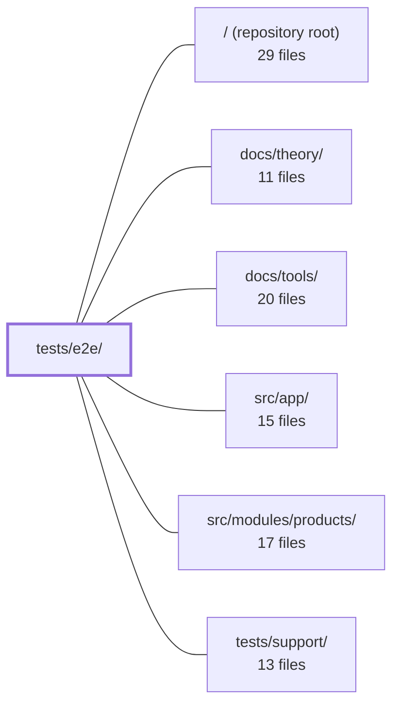

---
tags:
  - 2repo
  - 2repo/module
  - project/boilerplate-vue-frontend
type: module
module: tests/e2e/
files: 11
updated: 2026-08-30T17:12:56.016672+00:00
---

# tests/e2e/

## Purpose

`tests/e2e/` houses the repository's browser-level (Cypress) end-to-end test suite. It validates the application as a user would experience it: routing, authentication flows, commerce transactions, locale handling, keyboard accessibility, image uploads, and visual fidelity of the application shell. These specs run against a live (or dev) server and assert on rendered DOM, network consequences, and session state rather than unit-level internals.

## Key parts

- **Shell & chrome specs** — `specs/home.cy.ts` (public route rendering), `specs/a11y.cy.ts` (axe accessibility sweep of unowned routes), `specs/keyboard.cy.ts` (Tab/focus/Escape behaviour via CDP), and `visual/visual.cy.ts` (visual-regression baselines for home and 404). Together they guard the cross-cutting UI that has no single owning module.
- **Commerce & user journey specs** — `specs/journey.cy.ts` (full guest-to-customer arc in one session), `specs/commerce.cy.ts` (decline/retry/cancel + admin order lifecycle), and `specs/storefront.cy.ts` (facet chips, stock gate, add-to-cart, order actions). Each pins a different layer of the buying flow.
- **Cross-cutting concerns** — `specs/locale.cy.ts` (the entire `:locale` machinery in a non-English language), `specs/resilience.cy.ts` (structural health: no overflow, no silent errors, empty states, pagination), and `specs/uploads.cy.ts` (multipart image upload across every form).
- **Fixtures** — `fixtures/not-an-image.txt`, a deliberate non-image file used to verify rejection of invalid upload inputs.

## How it connects

- **`src/app/`** — the application under test. Shell specs (home, a11y, keyboard, visual) exercise its routing, layout, and chrome directly; locale and resilience specs verify app-level guards and rendering invariants.
- **`src/modules/products/`** — the products domain exercised by the commerce, storefront, uploads, and resilience specs. Those specs assert on the frontend consequence of the products API (stock counts, facet chips, image previews) without re-testing backend logic.
- **`tests/support/`** — shared Cypress setup (custom commands, fixture helpers, server configuration) that every spec in this directory imports before running.
- **`/` (repository root)** — provides the project manifest and scripts (`cypress run`) that launch this suite, as well as shared configuration consumed by the specs.

## Where to start

1. **`specs/journey.cy.ts`** — a single, self-contained test that walks the entire app as a real user (browse → sign-in → buy → cancel → stock restore). Reading it gives the broadest view of routing, auth, commerce, and session state in one pass.
2. **`tests/support/`** (the connected module) — to understand the custom commands, fixture setup, and server bootstrap that every spec here relies on before diving into individual spec files.

## Connected modules

[[boilerplate-vue-frontend_ROOT|/ (repository root)]] · [[boilerplate-vue-frontend_docs_theory|docs/theory/]] · [[boilerplate-vue-frontend_docs_tools|docs/tools/]] · [[boilerplate-vue-frontend_src_app|src/app/]] · [[boilerplate-vue-frontend_src_modules_products|src/modules/products/]] · [[boilerplate-vue-frontend_tests_support|tests/support/]]

## Files
- `tests/e2e/fixtures/not-an-image.txt` — A negative test fixture containing plain text (literally "not an image, on purpose") used in end-to-end tests to verify that the application correctly rejects or handles inputs that are not valid images. It exists as a deliberate contrast to `sample-image.png`.
- `tests/e2e/specs/a11y.cy.ts` — Accessibility sweep for the "shell" routes — the landing page, prose pages (about, faq, terms, privacy), the 404 and error pages, and the shared chrome (app bar, drawer, language menu, theme toggle, account/admin menus). These routes have no owning module, so their a11y coverage lives here rather than inside a module's test directory. Only `serious` and `critical` axe violations fail the run; lighter findings are logged to `reports/a11y/`.
- `tests/e2e/specs/commerce.cy.ts` — End-to-end test covering the two core commerce arcs: a customer buying with express shipping, experiencing a declined payment (demo decline card `4000 0000 0000 0002`), retrying successfully (`4242 4242 4242 4242`), and cancelling a paid order; and an admin advancing a paid order through `processing → shipped`, verifying the shipment panel / tracking email / courier delivery button, then recording a delivery receipt in the inventory ledger. Each `it` builds its own state and never reloads mid-arc.
- `tests/e2e/specs/home.cy.ts` — Cypress end-to-end spec that verifies all public (unauthenticated) routes render their expected pages: the locale-prefixed home, the redirect from `/`, the products list, login, signup, and the 404 error page. It exists to guard against routing regressions and broken public-page layouts.
- `tests/e2e/specs/journey.cy.ts` — A single end-to-end test that walks the shop as a real user would: a guest browses and hits the sign-in wall, then a logged-in customer filters, buys, checks out, cancels the order, and confirms stock is restored. After the one deliberate login reload, every subsequent navigation goes through in-app links and buttons—no deep `cy.visit`—so surviving session state across the journey is itself part of the assertion.
- `tests/e2e/specs/keyboard.cy.ts` — Cypress E2E spec that verifies keyboard accessibility behaviours (Tab order, focus management, focus trapping, Escape semantics) that static analysis tools like axe cannot observe because they cannot press a key. Each case exercises a real keystroke through Chrome DevTools Protocol to confirm the shell's keyboard contract holds.
- `tests/e2e/specs/locale.cy.ts` — Cypress e2e spec that exercises the entire locale layer end-to-end: the `:locale` URL segment, the `localeChoice` guard, dynamic dictionary loading, `<html lang>`, per-key fallback, and the persisted language preference. It exists because every other spec only visits `/en/…`, meaning the locale machinery was untested in any non-English language.
- `tests/e2e/specs/resilience.cy.ts` — Cypress e2e spec that verifies the application survives *any* dataset without visible breakage. Unlike the value-pinning specs (exact counts, titles, prices), this file asserts only structural health: pages render, log nothing unexpected, do not overflow horizontally, handle empty states, and keep pagination consistent with visible rows. It exists to catch the class of bugs a fixed-dataset spec cannot see—broken images, silent TypeErrors, a table 300 px past the viewport.
- `tests/e2e/specs/storefront.cy.ts` — Cypress e2e spec covering the three storefront surfaces added in the customer release: catalogue facet chips, product-page stock gate and add-to-cart, and order-page cancel / buy-again. Its role is to pin the *frontend* honouring invariants the API already enforces (public-scope facets, the stock gate, the single order write), rather than re-testing backend logic.
- `tests/e2e/specs/uploads.cy.ts` — Cypress end-to-end spec that verifies the full image-upload flow across every form in the app (product edit, product create, user create, signup). It asserts on the *consequence* of a multipart request — a server-returned `/images/<uuid>.<ext>` path appearing in the preview's `src` — rather than intercepting the request itself, so the assertions stay valid regardless of transport details.
- `tests/e2e/visual/visual.cy.ts` — Visual regression test for the application shell — the two screens (home/landing page and the 404 error page) that don't belong to any domain module. All other visual baselines live under `src/modules/<name>/tests/e2e/__snapshots__/`; this file captures the orphaned screens that have no owning module.

---
[[boilerplate-vue-frontend_INDEX|← boilerplate-vue-frontend index]]
