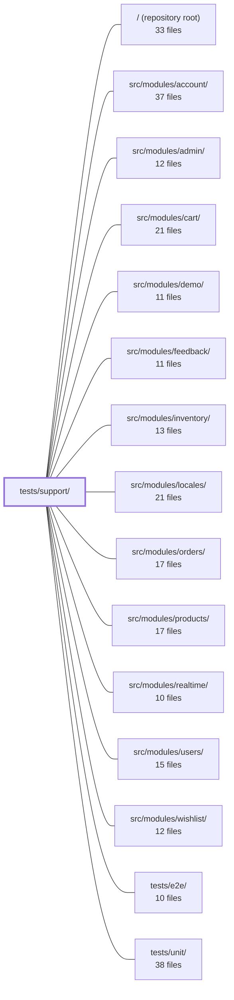

---
tags:
  - 2repo
  - 2repo/module
  - project/boilerplate-vue-frontend
type: module
module: tests/support/
files: 13
updated: 2026-09-03T11:01:03.865598+00:00
---

# tests/support/

## Purpose

`tests/support/` is the shared-infrastructure layer for the project's two test suites (Cypress E2E and Vitest unit). It centralises custom commands, fixtures, accessibility and visual-regression mechanics, environment polyfills, and type-cast helpers so that individual spec files can stay thin and declarative rather than repeating setup boilerplate.

## Key parts

**E2E wiring & commands**
- `e2e/` — `e2e.ts` is the global support file loaded before every spec; it registers plugins, commands, fixtures, and a shared `beforeEach` reset. `commands.ts` declares the custom Cypress command set and the `visit` overwrite. `fixtures.ts` provides role-based subject lookup (e.g. "an in-stock product") resolved against the running backend at runtime. `accounts.ts` is the single source of truth for demo credentials. `admin-api-task.ts` exposes a Node-side authenticated admin API call that bypasses the browser session.

**E2E accessibility**
- `e2e/a11y-sweep.ts` — shared axe-sweep helper; each module's `a11y.cy.ts` supplies its route list while the mechanics (viewport, theme, network settling, axe invocation) live here.
- `e2e/a11y-task.ts` — Node-side task that persists every axe finding to `reports/a11y/` so threshold tightening starts from recorded data.

**E2E visual regression**
- `e2e/visual-sweep.ts` — shared "visit → wait → freeze → snapshot" pass over a caller-supplied route list.
- `e2e/visual-task.ts` — hand-rolled `compareSnapshot` logic (baseline read/write, tolerance thresholds) living in the Node process.

**Unit-test environment**
- `unit/setup.ts` — polyfills browser APIs missing from jsdom so Vuetify components render; deliberately free of app imports to preserve `vi.mock` hoisting.
- `unit/jsdom-quiet-css.environment.ts` — custom Vitest environment that suppresses Vuetify's `@media`-in-`@layer` CSS parse errors while keeping computed-style assertions available.
- `unit/wire-modules.ts` — single-call helper that injects response schemas and i18n dictionaries the same way the composition root does at boot, so unit tests that touch those subsystems don't silently pass without exercising them.
- `stub.ts` — one named cast function for hand-built test doubles, eliminating inline `as unknown as T` double-casts in spec files.

## How it connects

- **`tests/e2e/` and `tests/unit/`** are the spec directories that *consume* every helper and command defined here; they contain no infrastructure of their own.
- **Each feature module** (`src/modules/account/`, `admin/`, `cart/`, `inventory/`, `orders/`, `products/`, `wishlist/`, etc.) contributes routes and domain objects that `a11y-sweep.ts`, `visual-sweep.ts`, and `fixtures.ts` operate on at runtime. The sweep helpers were split from a former central spec precisely so a deleted module would no longer leave orphaned routes in a shared list.
- **`src/modules/locales/`** is the provider of i18n dictionaries that `unit/wire-modules.ts` injects into unit-test contexts, mirroring the boot-time composition.
- The repository root holds the global test configuration (Cypress config, Vitest config) that points at the files in this directory.

## Where to start

1. **`tests/support/e2e/e2e.ts`** — it is the single entry point that shows how plugins, commands, fixtures, and the reset hook are assembled; reading it first makes every other E2E support file self-evident.
2. **`tests/support/unit/wire-modules.ts`** — it explains the one non-obvious constraint in the unit-test world (module schemas and locale dictionaries must be injected manually), and once that is clear the rest of the unit support files are straightforward polyfill/cast utilities.

## Connected modules

[[boilerplate-vue-frontend_ROOT|/ (repository root)]] · [[boilerplate-vue-frontend_src_modules_account|src/modules/account/]] · [[boilerplate-vue-frontend_src_modules_admin|src/modules/admin/]] · [[boilerplate-vue-frontend_src_modules_cart|src/modules/cart/]] · [[boilerplate-vue-frontend_src_modules_demo|src/modules/demo/]] · [[boilerplate-vue-frontend_src_modules_feedback|src/modules/feedback/]] · [[boilerplate-vue-frontend_src_modules_inventory|src/modules/inventory/]] · [[boilerplate-vue-frontend_src_modules_locales|src/modules/locales/]] · [[boilerplate-vue-frontend_src_modules_orders|src/modules/orders/]] · [[boilerplate-vue-frontend_src_modules_products|src/modules/products/]] · [[boilerplate-vue-frontend_src_modules_realtime|src/modules/realtime/]] · [[boilerplate-vue-frontend_src_modules_users|src/modules/users/]] · [[boilerplate-vue-frontend_src_modules_wishlist|src/modules/wishlist/]] · [[boilerplate-vue-frontend_tests_e2e|tests/e2e/]] · [[boilerplate-vue-frontend_tests_unit|tests/unit/]]

## Files
- `tests/support/e2e/a11y-sweep.ts` — Shared helper that runs a single axe accessibility sweep over a caller-supplied list of routes at a given authentication level. It exists so each module's `a11y.cy.ts` spec can own *which* routes to audit while the sweep mechanics (viewport, theme, network settling, prepare steps, axe invocation) live in one place. The split from the former central spec was driven by a deleted module leaving orphaned routes in the shared list.
- `tests/support/e2e/a11y-task.ts` — Node-side Cypress task that persists axe accessibility findings to a JSON file per spec under `reports/a11y/`. The browser-side `cy.checkPageA11y()` gates on `serious`/`critical` and merely logs lighter findings, which vanish after the run. This task writes every finding to disk so that a future threshold tightening starts from recorded data rather than rediscovery.
- `tests/support/e2e/accounts.ts` — Single source of truth for the two demo accounts (user & admin) used across all E2E specs. Centralizing credentials here prevents silent drift between UI-login flows, server-side API calls, and the backend seed script.
- `tests/support/e2e/admin-api-task.ts` — Provides the `adminApi` Cypress task: an authenticated admin-API call executed in Node (outside the browser) so that the page's own refresh cookie and session state remain untouched. It exists so test fixtures can provision or modify backend resources directly, without coupling to the browser's authentication lifecycle.
- `tests/support/e2e/commands.ts` — Declares and implements the full set of custom Cypress commands used by the e2e test suite, plus the `visit` overwrite that guards against stale-window races on successive navigations. It also injects `__E2E_API_URL` into the page's `window` so a single built bundle can be pointed at any shard's backend.
- `tests/support/e2e/e2e.ts` — Cypress global support file, automatically loaded before every e2e spec. It wires up third-party plugins (a11y, real keyboard events), registers custom commands and fixtures, and applies a shared `beforeEach` reset so tests start from a clean state.
- `tests/support/e2e/fixtures.ts` — Defines a set of Cypress custom commands that give specs a **role-based** way to find or create test subjects (products, orders, accounts) without hard-coding backend-specific IDs or titles. The design principle: a spec names *what it needs* (e.g. "an in-stock product", "a cancellable order") and the file resolves that against the running backend at runtime, keeping specs portable across backends.
- `tests/support/e2e/visual-sweep.ts` — A single shared helper (`sweepVisual`) that drives one visual-regression pass over a list of screens at a given auth level. It exists so every module's visual spec can reuse the same "visit → wait for real content → freeze → snapshot" sequence without duplicating setup logic or hard-coding domain-specific routes.
- `tests/support/e2e/visual-task.ts` — Implements the `compareSnapshot` logic behind `cy.compareSnapshot()`. It runs in Cypress' Node process (not the browser) so it can read/write baseline PNG files on disk. Written by hand instead of using a plugin so the tolerance thresholds and missing-baseline behaviour are visible and editable in one place rather than hidden behind plugin options.
- `tests/support/stub.ts` — A single sanctioned cast helper for hand-built test stubs. Because test doubles can never structurally satisfy the full framework type they stand in for, some cast is unavoidable; this file consolidates that cast into one named function so that the raw `as unknown as T` double-cast is never written inline in test suites.
- `tests/support/unit/jsdom-quiet-css.environment.ts` — A custom Vitest environment (`jsdom-quiet-css`) that wraps the built-in jsdom environment to suppress Vuetify's `@media`-in-`@layer` CSS parsing errors while keeping CSS fully enabled. It exists so test output stays readable without sacrificing the ability to assert on computed styles.
- `tests/support/unit/setup.ts` — Vitest setup file that polyfills browser APIs missing from jsdom so Vuetify components (v-app-bar, v-number-input, v-overlay, etc.) can render in unit tests. It is deliberately free of any application imports to avoid breaking `vi.mock` hoisting semantics.
- `tests/support/unit/wire-modules.ts` — Provides a single-call helper for unit tests that exercise module-registered subsystems (response-schema validation, i18n dictionaries) without booting the full app. Because `infrastructure` is the bottom layer and cannot import `@/modules`, tests must inject the collected schemas and locale contributors the same way the composition root does at boot; without this wiring, i18n keys render as their own names and response schemas go unvalidated—a silent pass that looks like a green test but verifies nothing.

---
[[boilerplate-vue-frontend_INDEX|← boilerplate-vue-frontend index]]
