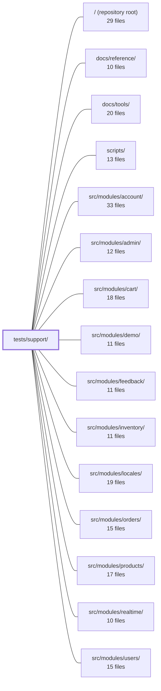

---
tags:
  - 2repo
  - 2repo/module
  - project/boilerplate-vue-frontend
type: module
module: tests/support/
files: 13
updated: 2026-08-30T17:13:10.213457+00:00
---

# tests/support/

## Purpose

Shared, reusable infrastructure for the project's two test suites—Cypress E2E and Vitest unit—providing custom commands, fixture helpers, sweep drivers, Node-side tasks, and environment polyfills so that individual spec files stay declarative, profile-agnostic, and free of duplicated setup logic.

## Key parts

- **E2E entry & command registry** — `e2e/e2e.ts` (global support file loaded before every spec: plugins, command registration, `beforeEach` reset) and `e2e/commands.ts` (the single vocabulary of custom commands—`loginAs`, `navigateTo`, `resetState`, `settleNetwork`, `checkPageA11y`, `compareSnapshot`, etc.).
- **Fixture & credential helpers** — `e2e/fixtures.ts` (role-based record lookup so specs stay backend-portable) and `e2e/accounts.ts` (single source for demo user/admin credentials).
- **Sweep helpers & Node tasks** — `e2e/a11y-sweep.ts` + `e2e/a11y-task.ts` (axe accessibility pass + JSON persistence) and `e2e/visual-sweep.ts` + `e2e/visual-task.ts` (visual-regression pass + baseline PNG comparison). The sweep files own *which* routes to visit; the task files own the mechanics and file I/O.
- **Admin API bridge** — `e2e/admin-api-task.ts` (authenticated backend calls executed in Node so the browser session is left untouched, letting fixtures provision resources directly).
- **Unit-test environment** — `unit/setup.ts` (jsdom polyfills for Vuetify components, no app imports), `unit/jsdom-quiet-css.environment.ts` (suppresses Vuetify CSS-parsing noise while keeping style assertions intact), and `unit/wire-modules.ts` (injects module-registered schemas and locale contributors the way the composition root does at boot).
- **General utility** — `stub.ts` (one named cast helper so raw `as unknown as T` never appears inline in test code).

## How it connects

- **tests/e2e/** is the primary consumer of the E2E sub-tree: every spec under `tests/e2e/specs/` imports commands from `commands.ts`, uses role-based lookups from `fixtures.ts`, and calls the sweep helpers for a11y and visual passes. `e2e.ts` is the file the Cypress runner loads automatically before those specs execute.
- **tests/unit/** consumes the `unit/` sub-tree: Vitest's `setup` and `environment` options point at `setup.ts` and `jsdom-quiet-css.environment.ts`; specs that exercise module-registered subsystems call `wire-modules.ts`.
- **src/modules/\*** (account, admin, cart, demo, feedback, inventory, locales, orders, products, realtime, users, wishlist) are the *subjects* under test. The E2E commands and fixtures navigate the UI these modules render; `admin-api-task.ts` provisions the backend data they persist; and `wire-modules.ts` injects the i18n dictionaries and response schemas those modules contribute at boot.
- **scripts/** and **docs/** sit at the repository level and are not directly imported by this module; they consume test reports (e.g. `reports/a11y/` written by `a11y-task.ts`) or document how to run the suites.

## Where to start

1. **`e2e/commands.ts`** — Reading the command signatures gives you the shared vocabulary every E2E spec uses and immediately surfaces what `e2e.ts` wires up and what the sweep/task files back.
2. **`unit/wire-modules.ts`** — For unit-test newcomers, this single file explains why you must manually inject module-registered data and what goes wrong (silent i18n/schema misses) if you skip it.

## Connected modules

[[boilerplate-vue-frontend_ROOT|/ (repository root)]] · [[boilerplate-vue-frontend_docs_reference|docs/reference/]] · [[boilerplate-vue-frontend_docs_tools|docs/tools/]] · [[boilerplate-vue-frontend_scripts|scripts/]] · [[boilerplate-vue-frontend_src_modules_account|src/modules/account/]] · [[boilerplate-vue-frontend_src_modules_admin|src/modules/admin/]] · [[boilerplate-vue-frontend_src_modules_cart|src/modules/cart/]] · [[boilerplate-vue-frontend_src_modules_demo|src/modules/demo/]] · [[boilerplate-vue-frontend_src_modules_feedback|src/modules/feedback/]] · [[boilerplate-vue-frontend_src_modules_inventory|src/modules/inventory/]] · [[boilerplate-vue-frontend_src_modules_locales|src/modules/locales/]] · [[boilerplate-vue-frontend_src_modules_orders|src/modules/orders/]] · [[boilerplate-vue-frontend_src_modules_products|src/modules/products/]] · [[boilerplate-vue-frontend_src_modules_realtime|src/modules/realtime/]] · [[boilerplate-vue-frontend_src_modules_users|src/modules/users/]] · … and 3 more

## Files
- `tests/support/e2e/a11y-sweep.ts` — Shared helper that runs a single axe accessibility sweep over a caller-supplied list of routes at a given authentication level. It exists so each module's `a11y.cy.ts` spec can own *which* routes to audit while the sweep mechanics (viewport, theme, network settling, prepare steps, axe invocation) live in one place. The split from the former central spec was driven by a deleted module leaving orphaned routes in the shared list.
- `tests/support/e2e/a11y-task.ts` — Node-side Cypress task that persists axe accessibility findings to a JSON file per spec under `reports/a11y/`. The browser-side `cy.checkPageA11y()` gates on `serious`/`critical` and merely logs lighter findings, which vanish after the run. This task writes every finding to disk so that a future threshold tightening starts from recorded data rather than rediscovery.
- `tests/support/e2e/accounts.ts` — Single source of truth for the two demo credentials (user and admin) used across e2e tests. Centralising them here prevents silent drift that would occur if passwords were duplicated in login helpers and fixture seeds.
- `tests/support/e2e/admin-api-task.ts` — Provides the `adminApi` Cypress task: an authenticated admin-API call executed in Node (outside the browser) so that the page's own refresh cookie and session state remain untouched. It exists so test fixtures can provision or modify backend resources directly, without coupling to the browser's authentication lifecycle.
- `tests/support/e2e/commands.ts` — Central registry of all custom Cypress commands for the E2E test suite. It defines the shared vocabulary (`resetState`, `loginAs`, `navigateTo`, `settleNetwork`, `compareSnapshot`, `checkPageA11y`, etc.) that every spec in `tests/e2e/specs/` relies on, abstracting away profile differences (demo vs. live), backend reset mechanics, and navigation details so specs stay declarative and profile-agnostic.
- `tests/support/e2e/e2e.ts` — Cypress global support file, automatically loaded before every e2e spec. It wires up third-party plugins (a11y, real keyboard events), registers custom commands and fixtures, and applies a shared `beforeEach` reset so tests start from a clean state.
- `tests/support/e2e/fixtures.ts` — Cypress custom commands that locate or create demo-dataset records by **role** (e.g. "inStock", "rich") instead of by a backend-specific id or title. This keeps specs portable across backends: the shared contract treats `Id` as format-free, so naming a concrete record in a spec would adopt a constraint the contract deliberately avoided.
- `tests/support/e2e/visual-sweep.ts` — A single shared helper (`sweepVisual`) that drives one visual-regression pass over a list of screens at a given auth level. It exists so every module's visual spec can reuse the same "visit → wait for real content → freeze → snapshot" sequence without duplicating setup logic or hard-coding domain-specific routes.
- `tests/support/e2e/visual-task.ts` — Implements the `compareSnapshot` logic behind `cy.compareSnapshot()`. It runs in Cypress' Node process (not the browser) so it can read/write baseline PNG files on disk. Written by hand instead of using a plugin so the tolerance thresholds and missing-baseline behaviour are visible and editable in one place rather than hidden behind plugin options.
- `tests/support/stub.ts` — A single sanctioned cast helper for hand-built test stubs. Because test doubles can never structurally satisfy the full framework type they stand in for, some cast is unavoidable; this file consolidates that cast into one named function so that the raw `as unknown as T` double-cast is never written inline in test suites.
- `tests/support/unit/jsdom-quiet-css.environment.ts` — A custom Vitest environment (`jsdom-quiet-css`) that wraps the built-in jsdom environment to suppress Vuetify's `@media`-in-`@layer` CSS parsing errors while keeping CSS fully enabled. It exists so test output stays readable without sacrificing the ability to assert on computed styles.
- `tests/support/unit/setup.ts` — Vitest setup file that polyfills browser APIs missing from jsdom so Vuetify components (v-app-bar, v-number-input, v-overlay, etc.) can render in unit tests. It is deliberately free of any application imports to avoid breaking `vi.mock` hoisting semantics.
- `tests/support/unit/wire-modules.ts` — Provides a single-call helper for unit tests that exercise module-registered subsystems (response-schema validation, i18n dictionaries) without booting the full app. Because `infrastructure` is the bottom layer and cannot import `@/modules`, tests must inject the collected schemas and locale contributors the same way the composition root does at boot; without this wiring, i18n keys render as their own names and response schemas go unvalidated—a silent pass that looks like a green test but verifies nothing.

---
[[boilerplate-vue-frontend_INDEX|← boilerplate-vue-frontend index]]
