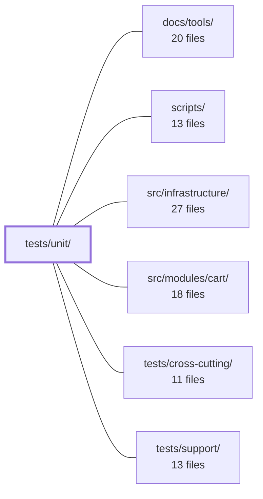

---
tags:
  - 2repo
  - 2repo/module
  - project/boilerplate-vue-frontend
type: module
module: tests/unit/
files: 39
updated: 2026-08-30T17:13:26.506606+00:00
---

# tests/unit/

## Purpose

`tests/unit/` is the Vitest suite that pins the behavioral contracts of every source module in the app—guards, stores, HTTP interceptors, UI components, and build scripts—without requiring a browser, a live API, or cross-domain wiring. Each spec file mirrors the directory layout of `src/` (plus `scripts/`) so a developer can find the relevant test by changing to the matching path and appending `.spec.ts`.

## Key parts

- **`app/`** — Guards (`authentications`, `authentications-restore`, `locale-choice`), router navigation helpers, the `AppNavigation` component, and the router's own meta/redirect wiring. These tests mock all domain modules so they validate shell-level invariants (access truth-table, restore ordering, locale decision branches) independently of any feature.
- **`infrastructure/http/`** — The largest sub-group. Covers the axios instance defaults, request/response interceptors, the 401→refresh→replay loop (via MSW), response-schema validation, the route→schema lookup table, and the `toPathname` normaliser. Together they pin the full HTTP contract from wiring through error normalisation.
- **`infrastructure/i18n/` + `infrastructure/stores/`** — Locale loading/merging, runtime overrides, the dialog FIFO queue, observability (Umami/Faro), and the session store's locale-persistence method.
- **`infrastructure/utils/`** — Formatters (example + property-based via `fast-check`), image-URL resolution, upload validation constants, logger scoping, and error-message helpers.
- **`ui/`** — Shared Vuetify-wrapping components (`DataTable`, `FormCard`, `LazyImage`, `FormImageUpload`, `ListPagination`, etc.), each locking accessibility, lifecycle, or edge-case rendering behavior that page-level tests would otherwise re-assert.
- **`kernel/`** — The registry helpers that assemble routes and sidebar navigation from individual domain modules.
- **`scripts/`** — Tests for CI tooling: mutation-baseline ratchet, e2e shard balancer, spec-glob consistency, cross-repo spec identity, paired-backend path resolution, and demo-scratch-directory hygiene.

## How it connects

- **`src/infrastructure/`** — The primary subject of the `infrastructure/` sub-tree. Every spec here imports (or mocks) modules from that directory and asserts their public contracts.
- **`scripts/`** — Direct subject of `tests/unit/scripts/`; the specs import the TypeScript helpers and run them in-memory against synthetic fixtures.
- **`tests/support/`** — Supplies shared test utilities (MSW server setup, fixture factories, common mocks) that unit specs import to avoid duplicating boilerplate.
- **`tests/cross-cutting/`** — Sibling suite that tests *interactions* between modules (e.g., a guard firing during a real route change). Unit specs deliberately stub out those interactions; cross-cutting specs fill the gap.
- **`src/modules/cart/`** (and other domain modules) — Explicitly **mocked** in the `app/` specs. Unit tests never import real domain code; they only verify that the shell *delegates* to the right seams.
- **`docs/tools/`** — Documentation for the test tooling (Vitest config, Stryker setup, MSW wiring) that explains *how* to run and extend this suite.

## Where to start

1. **`tests/unit/app/guards/authentications.spec.ts`** — The access-control truth table is the single most important behavioral contract in the app. Reading it shows the mock strategy, assertion style, and how a spec isolates one module's logic from the rest.
2. **`tests/unit/infrastructure/http/http.spec.ts`** — Demonstrates the error-normalisation envelope every UI component depends on, and illustrates the stub-axios pattern used throughout the HTTP sub-tree (contrasted with the MSW-based `http-refresh.spec.ts` next to it).

## Connected modules

[[boilerplate-vue-frontend_docs_tools|docs/tools/]] · [[boilerplate-vue-frontend_scripts|scripts/]] · [[boilerplate-vue-frontend_src_infrastructure|src/infrastructure/]] · [[boilerplate-vue-frontend_src_modules_cart|src/modules/cart/]] · [[boilerplate-vue-frontend_tests_cross-cutting|tests/cross-cutting/]] · [[boilerplate-vue-frontend_tests_support|tests/support/]]

## Files
- `tests/unit/app/app-navigation.spec.ts` — Unit spec for the `AppNavigation` component. It pins the visibility invariant (an entry renders only when the router would permit the visitor to enter the route it links to), the `order`-based sort within each section, the kernel section sequence (main → account → admin), and the conditional sign-in/sign-up buttons. All domain modules are mocked so the test stays decoupled from any specific domain.
- `tests/unit/app/guards/authentications-restore.spec.ts` — Unit tests for `tryRestoreAuth`, the vue-router guard that converts a persisted `isAuth` cookie back into an active session on every navigation. The focus is the **order** and **conditional skipping** of two store calls (`refreshToken` → `loadViewer`), and the hard contract that the function must *always resolve* (a rejection would abort navigation and strand the visitor on a blank page).
- `tests/unit/app/guards/authentications.spec.ts` — Unit tests for the two exported functions in `@/app/guards/authentications` (`canAccess` and `enforceRouteAccess`). Validates the full access-control truth table and the redirect/notification behavior when a visitor is denied a route.
- `tests/unit/app/guards/locale-choice.spec.ts` — Unit tests for the `localeChoice` Vue Router guard and its `fetchLanguageApi` helper (both in `src/app/guards/locale-choice.ts`). The guard decides per-navigation whether to proceed, load a language, or redirect to a default locale. These tests verify the three decision branches, the dictionary-loading/merging contract (always resolves, never rejects), and that redirect paths preserve route context.
- `tests/unit/app/router/navigation.spec.ts` — Unit tests (Vitest) for the two navigation helpers exported by `src/app/router/navigation`: `loginContinueTo` (decides where to send a user after a login bounce) and `signInLocation` (resolves a sign-in route or falls back to Home when the account module is absent). The file exists because `loginContinueTo`'s error-page branch was previously only exercised incidentally by other specs, and `signInLocation` had no coverage at all.
- `tests/unit/app/router/router.spec.ts` — Unit tests for the router's own behaviour — locale redirect, 404 catch-alls, global auth-restore ordering, error→redirect mapping, and that every shell-owned route record declares its `meta` requirements (title, access). Auth-enforcement logic is explicitly mocked out; this file verifies that enforcement is *attached* and correctly ordered, not that it decides correctly (that lives in `authentications.spec.ts`).
- `tests/unit/infrastructure/composables/use-upload-progress.spec.ts` — Unit tests for the **axios binding** around the toolkit's upload-progress state machine (`use-upload-progress.ts`). The state machine is tested in the toolkit itself; this spec verifies only what this app adds on top: the `onUploadProgress` callback shape, the 0–1 → percentage conversion, the "no file ⇒ no tracking" guard, and the idle (undefined) vs. in-progress (0) distinction that the UI depends on.
- `tests/unit/infrastructure/create-sse-client.spec.ts` — Unit tests for the `createSseClient` factory (from `@/infrastructure/create-sse-client`), verifying that it correctly wires an `EventSource` to named AsyncAPI SSE events and lifecycle callbacks without requiring a real server.
- `tests/unit/infrastructure/http/client.spec.ts` — Unit tests for the shared axios instance exported by `src/infrastructure/http/client.ts`. Verifies that the instance's `baseURL`, `timeout`, and `withCredentials` defaults are wired correctly from environment variables and that sensible fallbacks apply when those variables are absent.
- `tests/unit/infrastructure/http/http-refresh.spec.ts` — Exercises the 401 → refresh → replay flow through the **real** axios interceptor chain by driving requests against a live MSW (Mock Service Worker) node server, rather than a stubbed adapter. A broken refresh is invisible to types and to e2e tests (it just logs the user out later), so this suite pins the exact request sequence, token propagation, and the `_dontRetry` guard that prevents infinite refresh loops. It is the complement to `http.spec.ts`, which covers error normalisation with plain stubs.
- `tests/unit/infrastructure/http/http-request.spec.ts` — Unit tests for the `onRequest` and `onRequestReject` interceptors exported by `src/infrastructure/http/index.ts`. They verify that the bearer token and active-language header are attached correctly (or omitted cleanly) on every outgoing request, and that setup failures in the reject path are forwarded untouched. The refresh-exclusion branch is intentionally excluded and covered separately in `http-refresh.spec.ts`.
- `tests/unit/infrastructure/http/http-validate-responses.spec.ts` — Tests the contract-validation gate (`VITE_VALIDATE_RESPONSES`) on `orvalMutator` by sending real HTTP requests through MSW to a live `http://api.test` server, exercising the full interceptor chain rather than a stubbed axios adapter. Verifies the default-on/off behaviour driven by `MODE`, pass/fail on schema conformance, strict rejection of undeclared fields, and the fail-open path for unmapped routes.
- `tests/unit/infrastructure/http/http.spec.ts` — Unit tests for the `onResponseReject` axios interceptor, verifying that every shape of API error (well-formed reject envelopes, transport failures, gateway errors, network-level failures) is normalised into the single `success / status / message / errors / requestId / traceId` envelope the UI consumes.
- `tests/unit/infrastructure/http/response-schema-map.spec.ts` — Unit tests for the route → response-schema lookup table (`response-schema-map.ts`). They guard two properties that are invisible in a code review of the table itself: **anchoring** (every pattern is `^…$`-anchored so `[^/]+` cannot bleed into adjacent segments) and **ordering** (longer/more-specific paths listed before shorter ones so `find()` hits the right row). They also verify the table is complete against `openapi.yaml` and that each row resolves to the correct generated schema.
- `tests/unit/infrastructure/http/url.spec.ts` — Unit tests for `toPathname`, the URL → pathname normalisation utility in `src/infrastructure/http/url.ts`. The function is critical because its two downstream consumers — the response-schema table's anchored route patterns and `refresh.ts`'s excluded-paths set — both perform exact-string comparisons, so any normalisation gap causes routes to be silently skipped.
- `tests/unit/infrastructure/i18n/i18n.spec.ts` — Unit tests for the i18n locale machinery (`@/infrastructure/i18n`) executed against a **real** `vue-i18n` instance rather than a mock. It covers locale loading, activation, fallback behaviour, browser-language detection, and the `routerLinkI18n` path-prefix helper — the layer that the router-guard spec (`locale-choice.spec.ts`) deliberately stubs out.
- `tests/unit/infrastructure/i18n/locale-overrides.spec.ts` — Unit tests for the runtime locale-override tier (`src/infrastructure/i18n/locale-overrides.ts`). Every test defends two invariants: (1) no function ever rejects — the bundled locale JSON is the floor and all remote tiers must degrade to it; and (2) the merge of overrides over bundled strings is deep and per-key, so a single edited string never wipes its siblings.
- `tests/unit/infrastructure/stores/dialog.spec.ts` — Unit tests for the `useDialogStore` Pinia store. They lock down the store's contract: `confirm()` enqueues a question whose resolution is delivered to exactly one caller, `answer()` resolves the oldest pending question (FIFO), a dismissal counts as `false`, and answering an empty queue is a safe no-op.
- `tests/unit/infrastructure/stores/observability.spec.ts` — Unit tests for the `useObservabilityStore` Pinia store, covering the Umami analytics half (script injection, readiness guards, event buffering, `track*` helpers) and the safety contract when Faro is absent. The file exists because `src/infrastructure/observability.ts` previously carried 123 mutants with zero coverage — nothing in the telemetry surface was ever exercised.
- `tests/unit/infrastructure/stores/session.spec.ts` — Unit tests for the `persistLocalePreference` method of the session store. The single invariant under test is that **choosing a language always succeeds regardless of auth state or API outcome**, which is what allows `AppLanguageSwitcher` to fire-and-forget the call without knowing what a session is.
- `tests/unit/infrastructure/utils/errors.spec.ts` — Unit tests (Vitest) for the `notifyErrorMessages` helper and the `VUETIFY_INVALID_FIELD_SELECTOR` constant exported by `@/infrastructure/utils/errors.ts`. Covers message-extraction across input shapes, fallback behaviour, telemetry forwarding, and the CSS selector's matching against Vuetify markup.
- `tests/unit/infrastructure/utils/formatters.property.spec.ts` — Property-based test suite (via `fast-check`) that asserts universal invariants of `formatText`, `formatCurrency`, `formatFlag`, `formatDateTime`, `formatDate`, and the upload predicates (`isAcceptedImageType`, `isWithinUploadSizeLimit`) for **every** generated input, not just hand-picked examples. It complements the example-based specs (`formatters.spec.ts`, `uploads.spec.ts`) by covering boundary cases, malformed currency codes, arbitrary strings, and edge inputs that sampling would miss.
- `tests/unit/infrastructure/utils/formatters.spec.ts` — Vitest suite covering the display-formatter utilities (`@/infrastructure/utils/formatters`). It was written after a mutation-testing run scored the module 0% (every mutant survived because no test exercised it). Its job is to pin down the happy-path output of each formatter **and** the fallback-to-`EMPTY_VALUE` branch that only triggers when data is missing — the branch nobody hits by clicking through the UI.
- `tests/unit/infrastructure/utils/images.spec.ts` — Unit tests for `src/infrastructure/utils/images.ts`, covering the three image-URL helpers. The core concern is `resolveImageUrl`: it must prefix API-relative paths with the API origin (read from the axios instance) while leaving already-absolute URLs untouched. The file also pins down the "no thumbnail param set" and "thumbnail param set" contracts for `thumbnailImageUrl`, and the fixed path returned by `placeholderImageUrl`.
- `tests/unit/infrastructure/utils/logger.spec.ts` — Unit tests for the app's console boundary (`src/infrastructure/logger.ts`, imported as `@/infrastructure/utils/logger`). Because every other module routes through this logger, a wrong scope or level comparison either silences a real error or floods a production console. The tests pin both filtering axes—scope and level—and confirm the defaults that keep a typo'd env var from accidentally muting errors.
- `tests/unit/infrastructure/utils/uploads.spec.ts` — Pins the client-side upload validation rules (accepted MIME types, size boundary, schema behavior) so that a silent drift from the backend's `storage.ts` constants is caught. The client-side constants are a hand-maintained copy; without these tests nothing generated would flag a divergence.
- `tests/unit/kernel/registry.spec.ts` — Unit tests for the four public helpers exported from `@/kernel/registry` (`collectModuleRoutes`, `collectModuleNavigation`, `sortNavigation`, `groupNavigation`). They pin down the exact contract of how a multi-module app assembles its route table and sidebar navigation, ensuring that misconfigurations fail loudly at boot rather than producing a blank page at runtime.
- `tests/unit/scripts/backend-demo-scratch-directory.spec.ts` — Vitest unit tests for the demo-scratch-directory helpers. Verifies that the per-process directory a spawned demo backend uses for its Mongo data lives under the user cache (not the system tmpdir), fits within Unix-socket path limits, can be removed along with orphaned contents, and that creation of a new directory selectively sweeps only the scratch of *dead* sibling processes.
- `tests/unit/scripts/cypress-spec-globs.spec.ts` — Guard test that verifies every location which enumerates the Cypress spec set resolves to the **same file set**. It does so by expanding each glob against the real filesystem (via `globSync`) and comparing the resulting path arrays, rather than comparing glob strings — because a shallow `tests/e2e/*.cy.ts` and its recursive `tests/e2e/**/*.cy.ts` form look similar but schedule different suites once a spec lands in a subdirectory. It also asserts that config and script files reference the shared constants from `cypress-spec-globs.ts` instead of inlining their own globs.
- `tests/unit/scripts/e2e-shard-balancer.spec.ts` — Unit tests for the LPT (Longest Processing Time) shard-balancing algorithm in `scripts/e2e-shard-balancer.ts`. It verifies spec weighting, greedy shard packing, and the shape of the real `SECONDS` timing table, using small hand-built duration tables so the algorithmic properties are legible independent of actual measured runtimes.
- `tests/unit/scripts/mutation-baseline.spec.ts` — Vitest suite that pins the per-file mutation-score ratchet in `scripts/mutation-baseline.ts`. It verifies the core asymmetry — improvements raise the baseline, regressions never lower it — and the partial-run guard that prevents a single-file Stryker report from silently wiping the rest of the baseline. All cases run against synthetic Stryker-shaped reports so no real mutation run is required.
- `tests/unit/scripts/paired-backend-path.spec.ts` — Unit tests for `scripts/paired-backend-path.ts`, the resolver that tells both halves of a frontend/backend pairing where to find each other. The tests focus on the failure modes that produce confusing downstream errors (wrong npm prefix, false fork reports) rather than the happy path, and on the subtle distinction between "unset" and "set to empty string."
- `tests/unit/scripts/spec-identity.spec.ts` — Vitest suite for `scripts/spec-identity.ts`, the cross-repo contract check that verifies shared files (OpenAPI, AsyncAPI, analytics-events) are identical between this frontend checkout and its paired backend. Tests run against synthetic temp-directory fixtures so they work on any CI runner or standalone clone, plus a conditional live check against the real sibling when present.
- `tests/unit/ui/data-table.spec.ts` — Unit tests for the `DataTable.vue` component's accessibility contract: ARIA region naming, loading indicator, sortable vs. synthetic header behavior, and keyboard-driven row selection. Exists so that every list page can rely on these guarantees without re-testing them locally.
- `tests/unit/ui/form-card.spec.ts` — Unit test for `FormCard.vue` that pins the `defineExpose` seam between a page component and the `<form>` element one level below it. It verifies that `formElement` actually resolves to the real `<form>` node, that slotted fields live inside that node (so `querySelector`-based focus logic can find them), and that submit is emitted to the parent rather than triggering a browser form send.
- `tests/unit/ui/form-counter-input.spec.ts` — Unit tests for the `FormCounterInput` Vue component (a wrapper around Vuetify's `v-number-input`). Verifies basic rendering, value binding via `modelValue`, min/max clamping with button disablement, and that accessibility labeling and error-message props surface correctly in the rendered output.
- `tests/unit/ui/form-image-upload.spec.ts` — Unit tests for `FormImageUpload.vue`, focusing on the object-URL lifecycle (create/revoke), preview image selection, upload progress-bar visibility and value, and the file-input field contract. The component wraps well-tested upload utilities but owns a browser resource (`URL.createObjectURL`) that no other test exercises, so this file pins the three revoke paths (replace, clear, unmount) and the few behaviours a naive implementation gets backwards.
- `tests/unit/ui/lazy-image.spec.ts` — Unit test suite for `LazyImage.vue` that pins down four behavioral contracts: placeholder selection (absence vs. 404), `alt` text integrity across all display states, per-URL failure reset for recycled instances, and the `loading` attribute strategy. These are written as logic-level assertions rather than visual checks because the behaviors are invisible until they are wrong.
- `tests/unit/ui/list-pagination.spec.ts` — Unit tests for `ListPagination.vue`, a thin wrapper around Vuetify's `v-pagination` whose only logic is a `v-if="length > 1"` guard. The file exists to pin down the exact render boundary (0, 1, 2 pages) that a happy-path example test would miss, plus the `v-model` contract and the `aria-label` pass-through.

---
[[boilerplate-vue-frontend_INDEX|← boilerplate-vue-frontend index]]
