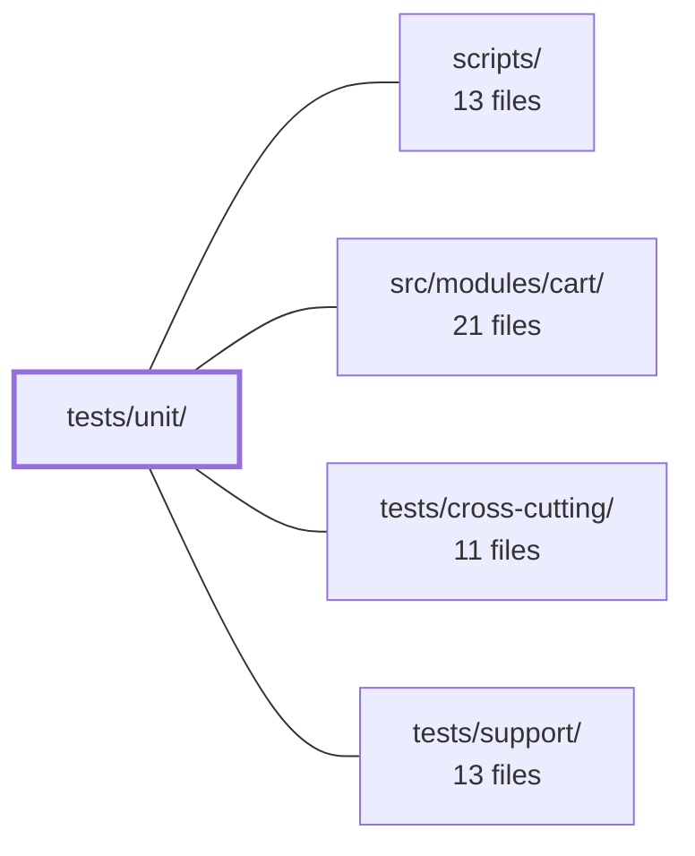

---
tags:
  - 2repo
  - 2repo/module
  - project/boilerplate-vue-frontend
type: module
module: tests/unit/
files: 38
updated: 2026-09-03T11:01:22.465200+00:00
---

# tests/unit/

## Purpose

`tests/unit/` contains the Vitest unit-test suites for every layer of the application: router guards and navigation helpers, the HTTP infrastructure, i18n, the shared UI component library, the kernel module-registry, and the build/test tooling in `scripts/`. Each file pins a narrow contract or invariant at the finest granularity—ensuring that a single mutation, a missing environment variable, or a mis-ordered array entry is caught immediately rather than surfacing as a blank page, a silent locale fallback, or a broken image in production.

## Key parts

- **`app/`** — Guards (`authentications`, `authentications-restore`, `locale-choice`), router wiring (`router.spec.ts`), navigation helpers (`navigation.spec.ts`), and the sidebar visibility invariant (`app-navigation.spec.ts`). Together they cover the full per-navigation decision pipeline from route table to redirect.
- **`infrastructure/http/`** — The largest cluster: axios instance defaults, request/response interceptors, the 401 → refresh → replay round-trip (via MSW), response-schema validation, the route-to-schema lookup table, and URL normalisation. These tests exercise the real interceptor chain against a live `http://api.test` server.
- **`infrastructure/i18n/`** — Locale loading/activation against a real `vue-i18n` instance, plus the runtime override-merge tier that must never reject.
- **`infrastructure/` (other)** — Session store, observability/telemetry, and a `utils/` subdirectory covering formatters (example- and property-based), error extraction, image URL resolution, the console logger boundary, and upload validation constants.
- **`kernel/`** — The four public helpers that assemble routes and sidebar navigation from feature modules.
- **`ui/`** — Shared Vue components: `DataTable`, `Dialog`, `FormCard`, `FormCounterInput`, `FormImageUpload`, `LazyImage`, `ListPagination`. Each pins an accessibility or lifecycle contract that every consuming page relies on.
- **`scripts/`** — Tooling guards: Cypress spec-glob consistency, e2e shard balancer, mutation-score baseline ratchet, paired-backend path resolution, spec-identity cross-repo check, and the demo-scratch-directory lifecycle.

## How it connects

- **`scripts/`** — The `tests/unit/scripts/` subdirectory directly tests the tooling that lives in `scripts/` (shard balancer, mutation baseline, glob constants, etc.), asserting their output shapes and failure modes without invoking a real CI pipeline.
- **`src/modules/cart/`** — The `kernel/registry.spec.ts` suite pins the contract (`collectModuleRoutes`, `collectModuleNavigation`, `sortNavigation`, `groupNavigation`) that cart and every other feature module depends on to appear in the router and sidebar; a broken assembly there produces a blank page for all modules simultaneously.
- **`tests/cross-cutting/`** — Unit tests and cross-cutting tests are complementary layers: for example, `locale-choice.spec.ts` stubs the i18n layer to isolate the guard's three branches, while `infrastructure/i18n/i18n.spec.ts` exercises the real `vue-i18n` instance; `http-refresh.spec.ts` drives the interceptor chain in-process, leaving full-stack navigation flows to the cross-cutting suite.
- **`tests/support/`** — Shared fixtures, mocks, and helpers (e.g., the `storeToRefs` pattern, MSW server setup, `fast-check` property-test helpers) that unit specs import to avoid duplicating setup logic across files.

## Where to start

1. **`tests/unit/kernel/registry.spec.ts`** — In a few dozen lines it reveals how a multi-module app stitches together its route table and sidebar, which is the architectural skeleton every other spec builds upon.
2. **`tests/unit/app/router/router.spec.ts`** — Shows the router's global wiring (guard order, 404 catch-all, title derivation) and deliberately separates "is it attached?" from "does it decide correctly?", giving a newcomer a clear mental model of the testing layers.

## Connected modules

[[boilerplate-vue-frontend_scripts|scripts/]] · [[boilerplate-vue-frontend_src_modules_cart|src/modules/cart/]] · [[boilerplate-vue-frontend_tests_cross-cutting|tests/cross-cutting/]] · [[boilerplate-vue-frontend_tests_support|tests/support/]]

## Files
- `tests/unit/app/app-navigation.spec.ts` — Unit test for `AppNavigation.vue` that pins the core visibility invariant: a nav entry appears **exactly when** the router would permit entry to its target route (via `meta.access`). It uses three throwaway mock domains—one per section (main, account, admin) and one per access class (public, auth, admin)—so the test exercises the *mechanism* (filter by access, sort by `order`, place in section) without coupling to any real domain name. Deleting a real domain must never break this file.
- `tests/unit/app/guards/authentications-restore.spec.ts` — Unit tests for `tryRestoreAuth`, the vue-router guard that converts a surviving `isAuth` cookie into a live session (refresh token → load viewer). Because this guard must **always resolve** (a rejection aborts navigation and strands the visitor on a blank page), every failure-path test asserts a resolved promise. The file is split from `authentications.spec.ts` because the latter mocks `useSessionStore` as an empty reactive object driven through `storeToRefs`, whereas this test needs a *recording double* that captures the **order** of `refreshToken` and `loadViewer` calls and which of them is skipped.
- `tests/unit/app/guards/authentications.spec.ts` — Unit tests for the route-authentication guard functions `canAccess` and `enforceRouteAccess` in `@/app/guards/authentications`. Verifies the full access-level truth table and the redirect/notification behavior when a visitor is denied a route.
- `tests/unit/app/guards/locale-choice.spec.ts` — Unit tests for the `localeChoice` Vue Router guard and its `fetchLanguageApi` helper (both in `src/app/guards/locale-choice.ts`). The guard decides per-navigation whether to proceed, load a language, or redirect to a default locale. These tests verify the three decision branches, the dictionary-loading/merging contract (always resolves, never rejects), and that redirect paths preserve route context.
- `tests/unit/app/router/navigation.spec.ts` — Unit tests (Vitest) for the two navigation helpers exported by `src/app/router/navigation`: `loginContinueTo` (decides where to send a user after a login bounce) and `signInLocation` (resolves a sign-in route or falls back to Home when the account module is absent). The file exists because `loginContinueTo`'s error-page branch was previously only exercised incidentally by other specs, and `signInLocation` had no coverage at all.
- `tests/unit/app/router/router.spec.ts` — Verifies that the router is correctly *wired*: that auth enforcement is attached globally and runs in the right order, that locale redirects and 404 catch-alls behave as designed, that the document title and WCAG announcer derive from route `meta`, and that the static prose routes resolve to their computed names. Enforcement itself is mocked — the unit under test is the router's own navigation logic and its route-table declarations, not the guard's decision logic (which lives in `tests/unit/app/guards/authentications.spec.ts`).
- `tests/unit/infrastructure/create-sse-client.spec.ts` — Unit tests for the `createSseClient` factory (from `@/infrastructure/create-sse-client`), verifying that it correctly wires an `EventSource` to named AsyncAPI SSE events and lifecycle callbacks without requiring a real server.
- `tests/unit/infrastructure/http/client.spec.ts` — Unit tests for the shared axios instance exported by `src/infrastructure/http/client.ts`. Verifies that the instance's `baseURL`, `timeout`, and `withCredentials` defaults are wired correctly from environment variables and that sensible fallbacks apply when those variables are absent.
- `tests/unit/infrastructure/http/http-refresh.spec.ts` — Unit-test suite for the **401 → token refresh → request replay** flow, executed against a real HTTP server (MSW's node interceptor) so that the axios response-interceptor chain, the replay round-trip, and the `_dontRetry` guard are all exercised for real. This scenario is invisible to both the type system and the e2e suite—a broken refresh silently logs the user out later—so it needs a dedicated test that drives `orvalMutator` through the actual instance.
- `tests/unit/infrastructure/http/http-request.spec.ts` — Unit tests for the `onRequest` and `onRequestReject` interceptors exported by `@/infrastructure/http`. They verify that every outgoing request carries the correct `Authorization` header (when authenticated) and the `Accept-Language` header (always), and that non-recoverable errors are re-thrown unchanged. The file exists to catch regressions where a missing or malformed token would silently log the user out, or a missing language header would degrade all responses to the fallback locale.
- `tests/unit/infrastructure/http/http-validate-responses.spec.ts` — Tests the contract-validation gate (`VITE_VALIDATE_RESPONSES`) on `orvalMutator` by sending real HTTP requests through MSW to a live `http://api.test` server, exercising the full interceptor chain rather than a stubbed axios adapter. Verifies the default-on/off behaviour driven by `MODE`, pass/fail on schema conformance, strict rejection of undeclared fields, and the fail-open path for unmapped routes.
- `tests/unit/infrastructure/http/http.spec.ts` — Unit tests for `onResponseReject`, the Axios error-interceptor in `@/infrastructure/http`. The file verifies both the "envelope passthrough" path (well-formed API reject bodies) and the "fallback normalisation" path (transport failures, bare status codes, missing messages), ensuring that whatever reaches the UI is a safe, localized, user-facing message rather than a raw Axios string or server-internal detail.
- `tests/unit/infrastructure/http/response-schema-map.spec.ts` — Unit tests for the route → response-schema lookup table (`response-schema-map.ts`). They guarantee two silent-failure properties that aren't visible in a code review of the table itself: (1) every regex pattern is anchored at both ends so `[^/]+` can't absorb adjacent segments, and (2) array order matters because `find()` returns the first match (e.g. `/orders/:id/invoice` must precede `/orders/:id`). The suite also cross-checks the table against `openapi.yaml` to catch any operation whose response would go unvalidated.
- `tests/unit/infrastructure/http/url.spec.ts` — Unit tests for `toPathname`, the URL → pathname normalisation utility in `src/infrastructure/http/url.ts`. The function is critical because its two downstream consumers — the response-schema table's anchored route patterns and `refresh.ts`'s excluded-paths set — both perform exact-string comparisons, so any normalisation gap causes routes to be silently skipped.
- `tests/unit/infrastructure/i18n/i18n.spec.ts` — Unit tests for the i18n locale machinery (`@/infrastructure/i18n`) executed against a **real** `vue-i18n` instance rather than a mock. It covers locale loading, activation, fallback behaviour, browser-language detection, and the `routerLinkI18n` path-prefix helper — the layer that the router-guard spec (`locale-choice.spec.ts`) deliberately stubs out.
- `tests/unit/infrastructure/i18n/locale-overrides.spec.ts` — Unit tests for the runtime locale-override tier (`src/infrastructure/i18n/locale-overrides.ts`). Every test defends two invariants: (1) no function ever rejects — the bundled locale JSON is the floor and all remote tiers must degrade to it; and (2) the merge of overrides over bundled strings is deep and per-key, so a single edited string never wipes its siblings.
- `tests/unit/infrastructure/observability.spec.ts` — Unit tests for the observability store (`@/infrastructure/observability/store.ts`). This file was written because the telemetry surface had 123 mutants with zero coverage. It exercises the Umami script-injection path and every "Faro disabled" safety branch — the state a real visitor actually sees when `VITE_FARO_URL` is absent.
- `tests/unit/infrastructure/session.spec.ts` — Unit tests for the session store (`src/infrastructure/session.ts`), covering three behaviors: `persistLocalePreference` (the one API write the store makes), the `isAuth` / `rememberMe` cookie pair set by `setAccessToken`, and the `thumbnailUrl` field in the `loadViewer` projection. The file exists to pin down that language switching never surfaces an error to the UI and that session-cookie persistence rules are honored across token refreshes.
- `tests/unit/infrastructure/utils/errors.spec.ts` — Unit tests for the error-handling utilities in `@/infrastructure/utils/errors.ts`. Validates that `notifyErrorMessages` extracts a human-readable string from a wide range of error shapes (and falls back safely when it can't), and that `VUETIFY_INVALID_FIELD_SELECTOR` correctly targets the first invalid field in Vuetify-shaped DOM markup.
- `tests/unit/infrastructure/utils/formatters.property.spec.ts` — Property-based test suite (via `fast-check`) that asserts universal invariants of `formatText`, `formatCurrency`, `formatFlag`, `formatDateTime`, `formatDate`, and the upload predicates (`isAcceptedImageType`, `isWithinUploadSizeLimit`) for **every** generated input, not just hand-picked examples. It complements the example-based specs (`formatters.spec.ts`, `uploads.spec.ts`) by covering boundary cases, malformed currency codes, arbitrary strings, and edge inputs that sampling would miss.
- `tests/unit/infrastructure/utils/formatters.spec.ts` — Vitest suite covering the display-formatter utilities (`@/infrastructure/utils/formatters`). It was written after a mutation-testing run scored the module 0% (every mutant survived because no test exercised it). Its job is to pin down the happy-path output of each formatter **and** the fallback-to-`EMPTY_VALUE` branch that only triggers when data is missing — the branch nobody hits by clicking through the UI.
- `tests/unit/infrastructure/utils/images.spec.ts` — Unit tests for the two exports of `src/infrastructure/utils/images.ts`: `resolveImageUrl` and `placeholderImageUrl`. They exist to pin down the prefixing logic that converts API-relative image paths (e.g. `/images/<hash>.png`) into absolute URLs using the axios instance's `baseURL`, and to guarantee that already-fetchable sources (absolute URLs, `data:`/`blob:` URIs) and empty inputs are passed through or rejected unchanged. The tests target a regression where cross-origin deployments rendered blank images because no one asserted that a byte actually arrived—only that the `src` attribute was a string.
- `tests/unit/infrastructure/utils/logger.spec.ts` — Unit tests for the app's console boundary (`src/infrastructure/logger.ts`, imported as `@/infrastructure/utils/logger`). Because every other module routes through this logger, a wrong scope or level comparison either silences a real error or floods a production console. The tests pin both filtering axes—scope and level—and confirm the defaults that keep a typo'd env var from accidentally muting errors.
- `tests/unit/infrastructure/utils/uploads.spec.ts` — Pins the client-side upload validation rules (accepted MIME types, size boundary, schema behavior) so that a silent drift from the backend's `storage.ts` constants is caught. The client-side constants are a hand-maintained copy; without these tests nothing generated would flag a divergence.
- `tests/unit/kernel/registry.spec.ts` — Unit tests for the four public helpers exported from `@/kernel/registry` (`collectModuleRoutes`, `collectModuleNavigation`, `sortNavigation`, `groupNavigation`). They pin down the exact contract of how a multi-module app assembles its route table and sidebar navigation, ensuring that misconfigurations fail loudly at boot rather than producing a blank page at runtime.
- `tests/unit/scripts/backend-demo-scratch-directory.spec.ts` — Vitest unit tests for the demo-scratch-directory helpers. Verifies that the per-process directory a spawned demo backend uses for its Mongo data lives under the user cache (not the system tmpdir), fits within Unix-socket path limits, can be removed along with orphaned contents, and that creation of a new directory selectively sweeps only the scratch of *dead* sibling processes.
- `tests/unit/scripts/cypress-spec-globs.spec.ts` — Guard test that verifies every location which enumerates the Cypress spec set resolves to the **same file set**. It does so by expanding each glob against the real filesystem (via `globSync`) and comparing the resulting path arrays, rather than comparing glob strings — because a shallow `tests/e2e/*.cy.ts` and its recursive `tests/e2e/**/*.cy.ts` form look similar but schedule different suites once a spec lands in a subdirectory. It also asserts that config and script files reference the shared constants from `cypress-spec-globs.ts` instead of inlining their own globs.
- `tests/unit/scripts/e2e-shard-balancer.spec.ts` — Unit tests for the LPT (Longest Processing Time) shard-balancing algorithm in `scripts/e2e-shard-balancer.ts`. It verifies spec weighting, greedy shard packing, and the shape of the real `SECONDS` timing table, using small hand-built duration tables so the algorithmic properties are legible independent of actual measured runtimes.
- `tests/unit/scripts/mutation-baseline.spec.ts` — Vitest suite that pins the per-file mutation-score ratchet in `scripts/mutation-baseline.ts`. It verifies the core asymmetry — improvements raise the baseline, regressions never lower it — and the partial-run guard that prevents a single-file Stryker report from silently wiping the rest of the baseline. All cases run against synthetic Stryker-shaped reports so no real mutation run is required.
- `tests/unit/scripts/paired-backend-path.spec.ts` — Unit tests for `scripts/paired-backend-path.ts`, the resolver that tells both halves of a frontend/backend pairing where to find each other. The tests focus on the failure modes that produce confusing downstream errors (wrong npm prefix, false fork reports) rather than the happy path, and on the subtle distinction between "unset" and "set to empty string."
- `tests/unit/scripts/spec-identity.spec.ts` — Unit tests for the cross-repo contract checker (`scripts/spec-identity.ts`). Validates that the shared-file comparison logic works correctly against synthetic fixture roots (no sibling checkout required), that the YAML fingerprint normalises semantically-equivalent serialisations, and that the real-pair comparison runs conditionally when a sibling repo is present.
- `tests/unit/ui/data-table.spec.ts` — Unit tests for the `DataTable.vue` component's accessibility contract: ARIA region naming, loading indicator, sortable vs. synthetic header behavior, and keyboard-driven row selection. Exists so that every list page can rely on these guarantees without re-testing them locally.
- `tests/unit/ui/dialog.spec.ts` — Unit tests for the `useDialogStore` Pinia store, verifying its queue-based confirm-dialog contract: questions are queued in order, each resolved by exactly one `answer()` call, and dismissal is equivalent to `false`. The file exists to pin down this store-level API without involving any component rendering.
- `tests/unit/ui/form-card.spec.ts` — Unit test for `FormCard.vue` that pins the `defineExpose` seam between a page component and the `<form>` element one level below it. It verifies that `formElement` actually resolves to the real `<form>` node, that slotted fields live inside that node (so `querySelector`-based focus logic can find them), and that submit is emitted to the parent rather than triggering a browser form send.
- `tests/unit/ui/form-counter-input.spec.ts` — Unit tests for the `FormCounterInput` Vue component (a wrapper around Vuetify's `v-number-input`). Verifies basic rendering, value binding via `modelValue`, min/max clamping with button disablement, and that accessibility labeling and error-message props surface correctly in the rendered output.
- `tests/unit/ui/form-image-upload.spec.ts` — Unit tests for `FormImageUpload.vue`, focusing on the object-URL lifecycle (create/revoke), preview image selection, upload progress-bar visibility and value, and the file-input field contract. The component wraps well-tested upload utilities but owns a browser resource (`URL.createObjectURL`) that no other test exercises, so this file pins the three revoke paths (replace, clear, unmount) and the few behaviours a naive implementation gets backwards.
- `tests/unit/ui/lazy-image.spec.ts` — Unit tests for the `LazyImage.vue` molecule, pinning the four decisions every stored picture in the app must satisfy: placeholder-on-absence *and* placeholder-on-failure (never pre-empting a slow load), `alt` text that tracks what is actually on screen (including the `alt=""` decorative contract), per-URL failure state that resets when a recycled `v-for` row receives a new record, and the `loading="lazy"` / `eager` performance attribute. These are pinned in a unit suite rather than the visual suite because the behaviors are invisible until they break.
- `tests/unit/ui/list-pagination.spec.ts` — Unit tests for `ListPagination.vue`, a thin wrapper around Vuetify's `v-pagination` whose only logic is a `v-if="length > 1"` guard. The file exists to pin down the exact render boundary (0, 1, 2 pages) that a happy-path example test would miss, plus the `v-model` contract and the `aria-label` pass-through.

---
[[boilerplate-vue-frontend_INDEX|← boilerplate-vue-frontend index]]
