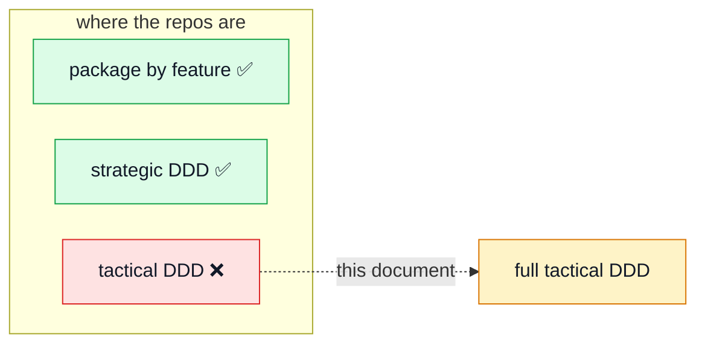

# DDD_EXPLORATION.md

**Status: exploration. Nothing here is implemented.**

This document works out what it would take to move these two boilerplates —
`boilerplate-node-api-mongodb-mongoose` and `boilerplate-vue-frontend` — from where they are today
to **full tactical DDD**, and what that would cost.

It exists so the decision can be made with numbers instead of vibes, and so that a project that
genuinely needs it has a map rather than a blank page. The companion page,
[`docs/theory/domain-layer.md`](./docs/theory/domain-layer.md), describes what **is** implemented:
a small, lint-enforced `domain/` folder per module.

---

## 1. The distinction this whole document rests on

**A domain/feature folder structure and DDD are not the same thing**, and conflating them is the
usual reason "we do DDD" means "we have folders named after features".

|                        | What it is                                                                                       | Status here        |
| ---------------------- | ------------------------------------------------------------------------------------------------ | ------------------ |
| **Package by feature** | a _packaging_ decision: one folder per feature instead of `controllers/`, `services/`, `models/` | **done, and well** |
| **DDD — strategic**    | bounded contexts, ubiquitous language, context mapping, core vs supporting vs generic subdomains | **largely done**   |
| **DDD — tactical**     | entities, value objects, aggregates, domain repositories, factories, domain services             | **not done**       |

You can have immaculate feature folders and zero DDD. That is roughly the current state, and it is
a _good_ state — the usual failure is the reverse, elaborate tactical patterns inside a big ball of
mud.



A fuller explanation of the distinction, with diagrams, is in
`docs/theory/domain-layer.md` §2–3.

### What is already DDD-aligned

These are not aspirational; they are in the code today.

| DDD concept                 | Where it already lives                                                    |
| --------------------------- | ------------------------------------------------------------------------- |
| Bounded context             | one folder per module, `rm -rf` deletes the domain                        |
| Published language          | the module barrel, `index.ts` — lint forbids reaching past it             |
| Context map                 | `dependsOn` in each `module.ts`, validated as a DAG at boot               |
| Anticorruption-ish boundary | barrels export the narrowest thing that satisfies the caller              |
| Domain events               | `kernel/events.ts`; `products` emits `product.deleted`, `cart` subscribes |
| Domain service              | `orders/domain/totals.ts` — a rule belonging to no single entity          |
| Shared-kernel avoidance     | `totals.ts` was moved _out_ of the substrate into its owning module       |

### What is absent

| DDD concept                         | Today                                                                          |
| ----------------------------------- | ------------------------------------------------------------------------------ |
| Entity                              | none — a Mongoose document is the model                                        |
| Value object                        | none — money is `number`, ids are `string`/`ObjectId`                          |
| Aggregate / aggregate root          | implicit only                                                                  |
| Consistency boundary                | hand-rolled — see the `__v` guard in `cart/services/checkout.ts`               |
| Repository returning domain objects | no — repositories return `IOrderDocument`                                      |
| Factory / invariant-at-construction | no — validation is Mongoose schema validators                                  |
| Ubiquitous language                 | partial — names are domain-ish, but `status: string` is not a modelled concept |

The cart checkout guard is the tell worth dwelling on. It reads a cart, writes an order, then
empties the cart conditionally on the `__v` it read at, rolling the order back if it lost the race.
**That is aggregate versioning, invented on the spot because there was no aggregate to hang it on.**
The need is real; only the vocabulary is missing.

---

## 2. Target structure — backend

Using `orders` as the worked example.

```
src/modules/orders/
  domain/                        ← pure. no framework. lint-enforced today
    order.ts                     Order — aggregate root
    order-line.ts                OrderLine — value object
    money.ts                     Money — value object
    order-status.ts              OrderStatus — closed set + legal transitions
    order-repository.ts          INTERFACE (a port). speaks Order, not documents
    events.ts                    OrderPlaced, OrderCancelled — domain events
    totals.ts  rules.ts          (already here)
  application/                   ← use cases. orchestration + transactions
    place-order.ts
    cancel-order.ts
    read-orders.ts               (or a separate read model — see §4)
  infrastructure/                ← the only place that knows Mongoose exists
    order.schema.ts              the mongoose schema, demoted to a detail
    mongo-order-repository.ts    implements domain/order-repository.ts
    order-mapper.ts              document ↔ Order
  http/
    controllers/  routes.ts
  module.ts  index.ts
```

The dependency arrow inside the module points **inward**: `http → application → domain`, with
`infrastructure` implementing an interface that `domain` declares. That is the Dependency Inversion
Principle applied within a module, and it is the actual content of "hexagonal" / "clean"
architecture.

### Before and after, concretely

**Today** — the rule lives in a serialization transform, money is a number, an invalid order is
caught at save time:

```ts
// model.ts
const applyOrderTotals = (serialized: Record<string, unknown>) => {
    const { count, quantity, price } = sumLineItems(serialized.items as ILineItem[]);
    serialized.totalPrice = price;
};

// service.ts
const order = await orderRepository.create({ userId, email, items } as Partial<IOrderDocument>);
```

**Under full tactical DDD** — an `Order` that exists is valid, and money knows it is money:

```ts
// domain/order.ts
export class Order {
    private constructor(
        readonly id: OrderId,
        readonly customer: CustomerId,
        private readonly lines: readonly OrderLine[],
        private status: OrderStatus
    ) {}

    static place(customer: CustomerId, lines: readonly OrderLine[]): Order {
        if (lines.length === 0) throw new EmptyOrder();
        return new Order(OrderId.next(), customer, lines, OrderStatus.Pending);
    }

    get total(): Money {
        return this.lines.reduce((sum, line) => sum.plus(line.subtotal), Money.zero('EUR'));
    }

    cancel(): void {
        if (!this.status.canTransitionTo(OrderStatus.Cancelled))
            throw new IllegalTransition(this.status, OrderStatus.Cancelled);
        this.status = OrderStatus.Cancelled;
    }
}
```

```ts
// application/place-order.ts
export const placeOrder =
    (deps: { orders: IOrderRepository; catalogue: ICatalogue }) =>
    async (command: PlaceOrderCommand): Promise<Order> => {
        const lines = await deps.catalogue.priceLines(command.items);
        const order = Order.place(command.customer, lines);
        await deps.orders.save(order);
        return order;
    };
```

Four things changed, and each is the point of a DDD pattern:

1. **Invalid states are unconstructable.** `Order.place([])` throws; there is no path to an empty
   order. Today that is a `422` decided in the service.
2. **Money is a type.** `Money.plus` cannot add cents to euros, and rounding lives in one place
   instead of at every call site of `toCents`.
3. **Status is a closed set with legal transitions**, not `status: string` validated by an enum in
   a Zod schema at the edge.
4. **The repository speaks `Order`.** Nothing above `infrastructure/` has heard of Mongoose.

---

## 3. Target structure — frontend

The frontend's honest answer is different, and pretending otherwise is how client-side DDD becomes
theatre.

**Most of this application's domain lives behind the API.** Prices, totals, eligibility and
permissions are decided server-side, and a client that re-implements them has two implementations
of one rule — the precise drift `scripts/specIdentity.ts` exists to detect across these repos. So
"full DDD on the frontend" is only a real goal for a client that genuinely owns domain decisions:
offline-first, a complex editor, a client-side pricing or rules engine.

If that is the case, the shape is:

```
src/modules/cart/
  domain/
    cart.ts                Cart — aggregate root, client-side
    cart-line.ts           value object
    quantity.ts            (already here)
    cart-repository.ts     INTERFACE — "where carts come from"
  application/
    add-item.ts  checkout.ts       use cases, framework-free
  infrastructure/
    http-cart-repository.ts        implements the port over the generated API client
    cart-mapper.ts                 API DTO ↔ Cart
  store.ts                         Pinia — now a thin reactive shell over application/
  views/  components/
```

The change that matters: **the Pinia store stops being the model and becomes a view of it.** Today
`store.ts` holds `CartResponse` — an API shape — and components read it directly. Under this
structure the store holds a `Cart` and calls use cases; the API shape exists only inside
`infrastructure/`.

The cost is the same mapper problem as the backend, doubled by the fact that the server remains the
authority: you now maintain a client model **and** keep it reconciled with the server's.

**Recommendation, stated plainly: do not do this on the frontend unless the client owns rules the
server does not.** For an API-backed admin/storefront — which is what this boilerplate produces —
the current thin `domain/` is the right size, and `docs/theory/domain-layer.md` says why.

---

## 4. What breaks

This is the section that usually goes missing, and it is the reason full DDD is a decision rather
than an upgrade.

### 4.1 `createBaseRepository` largely dissolves

`infrastructure/persistence/base-repository.ts` is a generic CRUD factory shared by every module,
with a declarative `ISearchSpec` per collection. It is genuinely good engineering.

DDD rejects it. A repository belongs to **one aggregate** and exposes **domain-meaningful**
methods — `findUnpaidOrdersFor(customer)`, not `findAll(filters)`. A generic repository leaks the
persistence model back into the domain, which is the thing the pattern exists to prevent.

So: five modules lose their shared base and gain hand-written repositories. Expect a net **increase**
in repository code.

### 4.2 Reads need a second path — this is where CQRS arrives

Aggregate-returning repositories are for **writes**. They are bad at:

- paginated admin tables with arbitrary filters
- the orders list, which is an aggregation pipeline over embedded product snapshots
- anything that wants a flat projection rather than a whole object graph

Loading 50 full `Order` aggregates to render a table is wasteful and forces every query through the
mapper.

The standard answer is **CQRS**: writes go through the domain, reads bypass it entirely and query
the database for read models. Practically that means **two models per module**, and
`infrastructure/persistence/search.ts` survives — but only on the read side.

This is the single largest hidden cost in the whole migration. It is also why "we adopted DDD and
everything got slower" is a common story: teams route reads through aggregates.

### 4.3 Serialization and the contract

`applySerialization` maps documents → JSON today, and `openapi.yaml` is authored contract-first.
Under DDD you map **domain → DTO** explicitly, per use case. The contract workflow is unaffected;
there is simply more mapping code, and `applyOrderTransform` no longer has a job.

### 4.4 Validation moves, or is duplicated

Mongoose schema validators currently enforce invariants at save time. Under DDD invariants are
enforced at construction. Keeping both means writing each rule twice; keeping only the domain one
means the database will accept anything a bug writes directly.

The usual compromise: keep schema-level constraints as a **safety net** (required, types, indexes),
and treat the domain as the authority for business invariants.

### 4.5 What gets _better_

- The `__v` checkout race becomes ordinary aggregate versioning, expressed once.
- Soft delete becomes a state transition on the aggregate rather than a nullable column toggled in
  a service.
- `status: string` becomes a closed set with legal transitions — a whole class of bug disappears.
- Domain events stop being an inter-module mechanism only and become the aggregate's own history.

---

## 5. Cost

Measured against this repo as it stands.

|                                  | Today                                 | Full tactical DDD                                                |
| -------------------------------- | ------------------------------------- | ---------------------------------------------------------------- |
| Files in `orders/`               | 11 (+ tests)                          | ~25–30 (+ tests)                                                 |
| Layers a write crosses           | 3 — controller → service → repository | 5 — controller → use case → aggregate → repository port → mapper |
| Models per module                | 1                                     | 2 (write model + read model)                                     |
| Mapper code                      | none                                  | one per aggregate, both directions                               |
| Unit-testable without a DB       | rules only                            | the entire domain and application layers                         |
| Time to add a trivial CRUD field | minutes                               | schema + mapper + domain + DTO                                   |
| Onboarding                       | familiar to any Express developer     | requires knowing DDD                                             |

**Rough estimate for the backend**: 2–4 focused days per module for the six domain-carrying
modules, plus 2–3 days for the read-side/CQRS split. Frontend, if pursued: comparable per module,
and not recommended.

---

## 6. If you do it anyway, do it in this order

1. **`orders` only, end to end.** It has the real invariants: totals, status transitions, soft
   delete, the checkout race. One vertical slice, complete, with its read path split out. Stop and
   evaluate before touching anything else.
2. **Extract `Money` first**, before entities. It is the highest value-to-cost item in the whole
   list, it is used by orders and cart, and it can land without any other change.
3. **`cart` second**, because it is the aggregate with the concurrency problem and it will validate
   whether aggregate versioning actually replaces the hand-rolled guard.
4. **Leave `users`, `feedback`, `audit-logs`, `locales`, `observability` alone.** They are generic
   and supporting subdomains — CRUD over forms and infrastructure. DDD's own doctrine says spend
   modelling effort on the core domain and keep the rest simple.
5. **Re-evaluate.** If steps 1–3 have not paid for themselves, stop. That is a legitimate outcome
   and the reason for doing them first.

---

## 7. The recommendation

**Stay DDD-ready; do not go DDD-everywhere in the boilerplate.**

The reasoning is not conservatism, it is DDD's own: tactical patterns belong in the **core domain**
— the part that is a competitive advantage — while supporting and generic subdomains should use the
simplest thing that works.

A boilerplate has no core domain. It cannot know what the next project's will be, and what it ships
today — products, orders, cart, users — is the textbook example of _generic_ subdomains. Baking full
tactical DDD into the starter would make every future project pay mapper-and-aggregate ceremony on
exactly the parts DDD says should not have it.

There is a second problem, less often said: DDD's value comes from modelling conversations with
domain experts about a specific business. A boilerplate has neither. Reproducing the shape without
the input is cargo cult, however faithful the folders look.

So the position the two repos take:

- **strategic DDD: adopted** — bounded contexts, explicit context mapping, domain events, a
  published language per module, all machine-enforced;
- **tactical DDD: available, not imposed** — `domain/` exists in every module that needs it, is
  lint-guaranteed framework-free, and is the folder an aggregate grows into with nothing else
  moving;
- **this document** — the map for the project that turns out to need it.

That is the most DDD a starter kit can honestly offer: not a domain model it invented for a demo
shop, but an architecture where building a real one is a supported path rather than a fight.
