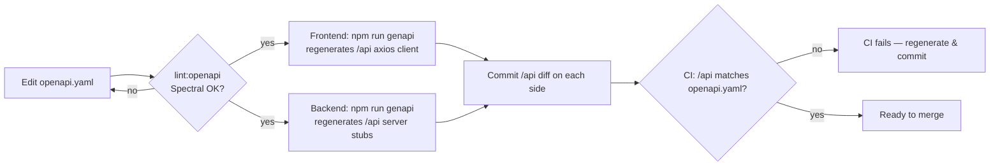

# Frontend / Backend Pairing Guide

Quick reference for working with the paired backend boilerplate.

See also: [README.md](./README.md) (frontend overview) · [AI_README.md](./AI_README.md) (AI-agent guidance).

## Paired repositories

| Side     | Repository                         | Default branch         |
| -------- | ---------------------------------- | ---------------------- |
| Frontend | `Guebbit/boilerplate-vue-frontend` | `main`                 |
| Backend  | `Guebbit/boilerplate-node-backend` | `api-mongodb-mongoose` |

Keep the paired branches in sync before merging contract changes.

## Runtime requirement

Both repos require **Node.js 22+**.

## Local URLs

| Service  | URL                     |
| -------- | ----------------------- |
| Frontend | `http://localhost:8080` |
| Backend  | `http://localhost:3000` |

Backend CORS must allow `http://localhost:8080`.  
Set `NODE_CORS_ORIGIN=http://localhost:8080` in the backend `.env`.

## OpenAPI contract discipline

`openapi.yaml` is the single source of truth for both sides.
Lint rules live in [`spectral.yaml`](./spectral.yaml) (see [Spectral docs](https://stoplight.io/open-source/spectral)).



After any change to `openapi.yaml`:

```bash
# Frontend
npm run genapi       # regenerate api/ client
git add api/
git commit -m "chore: regenerate api client"

# Backend
npm run genapi       # regenerate api/ server stubs
git add api/
git commit -m "chore: regenerate api stubs"
```

CI verifies that `api/` matches the committed `openapi.yaml` on every push.

## Validation gates

```bash
# Frontend
npm run complete:check   # build + lint + openapi-lint + prettier + unit tests + e2e

# Backend
npm run complete         # build + lint + tests
```

Both must be green before merging.

## Request / trace IDs in errors

The backend attaches `x-request-id` and `x-trace-id` to every response.  
The frontend axios interceptor (`src/utils/http.ts`) captures these into the
`IResponseReject` envelope (`requestId`, `traceId` fields) so they are
available in error handlers and Sentry context for cross-service debugging.
