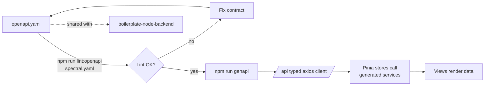
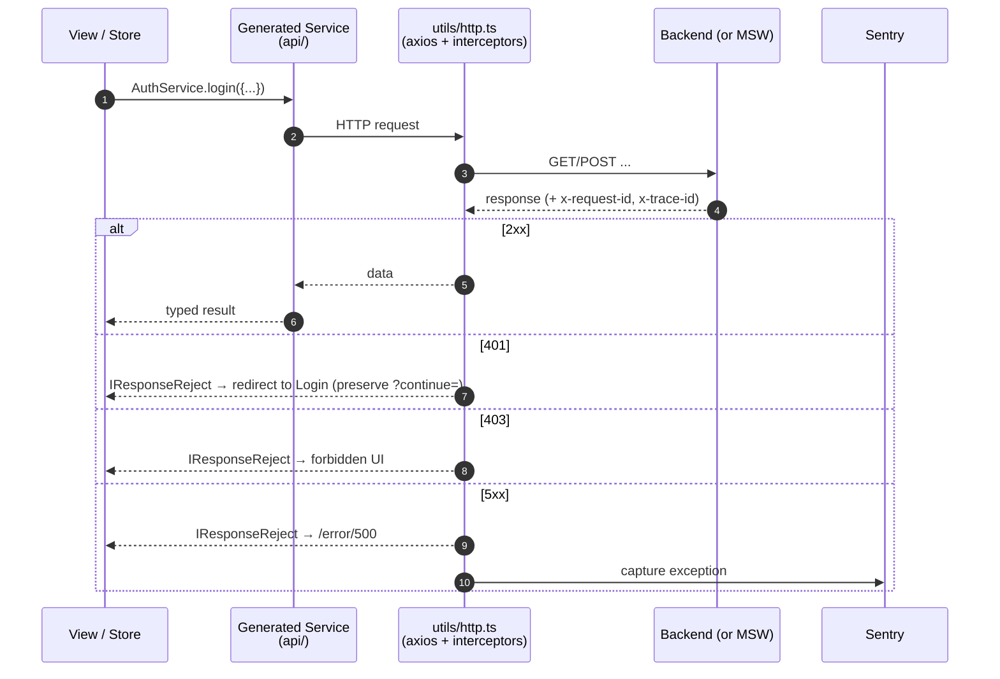
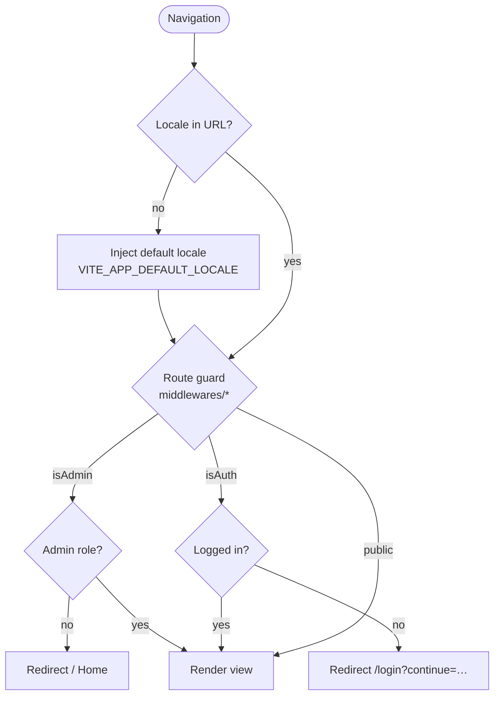
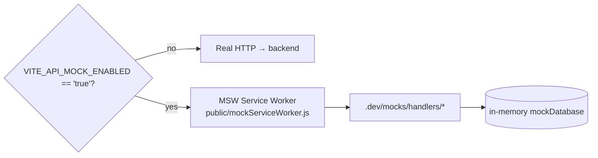

# boilerplate-vue-frontend

> Vue 3 + TypeScript SPA boilerplate, OpenAPI-first, paired with [`boilerplate-node-backend`](https://github.com/Guebbit/boilerplate-node-backend).

See also: [PAIRING.md](./PAIRING.md) for FE/BE pairing rules, [AI_README.md](./AI_README.md) for AI-agent guidance.

---

## Table of contents

- [Quick start](#quick-start)
- [Tech stack & official docs](#tech-stack--official-docs)
- [Architecture at a glance](#architecture-at-a-glance)
- [Folder structure](#folder-structure)
- [Environment variables](#environment-variables)
- [npm scripts](#npm-scripts)
- [Validation gate](#validation-gate)
- [OpenAPI contract flow](#openapi-contract-flow)
- [HTTP & error handling](#http--error-handling)
- [Routing, auth & i18n](#routing-auth--i18n)
- [Mocking with MSW](#mocking-with-msw)
- [Testing](#testing)
- [Observability (Sentry, request/trace IDs)](#observability-sentry-requesttrace-ids)
- [Admin Dashboard](#admin-dashboard)
- [TODO / roadmap](#todo--roadmap)

---

## Quick start

> Requires **[Node.js 22+](https://nodejs.org/)** and `npm`.

```bash
npm ci                # install dependencies
cp .env-example .env  # create local env file
npm run dev           # start Vite dev server on :8080
```

Then open <http://localhost:8080>.

---

## Tech stack & official docs

Every tool below has a one-line "why we use it" + a link to its official documentation. Use it as a starting point if you are new to the codebase.

### Runtime & language

| Tool                                              | Why it's here                                | Docs                                                                   |
| ------------------------------------------------- | -------------------------------------------- | ---------------------------------------------------------------------- |
| **[Vue 3](https://vuejs.org/)**                   | Reactive UI framework, Composition API, SFCs | [vuejs.org/guide](https://vuejs.org/guide/introduction.html)           |
| **[TypeScript](https://www.typescriptlang.org/)** | Static typing for app + generated API client | [ts handbook](https://www.typescriptlang.org/docs/handbook/intro.html) |
| **[Node.js 22+](https://nodejs.org/)**            | Required runtime for dev tooling             | [nodejs.org/docs](https://nodejs.org/docs/latest-v22.x/api/)           |

### Build & bundling

| Tool                                                                            | Why it's here                       | Docs                                                                |
| ------------------------------------------------------------------------------- | ----------------------------------- | ------------------------------------------------------------------- |
| **[Vite](https://vite.dev/)**                                                   | Dev server + production bundler     | [vite.dev/guide](https://vite.dev/guide/)                           |
| **[@vitejs/plugin-vue](https://github.com/vitejs/vite-plugin-vue)**             | `.vue` SFC support in Vite          | [package readme](https://github.com/vitejs/vite-plugin-vue#readme)  |
| **[vue-tsc](https://github.com/vuejs/language-tools/tree/master/packages/tsc)** | Type-check `.vue` files in CI/build | [language-tools repo](https://github.com/vuejs/language-tools)      |
| **[Sass / sass-embedded](https://sass-lang.com/)**                              | SCSS authoring for shared styles    | [sass-lang.com/documentation](https://sass-lang.com/documentation/) |

### State, routing, i18n

| Tool                                          | Why it's here                           | Docs                                                                      |
| --------------------------------------------- | --------------------------------------- | ------------------------------------------------------------------------- |
| **[Pinia](https://pinia.vuejs.org/)**         | Global state stores (`src/stores/`)     | [pinia.vuejs.org/introduction](https://pinia.vuejs.org/introduction.html) |
| **[Vue Router](https://router.vuejs.org/)**   | SPA routing + per-feature route modules | [router.vuejs.org/guide](https://router.vuejs.org/guide/)                 |
| **[Vue I18n](https://vue-i18n.intlify.dev/)** | Locale messages, locale-prefixed routes | [vue-i18n.intlify.dev/guide](https://vue-i18n.intlify.dev/guide/)         |

### API & contract

| Tool                                                                                        | Why it's here                                              | Docs                                                                                              |
| ------------------------------------------------------------------------------------------- | ---------------------------------------------------------- | ------------------------------------------------------------------------------------------------- |
| **[OpenAPI 3.x](https://www.openapis.org/)** (`openapi.yaml`)                               | Single source of truth for FE ⇄ BE contract                | [OpenAPI specification](https://spec.openapis.org/oas/latest.html)                                |
| **[openapi-typescript-codegen](https://github.com/ferdikoomen/openapi-typescript-codegen)** | Generates typed axios client into `/api`                   | [package readme](https://github.com/ferdikoomen/openapi-typescript-codegen#readme)                |
| **[Axios](https://axios-http.com/)**                                                        | HTTP client used under the generated services              | [axios-http.com/docs](https://axios-http.com/docs/intro)                                          |
| **[Zod](https://zod.dev/)**                                                                 | Runtime schema validation (forms, parsing untrusted input) | [zod.dev](https://zod.dev/)                                                                       |
| **[openapi-zod-client](https://github.com/astahmer/openapi-zod-client)**                    | Optional: generate Zod schemas from `openapi.yaml`         | [package readme](https://github.com/astahmer/openapi-zod-client#readme)                           |
| **[Spectral](https://stoplight.io/open-source/spectral)**                                   | Lints `openapi.yaml` (rules in `spectral.yaml`)            | [meta.stoplight.io/docs/spectral](https://meta.stoplight.io/docs/spectral/674b27b261c3c-overview) |

### Quality & tooling

| Tool                                                   | Why it's here                                 | Docs                                                                                  |
| ------------------------------------------------------ | --------------------------------------------- | ------------------------------------------------------------------------------------- |
| **[ESLint](https://eslint.org/)**                      | Lint TS/Vue (`eslint.config.ts`, flat config) | [eslint.org/docs](https://eslint.org/docs/latest/)                                    |
| **[eslint-plugin-vue](https://eslint.vuejs.org/)**     | Vue-specific lint rules                       | [eslint.vuejs.org/user-guide](https://eslint.vuejs.org/user-guide/)                   |
| **[typescript-eslint](https://typescript-eslint.io/)** | TypeScript-aware lint rules                   | [typescript-eslint.io/getting-started](https://typescript-eslint.io/getting-started/) |
| **[Prettier](https://prettier.io/)**                   | Code formatting (`.prettierrc`)               | [prettier.io/docs](https://prettier.io/docs/en/index.html)                            |

### Testing

| Tool                                                                           | Why it's here                                     | Docs                                                                       |
| ------------------------------------------------------------------------------ | ------------------------------------------------- | -------------------------------------------------------------------------- |
| **[Vitest](https://vitest.dev/)**                                              | Unit tests (`tests/unit/`, `vitest.config.ts`)    | [vitest.dev/guide](https://vitest.dev/guide/)                              |
| **[@vue/test-utils](https://test-utils.vuejs.org/)**                           | Component mounting/assertions                     | [test-utils.vuejs.org/guide](https://test-utils.vuejs.org/guide/)          |
| **[jsdom](https://github.com/jsdom/jsdom)**                                    | DOM environment for unit tests                    | [jsdom readme](https://github.com/jsdom/jsdom#readme)                      |
| **[Cypress](https://www.cypress.io/)**                                         | E2E tests (`cypress/e2e/`)                        | [docs.cypress.io](https://docs.cypress.io/)                                |
| **[MSW](https://mswjs.io/)**                                                   | Request mocking for dev + Cypress (`.dev/mocks/`) | [mswjs.io/docs](https://mswjs.io/docs/)                                    |
| **[start-server-and-test](https://github.com/bahmutov/start-server-and-test)** | Boots Vite + waits before running Cypress         | [package readme](https://github.com/bahmutov/start-server-and-test#readme) |

### Observability & UI libs

| Tool                                                                           | Why it's here                                                 | Docs                                                                                                      |
| ------------------------------------------------------------------------------ | ------------------------------------------------------------- | --------------------------------------------------------------------------------------------------------- |
| **[@sentry/vue](https://docs.sentry.io/platforms/javascript/guides/vue/)**     | Crash + performance monitoring (opt-in via `VITE_SENTRY_DSN`) | [docs.sentry.io/platforms/javascript/guides/vue](https://docs.sentry.io/platforms/javascript/guides/vue/) |
| **[@guebbit/css-toolkit](https://www.npmjs.com/package/@guebbit/css-toolkit)** | Shared SCSS utilities / tokens                                | [npm](https://www.npmjs.com/package/@guebbit/css-toolkit)                                                 |
| **[@guebbit/vue-toolkit](https://www.npmjs.com/package/@guebbit/vue-toolkit)** | Shared Vue components / composables                           | [npm](https://www.npmjs.com/package/@guebbit/vue-toolkit)                                                 |

> 💡 If you bump any of these, check the matching docs page first — most breaking changes are documented on the front page of each tool's site.

---

## Architecture at a glance

```mermaid
flowchart LR
    subgraph Browser["🌐 Browser SPA"]
        V[Vue 3 components<br/>views & features]
        P[Pinia stores<br/>src/stores]
        R[Vue Router<br/>src/router]
        I18N[Vue I18n<br/>src/locales]
    end

    subgraph Generated["📦 Generated layer"]
        API["/api OpenAPI client<br/>(axios + types)"]
    end

    subgraph Shared["🔧 Shared utils"]
        HTTP[utils/http.ts<br/>axios + interceptors]
        SENTRY[@sentry/vue]
    end

    subgraph Backend["🖥️ Backend"]
        BE[boilerplate-node-backend]
    end

    subgraph DevOnly["🧪 Dev / Test only"]
        MSW[MSW handlers<br/>.dev/mocks]
    end

    V --> P
    V --> R
    V --> I18N
    P --> API
    API --> HTTP
    HTTP -->|HTTP/JSON| BE
    HTTP -.intercepted by.-> MSW
    HTTP -->|errors| SENTRY
```

Key principles:

- **OpenAPI first.** `openapi.yaml` is the contract. Types and the axios client are generated from it.
- **Stores own data.** Views call composables/stores; stores call the generated API.
- **Interceptors own error shape.** Every HTTP error becomes an `IResponseReject` envelope.
- **Mocks are toggled by env.** MSW activates only when `VITE_API_MOCK_ENABLED=true`.

---

## Folder structure

```text
src/
├── components/      reusable UI components (atoms/molecules/organisms)
├── composables/     generic, cross-feature composables
├── features/        feature modules (account, admin, cart, orders, products, users)
│   └── <feature>/
│       ├── components/
│       ├── composables/
│       ├── views/
│       ├── routes.ts
│       └── types.ts
├── layouts/         page layout shells
├── locales/         vue-i18n messages
├── middlewares/     route navigation guards
├── router/          router instance + locale routing
├── stores/          Pinia stores
├── styles/          global SCSS (theme, main)
├── types/           shared TS types (incl. re-exports from @api)
├── utils/           http, api wiring, i18n, forms, multipart, sockets, errors
├── views/           top-level (non-feature) views
├── App.vue
└── main.ts          bootstrap (Pinia + Router + i18n + Sentry + MSW)

api/                 generated OpenAPI client (DO NOT edit by hand)
.dev/mocks/          MSW handlers + mock fixtures
cypress/             e2e specs
tests/               vitest unit tests
openapi.yaml         API contract (source of truth)
spectral.yaml        OpenAPI lint rules
```

---

## Environment variables

Reference: [`.env-example`](./.env-example).

| Variable                         | Purpose                                                                                     |
| -------------------------------- | ------------------------------------------------------------------------------------------- |
| `VITE_APP_DEFAULT_LOCALE`        | Initial locale (e.g. `en`)                                                                  |
| `VITE_APP_SUPPORTED_LOCALES`     | Comma-separated supported locales (e.g. `en,it,es`)                                         |
| `VITE_APP_PUBLIC_PATH`           | Public path served by Vite                                                                  |
| `VITE_APP_BASE_URL`              | Router history base URL (optional)                                                          |
| `VITE_API_URL`                   | Backend API base URL                                                                        |
| `VITE_API_WEBSOCKET`             | WebSocket URL used by demo page (`ws://…`; `http://…` is auto-converted)                    |
| `VITE_API_MOCK_ENABLED`          | Enable [MSW](https://mswjs.io/) mocking (`true`/`false`) — see [Mocking](#mocking-with-msw) |
| `VITE_AXIOS_TIMEOUT`             | [Axios](https://axios-http.com/) timeout (ms)                                               |
| `VITE_APP_DEBUG_ROUTER`          | Router debug logs in dev (`true`/`false`)                                                   |
| `VITE_APP_DEBUG_HOME`            | Home view demo logs in dev (`true`/`false`)                                                 |
| `VITE_APP_DEBUG_HTTP`            | HTTP interceptor debug logs for server errors (`true`/`false`)                              |
| `VITE_SENTRY_DSN`                | [Sentry](https://docs.sentry.io/platforms/javascript/guides/vue/) DSN (empty = off)         |
| `VITE_SENTRY_TRACES_SAMPLE_RATE` | Sentry tracing sample rate (`0`..`1`, clamped)                                              |

> ℹ️ **What Sentry does:** it collects FE crashes + optional performance traces so you can see what broke, where, and for which users in production. Disabled when `VITE_SENTRY_DSN` is empty.

---

## npm scripts

| Script                   | Purpose                                                                        |
| ------------------------ | ------------------------------------------------------------------------------ |
| `npm run dev`            | Start [Vite](https://vite.dev/) dev server on `:8080`                          |
| `npm run build`          | `vue-tsc` type-check **+** production build                                    |
| `npm run preview`        | Preview built app                                                              |
| `npm run lint`           | Run [ESLint](https://eslint.org/) (check)                                      |
| `npm run lint:fix`       | Run ESLint with `--fix`                                                        |
| `npm run lint:openapi`   | Lint `openapi.yaml` with [Spectral](https://stoplight.io/open-source/spectral) |
| `npm run prettier`       | [Prettier](https://prettier.io/) check (alias for `prettier:check`)            |
| `npm run prettier:fix`   | Prettier write                                                                 |
| `npm run test:unit`      | [Vitest](https://vitest.dev/) unit tests                                       |
| `npm run test:e2e`       | Start Vite (with MSW) + run [Cypress](https://www.cypress.io/) e2e             |
| `npm run test`           | `test:unit` then `test:e2e`                                                    |
| `npm run genapi`         | Regenerate `/api` client from `openapi.yaml`                                   |
| `npm run complete`       | build + lint:fix + lint:openapi + prettier:fix + tests (local hardening)       |
| `npm run complete:check` | build + lint + lint:openapi + prettier:check + tests (CI gate)                 |

---

## Validation gate

Run before opening or updating a PR:

```bash
npm run lint
npm run build
npm run test:unit
```

CI runs the strict gate:

```bash
npm run complete:check
```

---

## OpenAPI contract flow

`openapi.yaml` is the contract; the `/api` folder is **generated**. Never hand-edit `/api`.



Steps:

1. Edit [`openapi.yaml`](./openapi.yaml).
2. `npm run lint:openapi` — must be green.
3. `npm run genapi` — regenerates `/api` (commit the diff).
4. Update store/view usages if any operation signatures changed.
5. Sync with backend (see [PAIRING.md](./PAIRING.md)).

---

## HTTP & error handling

Single axios instance lives in `src/utils/http.ts`, wired into the generated client via `src/utils/api.ts`.



Conventions:

- **`401`** = _not logged in_. Route-level failures redirect to Login with `?continue=` preserved; form/list actions show auth-focused messages instead of generic server errors.
- **`403`** = _forbidden_. Shown as a clear authorization message (never as 500).
- **`5xx`** = real server failure → `/error/500` flow.
- Backend correlation headers (`x-request-id`, `x-trace-id`) are captured into `IResponseReject` for cross-service debugging — see [PAIRING.md](./PAIRING.md#request--trace-ids-in-errors).

---

## Routing, auth & i18n

Routes are locale-prefixed (`/:locale/...`). Locale handling lives in `src/middlewares/localeChoice.ts` and `src/utils/i18n.ts`.



Tools used here:

- [Vue Router](https://router.vuejs.org/) for navigation + guards.
- [Vue I18n](https://vue-i18n.intlify.dev/) for messages and locale switching.

---

## Mocking with MSW

[MSW](https://mswjs.io/) intercepts HTTP at the network layer so the SPA can run without a backend.



- Worker file is committed in `public/mockServiceWorker.js` (generated by `msw init`).
- Handlers live in `.dev/mocks/handlers/*` and share an in-memory DB via `.dev/mocks/shared/`.
- Cypress runs with `VITE_API_MOCK_ENABLED=true` so e2e is deterministic.

Official: [mswjs.io/docs](https://mswjs.io/docs/) · [browser integration](https://mswjs.io/docs/integrations/browser).

---

## Testing

| Layer | Tool                                                                                                                       | Where          |
| ----- | -------------------------------------------------------------------------------------------------------------------------- | -------------- |
| Unit  | [Vitest](https://vitest.dev/) + [@vue/test-utils](https://test-utils.vuejs.org/) + [jsdom](https://github.com/jsdom/jsdom) | `tests/unit/`  |
| E2E   | [Cypress](https://www.cypress.io/) + MSW                                                                                   | `cypress/e2e/` |

Commands:

```bash
npm run test:unit     # vitest run (CI mode)
npm run test:e2e      # boots Vite (with MSW) + cypress run
npm run test:e2e:dev  # opens Cypress UI
```

> 🧪 New tests should target behavior, not implementation. Prefer component contracts (props/emits/slots) over snapshots.

---

## Observability (Sentry, request/trace IDs)

- [@sentry/vue](https://docs.sentry.io/platforms/javascript/guides/vue/) is initialized in `src/main.ts` only when `VITE_SENTRY_DSN` is set.
- `VITE_SENTRY_TRACES_SAMPLE_RATE` is clamped to `[0, 1]`.
- This frontend does **not** emit browser OpenTelemetry spans by default. For cross-service debugging, keep using `x-request-id` / `x-trace-id` from backend responses (captured by `utils/http.ts`).
- Future option: add browser OTel instrumentation and forward `traceparent` / `tracestate`. Reference: [opentelemetry.io/docs/languages/js](https://opentelemetry.io/docs/languages/js/).

---

## Admin Dashboard

Route: `/:locale/admin` — requires admin role (non-admins are redirected Home).

### Overview tab

Fetches live data from two contract-defined endpoints:

| Endpoint                     | What it shows                                                                                |
| ---------------------------- | -------------------------------------------------------------------------------------------- |
| `GET /admin/health`          | API status, database status, uptime, memory, integrations (Loki, PostHog, OTEL), system info |
| `GET /admin/metrics/summary` | HTTP totals, error rate, in-flight requests, p50/p95 latency, auth events, business events   |

KPI cards at the top give an instant health snapshot:

```text
┌─────────────┐ ┌──────────────┐ ┌──────────┐ ┌──────────────┐
│  API Status │ │   Database   │ │  Uptime  │ │  Requests    │
│     ok      │ │  connected   │ │  1h 30m  │ │    1042      │
└─────────────┘ └──────────────┘ └──────────┘ └──────────────┘
┌─────────────┐ ┌──────────────┐ ┌──────────┐ ┌──────────────┐
│   Errors    │ │  Error Rate  │ │ Lat. p50 │ │  Lat. p95    │
│     12      │ │    1.2%      │ │  18ms    │ │    85ms      │
└─────────────┘ └──────────────┘ └──────────┘ └──────────────┘
```

### Audit Log tab

Fetches from `GET /admin/audit` with optional filters:

- **Actor** — filter by user ID
- **Action** — dot-notation action (e.g. `auth.login.failed`)
- **Outcome** — success / failure
- **Since** — ISO-8601 timestamp

Displays a colour-coded table with truncated request/trace IDs (hover for full value).

### Data contract

All types are driven by `openapi.yaml` (admin section) and reflected in:

- `api/api.ts` — generated interfaces (`AdminHealth`, `AdminMetricsSummary`, `AuditEventItem`, …)
- `src/features/admin/types.ts` — FE view-model types (`IAdminKpi`, `IAdminAuditFilters`)
- `src/features/admin/composables/useAdminObservability.ts` — single composable for health + metrics + audit
- `.dev/mocks/handlers/adminMockHandlers.ts` — MSW mock responses for dev/test

---

## TODO / roadmap

- Fix tests
- Signup should send an email with a link to confirm the account
  (CHECK `api-mongodb-mongoose` — currently it just creates the user)
    - Create the registration confirmation page
- Create the reset password page and reset password confirm page
- Add image upload in the various forms
- Always call `useXYZStore()` inside functions, not at top level — avoids circular dependency issues (unless explicitly dependent)
- Create a NUXT variant
- Create a Vuetify variant
- Create a Quasar variant
- Do Vitest tests
- Do Cypress tests
- Create skeleton version
- From skeleton: css-ui version
    - remember to take old `_root.scss` and old `_cards.scss` (for simple-card) from older commits
- From skeleton: vuetify version
- From skeleton: quasar version

### MAYBE?

- Extend `useI18n` (or create a new one) to add custom helpers from `utils/i18n.ts`
- From skeleton: bootstrap version
- Do Lighthouse metrics tests
