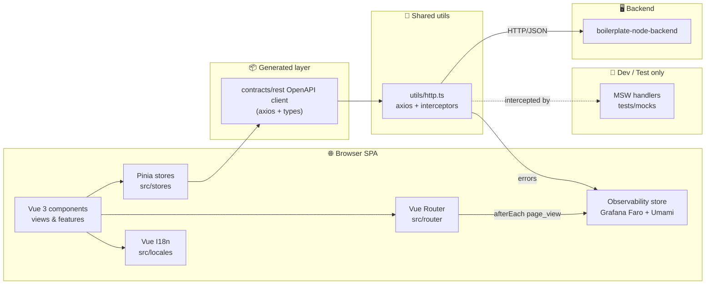
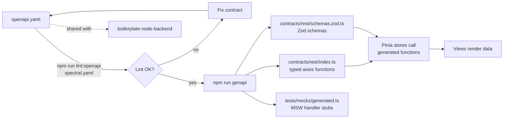
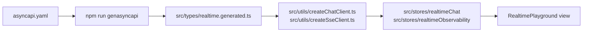
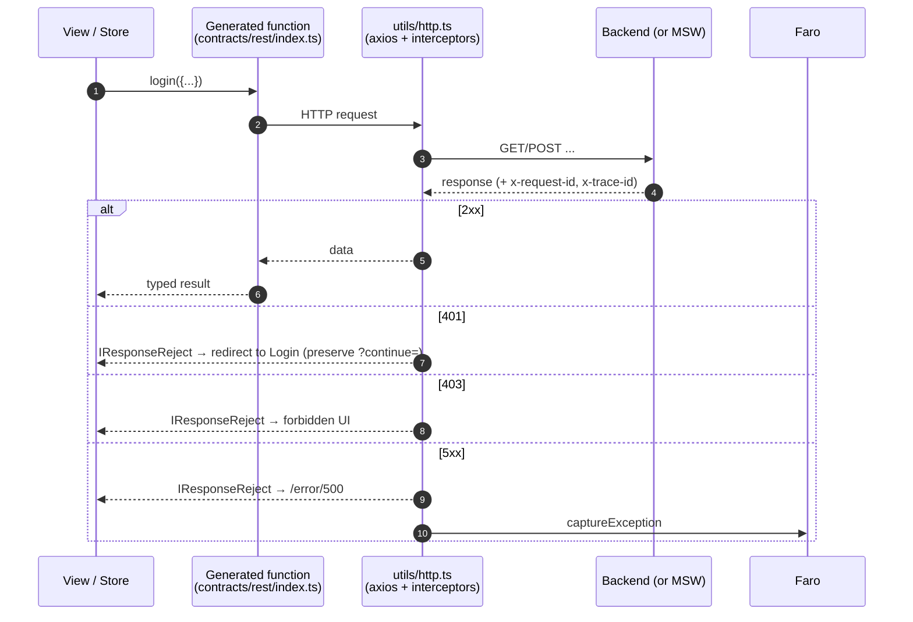
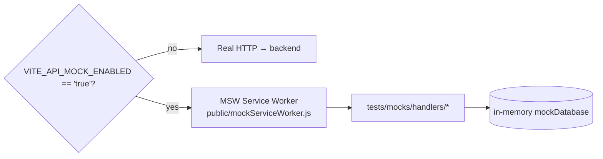

# boilerplate-vue-frontend

> Vue 3 + TypeScript SPA boilerplate, OpenAPI-first, paired with [`boilerplate-node-backend`](https://github.com/Guebbit/boilerplate-node-backend).

---

## Table of contents

- [Quick start](#quick-start)
- [Tech stack & official docs](#tech-stack--official-docs)
- [Architecture at a glance](#architecture-at-a-glance)
- [Folder structure](#folder-structure)
- [Sitemap & access control](#sitemap--access-control)
- [Environment variables](#environment-variables)
- [npm scripts](#npm-scripts)
- [Validation gate](#validation-gate)
- [OpenAPI contract flow](#openapi-contract-flow)
- [AsyncAPI realtime flow](#asyncapi-realtime-flow)
- [HTTP & error handling](#http--error-handling)
- [Routing, auth & i18n](#routing-auth--i18n)
- [Mocking with MSW](#mocking-with-msw)
- [Testing](#testing)
- [Observability (Grafana Faro, Umami, analytics)](#observability-grafana-faro-umami-analytics)
- [Admin Dashboard](#admin-dashboard)
- [TODO / roadmap](#todo--roadmap)

---

## Quick start

> Requires **[Node.js 22+](https://nodejs.org/)** and `npm`.

```bash
npm ci                # install dependencies
cp .env-example .env  # create local env file
npm run dev           # start Vite dev server on :8080
```

Then open <http://localhost:8080>.

---

## Tech stack & official docs

Every tool below has a one-line "why we use it" + a link to its official documentation. Use it as a starting point if you are new to the codebase.

### Runtime & language

| Tool                                              | Why it's here                                | Docs                                                                   |
| ------------------------------------------------- | -------------------------------------------- | ---------------------------------------------------------------------- |
| **[Vue 3](https://vuejs.org/)**                   | Reactive UI framework, Composition API, SFCs | [vuejs.org/guide](https://vuejs.org/guide/introduction.html)           |
| **[TypeScript](https://www.typescriptlang.org/)** | Static typing for app + generated API client | [ts handbook](https://www.typescriptlang.org/docs/handbook/intro.html) |
| **[Node.js 22+](https://nodejs.org/)**            | Required runtime for dev tooling             | [nodejs.org/docs](https://nodejs.org/docs/latest-v22.x/api/)           |

### Build & bundling

| Tool                                                                            | Why it's here                       | Docs                                                                |
| ------------------------------------------------------------------------------- | ----------------------------------- | ------------------------------------------------------------------- |
| **[Vite](https://vite.dev/)**                                                   | Dev server + production bundler     | [vite.dev/guide](https://vite.dev/guide/)                           |
| **[@vitejs/plugin-vue](https://github.com/vitejs/vite-plugin-vue)**             | `.vue` SFC support in Vite          | [package readme](https://github.com/vitejs/vite-plugin-vue#readme)  |
| **[vue-tsc](https://github.com/vuejs/language-tools/tree/master/packages/tsc)** | Type-check `.vue` files in CI/build | [language-tools repo](https://github.com/vuejs/language-tools)      |
| **[Sass / sass-embedded](https://sass-lang.com/)**                              | SCSS authoring for shared styles    | [sass-lang.com/documentation](https://sass-lang.com/documentation/) |

### State, routing, i18n

| Tool                                          | Why it's here                           | Docs                                                                      |
| --------------------------------------------- | --------------------------------------- | ------------------------------------------------------------------------- |
| **[Pinia](https://pinia.vuejs.org/)**         | Global state stores (`src/stores/`)     | [pinia.vuejs.org/introduction](https://pinia.vuejs.org/introduction.html) |
| **[Vue Router](https://router.vuejs.org/)**   | SPA routing + per-feature route modules | [router.vuejs.org/guide](https://router.vuejs.org/guide/)                 |
| **[Vue I18n](https://vue-i18n.intlify.dev/)** | Locale messages, locale-prefixed routes | [vue-i18n.intlify.dev/guide](https://vue-i18n.intlify.dev/guide/)         |

### API & contract

| Tool                                                            | Why it's here                                                                | Docs                                                                                              |
| --------------------------------------------------------------- | ---------------------------------------------------------------------------- | ------------------------------------------------------------------------------------------------- |
| **[OpenAPI 3.x](https://www.openapis.org/)** (`openapi.yaml`)   | Single source of truth for FE ⇄ BE contract                                  | [OpenAPI specification](https://spec.openapis.org/oas/latest.html)                                |
| **[AsyncAPI 2.x](https://www.asyncapi.com/)** (`asyncapi.yaml`) | Single source of truth for SSE/WebSocket realtime contracts                  | [AsyncAPI specification](https://www.asyncapi.com/docs/reference/specification/latest)            |
| **[Orval](https://orval.dev/)**                                 | Generates typed axios client, Zod schemas, and MSW stubs from `openapi.yaml` | [orval.dev/overview](https://orval.dev/overview)                                                  |
| **[@faker-js/faker](https://fakerjs.dev/)**                     | Fake data used by orval-generated MSW handler stubs                          | [fakerjs.dev/guide](https://fakerjs.dev/guide/)                                                   |
| **[Axios](https://axios-http.com/)**                            | HTTP client used under the generated services                                | [axios-http.com/docs](https://axios-http.com/docs/intro)                                          |
| **[Zod](https://zod.dev/)**                                     | Runtime schema validation (forms, parsing untrusted input)                   | [zod.dev](https://zod.dev/)                                                                       |
| **[Spectral](https://stoplight.io/open-source/spectral)**       | Lints `openapi.yaml` (rules in `spectral.yaml`)                              | [meta.stoplight.io/docs/spectral](https://meta.stoplight.io/docs/spectral/674b27b261c3c-overview) |

### Quality & tooling

| Tool                                                   | Why it's here                                 | Docs                                                                                  |
| ------------------------------------------------------ | --------------------------------------------- | ------------------------------------------------------------------------------------- |
| **[ESLint](https://eslint.org/)**                      | Lint TS/Vue (`eslint.config.ts`, flat config) | [eslint.org/docs](https://eslint.org/docs/latest/)                                    |
| **[eslint-plugin-vue](https://eslint.vuejs.org/)**     | Vue-specific lint rules                       | [eslint.vuejs.org/user-guide](https://eslint.vuejs.org/user-guide/)                   |
| **[typescript-eslint](https://typescript-eslint.io/)** | TypeScript-aware lint rules                   | [typescript-eslint.io/getting-started](https://typescript-eslint.io/getting-started/) |
| **[Prettier](https://prettier.io/)**                   | Code formatting (`.prettierrc`)               | [prettier.io/docs](https://prettier.io/docs/en/index.html)                            |

### Testing

| Tool                                                                           | Why it's here                                      | Docs                                                                       |
| ------------------------------------------------------------------------------ | -------------------------------------------------- | -------------------------------------------------------------------------- |
| **[Vitest](https://vitest.dev/)**                                              | Unit tests (`tests/unit/`, `vitest.config.ts`)     | [vitest.dev/guide](https://vitest.dev/guide/)                              |
| **[@vue/test-utils](https://test-utils.vuejs.org/)**                           | Component mounting/assertions                      | [test-utils.vuejs.org/guide](https://test-utils.vuejs.org/guide/)          |
| **[jsdom](https://github.com/jsdom/jsdom)**                                    | DOM environment for unit tests                     | [jsdom readme](https://github.com/jsdom/jsdom#readme)                      |
| **[Cypress](https://www.cypress.io/)**                                         | E2E tests (`tests/e2e/specs/`)                     | [docs.cypress.io](https://docs.cypress.io/)                                |
| **[MSW](https://mswjs.io/)**                                                   | Request mocking for dev + Cypress (`tests/mocks/`) | [mswjs.io/docs](https://mswjs.io/docs/)                                    |
| **[start-server-and-test](https://github.com/bahmutov/start-server-and-test)** | Boots Vite + waits before running Cypress          | [package readme](https://github.com/bahmutov/start-server-and-test#readme) |

### Observability & UI libs

| Tool                                                                                                                              | Why it's here                                                                                                         | Docs                                                                                                                                            |
| --------------------------------------------------------------------------------------------------------------------------------- | --------------------------------------------------------------------------------------------------------------------- | ----------------------------------------------------------------------------------------------------------------------------------------------- |
| **[@grafana/faro-web-sdk](https://grafana.com/docs/grafana-cloud/monitor-applications/frontend-observability/faro-web-sdk/)**     | Error monitoring + frontend tracing + web-vitals to a self-hosted Grafana Alloy receiver (opt-in via `VITE_FARO_URL`) | [grafana.com · Faro Web SDK](https://grafana.com/docs/grafana-cloud/monitor-applications/frontend-observability/faro-web-sdk/)                  |
| **[@grafana/faro-web-tracing](https://grafana.com/docs/grafana-cloud/monitor-applications/frontend-observability/faro-web-sdk/)** | Distributed tracing for fetch/XHR; propagates `traceparent` to the API so FE↔BE traces link                           | [grafana.com · Faro tracing](https://grafana.com/docs/grafana-cloud/monitor-applications/frontend-observability/faro-web-sdk/instrumentations/) |
| **[Umami](https://umami.is/docs)**                                                                                                | Self-hosted product analytics — pageviews + custom events (opt-in via `VITE_UMAMI_WEBSITE_ID`)                        | [umami.is/docs](https://umami.is/docs)                                                                                                          |
| **[@guebbit/css-toolkit](https://www.npmjs.com/package/@guebbit/css-toolkit)**                                                    | Shared SCSS utilities / tokens                                                                                        | [npm](https://www.npmjs.com/package/@guebbit/css-toolkit)                                                                                       |
| **[@guebbit/vue-toolkit](https://www.npmjs.com/package/@guebbit/vue-toolkit)**                                                    | Shared Vue components / composables                                                                                   | [npm](https://www.npmjs.com/package/@guebbit/vue-toolkit)                                                                                       |

> If you bump any of these, check the matching docs page first — most breaking changes are documented on the front page of each tool's site.

---

## Architecture at a glance



Key principles:

- **OpenAPI first.** `openapi.yaml` is the contract. Types and the axios client are generated from it.
- **AsyncAPI for realtime.** `asyncapi.yaml` drives generated realtime/channel types in `src/types/realtime.generated.ts`; `src/types/realtime.ts` stays as thin app-only helpers.
- **Stores own data.** Views call composables/stores; stores call the generated API.
- **Interceptors own error shape.** Every HTTP error becomes an `IResponseReject` envelope.
- **Mocks are toggled by env.** MSW activates only when `VITE_API_MOCK_ENABLED=true`.
- **Single observability store.** Grafana Faro and Umami are consolidated in `src/stores/observability.ts`; never scatter vendor calls into components.

---

## Folder structure

```text
src/
├── components/      reusable UI components (atoms/molecules/organisms)
├── features/        feature modules (account, admin, cart, orders, products, realtime, users)
│   └── <feature>/
│       ├── components/
│       ├── composables/
│       ├── views/
│       ├── routes.ts
│       └── types.ts
├── layouts/         page layout shells (LayoutDefault.vue)
├── locales/         vue-i18n messages
├── middlewares/     route navigation guards (authentications, localeChoice, demoMiddleware)
├── router/          router instance + locale routing
├── stores/          Pinia stores (counter, observability, profile, realtimeChat, realtimeObservability)
├── styles/          global SCSS (theme, main)
├── types/           shared TS types (incl. re-exports from @api)
├── utils/           http, api wiring, i18n, forms, multipart, sockets, errors, navigation, composables
├── views/           top-level (non-feature) views (Home, Playground, Error)
├── App.vue
└── main.ts          bootstrap (Pinia + Router + i18n + Grafana Faro + Umami + MSW)

contracts/
└── rest/
    ├── index.ts         generated axios functions + TS types  (DO NOT edit by hand)
    └── schemas.zod.ts   generated Zod schemas                 (DO NOT edit by hand)
tests/
├── mocks/
│   ├── generated.ts   orval-generated MSW stubs + faker factories (DO NOT edit)
│   └── handlers/      hand-written MSW handlers with in-memory DB logic
├── unit/              vitest unit tests
└── e2e/               Cypress e2e specs, fixtures, support
openapi.yaml         API contract (source of truth)
asyncapi.yaml        Realtime contract (source of truth)
spectral.yaml        OpenAPI lint rules
```

---

## Sitemap & access control

All routes are locale-prefixed (`/:locale/…`). Missing locale is injected automatically.

| Route                              | Name                   | Access                     |
| ---------------------------------- | ---------------------- | -------------------------- |
| `/:locale/`                        | `Home`                 | public                     |
| `/:locale/playground`              | `Playground`           | public                     |
| `/:locale/playground/realtime`     | `RealtimePlayground`   | public                     |
| `/:locale/error/:status/:message?` | `Error`                | public                     |
| `/:locale/login`                   | `Login`                | guest only                 |
| `/:locale/signup`                  | `Signup`               | guest only                 |
| `/:locale/password-reset`          | `PasswordResetRequest` | guest only                 |
| `/:locale/password-reset/confirm`  | `PasswordResetConfirm` | guest only                 |
| `/:locale/account-delete/confirm`  | `AccountDeleteConfirm` | public                     |
| `/:locale/profile`                 | `Profile`              | auth                       |
| `/:locale/logout`                  | `Logout`               | public (redirects to Home) |
| `/:locale/products`                | `ProductsList`         | public                     |
| `/:locale/products/:id`            | `ProductTarget`        | public                     |
| `/:locale/products/:id/edit`       | `ProductEdit`          | admin                      |
| `/:locale/cart`                    | `Cart`                 | auth                       |
| `/:locale/orders`                  | `OrdersList`           | auth                       |
| `/:locale/orders/:id`              | `OrderTarget`          | auth                       |
| `/:locale/orders/:id/edit`         | `OrderEdit`            | admin                      |
| `/:locale/users`                   | `UsersList`            | admin                      |
| `/:locale/users/create`            | `UserCreate`           | admin                      |
| `/:locale/users/:id`               | `UserTarget`           | admin                      |
| `/:locale/users/:id/edit`          | `UserEdit`             | admin                      |
| `/:locale/admin`                   | `Admin`                | admin                      |
| `/:locale/:catchAll(.*)`           | —                      | redirect → `Error 404`     |

Access level legend: **public** = no guard · **guest only** = `isGuest` (logged-in users are redirected away) · **auth** = `isAuth` (must be logged in) · **admin** = `isAdmin` (must have admin role).

---

## Environment variables

Reference: [`.env-example`](./.env-example).

| Variable                     | Purpose                                                                                                                                                        |
| ---------------------------- | -------------------------------------------------------------------------------------------------------------------------------------------------------------- |
| `VITE_APP_DEFAULT_LOCALE`    | Initial locale (e.g. `en`)                                                                                                                                     |
| `VITE_APP_SUPPORTED_LOCALES` | Comma-separated supported locales (e.g. `en,it,es`)                                                                                                            |
| `VITE_APP_PUBLIC_PATH`       | Public path served by Vite                                                                                                                                     |
| `VITE_APP_BASE_URL`          | Router history base URL (optional)                                                                                                                             |
| `VITE_API_URL`               | Backend API base URL                                                                                                                                           |
| `VITE_API_WEBSOCKET`         | WebSocket URL used by realtime playground chat (`ws://…`; `http://…` is auto-converted)                                                                        |
| `VITE_API_SSE`               | SSE URL used by realtime playground observability stream                                                                                                       |
| `VITE_API_MOCK_ENABLED`      | Enable [MSW](https://mswjs.io/) mocking (`true`/`false`) — see [Mocking](#mocking-with-msw)                                                                    |
| `VITE_AXIOS_TIMEOUT`         | [Axios](https://axios-http.com/) timeout (ms)                                                                                                                  |
| `VITE_APP_DEBUG_ROUTER`      | Router debug logs in dev (`true`/`false`)                                                                                                                      |
| `VITE_APP_DEBUG_HOME`        | Home view demo logs in dev (`true`/`false`)                                                                                                                    |
| `VITE_APP_DEBUG_HTTP`        | HTTP interceptor debug logs for server errors (`true`/`false`)                                                                                                 |
| `VITE_FARO_URL`              | [Grafana Faro](https://grafana.com/docs/grafana-cloud/monitor-applications/frontend-observability/faro-web-sdk/) receiver URL — Alloy `/collect` (empty = off) |
| `VITE_FARO_APP_NAME`         | App name reported to Faro (default `frontend`)                                                                                                                 |
| `VITE_FARO_APP_VERSION`      | App version reported to Faro (default `1.0.0`)                                                                                                                 |
| `VITE_FARO_ENVIRONMENT`      | Faro environment tag (defaults to Vite `MODE`)                                                                                                                 |
| `VITE_UMAMI_WEBSITE_ID`      | [Umami](https://umami.is/) website id (empty = off)                                                                                                            |
| `VITE_UMAMI_SRC`             | Umami tracker script URL (default: `http://localhost:8090/script.js`)                                                                                          |

---

## npm scripts

| Script                   | Purpose                                                                                 |
| ------------------------ | --------------------------------------------------------------------------------------- |
| `npm run dev`            | Start [Vite](https://vite.dev/) dev server on `:8080`                                   |
| `npm run build`          | `vue-tsc` type-check **+** production build                                             |
| `npm run preview`        | Preview built app                                                                       |
| `npm run lint`           | Run [ESLint](https://eslint.org/) (check)                                               |
| `npm run lint:fix`       | Run ESLint with `--fix`                                                                 |
| `npm run lint:openapi`   | Lint `openapi.yaml` with [Spectral](https://stoplight.io/open-source/spectral)          |
| `npm run prettier`       | [Prettier](https://prettier.io/) check (alias for `prettier:check`)                     |
| `npm run prettier:fix`   | Prettier write                                                                          |
| `npm run test:unit`      | [Vitest](https://vitest.dev/) unit tests                                                |
| `npm run test:e2e`       | Start Vite (with MSW) + run [Cypress](https://www.cypress.io/) e2e                      |
| `npm run test`           | `test:unit` then `test:e2e`                                                             |
| `npm run genapi`         | Regenerate `contracts/rest` client from `openapi.yaml`                                  |
| `npm run genasyncapi`    | Run `tsx scripts/gen-asyncapi-types.ts` to regenerate `src/types/realtime.generated.ts` |
| `npm run complete`       | build + lint:fix + lint:openapi + prettier:fix + tests (local hardening)                |
| `npm run complete:check` | build + lint + lint:openapi + prettier:check + tests (CI gate)                          |

---

## Validation gate

Run before opening or updating a PR:

```bash
npm run lint
npm run build
npm run test:unit
```

CI runs the strict gate:

```bash
npm run complete:check
```

---

## OpenAPI contract flow

`openapi.yaml` is the contract; the `contracts/rest` folder is **generated**. Never hand-edit `contracts/rest`.



Steps:

1. Edit [`openapi.yaml`](./openapi.yaml).
2. `npm run lint:openapi` — must be green.
3. `npm run genapi` — regenerates `contracts/rest` (commit the diff).
4. Update store/view usages if any operation signatures changed.
    - Import Zod schemas from `@api/schemas` instead of writing them by hand.
    - Use `tests/mocks/generated.ts` as a skeleton if you need a new MSW handler stub.
5. Coordinate with the backend team — both repos consume `openapi.yaml` as the shared contract; keep paired branches in sync before merging.

---

## AsyncAPI realtime flow

`asyncapi.yaml` is the source of truth for frontend realtime contracts. Generated types stay under `src/types/*` and are consumed by realtime clients/composables/stores.



Current incremental rollout:

1. **Contracts first**: update `asyncapi.yaml`.
2. **Generate clients/types**: `npm run genapi` and `npm run genasyncapi`.
3. **Playground-first integration**: route `/:locale/playground/realtime`.
4. **Broader app integration**: wire feature flows after playground validation.

Dev/test strategy for realtime:

- HTTP stays mocked by MSW (`VITE_API_MOCK_ENABLED=true`).
- SSE/WebSocket can be tested with lightweight fake adapters in unit tests.
- Keep realtime logic in clients/composables/stores; keep views thin.

---

## HTTP & error handling

Single axios instance lives in `src/utils/http.ts`, wired into the generated client via `src/utils/api.ts`.



Conventions:

- **`401`** = _not logged in_. Route-level failures redirect to Login with `?continue=` preserved; form/list actions show auth-focused messages instead of generic server errors.
- **`403`** = _forbidden_. Shown as a clear authorization message (never as 500).
- **`5xx`** = real server failure → `/error/500` flow.
- Error objects carry correlation IDs (`x-request-id`, `x-trace-id`) useful when reporting issues to the backend team.

---

## Routing, auth & i18n

Routes are locale-prefixed (`/:locale/...`). Locale handling lives in `src/middlewares/localeChoice.ts` and `src/utils/i18n.ts`.


Tools used here:

- [Vue Router](https://router.vuejs.org/) for navigation + guards.
- [Vue I18n](https://vue-i18n.intlify.dev/) for messages and locale switching.

---

## Mocking with MSW

[MSW](https://mswjs.io/) intercepts HTTP at the network layer so the SPA can run without a backend.



- Worker file is committed in `public/mockServiceWorker.js` (generated by `msw init`).
- Handlers live in `tests/mocks/handlers/*` and share an in-memory DB via `tests/mocks/shared/`.
- Cypress runs with `VITE_API_MOCK_ENABLED=true` so e2e is deterministic.

Official: [mswjs.io/docs](https://mswjs.io/docs/) · [browser integration](https://mswjs.io/docs/integrations/browser).

---

## Testing

| Layer | Tool                                                                                                                       | Where              |
| ----- | -------------------------------------------------------------------------------------------------------------------------- | ------------------ |
| Unit  | [Vitest](https://vitest.dev/) + [@vue/test-utils](https://test-utils.vuejs.org/) + [jsdom](https://github.com/jsdom/jsdom) | `tests/unit/`      |
| E2E   | [Cypress](https://www.cypress.io/) + MSW                                                                                   | `tests/e2e/specs/` |

Commands:

```bash
npm run test:unit     # vitest run (CI mode)
npm run test:e2e      # boots Vite (with MSW) + cypress run
npm run test:e2e:dev  # opens Cypress UI
```

> New tests should target behavior, not implementation. Prefer component contracts (props/emits/slots) over snapshots.

---

## Observability (Grafana Faro, Umami, analytics)

All observability code is consolidated in `src/stores/observability.ts` (a Pinia store). Never scatter vendor calls directly from components. Everything runs against a **self-hosted local stack** (Docker/Podman) — no external SaaS. Verify data in **Grafana** (`http://localhost:3001`) and the **Umami dashboard** (`http://localhost:8090`).

### What each tool does

| Tool             | Role                                                                                                                                       |
| ---------------- | ------------------------------------------------------------------------------------------------------------------------------------------ |
| **Grafana Faro** | Error/crash monitoring, frontend tracing, Core Web Vitals. Ships to Grafana Alloy's Faro receiver. Disabled when `VITE_FARO_URL` is empty. |
| **Umami**        | Product analytics — pageviews (automatic) + custom events. Disabled when `VITE_UMAMI_WEBSITE_ID` is empty.                                 |

Both are initialized in `src/main.ts` and are no-ops when their env vars are absent, so local dev works without the stack running. The browser only ever talks to Grafana Alloy (`:12347`); Faro tracing propagates the W3C `traceparent` header to `VITE_API_URL` so FE and BE traces link in Tempo.

### Tracking events

```ts
import { useObservabilityStore, analyticsEvents } from '@/stores/observability';

const obs = useObservabilityStore();

// Generic event
obs.track(analyticsEvents.PRODUCT_VIEWED, { product_id: '123' });

// Convenience helpers
obs.trackProductView('123', 'Widget');
obs.trackItemAddedToCart('123', 2);
obs.trackOrderPlaced('order-abc', 49.99, 3);
obs.trackProductSearched('blue shoes');
```

Page views are tracked automatically by the Umami tracker (it hooks SPA history changes) — no manual call needed in views.

### Event taxonomy

Event names match the canonical names the backend emits, so FE and BE analytics line up.

| Category            | Events                                                                                          |
| ------------------- | ----------------------------------------------------------------------------------------------- |
| Lifecycle (FE-only) | `app_started`, `app_ready`                                                                      |
| Auth                | `user_signed_up`, `user_logged_in`, `user_logged_out`, `user_profile_viewed`, `account_deleted` |
| Products            | `products_searched`, `product_viewed`                                                           |
| Cart                | `cart_viewed`, `cart_item_added`, `cart_item_updated`, `cart_item_removed`, `cart_cleared`      |
| Checkout / Orders   | `checkout_completed`, `checkout_failed`, `order_created`, `orders_viewed`                       |

Pageviews are automatic (Umami) and are not in this table.

### Rules

- **No PII** in event properties — never send email, name, or personal data.
- **Use constants** from `analyticsEvents` — never hardcode event name strings, and keep them matching the backend.
- **Fire-and-forget** — never `await` a `track()` call.
- **Faro for errors, Umami for product events** — two jobs, one store; there is no feature-flag provider (`isFeatureEnabled()` always returns `false`).

---

## Admin Dashboard

Route: `/:locale/admin` — requires admin role (non-admins are redirected Home).

### Overview tab

Fetches live backend health and metrics via the composable `src/features/admin/composables/useAdminObservability.ts` and displays KPI cards:

```text
┌─────────────┐ ┌──────────────┐ ┌──────────┐ ┌──────────────┐
│  API Status │ │   Database   │ │  Uptime  │ │  Requests    │
│     ok      │ │  connected   │ │  1h 30m  │ │    1042      │
└─────────────┘ └──────────────┘ └──────────┘ └──────────────┘
┌─────────────┐ ┌──────────────┐ ┌──────────┐ ┌──────────────┐
│   Errors    │ │  Error Rate  │ │ Lat. p50 │ │  Lat. p95    │
│     12      │ │    1.2%      │ │  18ms    │ │    85ms      │
└─────────────┘ └──────────────┘ └──────────┘ └──────────────┘
```

### Audit Log tab

Fetches audit events with optional filters:

- **Actor** — filter by user ID
- **Action** — dot-notation action string
- **Outcome** — success / failure
- **Since** — ISO-8601 timestamp

Displays a colour-coded table with truncated request/trace IDs (hover for full value).

### FE implementation

| File                                                      | Role                                                     |
| --------------------------------------------------------- | -------------------------------------------------------- |
| `src/features/admin/views/Admin.vue`                      | Tab shell (Overview + Audit Log)                         |
| `src/features/admin/composables/useAdminObservability.ts` | Fetches health + metrics + audit; exposes reactive state |
| `src/features/admin/types.ts`                             | View-model types (`IAdminKpi`, `IAdminAuditFilters`)     |
| `tests/mocks/handlers/adminMockHandlers.ts`               | MSW mock responses for dev/test                          |

---

## TODO / roadmap

- Fix tests
- Signup: create the registration confirmation page (email confirmation flow)
- Create the reset password page and reset password confirm page
- Add image upload in the various forms
- Always call `useXYZStore()` inside functions, not at top level — avoids circular dependency issues (unless explicitly dependent)
- Create a NUXT variant
- Create a Vuetify variant
- Create a Quasar variant
- Do Vitest tests
- Do Cypress tests
- Create skeleton version
- From skeleton: css-ui version
    - remember to take old `_root.scss` and old `_cards.scss` (for simple-card) from older commits
- From skeleton: vuetify version
- From skeleton: quasar version

### MAYBE?

- Extend `useI18n` (or create a new one) to add custom helpers from `utils/i18n.ts`
- From skeleton: bootstrap version
- Do Lighthouse metrics tests
