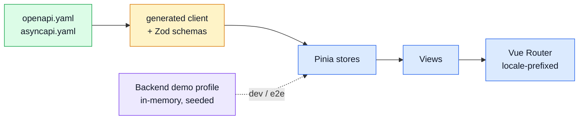

# boilerplate-vue-frontend

> Vue 3 + TypeScript SPA. Contract-first, modular, and able to run with no backend at all.
> Paired with [`boilerplate-node-backend`](https://github.com/Guebbit/boilerplate-node-backend).

**📚 The documentation is the real reference — this file is only the door.**
Run `npm run docs:dev`, or read `docs/`.

---

## Start here

> Requires **[Node.js 22+](https://nodejs.org/)** and `npm`.

The dev server talks to the paired backend at `http://localhost:3000` — there is no
backend-less mode. The lightest way to have one is its demo profile: the real API against an
in-memory, seeded database, no Docker.

```bash
npm ci                    # install exactly the lockfile
cp .env-example .env
npm --prefix ../boilerplate-node-backend run demo   # terminal 1
npm run dev                                         # terminal 2 — http://localhost:8080
```

That gives you a browsable storefront — products, cart, orders, a signed-in user — every screen of
it answered by the real API.

Or start the full stack (`compose`) for real Redis/queue behaviour.

→ Full setup, both modes, port map and the pre-commit gate: **[Getting Started](./docs/getting-started.md)**

---

## What this is


```mermaid
flowchart LR
    SPEC["openapi.yaml<br/>asyncapi.yaml"] --> GEN["generated client<br/>+ Zod schemas"]
    GEN --> STORES["Pinia stores"]
    STORES --> VIEWS["Views"]
    VIEWS --> ROUTER["Vue Router<br/>locale-prefixed"]
    DEMO["Backend demo profile<br/>in-memory, seeded"] -.->|"dev / e2e"| STORES

    classDef spec fill:#dcfce7,stroke:#16a34a,color:#111827;
    classDef gen fill:#fef3c7,stroke:#d97706,color:#111827;
    classDef app fill:#dbeafe,stroke:#2563eb,color:#111827;
    classDef mock fill:#ede9fe,stroke:#7c3aed,color:#111827;
    class SPEC spec;
    class GEN gen;
    class STORES,VIEWS,ROUTER app;
    class DEMO mock;
```

Four ideas carry the whole repository:

1. **The contract is the source.** `openapi.yaml` and `asyncapi.yaml` come from the backend and
   generate the axios client, the Zod schemas and the realtime types. None of that is hand-written.
2. **A module is a value, not a convention.** Every domain declares what it needs — routes,
   navigation, locales, response schemas — in one typed object.
   `src/modules.ts` lists them. Adding a domain is one folder plus one line; removing it is
   `rm -rf` plus that line.
3. **The app runs without its backend.** Mock mode is a first-class build, not a stub.
4. **The tests are part of the boilerplate.** Unit, component, e2e, accessibility, visual
   regression, property and mutation testing are all wired and all run.

---

## Where things live

|                      |                                             |
| -------------------- | ------------------------------------------- |
| `src/modules/*`      | the domains — each one deletable            |
| `src/kernel`         | the module registry                         |
| `src/infrastructure` | http, i18n, session, uploads, observability |
| `src/app`            | shell, router, layouts, guards              |
| `src/ui`             | shared presentational components            |
| `contracts/`         | generated API client — never edited by hand |

---

## The map

| You want to                      | Read                                                                                                                    |
| -------------------------------- | ----------------------------------------------------------------------------------------------------------------------- |
| Get it running                   | [Getting Started](./docs/getting-started.md)                                                                            |
| **Read the code, first time**    | **[Reading Path](./docs/theory/reading-path.md)** — nine files, in order                                                |
| Know what one file _is_          | [File Glossary](./docs/reference/) — every file in the repo, one hop to an answer                                       |
| Understand the shape             | [Architecture](./docs/theory/architecture.md) · [Layers](./docs/theory/layers.md) · [Modules](./docs/theory/modules.md) |
| Add or remove a domain           | [Adding & Removing a Module](./docs/theory/module-lifecycle.md)                                                         |
| Change an endpoint               | [OpenAPI Workflow](./docs/api/openapi-workflow.md)                                                                      |
| Configure something              | [Environment Variables](./docs/tools/environment.md)                                                                    |
| Look up a script                 | [Package Scripts](./docs/tools/package-scripts.md)                                                                      |
| Understand a dependency          | [Tools Explained](./docs/tools/tools-explained.md)                                                                      |
| Test something                   | [Testing overview](./docs/tools/testing-and-docs.md)                                                                    |
| Know what is planned but unbuilt | [Roadmap](./docs/theory/roadmap.md)                                                                                     |
| Deploy it                        | `.docker/Dockerfile.production` · `docker-compose.production.yml`                                                       |

---

## Before you commit

```bash
npm run complete    # lint + spec lint + contract identity + format + build + unit + e2e
```

Exactly what the pre-commit hook runs. It takes **around ten minutes**, mostly Cypress — start it
and go do something else. `npm run complete:fix` is the same gate with lint and formatting fixed
rather than reported.

Two suites sit outside it, in `npm run complete:manual`: pixel diffing, which answers to the
machine that took the snapshots, and the live-backend e2e run, which needs the paired API up.
See [Test timings](./docs/tools/testing-and-docs.md#test-timings) for what each layer costs.

---

## License

AGPL-3.0. See [LICENSE](./LICENSE).
