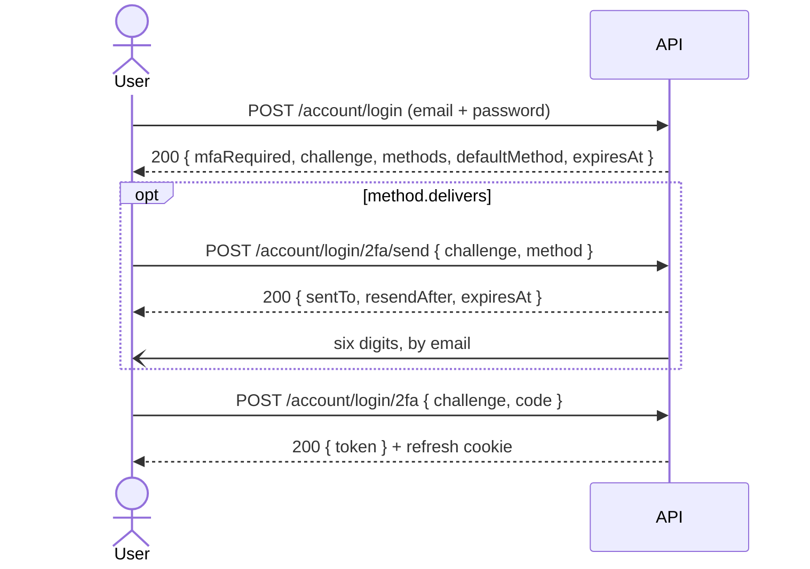

# Account & two-factor — frontend plan

Status: **the backend is built and tested, the contract is synced and validated here, and `src/`
still has no 2FA code at all.**

The API has no single TOTP factor. It has a **method registry** — an account arms one or more
factors, each named by a `method` string — and two methods ship, `totp` and `email`. The contract
in §3 is not a proposal: it is generated into `contracts/rest/`, byte-identical to the backend's
`openapi.yaml`, and covered by the backend's own integration suite.

---

## 1. First, what the "challenge" is

It is not a code, and nothing is sent to the user to obtain it.

The challenge is a **claim check**: a short-lived signed token that means _"someone passed the
password step for account X, four minutes ago"_. The login stops halfway — the password checked out
but no session may be issued yet — and the server refuses to hold that half-state in memory, so it
hands the browser a signed note instead.

The **code** is the separate secret, and where it comes from is what a _method_ decides:

- `totp` — an authenticator app derives six digits from a shared secret and the clock. Nothing is
  delivered because there is nothing to deliver.
- `email` — the server mints six digits and mails them. **This is the one to build the UI around.**



Three properties the UI has to respect:

- The challenge **cannot authenticate anything**. Sending it as a Bearer token gets a 401.
- It expires — **5 minutes** for a device-only account, **10** when a delivered method is armed.
  `expiresAt` is on the response; count down from it, do not hardcode either number.
- It is a credential. It lives in a store, never in a URL, `?query=`, or an analytics page view.

---

## 2. Where we are

|                                           | state                                                                                                                             |
| ----------------------------------------- | --------------------------------------------------------------------------------------------------------------------------------- |
| Backend                                   | **done** — registry, `totp` + `email`, backup codes, cooldowns, attempt ceilings, audit, metrics, migration, 39 integration tests |
| `contracts/rest/`                         | **regenerated** — every function and zod schema below already exists                                                              |
| `src/modules/account/response-schemas.ts` | **done** — all seven new rows registered, `/login/2fa/send` correctly ordered ahead of `/login/2fa`                               |
| `src/modules/users/response-schemas.ts`   | **done** — the admin-recovery row (`DELETE /users/{id}/2fa`) is registered, and nothing calls it                                  |
| Everything else in `src/`                 | **nothing** — no store, no view, no component, no locale key, no test                                                             |

### 2.1 Four things are actively broken or missing

**`stores/auth.ts` mis-handles a 2FA login.** `login()` calls
`session.setAccessToken(getTokenFromResponse(data), remember)` unconditionally
(`stores/auth.ts:57`). An `MfaChallenge` response has no `token`, so it stores `undefined`, then
chains `fetchProfile(true)`, which 401s. **Any account that turns 2FA on is locked out of this
app.**

**The refresh interceptor will eat the second step.** `REFRESH_EXCLUDED_PATHS`
(`infrastructure/http/refresh.ts:24`) lists the five public auth endpoints, and neither
`/account/login/2fa` nor `/account/login/2fa/send` is among them. Both answer **401** on a wrong or
expired code. So a mistyped digit fires `GET /account/refresh`, and — for a visitor who still holds
a valid refresh cookie from an earlier session — succeeds, then **silently replays the failed 2FA
submit**. Two paths to add, before either endpoint is ever called.

**There is no step-up re-auth anywhere.** `POST /account/reauth` appears in `response-schemas.ts`
and nowhere else — no store action, no dialog, no interceptor. Every 2FA management endpoint sits
behind `requireFreshAuth(REAUTH_TIME_CRITICAL)` — 300 seconds. A user who opens their profile six
minutes after signing in gets `401 { errors: [{ code: 'REAUTH_REQUIRED' }] }` and, today, a toast
reading "unauthorized". This is not a 2FA problem; see §5, Phase 1.

**The profile page cannot change the profile image.** `Profile.vue` edits username, email, phone,
website and locale. `stores/profile.ts`'s `updateProfile` forwards an `imageUrl` string, but no
call site sets one and nothing in this module ever posts multipart —
`updateAccountWithMultipart` is generated and unused. There is no way to set an avatar after
signup. `modules/users/store.ts:112` has the `{ imageUpload, ...rest }` split to copy.

---

## 3. The contract (built, generated, tested)

### Managing your own factors

`GET` is the only one that is not gated on freshness; the four mutations are all
`isAuth` + `requireFreshAuth(REAUTH_TIME_CRITICAL)`.

| endpoint                                     | body       | returns                                                                         |
| -------------------------------------------- | ---------- | ------------------------------------------------------------------------------- |
| `GET /account/2fa`                           | —          | `{ enabled, methods[], available[], backupCodesRemaining }` — **only `isAuth`** |
| `POST /account/2fa/methods/{method}/setup`   | —          | `TwoFactorSetup`                                                                |
| `POST /account/2fa/methods/{method}/confirm` | `{ code }` | `{ method, backupCodes?, backupCodesRemaining }`                                |
| `DELETE /account/2fa/methods/{method}`       | `{ code }` | —                                                                               |
| `DELETE /account/2fa`                        | `{ code }` | — (drops everything)                                                            |

### Logging in

All three are `security: []` — public. The challenge token is the credential.

| endpoint                       | body                    | returns                                      |
| ------------------------------ | ----------------------- | -------------------------------------------- |
| `POST /account/login`          | credentials             | `AuthTokens` **or** `MfaChallenge`           |
| `POST /account/login/2fa/send` | `{ challenge, method }` | `{ method, sentTo, resendAfter, expiresAt }` |
| `POST /account/login/2fa`      | `{ challenge, code }`   | `AuthTokens`                                 |

### Admin-assisted recovery

| endpoint                 | body | returns | who                                     |
| ------------------------ | ---- | ------- | --------------------------------------- |
| `DELETE /users/{id}/2fa` | —    | —       | `isAdmin` — no code, every call audited |

The one deliberate exception to "prove the factor to remove it", for an owner who lost both the
authenticator and the backup codes. Generated, schema-registered, and called from nowhere — its
home is `modules/users/views/User.vue`, the admin detail page (§5, Phase 2).

### The two shapes that carry everything

`TwoFactorMethodSummary` — what a client renders a row from:

```ts
{ method: string          // 'totp' | 'email' — a STRING; never switch on a closed union
  delivers: boolean       // true → render "send me a code"; false → just the input
  target?: string         // 'a***a@example.com', masked BY THE SERVER
  enrolledAt?: string     // absent while an enrollment is still pending confirmation
  resendAfter?: number    // seconds; count down from this, do not invent a cooldown
  enrollable?: boolean    // only meaningful in `available[]`
  reason?: string         // translated sentence, show as-is, when enrollable is false
}
```

`TwoFactorSetup` — one object, `delivers` says which half to read:

```ts
{ method, delivers: false, secret, otpauthUri }              // device
{ method, delivers: true, sentTo, resendAfter, expiresAt }   // delivered
```

### Behaviour the UI must not fight

- **`available[]` is already filtered.** A method this deployment cannot run is absent entirely;
  one this account is not eligible for is present with `enrollable: false` and a `reason`. Render
  the list; do not second-guess it, and do not hardcode "email" anywhere.
- **`target` is already masked.** Never redact client-side.
- **Backup codes appear once**, on the confirm of the account's _first_ factor only. A second
  factor returns `backupCodes: undefined` and a non-zero `backupCodesRemaining` — do not present
  that as "no codes".
- **`setup` is also the re-enrollment path.** Calling it again replaces whatever that method had
  pending and **disarms it if it was already confirmed** — the "lost my phone, still have my
  session" recovery. The button on an armed row is destructive; say so.
- **429 on setup or send** is the resend cooldown, with `errors[0].details.retryAfter` in seconds
  and `code: 'TWO_FACTOR_RESEND_TOO_SOON'`. Branch on the code, count down from `retryAfter`.
- **Removing the last factor** turns 2FA off and discards the backup codes. Say so before doing it.

### 3.1 Backend limits that shape what the UI may claim

Each verified against the paired backend checkout, not inferred from the contract:

1. **OAuth bypasses 2FA.** `get-oauth-callback.ts` never reads `twoFactorEnabledAt` — only
   `post-login.ts` does. Do not write copy saying 2FA is "required to sign in": with a linked
   Google account it is not.
2. **`remember` is dropped on the 2FA path.** `post-login-2fa.ts` calls
   `issueSession(response, userId, undefined, ['pwd', 'otp'])` — the third argument is the remember
   tier, and it is hardcoded `undefined`. Tick "remember me" with 2FA on and you get the short
   cookie. The frontend cannot fix it; the checkbox quietly lies until the backend does.
3. **`reauth` re-mints with the default `amr`**, discarding `'otp'` — `post-reauth.ts` calls
   `issueSession(response, id)` with no array. Harmless while no route demands `methods: ['otp']`.

### 3.2 The freshness tiers, in seconds

Two tiers, both env-tunable, and the UI has to count in the shorter one:

| tier                    | default | env                          | routes the frontend already calls or will                                                                                    |
| ----------------------- | ------- | ---------------------------- | ---------------------------------------------------------------------------------------------------------------------------- |
| `REAUTH_TIME_CRITICAL`  | **300** | `NODE_REAUTH_TIME_CRITICAL`  | every 2FA mutation, `DELETE /account`, cart checkout, all three `/payments` writes                                           |
| `REAUTH_TIME_SENSITIVE` | **900** | `NODE_REAUTH_TIME_SENSITIVE` | `PUT /account` _when the email changes_, `POST /account/logout-all`, `DELETE /account/sessions/{id}`, `POST /account/export` |

Do not mirror these numbers into the frontend. The 401 is the signal; the tier is the server's.

---

## 4. The account page

The user-facing ask, and the anchor for all of this: **one page where someone manages their own
account** — their details and picture, their password, and which second factors are armed.

`Profile.vue` is two thirds of it already. It grows an avatar and a 2FA panel, and the panels get
**reordered** — today `ProfileDeleteAccount` sits third, between the password form and the sessions
list, which puts the most destructive control in the middle of routine ones.

```
/:locale/profile — Profile.vue
├── ProfileVerificationBanner        exists
├── ProfileAvatar               NEW  picture: preview, pick, upload, remove
├── (the details form)               exists — username, email, phone, website, language
├── ProfileRole                      exists
├── ProfilePasswordChange            exists
├── ProfileTwoFactor            NEW  the panel below
├── ProfileSessions                  exists   ← moves up
├── ProfileAddresses                 exists   ← moves up
└── ProfileDeleteAccount             exists   ← moves to last
```

### `ProfileAvatar.vue`

`updateAccountWithMultipart` already exists in the generated client and nothing calls it. A file
input, a square preview, a remove button, and `onUploadProgress` forwarded through the store the
same way `Signup.vue` already does it. `stores/profile.ts`'s `updateProfile` gains the
`{ imageUpload, ...rest }` branch that `modules/users/store.ts` already has for the admin form —
one shape, two call sites, no second pattern. Validate type and size client-side with
`infrastructure/utils/uploads.ts`'s `imageUploadSchema` for the message, not for the security —
the backend's upload limiter and image pipeline are the real gate.

### `ProfileTwoFactor.vue`

Driven entirely by `GET /account/2fa`. **For now only `email` will be offered**, which needs no
client-side flag: `totp` needs a QR renderer that Phase 3 adds, so until then the panel renders
`available` rows it has a setup component for and ignores the rest.

```
┌─ Two-factor authentication ──────────────── [ On ] ─┐
│                                                     │
│  Armed                                              │
│   ✉  Email — a***a@example.com      [ Remove ]      │
│                                                     │
│  Add                                                │
│   📱 Authenticator app              [ Add ]         │  ← Phase 3
│                                                     │
│  ⚠ 3 of 10 backup codes left                        │
└─────────────────────────────────────────────────────┘
```

States it has to render honestly:

- **Off, and email not enrollable** — show the `reason` from `available[]` verbatim, and link to the
  verification banner rather than restating it.
- **Adding email** — `setup` mails a code and returns `sentTo`; a code input, a resend button
  disabled for `resendAfter` seconds, then `confirm`.
- **First factor armed** — the backup codes screen, blocking, with a checkbox the user must tick.
  They are never retrievable again.
- **Removing the last factor** — a confirmation that says the backup codes go with it.
- **Every mutation** — a `REAUTH_REQUIRED` 401 is possible on all of them, which is Phase 1's job,
  not this component's.

---

## 5. Work breakdown

### Phase 0 — unbreak login _(no new endpoints; ship alone)_

- `infrastructure/http/refresh.ts` — add `/account/login/2fa` and `/account/login/2fa/send` to
  `REFRESH_EXCLUDED_PATHS`. Smallest change here, and the only one that is a live bug rather than
  an absence (§2.1).
- `stores/auth.ts` — narrow `LoginOutcome`. `login()` returns
  `{ kind: 'session' } | { kind: 'mfa', challenge, methods, defaultMethod, expiresAt }`. Only the
  session branch touches `setAccessToken` / `fetchProfile`.
- `views/Login.vue` — on the `mfa` branch, hand the payload to the new store and push the challenge
  route.
- `composables/use-post-login-redirect.ts` — **extracted, not duplicated.** `Login.vue:112-136`
  (saved locale preference, `?continue=`, fallback to `Home`) now has to run from the _second_ step
  too. Module-level `composables/`, the convention `modules/cart`, `modules/orders` and
  `modules/payments` already follow.

`response-schemas.ts` needs nothing — the seven rows landed in `9f4bf64`.

### Phase 1 — step-up re-auth _(blocks everything below it)_

Not 2FA-specific. Eight routes sit behind the freshness guard (§3.2) and **six of them this app
already calls today**, every one surfacing the 401 as a bare "unauthorized" toast:

| flow                          | call site                               |
| ----------------------------- | --------------------------------------- |
| changing your email           | `Profile.vue` → `updateProfile`         |
| deleting your account         | `ProfileDeleteAccount.vue`              |
| ending one session            | `ProfileSessions.vue` → `revokeSession` |
| ending every session          | `stores/auth.ts` → `logoutEverywhere`   |
| cart checkout                 | `modules/cart/store.ts` → `checkout`    |
| paying, confirming, refunding | `modules/payments/store.ts`             |
| the GDPR export               | not built yet                           |
| every 2FA mutation            | Phase 2                                 |

Building it once fixes six live flows and unblocks two.

The subtlety is the interceptor order. A `REAUTH_REQUIRED` 401 is a 401 like any other, so
`onResponseRejectWithRefresh` grabs it first, refreshes successfully (the cookie is fine — it is
_freshness_ the server is objecting to, not validity), replays with `_dontRetry` set, and the
second 401 falls straight through to `onResponseReject`. **Step-up has to branch on the error code
before the refresh branch runs.**

```mermaid
flowchart TD
    E[401 response] --> C{errors[0].code === 'REAUTH_REQUIRED'?}
    C -- yes --> P[park request in the step-up queue]
    P --> D{dialog already open?}
    D -- yes --> W[await the in-flight reauth]
    D -- no --> O[open ReauthDialog]
    O --> R[POST /account/reauth]
    R --> T[adopt the rotated access token]
    T --> Y[replay every parked request]
    C -- no --> F[existing refresh-and-retry]
```

- `infrastructure/http/step-up.ts` — the branch above. Note that `refresh.ts` does park-and-retry
  but has **no single-flight**: two concurrent 401s fire two `GET /account/refresh` calls today.
  Step-up cannot copy a queue that does not exist — it needs its own (one dialog, N parked
  requests), and refresh deserves the same treatment while the file is open.
- `app/components/ReauthDialog.vue` — one password field, mounted once in
  `app/layouts/LayoutDefault.vue` beside `<DialogHost />`. It cannot go through
  `useDialogStore().confirm()`: that store's contract resolves `boolean`, and this one has to
  resolve a password. Same queued-promise shape, different payload — model it on `ui/dialog.ts`.
- `stores/auth.ts` — a `reauth(password)` action over the generated `reauth()`. It returns an
  `AuthTokensEnvelope`: **adopt the rotated token**, exactly as `stores/profile.ts:193` already does
  after a password change. Dropping it leaves the old token in the store and the next call 401s.

### Phase 2 — the account page and the email factor

- `stores/two-factor.ts` — status, the enrollment machine, the login challenge, a `resendAfter`
  countdown driven by the server's number. Follows `stores/sessions.ts`: `useStructureRestApi`,
  `getPayloadFromResponse`, plain refs, actions that re-read rather than patch locally.
- `views/TwoFactorChallenge.vue` — the login second step. Method picker when `methods.length > 1`,
  a "send me a code" button for `delivers` rows, a countdown from `expiresAt`, and a
  "use a backup code instead" link that is always reachable.
- `components/ProfileTwoFactor.vue`, `components/TwoFactorEnroll.vue`,
  `components/TwoFactorBackupCodes.vue`, `components/ProfileAvatar.vue` — §4.
- `modules/users/views/User.vue` — the admin-recovery button over `adminDisableUserTwoFactor`
  (§3). Behind a confirm, and the copy has to say it strips the factor without any proof from the
  owner, which is exactly why it is audited.
- `routes.ts` — `login/2fa`, `meta: { access: 'guest', title: '…' }`. The `title` is not optional
  here: the route guard announces it, and every existing entry carries one.
- `locales/{en,it}.json` — a `two-factor` top-level key for the shared vocabulary, plus a
  `two-factor-challenge-page` key for the view, matching the `*-page` convention the other seven
  views use.

Accessibility is not a follow-up here: the code input needs `autocomplete="one-time-code"`,
`inputmode="numeric"`, and a live region announcing "code sent to …" and the countdown.

### Phase 3 — TOTP, and staying method-agnostic

- A QR renderer (one small pinned dependency) and the device half of `TwoFactorEnroll.vue`. The
  backend deliberately returns the `otpauth://` URI and no image — rendering server-side would put
  the secret on the wire twice.
- The discipline that makes `sms` free later, and it is all absence: no `if (method === 'email')`
  anywhere; key state by the `method` string the server sent; copy is
  `t('two-factor.sent-to', { target })`, never "check your email"; render the rows `available[]`
  gives you.

---

## 6. Testing

| file                                                 | covers                                                                               |
| ---------------------------------------------------- | ------------------------------------------------------------------------------------ |
| `tests/unit/infrastructure/http/http.spec.ts`        | extend — the two 2FA login paths skip refresh-and-retry                              |
| `tests/unit/infrastructure/http/step-up.spec.ts`     | park-and-retry, single-flight under two concurrent 401s, cancel, token adoption      |
| `src/modules/account/tests/auth-login-mfa.spec.ts`   | Phase 0's union narrowing — the `mfa` branch must not touch the session store        |
| `src/modules/account/tests/two-factor-store.spec.ts` | enrollment machine, challenge lifecycle, resend countdown, 429, backup-code fallback |
| `src/modules/account/tests/profile-avatar.spec.ts`   | multipart path, progress, remove                                                     |
| `src/modules/account/tests/e2e/two-factor.cy.ts`     | enroll email → log out → log in with a mailed code → remove                          |
| `src/modules/account/tests/e2e/a11y.cy.ts`           | extend — code input attributes, live regions                                         |
| `src/modules/account/tests/e2e/account.visual.cy.ts` | extend — challenge screen, backup-codes screen, 2FA panel                            |

Infrastructure specs live under `tests/unit/`, module specs next to their module — the split every
other domain already follows.

**The e2e needs the demo backend's outbox.** A mailed code cannot be read from the UI, and the
backend stores only its HMAC. In demo mode the mailer records to an outbox instead of SMTP, so the
spec opens with `cy.skipUnlessDemo()` and reads the code with `cy.demoEmailTo(address)` — the same
pair `password-reset.cy.ts` already uses. See `docs/tools/demo-profile.md`. Do **not** seed a fixed
TOTP secret into production seeds to avoid this.

---

## 7. Decisions still open

1. **Enforce 2FA for admins?** Nothing in the backend can require it for a role. If wanted, it is a
   server-side policy the frontend only reflects — it turns the panel from a toggle into a gate.
2. **Regenerate backup codes.** `backupCodesRemaining` is reported, so the panel can warn; there is
   still no regenerate endpoint. Burning all ten means re-enrolling, or asking an admin to strip
   the factor via `DELETE /users/{id}/2fa`. Small backend job.
3. **Trusted devices / "don't ask for 30 days".** Absent, and the first thing users ask for. It is
   an exemption from a factor rather than a factor, so it needs a backend device-token concept —
   see `TWO_FACTOR_METHODS_ROADMAP.md` §8 in the backend repo for why it is also the easiest way to
   weaken all of this.
4. **Does OAuth get the 2FA gate (§3.1.1)?** Settle it before the panel's copy is written.
